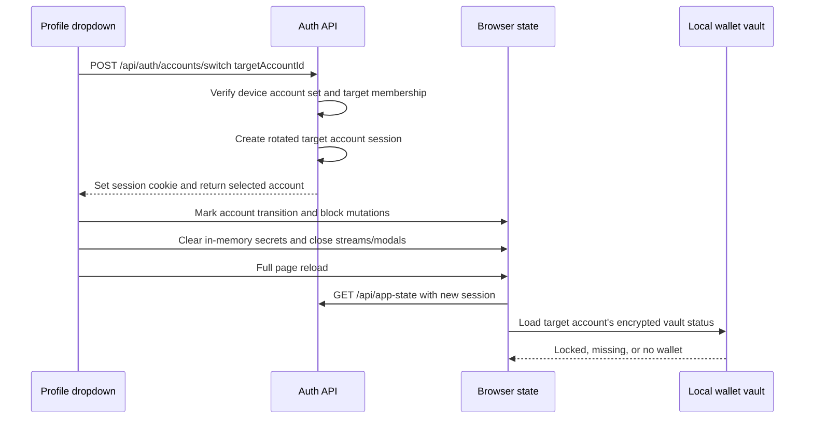

# Multi-Account Password Login And Wallet Isolation

Status: Implemented and deployed in Fly release v668 on 2026-08-28. The Phase 0
wallet ownership and sync-assignment audits pass in both live and local data.

## Summary

The app will support:

1. enabling password login from **Settings -> Security**;
2. retaining several independently authenticated accounts on one browser and
   switching between them from the profile dropdown; and
3. preserving a strict one-account-to-one-wallet operating boundary so task,
   signing, PFT, context-publication, and wallet functions always use the wallet
   belonging to the selected account.

Every retained account is independent. Each account has a different PFT wallet.
Selecting an account never moves, relinks, copies, merges, or unlocks a wallet.

Account login and wallet unlock remain separate:

- an account password, email code, or OAuth provider authenticates the app
  account;
- a wallet recovery phrase proves and restores the selected account's wallet;
- a local wallet-vault password decrypts that account's saved browser vault;
- an unlocked wallet authorizes signing-dependent functions.

The recovery phrase, private key, wallet-vault password, and decrypted wallet
secret never cross an API boundary.

## Goals

- Let an authenticated user enable, change, disable, and reset account-password
  login without creating a second account.
- Let a browser retain several authenticated accounts and switch between them
  from the profile dropdown.
- Make the selected server account the sole source of truth for all account and
  wallet state.
- Require the selected account's own wallet before enabling signing-dependent
  actions.
- Preserve a saved encrypted vault for each retained account on the same
  browser.
- Make stale account state fail closed during account changes.
- Preserve existing email-code and OAuth login and linking behavior through an
  explicit auth-intent boundary.

## Non-Goals

- Sharing one wallet between accounts.
- Moving or merging accounts as part of account switching.
- Moving a wallet between accounts through the normal link or restore flow.
- Treating a recovery phrase or browser vault as an app session.
- Server custody, recovery, escrow, or synchronization of recovery phrases,
  private keys, wallet-vault passwords, or decrypted wallet material.
- Automatically unlocking a wallet after switching accounts.
- Requiring wallet unlock for chat, account-scoped context editing, settings,
  profile, billing, or other non-signing surfaces.

## Definitions

| Term | Meaning |
| --- | --- |
| Selected account | The account identified by the current valid HttpOnly app-session cookie. |
| Retained account | An independently authenticated account authorized for selection on this browser. |
| Account password | A server-verified credential that starts an app session. It is never used for wallet encryption. |
| Linked wallet | The one public PFT wallet address proven for the selected account. |
| Recovery phrase | The 24-word secret used locally to derive and prove a PFT wallet. |
| Wallet-vault password | A browser-local password used to encrypt or decrypt one account's local recovery-phrase vault. |
| Wallet unlock | Temporary browser authorization to use the selected account's decrypted wallet for signing. |
| Auth intent | A server-stored value distinguishing login, add-account, and link-provider flows. |
| Account transition | The complete boundary change from one selected account to another. |

## Required Invariants

These invariants are release blockers.

### Account invariants

1. `session.accountId` from the authenticated server session is the only source
   of truth for the selected account.
2. A client-provided account id never grants access or selects an account by
   itself.
3. Each retained account must be authenticated independently before it is added
   to the browser's account list.
4. Switching accounts does not link providers, merge identities, change public
   handles, or transfer any data.
5. Chat, context, memory, tasks, billing, profile, documents, notifications,
   receipts, caches, streams, and wallet reads must resolve from the selected
   server account.
6. A response started under account A must not update visible or persistent
   state after account B becomes selected.

### Password invariants

1. Password login is attached to an existing account; it never creates an
   account implicitly.
2. The password identifier is either an email address already verified and
   owned by that account or the account's unique Hive handle.
3. Enabling password login requires a fresh signature from the unlocked wallet
   already linked to the selected account. A client boolean is never accepted
   as proof of unlock.
4. Password reset proves control of the account's verified email when the
   account has one; email is not required for password enablement.
5. Password hashes are one-way, salted, versioned, and computed server-side.
6. Account passwords and wallet-vault passwords are separate credentials with
   separate UI labels, storage, verification, and reset behavior.
7. The server never attempts to use an account password to decrypt a wallet
   vault.

### Wallet invariants

1. Each account has at most one active linked PFT wallet.
2. Each active wallet address belongs to at most one account.
3. Accounts retained on the same browser are expected to use different wallet
   addresses.
4. Selecting an account never changes `account_linked_wallets` or
   `pftl_sync_wallets`.
5. Ordinary link, restore, and relink requests fail if the proved wallet is
   actively owned by another account. They must not delete or reclaim the other
   account's link.
6. Any exceptional wallet-transfer or account-recovery process is a separate,
   explicit product and operator workflow outside this specification.
7. An unlocked secret is usable only when its account id and derived wallet
   address both match the selected account and its currently linked wallet.
8. An account transition clears decrypted wallet material from React memory and
   removes every unlocked-session envelope belonging to the prior account.
9. Encrypted local vaults for other retained accounts remain stored but locked.
10. Saving a local vault requires all of the following to match:
    - the account that opened the wallet flow;
    - the account bound to the server wallet challenge;
    - the account returned by wallet verification;
    - the currently selected account; and
    - the address derived from the recovery phrase.
11. A mismatch aborts the save and displays a safe account-changed or
    wallet-mismatch error.

## User Experience

### Security Settings

**Settings -> Security** adds an **Account password** row.

Possible states:

| State | Detail | Primary action |
| --- | --- | --- |
| Unavailable | No wallet is linked to this account | Open wallet |
| Wallet locked | A matching local vault exists but is locked | Unlock wallet |
| Disabled | The linked wallet is unlocked; password login is not enabled | Enable |
| Enabled | Password login is available for the unique Hive handle and optional verified email | Change |
| Reauthentication required | The session is not recent enough for a credential change | Verify identity |
| Temporarily locked | Repeated credential failures exceeded the rate limit | Try later |

Enabling a password follows this flow:

1. Start a session-bound password-enable challenge.
2. Require the selected account's matching local vault to be unlocked.
3. Sign the fresh challenge locally with that wallet and send only the address,
   public key, signature, and challenge id to the server.
4. Consume the challenge and verify that the signature derives the wallet
   address already linked to the selected account.
5. Collect and confirm the account password.
6. Store the password hash for that existing account.
7. Rotate the current session and show password login as enabled without
   changing the wallet link or uploading seed material.

The password form must:

- support password managers and paste;
- use a minimum length of 12 characters and a maximum of 1,024 UTF-8 bytes;
- avoid composition rules requiring arbitrary character classes;
- reject passwords found in the product's reviewed compromised-password check,
  when that check is configured;
- never log the password, include it in observability metadata, or return it;
  and
- clearly say **Account password**, never **Wallet password**.

Changing or disabling a password requires the current password. Disabling it
must obey the existing last-login-method lockout guard. Verified-email reset is
an optional recovery path, not an enablement prerequisite.

### Password Login

The login dialog adds **Continue with password** without removing email-code or
OAuth options.

1. The user enters a verified email or unique Hive handle and account password.
2. The server returns the same generic failure for an unknown email, disabled
   password, and wrong password.
3. A successful verification creates a normal revocable `auth_sessions` row.
4. If an account-set cookie is present, the account is added to or refreshed in
   that browser's retained account list.
5. The server rotates both the selected session and account-set cookies as
   applicable.

Password login does not create an account. New accounts continue through the
existing verified email-code or provider signup flow.

### Profile Dropdown

The signed-in profile dropdown displays:

1. the selected account with a check mark;
2. other retained accounts with avatar, display name or handle, masked login
   identifier, and abbreviated linked-wallet address when present;
3. **Add account**;
4. **Manage accounts**;
5. **Log out this account**; and
6. **Log out all accounts**.

The list comes from an authenticated server endpoint. Browser local storage is
not authoritative for account membership or account labels.

### Add Account

**Add account** starts an explicit `add_account` auth intent.

- Email code, password, and OAuth may satisfy this intent.
- OAuth started with `add_account` must authenticate the provider's existing
  account or create a new account through the normal signup rules.
- OAuth must not link that provider identity to the currently selected account.
- **Connect provider** in Security continues to use the separate
  `link_provider` intent.
- Auth intent is stored in the server challenge or OAuth state. Callback query
  parameters cannot override it.

After successful authentication, the newly authenticated account is retained
and becomes selected. The app then performs the account-transition flow.

### Switch Account

Switching to a retained account follows this sequence:



The first release must use a full page reload after the server confirms the
cookie change. A client-only swap is prohibited. The reload is the safety
boundary for chat streams, Server-Sent Events, task modals, pending receipts,
wallet modals, timers, cached profile data, and in-memory signing material.

### Wallet State After Switching

After the target account loads:

| Server wallet | Local target vault | Result |
| --- | --- | --- |
| Not linked | Not present | Show **Link or create wallet**; signing actions unavailable |
| Linked | Present and address matches | Show **Wallet locked**; request that vault's wallet-vault password |
| Linked | Missing | Show **Restore wallet on this device**; request the target wallet's recovery phrase |
| Linked | Present but address differs | Show **Vault mismatch**; do not unlock, sign, overwrite, relink, or delete automatically |

Restoring on a new device follows this flow:

1. Request the selected account's wallet address from authenticated app state.
2. Collect the recovery phrase locally.
3. Derive the wallet address locally.
4. Refuse immediately if it differs from the selected account's linked wallet.
5. Sign a fresh account-bound server challenge.
6. Send only the challenge id, public address, public key, encryption public
   key, and signature.
7. Save the recovery phrase in the selected account's encrypted local vault.
8. Mark only that account and wallet unlocked for the current tab.

The user should not normally enter a recovery phrase on every account switch.
After a local vault has been saved, the user enters that wallet's vault password
to unlock it. Recovery phrase entry is reserved for first import, restoration,
or an explicit recovery flow.

### Signing-Dependent Functions

The following remain unavailable until the selected account's linked wallet is
unlocked and matches the active session:

- requesting wallet-signed tasks where signing is required;
- accepting, refusing, cancelling, or submitting evidence for signed tasks;
- submitting verification evidence that requires a wallet signature;
- sending PFT;
- signing PFTL context pointers or other publications;
- decrypting wallet-bound historical context; and
- any future operation requiring the wallet private key.

Normal chat, account-scoped context editing, profile, settings, and billing do
not require wallet unlock.

### Logout

- **Log out this account** revokes its current app session and removes its
  membership from this browser's retained account set. Another retained account
  may become selected only through the normal switch response and reload.
- **Log out all accounts** revokes the device account set and all app sessions
  issued through it.
- Both actions clear all decrypted wallet material.
- Neither action deletes encrypted local vaults unless the user separately
  chooses **Remove local vault from this device**.

## Persistence Model

### Password Credentials

Add an `account_password_credentials` table with this logical shape:

| Column | Contract |
| --- | --- |
| `account_id` | Primary key and foreign key to `app_accounts`; delete cascades |
| `password_hash` | Encoded Argon2id hash containing salt and work parameters |
| `credential_version` | Monotonic integer used for session invalidation |
| `created_at` | First enable time |
| `updated_at` | Last password change time |
| `last_used_at` | Last successful password login time |
| `disabled_at` | Null while enabled |

Password hashing requirements:

- Argon2id with a unique cryptographic salt per credential;
- initial deployment parameters of at least 64 MiB memory, three iterations,
  and parallelism one, subject to a production latency benchmark;
- a versioned encoded representation so parameters can be upgraded on a
  successful login;
- constant-time verification behavior from the reviewed password library; and
- no reversible encryption or application-wide static salt.

The verified email remains owned by `account_email_identities`; it is not
duplicated as an independently mutable credential identifier.

### Browser Account Sets

Add these logical records:

`device_account_sets`:

- opaque token hash;
- created, last-used, and expiry timestamps;
- revoked timestamp;
- optional non-identifying device metadata; and
- rotation version.

`device_account_set_members`:

- account-set id;
- account id;
- added timestamp;
- last independently authenticated timestamp;
- last selected timestamp; and
- revoked timestamp.

The browser receives a random `tasknode_account_set` cookie with `HttpOnly`,
`Secure` in secure environments, `SameSite=Lax`, and `Path=/`. Only its hash is
stored. The existing app-session cookie remains the authorization source for
ordinary application routes.

No reusable app-session or account-set token may be stored in localStorage or
returned in JSON.

### Wallet Ownership Constraint

After a duplicate-address audit, add a partial unique index equivalent to:

```sql
CREATE UNIQUE INDEX account_linked_wallets_active_wallet_unique_idx
  ON account_linked_wallets (wallet_address)
  WHERE status = 'linked';
```

The migration must stop and require review if duplicate active wallet addresses
exist. It must not choose an owner, delete a link, or move projections
automatically.

## API Contracts

Implemented routes:

| Method and path | Auth | Purpose |
| --- | --- | --- |
| `GET /api/account/password` | Session | Return enabled/disabled status, linked-wallet readiness, and optional masked recovery email |
| `POST /api/account/password/enable/start` | Session | Start a selected-account linked-wallet challenge |
| `POST /api/account/password/enable/verify` | Session | Verify the linked-wallet signature and enable password |
| `POST /api/account/password/change` | Session + recent reauth | Change password and rotate sessions |
| `POST /api/account/password/disable` | Session + recent reauth | Disable password subject to lockout guard |
| `POST /api/auth/password` | Public, rate limited | Authenticate an existing password credential |
| `POST /api/auth/password/reset/start` | Public, rate limited | Start non-enumerating verified-email reset |
| `POST /api/auth/password/reset/verify` | Public, rate limited | Consume reset challenge and replace credential |
| `GET /api/auth/accounts` | Session + account-set cookie | List retained accounts and selected account |
| `POST /api/auth/accounts/add/start` | Session | Start explicit add-account intent |
| `POST /api/auth/accounts/switch` | Session + account-set cookie | Select an authenticated member and rotate session |
| `POST /api/auth/accounts/remove` | Session + account-set cookie | Remove one retained account from this browser |
| `POST /api/auth/logout-all` | Session or account-set cookie | Revoke the complete browser account set |

All mutation routes require explicit request-body schemas, route-policy
registration, rate limits appropriate to their credential risk, same-origin
enforcement, and no-store responses.

The switch response includes the selected account id and a new account
transition generation. It does not include any wallet secret, session token, or
account-set token.

## Client Transition Boundary

The client maintains an in-memory `accountGeneration` that changes whenever a
new selected account is accepted. Every account-scoped asynchronous operation
captures:

- selected account id;
- account generation; and
- linked wallet address when wallet state is involved.

A completion handler applies its result only if all captured values still match
current state. This protection is required even though the first release also
hard-reloads, because a mutation may already be in flight when switching
begins.

While an account transition is pending:

- new mutations are disabled;
- wallet link, restore, create, relink, delink, unlock, send, and signing modals
  are closed;
- active chat streaming is aborted;
- active task and verification modals are closed;
- EventSource connections and polling timers are closed;
- in-memory wallet secrets are cleared before navigation; and
- local persistence writes from earlier generations are rejected.

## Failure Contract

Required stable error classes include:

| Error | Meaning |
| --- | --- |
| `password_login_invalid` | Generic unknown-email, disabled-password, or wrong-password result |
| `password_reauth_required` | Credential mutation needs fresh identity proof |
| `password_login_rate_limited` | Login attempts exceeded the allowed window |
| `account_switch_membership_required` | Target is not an authenticated member of this browser's account set |
| `account_switch_session_changed` | The selected account changed during the request |
| `wallet_owned_by_other_account` | Wallet is actively linked to a different account |
| `wallet_account_changed` | Wallet flow started under another selected account |
| `wallet_vault_account_mismatch` | Local vault account does not match selected account |
| `wallet_vault_address_mismatch` | Derived or saved wallet differs from the selected account's linked wallet |

Credential-facing errors must not disclose whether an email, provider identity,
account-set membership, or password credential exists.

## Observability And Audit

Record structured events for:

- password enabled, changed, disabled, login succeeded, login failed, and reset;
- retained account added, selected, removed, and all accounts logged out;
- account transition blocked by an in-flight wallet mutation;
- stale account response rejected;
- wallet ownership conflict; and
- vault account or address mismatch.

Events may contain account id, hashed session or device-set correlation,
provider id, route, reason code, and public wallet address where existing policy
permits it. They must never contain passwords, recovery phrases, private keys,
raw cookies, raw challenges with signatures, decrypted vault content, or email
verification codes.

## Rollout

### Phase 0: Wallet Boundary Hardening

1. Audit active wallet ownership and sync-account assignments.
2. Resolve any duplicate active-wallet rows through explicit operator review.
3. Add the active-wallet unique index.
4. Change normal wallet linking from implicit reclaim to conflict.
5. Add account and wallet identity checks before local vault writes.
6. Add stale-response rejection and mutation-transition blocking.

The account switcher must not be exposed before this phase is complete.

### Phase 1: Password Credentials

1. Add credential persistence and repository boundaries.
2. Add enable, change, disable, reset, and login routes.
3. Update the last-login-method unlink guard.
4. Add the Security UI and login-dialog entry.
5. Ship behind a server capability flag until focused fixtures pass.

### Phase 2: Retained Accounts

1. Add device account-set persistence and cookies.
2. Add explicit auth intents for login, add-account, and link-provider.
3. Add list, switch, remove, logout-current, and logout-all routes.
4. Add the profile dropdown account list.
5. Use server switch followed by full reload.

### Phase 3: Optimization

Only after the reload-based boundary is stable may the product consider a
client-only transition. A client-only transition requires complete account
generation coverage, request cancellation, component-state reset, and a
dedicated isolation review. It is not required by this specification.

## Regression Requirements

### Password

- An account with a linked wallet can enable password login without changing
  its account id or attaching an email.
- An account without a linked wallet cannot start password enablement.
- A signature from a different wallet cannot authorize password enablement.
- A valid proof is bound to the selected account, purpose, and single-use
  challenge.
- Correct password resumes the existing account; it does not create another.
- Unknown email, disabled password, and wrong password have indistinguishable
  public responses.
- Password change rotates sessions and invalidates the old credential.
- Password reset requires a fresh, single-use email challenge.
- Disabling the last remaining login method fails closed.
- Passwords and hashes never appear in logs, responses, exports, or fixtures.

### Account Switching

- Accounts A and B must authenticate independently before both appear.
- Adding B while A is selected does not link B's OAuth identity to A.
- Connecting a provider from A's Security page still links it to A.
- Switching A -> B rotates the selected session and reloads app state.
- A's chat messages, drafts, active conversation, context, tasks, task receipts,
  billing, documents, profile state, and notifications are not displayed under
  B.
- A stale response started before the switch cannot update B's state.
- Removing A from the browser does not delete A's account or local encrypted
  vault.

### Wallet Isolation

- Account A linked to wallet A and account B linked to wallet B retain their own
  server links through repeated switching.
- Switching A -> B clears wallet A's decrypted secret before B is usable.
- Wallet B begins locked after the switch unless it is freshly unlocked for B.
- Saved encrypted vaults for A and B remain independently present.
- Wallet A's vault password cannot unlock wallet B's vault unless the user
  independently chose the same password and the resulting vault still derives
  wallet B; address validation remains mandatory.
- Wallet A's recovery phrase is rejected while B is selected.
- Attempting to link wallet A to B returns `wallet_owned_by_other_account` and
  does not change either account.
- Switching while link, create, relink, delink, unlock, send, or task signing is
  pending cannot write to the new account or old account's local vault.
- Server requests for wallet balance, activity, history, and signing preparation
  always resolve the wallet from the selected session rather than a client
  address.

## Acceptance Criteria

The capability is complete only when all of the following are true:

1. A user can unlock the wallet linked to the selected account, enable password
   login without an email, and later log in to the same account with its unique
   Hive handle plus password.
2. A user can add two independently authenticated accounts and switch them from
   the profile dropdown without logging out first.
3. Each account preserves its distinct linked wallet and encrypted local vault.
4. A switch never relinks, reclaims, overwrites, or unlocks a wallet.
5. Signing-dependent functions remain unavailable until the selected account's
   matching wallet is unlocked.
6. A recovery phrase for any other account fails before persistence or signing.
7. Account and wallet isolation regression fixtures pass for different-wallet,
   same-wallet-conflict, stale-response, pending-mutation, and OAuth-intent
   cases.
8. Existing email-code login, provider linking, logout, wallet restore, wallet
   signing, and account-scoped data fixtures continue to pass.

## Current Implementation References

- `src/features/settings/AppDialogs.jsx`: Security settings, profile auth rows,
  and login dialog.
- `src/app/App.jsx`: selected session, profile dropdown, app-state refresh,
  wallet-secret memory, polling, streams, and modal state.
- `src/features/settings/account-transition-boundary.js`: in-memory account
  generation and stale-response rejection during a selected-account change.
- `src/wallet-core.js`: account-keyed encrypted wallet vault and address-checked
  unlock.
- `src/features/wallet/wallet-unlocked-session.js`: account-keyed temporary
  unlock envelopes.
- `src/features/wallet/WalletComponents.jsx`: wallet proof and local vault save
  sequence.
- `server/auth-connected-accounts.js`: OAuth login-versus-link behavior.
- `server/repositories/auth-sessions.js`: hashed revocable app sessions.
- `server/repositories/account-passwords.js`: Argon2id credential storage and
  verification.
- `server/account-password-auth.js`: enable, change, disable, reset, and login
  contracts.
- `server/repositories/device-account-sets.js`: retained browser membership,
  token rotation, and set-scoped session revocation.
- `server/account-switching.js`: add, list, switch, remove, and logout
  contracts.
- `server/repositories/accounts.js`: email/provider ownership and last-login
  unlink guard.
- `server/repositories/account-wallets.js`: fail-closed active-wallet ownership.
- `server/repositories/pftl-cache.js`: wallet-to-account projection assignment.
- `server/db/migrations/128_multi_account_password_wallet_isolation.sql`:
  password credentials, retained account sets, session association, and the
  unique active-wallet constraint.
- `docs/wiki/architecture/auth-and-connected-accounts.md`: current login and
  provider-linking contract.
- `docs/wiki/architecture/auth-wallet-boundary.md`: current account, wallet
  proof, local vault, and unlock separation.
- `scripts/multi-account-password-wallet-smoke.mjs`: focused credential,
  retained-session, and distinct-wallet regression fixture.
- `scripts/wallet-account-isolation-audit.mjs`: read-only rollout audit for
  duplicate active owners and wallet-to-sync-account mismatches.
