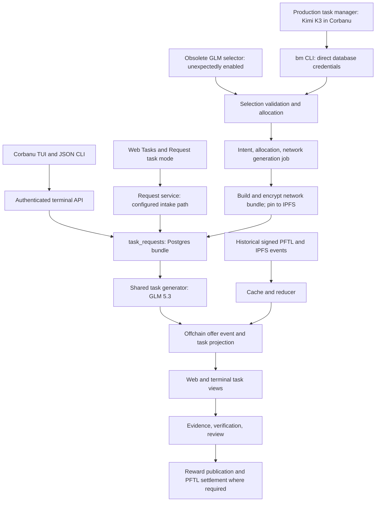

# Task Node reliability and Corbanu integration audit

**Date:** September 5, 2026. **Status:** Phase 1 audit and proposed implementation plan.
**Deliverable:** Documentation only. No application changes, task mutations,
agent restarts, reward operations, or deployment were performed for this audit.

## Production ownership correction

**The production task manager is the Kimi K3 agent in Corbanu Terminal.** The
operator confirmed this ownership after the initial audit. The launch contract
also explicitly records the Kimi K3 mandate. The initial audit incorrectly
promoted an older, still-enabled GLM selector into the intended architecture
and recommended repairing that selector first. That recommendation is withdrawn.

The **290 runs / 185 failures / zero successful enqueues** statistic belongs
only to the old `hive_task_manager:global_hive` GLM selector. It says nothing
about the production Kimi agent's assignment or review throughput. The initial
audit checked Kimi process presence, not completed board duties; it therefore
cannot conclude that production task management stopped.

Git history shows the GLM selector and active flags in commit `0300725`
(June 29), and the flags were already enabled in the August 21 public source
snapshot `c73b2b8`. The recent provider migration retained those flags and
changed that selector from GLM 5.2 to GLM 5.3. It did not replace the Kimi
process. An enabled historical loop is configuration drift relative to the
confirmed Kimi ownership, not evidence of an approved second task manager.

## Follow-on cleanup

The operator subsequently authorized removal of nonproduction loops. The GLM
selector has been disabled on the active Hive machine and its standby. Its
implementation, legacy Board Manager launchers/scheduler, experimental project
planner, and disabled accounting harvester were deleted. The shared Kimi action
contracts and task generation/review engine remain intact. See the separate
[cleanup verification](../verification/obsolete-loop-removal-2026-09-05/verification.md)
for deployment and test evidence. The findings below record the pre-cleanup audit.

## Recommended order

1. Establish Kimi's actual assignment/review progress and retire the obsolete
   automatic GLM selector through a controlled configuration change.
2. Make API submissions, queue claims, and task outcomes durable and unambiguous.
3. Harden the production Kimi runtime's work delivery, acknowledgement and recovery.
4. Improve measured latency without shrinking the requested response allowances.
5. Complete the UX recovery paths and simplify backend ownership incrementally.

Preserve the GLM-backed downstream task generator, shared queue/review services,
and advisory secretary functions used by the Kimi workflow. Removing an old
selector is not the same operation as removing the task-generation engine.
No runtime configuration change is performed in this documentation phase.

The old selector's latest sampled GLM 5.3 outputs violated its expected schema,
producing `selected_board_not_active` and `missing_project_need_summary` despite
nonempty source pools. Retain those observations as evidence about an obsolete
loop and as schema-validation lessons for active inference boundaries. Do not
restore that loop merely to make its enqueue metric nonzero.

## Evidence and limits

The audit inspected the canonical Task Node and Corbanu Terminal checkouts,
request handlers, Rust clients, routing prompts, repositories, worker ownership,
Fly configuration, local Kimi supervision, relevant regression scripts, and
the documentation linked below. Production reads were limited to public health
and status plus read-only, bounded database queries. No user prompts, terminal
pane contents, credentials, or private task evidence are included here.

| Evidence | Scope |
| --- | --- |
| Task Node checkout | `/home/pfrpc/repos/tasknode`, base commit `571d7833ed016165de32bd305ed765e62da066c7`, with substantial pre-existing uncommitted changes |
| Corbanu checkout | `/home/pfrpc/repos/CorbanuTerminal`, base commit `ec549c0c687f50a682487e9d68289c05557ff579`, also with pre-existing changes |
| Last recorded deployment | Task Node v702 and PFDocs v61; see [deployment evidence](../verification/docs-assistant-limits/deployment.json) |
| Fresh production observations | September 5, 15:22–15:29 UTC; [sanitized audit evidence](../verification/reliability-audit-2026-09-05/observations.json) |
| Local board runtime | Running `bm-pfterminal` session with Corbanu child processes and launch flags `model_provider=kimi-code`, `-m kimi-k3` |
| What was not tested | New live task creation, account-crossing attacks, concurrency fault injection, a fresh authenticated browser/TUI lifecycle, or Kimi duty completion |

Commit hashes alone do not identify the deployed working tree. The evidence
manifest records hashes of the principal inspected source files. Findings
below distinguish observed production behavior from code-level failure risks.

### Production snapshot

| Boundary | Observation | Interpretation |
| --- | --- | --- |
| Web health | `/health` returned `ok: true` | Web availability only |
| System Status | 15 OK, 6 warning, 2 critical, 1 disabled | Availability does not establish workflow health |
| Obsolete GLM selector | 290 runs / 185 failed / 0 executed in 24 hours; latest five completed but blocked | Unexpected enabled loop; not a production Kimi throughput measure |
| Hive active projects | Critical; 23 pending jobs; last success August 4 | Project-maintenance queue is stale despite healthy web service |
| Task review | Critical; 3 verification responses, 1 retry-backoff, 1 `reward_submit_unknown`, 2 `publication_stalled` | Reconcile recorded outcomes before any retry that can pay again |
| Network generation | No queued/running rows in the status snapshot; last success 01:18 UTC | An empty downstream queue can coexist with a broken upstream selector |
| Personal/shared task generation | 15 completed receipts in the preceding 24 hours | Some task generation works; this does not establish automatic network routing |
| Kimi runtime | One configured agent covers six boards; live Corbanu processes; no pending wake file at inspection | Process presence is verified; work completion is not |

The single System Status read took 8.183 seconds from this host. This is a
diagnostic sample, **not** a latency percentile or a benchmark. Historical
failure totals, such as old secretary memo failures, must not be interpreted as
current failures without their freshness window.

For the 15 completed task receipts, the database timestamps gave:

- Creation to **last** claim: p50 0.283 seconds, p95 0.396 seconds.
- Last claim to completion: p50 45.702 seconds, p95 63.331 seconds.

These are survivor-only measurements from a small, mixed 24-hour sample. They
exclude unsuccessful requests, do not isolate provider time, and do not measure
when the task became visible in a client. They cannot establish a GLM 5.3
before/after comparison. They do suggest that cutting a five-second poll alone
will not eliminate the dominant observed generation time.

## Observed runtime, including configuration drift

The diagram records discovered execution paths. It does not endorse two
automatic task managers; Kimi is the confirmed production owner.

### Three distinct agent integration paths

| Path | Identity and transport | Current responsibility |
| --- | --- | --- |
| Corbanu `/tasknode` and `corbanu tasknode …` | Profile-scoped terminal credential; authenticated HTTP API; linked Task Node account and wallet | User task requests/actions, evidence, context, chat, balances and receipts |
| Production Kimi task manager | Corbanu TUI launched by local shell/tmux/cron; operator identity flags; Fly Postgres proxy and `DATABASE_URL` | Owns board task lifecycle: selection, verification/review decisions and journal operations through `scripts/bm.mjs` |
| Legacy Fly Board Manager | Retained decision/action modules and tables; automatic process retired | Compatibility action contract, historical runs, shared repository functions |

The Kimi board manager is **not launched by opening `/tasknode`**. It runs a
general Corbanu agent with installed board skills and calls the database-backed
`bm` CLI. Its execution substrate is separate from Corbanu's general
Sauron/Nazgul/Troll/Orc orchestration. That orchestration's recovery guarantees
must not be assumed to cover this shell harness.

### API task creation, precisely

1. Corbanu sends `POST /api/terminal/tasknode/requests` with a work description,
   kind and `idempotencyKey`.
2. Task Node validates a terminal session, linked GitHub identity and wallet,
   then the configured terminal-action gate.
3. `terminalTaskRequestAction` builds a **minimal** request bundle and stores it
   in `task_requests.metadata_json`. The receipt uses `postgres:` bundle/event
   references and an `offchain:` transaction reference. These are not IPFS CIDs
   or signed ledger transactions.
4. The receipt is persisted with status `published`, which here means recorded
   and eligible for generation. An immediate timer is requested; the durable
   row survives if the timer does not run.
5. The shared worker claims the row, projects the input, checks the replay
   cache, calls the model when needed, and records the offer through
   `applyOffchainTaskOffer`.
6. The offer event and task projection are written transactionally together;
   replay-cache publication, receipt completion, and network allocation links
   are additional writes. Clients subsequently read the projected task.

The terminal bundle currently contains empty context summary, memories, recent
chat and task-queue sections. It does not obtain the richer browser/network
bundle simply because the account has saved Context. Enrichment in an
asynchronous worker is a useful way to preserve fast acknowledgement while
improving task quality.

References: [terminal routes](../../server/tasknode-terminal-routes.js),
[request service](../../server/task-request.js),
[terminal bundle](../../server/task-request-terminal-bundle.js),
[generator](../../server/task-generation-worker.js),
[offchain persistence](../../server/offchain-task-lifecycle.js),
[Corbanu TUI](../../../CorbanuTerminal/codex-rs/tui/src/chatwidget/tasknode_menu.rs),
[Corbanu CLI](../../../CorbanuTerminal/codex-rs/cli/src/tasknode_cmd.rs).

## Findings and proposed repairs

Priority P0 means address before expanding automation or concurrency. P1 means
the next reliability/latency tranche. P2 means follow-on consolidation.

### F1 — P0: obsolete GLM selector remains active beside the production Kimi manager

**Observed:** `TASKNODE_HIVE_TASK_MANAGER_ENABLED=true` and
`TASKNODE_HIVE_TASK_MANAGER_ACTIVE=true` leave the old GLM selection loop
running in `worker-hive`. Kimi is the confirmed production task manager. The
GLM run statistics and invalid outputs belong to this obsolete loop, and must
not stand in for Kimi health or task throughput.

**Repair:** First audit the real Kimi path: assignment coverage, run readiness,
outstanding duties, `bm` command results, resulting allocation/job/task links,
verification decisions and published review outcomes. Then disable the old
selector's active and enabled flags through the controlled deployment path.
Guard its schedule/manual entry points against accidental reactivation; keep
its historical audit data. Preserve shared generation, review, queue and
secretary functions. No second routing owner is introduced.

**Acceptance:** A restart/deploy does not start or enqueue the obsolete
selector. Kimi remains the manager and can issue an authorized board command
through the shared engine to a visible task. Readiness, no-work, blocked duty,
accepted command and completed task stages are individually observable. Audit
actor labels alone do not provide session-bound Kimi attribution.

The captured wrong-schema GLM outputs remain useful regression evidence, but
repairing that obsolete selector is not a production recovery goal. Apply exact
local schema validation to active generation/review/provider boundaries;
provider schema requests and generic JSON parsing alone are insufficient.

Sources: [Kimi mandate](../../ops/bm-runtime/bm-env.sh),
[production flags](../../fly.toml),
[old selector worker](../../server/hive-task-manager-worker.js),
[board commands](../../scripts/bm/writes.mjs),
[old provider](../../server/hive-task-manager-provider.js).

### F2 — P0: request identity is neither immutable nor reliably idempotent

**Confirmed in code:** Both Corbanu clients send an `idempotencyKey`; terminal
request creation does not consume it. Instead, `requestInput` accepts or creates
`requestId`. `upsertTaskRequest` conflicts globally on that ID and can replace
account, wallet, bundle, text and status without an ownership condition.
The declared request body permits `requestId`.

This creates duplicate-submission and state-regression risks. It also creates a
potential cross-account overwrite boundary if another request ID is supplied.
No cross-account mutation was attempted in production.

**Repair:** Give each command an account-scoped, immutable idempotency record
with a canonical payload digest. Same account/key/payload returns the original
receipt; changed payload returns a conflict. Enforce ownership independently of
the request ID and refuse transitions that resurrect terminal work. Corbanu
must persist the key and pending receipt across timeout, cancellation of the
view, process exit and restart. A timeout after write becomes “outcome unknown;
checking receipt,” not immediate permission to submit a new command.

**Acceptance:** Concurrent duplicate posts create one request; same key with a
different payload conflicts; account B cannot modify account A's receipt;
retrying after a simulated lost HTTP response returns the original task lineage.

Sources: [request repository](../../server/repositories/task-requests.js),
[body contracts](../../server/request-body-contracts.js), and the API/client
sources above.

### F3 — P0: retired selector policy conflicts with the Kimi task contract

The GLM selector prompt contains a “Temporary Hard-Coded Task Policy” limited to
three lanes: KOL distribution, public PfTerminal implementation and public L1
implementation. It excludes investigation, standalone QA, coordination and
documentation-only work. The Kimi board skill explicitly allows small
investigation tasks; the network v2 generation prompt has a broader badge-based
work vocabulary. The terminal fast path also accepts a requested kind without
requiring a network allocation packet; calling something `network` is not proof
it passed automatic routing.

Kimi ownership is now settled by the operator. Do not inherit the obsolete
selector's three-lane restriction as a new Kimi requirement. Inventory the
current Kimi mandate and the shared engine's existing rules; seek a policy
decision only for unresolved substantive work/reward rules. Persist the
authoritative policy version on selection, allocation, generation, review
and audit records. All clients must use the same domain
validation for network creation, with explicit capabilities for any operator
override. Do not change reward bands, badge eligibility or capacity limits as a
side effect of infrastructure work.

The eligibility panel is also stricter than the creation predicate in the same
repository: its readiness check requires a routing profile, wallet-cache sync
and zero blockers; `resolveCandidate` explicitly treats the legacy profile as
optional enrichment and resolves a verified badge plus delivery wallet. Enqueue
uses the configured capacity limit. Share one explainable eligibility result
with display-only readiness facts separated from actual creation gates. Test an
account with available configured capacity and no legacy profile across UI,
Kimi commands and the shared enqueue service. Source:
[eligibility repository](../../server/repositories/network-task-eligibility.js).

The obsolete selector also uses word overlap/exact-title comparisons as a hard
`structural_dedup_match` gate. That can reject related but distinct follow-up
work and miss paraphrased duplicates. Use exact IDs/digests for command replay;
use a small structured semantic decision for duplicate intent, citing prior
task IDs and distinguishing duplicate, continuation and independent work.
Retain deterministic identity, state, badge and authorized budget validation.
Do not port the obsolete selector's heuristic gate into Kimi as part of retiring it.

Sources: [selector prompt](../../prompts/hive/task_manager_selection_v1.md),
[network v2 prompt](../../prompts/task_engine/taskgen_network_v2.md),
[installed-skill source](../../ops/bm-runtime/skills/board-manager/SKILL.md),
[guardrails](../../server/repositories/hive-task-manager.js).

### F4 — P0: capacity checking can race across routing producers

The shared network enqueue helper checks existing intents and candidate
capacity **before** its transaction inserting intent/allocation/job rows. Its
semantic key protects identical normalized intents, but two different intents
for the same remaining account slot can both pass the earlier capacity read.
Kimi and GLM both reach this helper; a lease on just the GLM selector does not
serialize both producers.

Move capacity validation/reservation into the enqueue transaction under an
account-scoped lock, and recheck current wallet, badge and board eligibility at
that boundary. Preserve the configured capacity policy. Record accepted and
rejected decisions with source actor, policy version and correlation ID.

**Acceptance:** Two producers compete for the last configured slot; only the
permitted allocation commits. Cancellation/reward/failed generation releases
capacity once. Changed wallets and stale snapshots cannot create a second live
reservation. This is a code-level race finding, not a reproduced overload event.

Source: [network enqueue](../../server/repositories/network-task-enqueue.js).

### F5 — P0: queue recovery guarantees differ between the two generation stages

The personal/shared request queue already has `SKIP LOCKED`, attempt IDs,
ownership-checked updates, retry timing and replay caching. Preserve these.
The network preparation queue uses `locked_at` with a five-minute stale scan
and job-ID-based completion/failure updates, without the same attempt-token
fencing or heartbeat contract. A slow IPFS/context operation can overlap a
reclaimer or replacement attempt.

Standardize claim tokens, periodic heartbeats, lease-loss cancellation and
compare-and-set completion across network preparation, generation and review.
Heartbeat while awaiting slow I/O, not only between stages. Claim only work
that has an available execution slot. The ordinary request loop processes a
claimed batch sequentially, so increasing batch size alone is not concurrency.

The offer event/projection transaction is a useful existing boundary. Extend
reconciliation across receipt, replay cache, allocation, job and intent; do not
replace it with another independent task state. Test crashes before/after each
write. Reward submission with an unknown ledger outcome must reconcile the
existing transaction before a second payment is considered.

Sources: [request claims](../../server/repositories/task-requests.js),
[network claims and recovery](../../server/repositories/network-task-generation-jobs.js),
[network worker](../../server/network-task-generation-worker.js),
[review publication](../../server/task-review-publication.js).

### F6 — P1: immediate scheduling bypasses intended process ownership

Fly assigns periodic generation to `worker-taskgen`, but the request handler
calls `scheduleTaskGenerationQueue`. That function checks a global enable flag
and starts an in-process timer; it does not check the process role. Network/Hive
handoffs use similar immediate scheduling. With the shared flags in `fly.toml`,
these paths can run task work inside web or Hive processes as well as the
dedicated worker.

The automatic GLM selector chooses at most one allocation per periodic run.
At the configured five-minute cadence, that old loop has a ceiling of 12
allocations/hour before failures or slow runs. This is not a capacity estimate
for production Kimi. Retire the obsolete loop; reduce Kimi's wake latency with
its own durable work notifications and retain shared reservation/policy checks.

This is a plausible source of contention and uneven latency, not a measured
attribution of the observed eight-second status request. Make handlers durable
enqueue-only. Send a best-effort notification to the owning worker, with
database polling as the correctness backstop. Use bounded execution pools per
workload and instrument where work actually ran. Ensure web shutdown cannot
abandon an unrecorded task operation.

Sources: [process map](../../fly.toml),
[worker registry](../../server/background-workers.js),
[immediate scheduler](../../server/task-generation-worker.js).

### F7 — P1: terminal receipt lookup and progress do not form a durable workflow

`GET /requests/:id` searches only the latest 100 account/wallet receipts and
returns 404 otherwise. The TUI requests only 20 list rows, prints the submit
result and polls menu counts every 30 seconds while the menu is open. It has no
durable command journal equivalent to an end-to-end request tracker. Web
requests marked `published` can disappear from the active strip after 20
minutes without a generated task.

Use an ownership-scoped direct receipt lookup, cursor pagination, stable
request-to-task links and explicit stage/history fields. Provide authenticated
events or adaptive polling with a last-seen revision. Closing the menu should
cancel its display subscription, while the durable server job and receipt
remain recoverable. Errors must retain the submitted text and explain whether
retry is safe. Keep stalled work discoverable until it is explicitly resolved.

Sources: [terminal routes](../../server/tasknode-terminal-routes.js),
[request lifecycle](../../server/repositories/task-requests.js),
[web visible state](../../src/features/tasks/task-visible-state.js),
[web queue component](../../src/features/tasks/TaskRequestQueue.jsx).

### F8 — P1: duplicated Corbanu clients can drift in identity and UX behavior

The TUI and JSON CLI contain separate HTTP clients, error mapping, timeouts and
payload creation. Both use 45-second ordinary request and 300-second stream
timeouts. The CLI considers the saved session origin; the TUI constructs the
origin from environment/defaults. The TUI's poll generation guards timer events,
but status/request result events do not carry that generation or a profile
identity. Reopening views or switching identity can permit stale results to
replace newer display state unless guarded at the consuming boundary.

Extract a shared typed Task Node client, keeping UI rendering separate. Bind a
credential to its stored origin, carry profile/session/view epochs through
responses, reuse bounded HTTP workers and coalesce overlapping reads. Fetch
chat modes/capabilities rather than freezing “Private Thinking” copy and mode
names in two clients. Preserve the existing profile-isolated vault and pending
link promotion behavior.

**Acceptance:** Two profiles, failed relink, logout, origin change, delayed old
responses, server restart and menu reopening are covered in fixtures and a real
PTY session. No automatic retry of mutations precedes F2.

### F9 — P1: Kimi supervision tracks activity rather than completion

The current harness has useful safeguards: binary discovery after the Corbanu
rename, skill installation checks, trusted workspace setup, database proxy
cluster validation, process-child liveness checks, durable journals/handoffs,
and pending wake retries. Its configured provider is **Kimi K3 on `kimi-code`**;
the shared Task Node Vercel/Ambient migration does not route these calls.
The fallback mentioned in `bm-env.sh` is an operator configuration comment;
`bm-launch.sh` does not implement automatic model failover.

Important remaining boundaries:

- `bm-whip.sh` understands `agents.conf` with multi-board coverage; launch,
  reset and transcript scripts still resolve the alias or `enabled-boards`.
  The inspected one-agent/six-board configuration therefore has inconsistent
  launch context, reset coverage and transcript attribution.
- Wake acknowledgement counts **any** board audit rows since a timestamp. It
  is not tied to a run, agent, duty, success or validated refusal. After three
  unacknowledged attempts, the harness commits the digest to stop retrying.
  Outstanding work can therefore look acknowledged or stop being retried.
- Cron runs wakes every 15 minutes, transcript collection every five minutes,
  and daily resets at 06:00. `C-u` plus injected text assumes a usable composer;
  there is no structured ready/busy/blocked handshake.
- Reset waits a fixed grace period then relaunches. A model tool operation may
  still be in flight. Whip/reset have no shared lifecycle lock in these scripts.
- Public feed “online” derives from the latest changed transcript snapshot.
  An idle healthy process can look offline, while a fresh snapshot proves no
  successful duty. Transcript collection is not a heartbeat.
- Raw pane snapshots are scrubbed with regex before storage. This is a fragile
  disclosure boundary and operates on agent output; replace it with structured,
  explicitly publishable events instead of extending secret-shaped regexes.

**Repair:** One declarative agent-to-board assignment registry; durable run and
duty IDs; leased work delivery; structured readiness, heartbeat and per-duty
results; fenced commands; graceful drain/resume; dead-letter escalation that
keeps the unresolved duty open. Keep the TUI as an inspectable console. Prefer
supported Corbanu structured session control over simulated keystrokes after
verifying that control path supports the required Kimi tools and resume state.

Move board mutations behind a scoped Task Node agent API using the same domain
services as other producers. Preserve a temporary audited compatibility adapter
while qualifying the replacement. The current harness passes the app database
credential into an agent with unrestricted local execution, so API capability
scope and attribution are material reliability/authority improvements.

**Acceptance:** Real PTY launch, missing credential/skill, provider outage,
tool failure, busy composer, partial duty completion, two supervisors,
multi-board coverage, reset during a pending command, restart/resume and model
fallback are tested. No real reward is needed for these fault tests.

Sources: [launch](../../ops/bm-runtime/bm-launch.sh),
[environment](../../ops/bm-runtime/bm-env.sh),
[whip](../../ops/bm-runtime/bm-whip.sh),
[reset](../../ops/bm-runtime/bm-reset.sh),
[transcripts](../../ops/bm-runtime/bm-transcript.sh),
[CLI acknowledgement](../../scripts/bm.mjs),
[board writes](../../scripts/bm/writes.mjs),
[public feed](../../server/bm-transcript-routes.js).

### F10 — P1: model budget, deadline and provenance are not one contract

Task generation has a 240-second **per-provider-attempt** timeout. Shared
inference can try Vercel and then Ambient, each with that allowance; a caller
without an outer deadline can therefore wait roughly twice that duration.
Taskgen and Hive selection do not send an explicit output-token allowance.
By comparison, Docs assistants now request 32,768 tokens, with one 65,536-token
truncation retry and a shared outer deadline.

Preserve large-response support. Define separate output, reasoning, overall
deadline, first-visible-output and retry budgets for chat, Docs, routing,
generation and review. Give workers a lease contract that covers those budgets
and cancels work when ownership is lost. A routing response is small structured
data; that does not justify applying its small output needs to long document
answers. Cache stable inputs by account/context revision and policy digest;
never replay private context across accounts.

Record requested and actual provider/model separately throughout the pipeline.
For example, `fetchHiveTaskManagerSelection` currently returns the requested
`model` alongside the actual provider, so an Ambient fallback can retain a
primary model label in the run record. Preserve the shared inference rule that
streaming fallback stops after the first visible delta.

Sources: [shared inference](../../server/inference.js),
[taskgen contract](../../server/task-generation-contract.js),
[Docs assistant evidence](../verification/docs-assistant-limits/verification.md).

### F11 — P1: the no-regex check covers an entry-point inventory, not the whole call graph

The current AST check discovers direct shared-inference imports and a fixed
helper list. It does not traverse all prompt/input/output dependencies or the
Rust/shell board path. Regex remains in upstream request-ID validation in
`task-request.js`, network enqueue's intent-ID transformation, and board
transcript processing. Passing the existing check therefore cannot substantiate
the documentation's former claim that every LLM path is regex-free.

Extend the inventory to transitive input/output paths, typed protocol parsers,
prompt builders and agent/tool bridges. Remove regex from those paths using
schemas and ordinary parsers. Semantic routing/deduplication should use
structured model decisions, not keyword lists or replacement regexes. Tests
must include adjacent and paraphrased cases as required by workspace policy.

Source: [current checker](../../scripts/inference-no-regex-check.mjs).

### F12 — P2: backend contracts and documentation have multiple competing owners

The app already has split workers, repository modules, shared lifecycle
definitions, durable queues, replay cache and route authentication enforcement.
Preserve these investments. The remaining problem is inconsistent ownership
across intake, projections, provider metadata, operator tools and status reads.

Extract services by command boundary: request intake, task lifecycle, routing
and reservation, review/settlement, and agent run control. Routes, Corbanu and
operator adapters should call these services; they should not each normalize
and mutate the same records differently. Use transactional outbox events for
notifications and resumable downstream work. Keep Postgres as the queue
foundation initially; a new broker does not repair an ambiguous state machine.

Measure database pool wait, query duration and event-loop lag by process role.
Remove redundant status/context assembly only after traces identify the work.
The current System Status assembly contains sequential component reads and
several aggregate queries; cache a timestamped operational snapshot rather
than recomputing the full diagnostic tree for frequent UI refreshes.

Sources: [shared lifecycle](../../shared/task-lifecycle.js),
[HTTP policy enforcement](../../server/server-http-boundary.js),
[database pool](../../server/db/pool.js),
[status assembly](../../server/system-status.js).

### Proposed shared records

These are target contracts for implementation, not additional tables already
present in production. Adapt existing tables where possible.

| Record | Required invariant |
| --- | --- |
| Command receipt | Account, actor/capability, stable key, payload digest, accepted time, immutable request link and monotonic revision; a replay cannot change its owner or payload |
| Request progress | Explicit stage and stage time; `completed` requires a task ID and authoritative visible projection; failure includes safe retry semantics |
| Job attempt | Owner, unique lease token, heartbeat, absolute deadline, attempt count and next retry; only the current token can complete work |
| Routing decision | Strict schema, policy/prompt version, source revision, chosen board/operator, evidence references and distinct decision/execution outcome |
| Agent duty | Assignment, agent/run/duty IDs, claim lease and explicit completed/blocked/failed result; unrelated journal activity cannot acknowledge it |
| Provider result | Requested and actual provider/model, attempts, token/latency metadata and typed completion/truncation state |
| Publication record | Durable event/payment identity and known/unknown settlement status; recovery checks prior outcome before issuing again |

Expose a versioned receipt/progress schema to both Rust and browser clients,
with an account-scoped status URL and revision. Map existing `published`
receipts explicitly during migration. A transactional outbox can notify clients
and workers after accepted commands and committed lifecycle changes; consumers
must tolerate repeated delivery. Database constraints, not notifications,
establish uniqueness. Retain the existing signed-protocol adapter for actual
historical pointer work.

## Latency plan and proposed service objectives

Instrument before setting final SLOs. Carry one correlation chain through
`commandId → requestId → selectionRunId/allocationId → jobId/attemptId → taskId
→ review/publicationId`, with absent stages explicit. Record enqueue, claim,
context assembly, provider start, first visible output, provider end,
persistence, projection read and client display timestamps. Store metadata,
lengths and hashes instead of raw private content in telemetry.

Segment every measurement by route, task kind, context-size band, requested and
actual model/provider, fallback, cold/warm process, success/failure and source
client. Include abandonment, timeout and time-to-visible-task; a successful
completion percentile alone hides the worst failures.

| Proposed objective | Initial target to validate | Work that enables it |
| --- | --- | --- |
| Durable request acknowledgement | p95 ≤ 1 second with healthy DB | Minimal validation/write; F2 and F6 |
| Read-only task/status API | p95 ≤ 750 ms warm; report cold starts separately | Query/pool traces, compact summaries, bounded caching |
| Queue pickup under admitted load | p95 ≤ 2 seconds | Durable enqueue plus notification; correct worker ownership |
| Instant first visible text | p95 ≤ 3 seconds | Streaming, bounded context assembly, measure provider TTFT |
| Thinking/Docs perceived progress | Status within 1 second; explicit queued/generating stages | Recoverable streamed/job status, preserving long answers |
| Generated offer to client visibility | p95 ≤ 2 seconds after persistence | Revision-aware events or adaptive polling |
| Ordinary task generation | Baseline first; seek p95 ≤ 60 seconds for an agreed input-size band | Context enrichment/cache, provider timing, measured concurrency |
| Board wake after actionable work | p95 ≤ 10 seconds once event-driven delivery exists | F9; current periodic wake cadence is 15 minutes |
| Silent disappearance or duplicate durable command | Zero in fault/concurrency fixtures | F2, F5, F7 |

These are engineering targets, not current performance claims or promises
about upstream model speed. Benchmark a fixed task/context corpus on GLM 5.3
and the configured fallback before changing reasoning effort or routing a
workload to Flash. Preserve the user's GLM 5.3 Thinking / GLM 5.3 Flash Instant
default choices. Do not trade away task quality or long-answer completeness to
make a latency graph look better.

## UX reliability plan

Recent Docs work already added a page-level unlock gate, encrypted folders,
spreadsheet chat readiness handling and larger assistant responses. Keep those
as the baseline, with their [UX evidence](../verification/docs-library-ux/verification.md)
and [assistant evidence](../verification/docs-assistant-limits/verification.md).
The transport tests and live-model tests are separate evidence; this audit did
not rerun a single authenticated browser-to-model-to-encrypted-document flow.

| User journey | Cases to qualify | Desired behavior |
| --- | --- | --- |
| Docs entry/unlock | Locked, unlock cancelled, wrong password, relock, another account | One clear unlock action; explain the actual blocked action |
| Folder/document library | Nested move, rename conflict, concurrent tabs, missing key, empty folder, mobile | Preserve selection and navigation; resolve revision conflicts without losing encrypted metadata |
| Spreadsheet assistant | Iframe not ready, cell selection changes, send during load, Coach/ODV, long response, disconnect | Stable composer; correct document/cell context; durable result and clear retry state |
| Task request | Double submit, timeout after commit, restart, over 100 old receipts, no wallet | One request; retained draft; recoverable receipt and eventual task link |
| Task lifecycle | Accept/refuse/cancel race, stale detail versus list, delayed review, zero reward | Monotonic visible state; actions reflect current server authority |
| Corbanu task menu | Two profiles, relink failure, logout while reads finish, expired token, slow server | Correct identity, responsive UI, cancelled stale display updates |
| Long chat/Docs response | Large reasoning, truncation, partial stream failure, navigate away/back | Preserve text; distinguish incomplete from complete; explicit recovery |
| Hive board feed | Healthy idle agent, crashed agent, rejected selection, unresolved duty | Separate last heartbeat, last decision, last successful action and blocked reason |
| Context/memory/team/wallet | Revision conflict, delayed refresh, permission change, locked signing action | Preserve authorization boundaries and pending edits; precise action-specific status |

Use a small shared error vocabulary: authentication required, wallet action
required, revision conflict, queued, provider unavailable, output incomplete,
outcome unknown and operation failed. Keep machine codes in inspectable
diagnostics with a support ID; do not present a bare
`collaboration_request_failed` as the whole user experience. Add accessibility,
keyboard/focus, empty/loading and narrow-screen checks to the changed surfaces.

Explicit UI commands remain deterministic. Where free text determines whether
the user wants advice, a task request, evidence submission or a board operation,
use a small schema-constrained intent classifier with a conservative no-write
fallback. Classification does not itself authorize a mutation.

## Evaluation and regression contract

Build an offline, privacy-reviewed corpus from representative task shapes,
sanitized failures and synthetic account histories. Keep a held-out set. Store
model, provider, prompt digest, policy version, input-size band and actual token
usage with each evaluation. Run fixtures before spending on live model calls.

| Evaluation | Measures and cases | Gate |
| --- | --- | --- |
| Manager ownership | Restart/deploy with obsolete selector retired; Kimi assignment and review commands; active generator schema validation | Only the intended manager selects work; Kimi commands reach durable outcomes; invalid active-stage objects fail locally |
| Semantic routing | Paraphrases, declined work with a different goal, continuation after a report/PR, duplicate across boards, contradictory policy/context | Explainable decisions with cited task IDs; policy conflicts surfaced |
| Task quality | Correct surface, feasible scope, actionable steps, supported evidence, current context, suitable contributor, duplicate avoidance | Reviewer rubric plus deterministic schema/identity checks; no model-only pass claim |
| API compatibility | TUI and CLI same payload/receipt, replayed command, payload conflict, old receipt, origin/profile change | One immutable outcome and consistent typed responses |
| Queue faults | Kill before/after claim, provider call, offer write, receipt completion and network link; lease expiry; two producers | No lost accepted command; no stale owner completion; repairable lineage |
| Review/settlement | Unknown submit result, delayed confirmation, callback duplication, retry after restart | Reconcile before paying; at most one intended economic payout |
| Kimi runtime | Real PTY keys, start/readiness, busy state, missing key/skill, partial duties, reset/resume, six-board attribution | Correct work acknowledgement and recoverable pending commands |
| UX recovery | The matrix above, including large responses and mobile/keyboard behavior | User retains work and can determine the next action |
| LLM-path policy | Transitive JS inputs/outputs and Rust/shell bridges; paraphrased semantic cases | No regex-dependent LLM behavior |

Existing starting points include `terminal-task-request-smoke`,
`terminal-chat-smoke`, `terminal-auth-repository-smoke`,
`hive-task-manager-smoke`, `task-generation-reliability-smoke`,
`taskgen-replay-smoke`, `network-task-generation-recovery-smoke`,
`network-task-capacity-smoke`, `bm-runtime-harness-smoke`,
`task-review-idempotency-smoke`, and the Docs verification records. Their
existence is not proof they cover the new scenarios; this phase inspected
coverage boundaries rather than running the broad product suite.

## Delivery sequence

Estimates below are planning ranges for focused engineering work, excluding
policy-decision delays and provider incidents. Owners are roles, not assigned
people. Maintain one reviewable change per boundary.

| Tranche | Owner | Dependencies / scope | Estimated effort | Exit evidence |
| --- | --- | --- | --- | --- |
| A: enforce Kimi ownership and verify progress | Agent runtime + task engine | F1; inspect real Kimi duties/commands, retire old selector, surface live queue incidents | 2–4 engineer-days | Old selector stays disabled after restart; Kimi command-to-visible-task and review-stage evidence |
| B: durable command and queue contract | Backend/task engine | F2, F4, F5; database migrations compatible with existing workers | 4–7 engineer-days | Lost-response, ownership, capacity-race, lease and crash fixtures; reconciled receipt/offer/allocation lineage |
| C: terminal client and progress | Corbanu + Task Node API | B for safe retry; F7/F8 and minimal versioned API schema | 3–5 engineer-days | Shared client fixtures and real PTY success/cancel/relink/restart proof |
| D: board-agent lifecycle | Agent runtime + Task Node API | B and explicit F3 policy; F9 scoped commands and shared assignment registry | 4–7 engineer-days | Structured readiness/heartbeat/duty results, reset/resume fault tests, multi-board canary |
| E: latency and product recovery | Web/PFDocs + backend | Instrumentation can start in A; optimize after F6/F10 and B | 4–6 engineer-days | Before/after traces on fixed inputs, UX matrix for changed surfaces, long-response completeness |
| F: consolidation and drift prevention | Backend + documentation | F11/F12 can progress alongside earlier tranches | 2–4 engineer-days | Call-path policy inventory, domain adapters, generated contract/process docs, bounded checks |

Recommended first implementation slice: **F1: verify production Kimi progress
and retire the obsolete GLM selector**, with F2's ownership/idempotency repair
next before encouraging retries. Diagnose the stale Hive project and review queues in A; do not clear
their records merely to turn a dashboard green. Review unknown reward submits
through reconciliation, not blind resubmission.

Before implementation inside Corbanu, follow its development policy: classify
the initiative, link an active plan and one ready/in-progress sprint to exact
worktree coordinates, and obtain real PTY evidence for interactive changes.
The relevant product authority is **“Shipping MVP — LIVE”**, Task Node and
identity: “Tasks, evidence, verification, rewards, balances, chat, context,
linked identity, and live Task Node-linked Nostr identity.” This external audit
does not activate a Corbanu implementation sprint or mark a feature shipped.

### Rollout and rollback

Verify Kimi duty/command lineage, then disable the obsolete selector without
disabling its shared downstream services. Use additive schemas and dual-readable
receipts for later changes. Shadow command validation and qualify one Kimi
canary for a changed boundary before expanding rollout. After
capacity reservation and lease fencing pass, expand concurrency in measured
steps. Keep a compatibility adapter for the `bm` CLI until the scoped agent API
and resume flow are qualified. A rollback disables new producers and drains or
parks their durable jobs; it does not delete accepted requests or erase audit
history. Record deployed artifacts and source hashes for each canary.

### Decisions required during implementation

- **Settled:** Kimi K3 is the production task manager. Retire the old automatic
  GLM selector; do not ask the operator to choose routing ownership again.
- Record the current Kimi task mandate and reconcile only unresolved shared
  engine work/reward rules. The old GLM prompt is not new policy authority.
- Confirm which context/history a terminal request should include and the
  visible provenance of that use. The proposed worker enrichment requires a
  documented account-scoped contract.
- Agree final latency objectives after baseline segmentation; current sample
  sizes do not justify capacity promises.

These decisions do not block completion of this documentation phase.

## Documentation corrections in this phase

The accompanying documentation separates current Postgres task lifecycle from
historical PFTL replay, fixes Vercel/model and process ownership descriptions,
documents the actual terminal API/Kimi split, and qualifies regex coverage and
model provenance claims. Older architecture material is preserved as historical
reference where replaced. Internal audit evidence and proposed work are kept
outside the public Help loader allowlist.

Primary reading after this audit:

- [Current system](../wiki/architecture/current-system.md)
- [Task async engine](../wiki/architecture/task-async-engine.md)
- [Task generation worker](../wiki/architecture/task-generation-worker.md)
- [Network task generation](../wiki/architecture/network-task-generation-worker.md)
- [Task lifecycle and replay](../wiki/architecture/task-lifecycle.md)
- [Board manager and Kimi runtime](../wiki/architecture/board-manager.md)
- [Terminal integration contract](../wiki/architecture/tasknode-terminal-contract.md)
- [AI providers](../wiki/architecture/ai-providers.md)
- [Tasks surface](../wiki/surfaces/tasks.md)

Documentation validation and precise scope are recorded in the accompanying
[verification note](../verification/reliability-audit-2026-09-05/verification.md).
