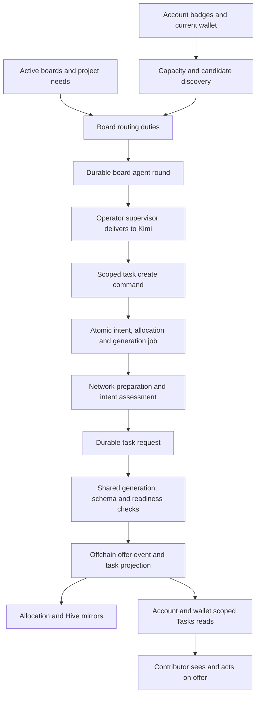

# Task Hive allocation audit — September 19, 2026

Task: `task_6e13951bd3e4973aa7ef7b892380fc32`.

## Verdict

**Hive allocation is stalled.** Production recorded no new network allocations during September 12–19, although 28 contributors currently satisfy the engine's badge/wallet rules and have free capacity. The board manager hit provider rate limits, exhausted three supervisor deliveries, and has remained on one unresolved six-board round since September 10. The downstream network queue is empty; restarting its generation worker alone would not restore routing.

Personal generation is functioning for new requests: 101 requests created since September 12 reached `proposed`. Three older personal requests are separately stranded in `queued` with exhausted attempts. Successful personal generation does not establish Hive recovery.

Production investigation was read-only: no allocator repairs, new assignments, provider changes, restarts, or payments were performed. Recovery has **not** been performed or verified. The deliverables are production evidence, three executable failure reproductions, and the repair/recovery plan below.

## Evidence scope and deployed revisions

Production observations were collected on September 19, approximately 19:14–19:28 UTC. The principal reconciliation window is September 12 00:00 UTC through the snapshot at 19:16:48 UTC; September 1–11 records explain the lead-up. The eligibility evaluation ran 19:22:49–19:23:03 UTC. Historical task dates do not establish continuous eligibility or the date someone began waiting.

Production is Fly app `tasknodeofficial-dev`, serving Task Node. Release metadata says 741, but individual process images differ:

| Boundary | Running machine | Immutable deployed image |
| --- | --- | --- |
| API / board commands | `8d4930ae156638` | `decisions-context-memory-20260919@sha256:5008851b189a96bb033d28ff816bc454d9298b5d0ba0921b82c9aa196b780d0c` |
| Personal and network generation | `7813e21f1295d8` | `task-step-readiness-20260916@sha256:ee2d49c37ec2707e19a43eb8689a7490040939223614e80e1c433f722feb34a9` |
| Operator supervisor | User service `tasknode-kimi-supervisor.service` | `ops/bm-runtime/supervisor.mjs`, SHA-256 `fdf2e218be52ed4f522642b049de24352f1490e109451a93db47ac29422823c8` |

The supervisor source predates the running service's September 5 start. The inspection checkout is `/home/pfrpc/repos/tasknode`, base commit `be15017ec2ba84bbb443e2443961f1277772428c`, with pre-existing changes. That Git commit alone does not identify the deployed tree. Deployed file hashes match the inspected eligibility, capacity, enqueue, queue, and board scheduling code. Both generator/readiness files match the running taskgen worker; the API image contains different versions of those two files. The image digests and per-file fingerprints are the deployment evidence.

All production SQL used database-enforced read-only transactions. Main snapshots use repeatable-read; the eligibility probe uses the real repository functions in one read-only transaction at the normal isolation level. It resolves account-owned badge state, provider-derived eligibility, current linked-wallet authorization with sync fallback, capacity, and board handle restrictions. Only pseudonyms and relevant status/timestamps are emitted; no account identifiers, wallet addresses, private provider identities, credentials, or balances are included.

## Allocation flow



| Stage | Implementation and durable evidence |
| --- | --- |
| Eligibility | `networkBadgeProjectionForAccount` in `server/repositories/network-badges.js`; `explainNetworkTaskCandidateEligibility` in `network-task-eligibility.js:625`. Current badge authorization and linked wallet govern eligibility; the legacy diagnostic-profile list is not the current executor gate. |
| Capacity | `getNetworkTaskCapacityState` in `network-task-capacity.js:112`. Default one live allocation, explicit account overrides; terminal projections and delinked wallets do not consume capacity. Personal tasks do not block network capacity. |
| Candidate discovery and scheduling | `scripts/bm/lib.mjs:234` and `:590`; `server/board-task-policy.js`. Discovery sorts by historical rewarded count, caps the source at 100, then returns the first 12 eligible idle contributors. Board restrictions are applied afterward. |
| Work selection | `server/board-agent-rounds.js` stores rounds/duties/results; operator `ops/bm-runtime/supervisor.mjs` delivers to the existing Kimi terminal. Kimi selects concrete work; downstream GLM writes the offer. |
| Authorization and reservation | Scoped board command dispatcher, `scripts/bm/writes.mjs:138`, `server/repositories/network-task-enqueue.js:34`. Badge/work-type and board restrictions, semantic idempotency, and account advisory lock with capacity recheck precede durable allocation/job creation. |
| Network preparation | `server/network-task-generation-worker.js:129`, `server/task-intent-assessment.js`, `network-task-generation-jobs.js`. Current direct intake uses account context and current wallet, then persists a PostgreSQL-backed request. Duplicate/uncertain intent assessments stop preparation. |
| Queue and generation | Fly taskgen role polls every 5 seconds, batch one. Network jobs claim with `SKIP LOCKED`, attempt IDs, heartbeat every 20 seconds, five-minute lease/reclaim and three-attempt exhaustion. Ordinary requests use attempt fencing, heartbeat/stale reclamation and bounded provider retries. |
| Publication | `server/task-generation-worker.js:264` calls `applyOffchainTaskOffer`; `server/offchain-task-lifecycle.js:379` writes offer events and projections. Offchain lifecycle is enabled and dual-write disabled. This path does not require a new PFTL pointer/reducer pass. |
| Delivery/read models | `server/repositories/tasks.js` scopes projections to the account/wallet; allocation/Hive mirror sync and `src/features/tasks/task-refresh-policy.js` support visibility and refresh. Database visibility, API visibility, and observed browser rendering are distinct checkpoints. |

There is no demonstrated queue of interchangeable unassigned tasks: this system generates assignments from selected board needs. Six active production boards, six pending routing duties and positive remaining board budgets establish routing demand and available budget, not proof that every possible task fits every eligible badge.

## Reconciliation and affected contributors

| Measure | Observed result |
| --- | --- |
| Candidate discovery universe | 144 accounts from badge, linked-wallet and active-sync sources |
| Engine exclusions | 107 without a verified badge; 4 with no resolved wallet |
| Engine eligible | 33 |
| Eligible but capacity occupied | 5 |
| Eligible with free capacity | 28 |
| Candidates surfaced by current scheduler | 12; 16 eligible idle contributors omitted, including 4 outside the top-100 source cutoff |
| Active production boards | 6; all have positive configured task caps and remaining daily budget |
| New allocations, generation jobs and linked offers, principal window | 0 |
| Network pending/running/link-failed chains at snapshot | 0 |
| Latest allocation | September 8 09:55:03 UTC; failed during intent assessment |
| Latest successful network job completion | September 7 16:54:51 UTC |
| New personal requests reaching proposed, principal window | 101: 37 terminal and 64 task-interface |
| Other personal states | 2 cancelled requests in-window; 3 older exhausted queued requests |
| Network allocation inventory, all history | 868 = 358 rewarded + 344 refused + 112 failed + 49 cancelled + 5 proposed mirrors |
| Network job inventory, all history | 868 = 756 published + 112 failed |
| Allocation-chain integrity | No missing job, referenced request, referenced projection, or referenced Hive task row; 2 status mismatches |
| Pending manager work | One September 10 round, 6 routing duties, 0 results |
| Manager command activity | No committed task-create audit after September 8; no completed command receipts in the principal window |

The five occupied allocations correspond to three proposed and two accepted canonical tasks. All five require stale-work follow-up under the existing policy. Two mirrors still say proposed although their canonical tasks were accepted. This does not free their capacity: both states correctly count as live.

All 28 currently idle eligible contributors are affected by the stopped routing process. The full pseudonymized cohort and exclusions are in `production-eligibility.json`. Five additional eligible contributors remain occupied by existing work; their cases require deliberate follow-up, not automatic reassignment.

Longest gaps among currently idle eligible contributors with a recorded prior offer:

| Contributor pseudonym | Last network offer | Relevant qualification |
| --- | --- | --- |
| `contributor_87db6c929f` | June 25 02:57 UTC | QA/expert; task activity September 19; omitted from scheduler's 12 |
| `contributor_507a8232dd` | June 26 07:36 UTC | KOL; outside source top 100 |
| `contributor_a1ce5db9de` | August 15 14:47 UTC | Core contributor/project leader; surfaced |
| `contributor_3a0bbc63c6` | August 31 22:46 UTC | Expert/QA; surfaced |

Four currently idle eligible contributors have no recorded network offer; there is no defensible numeric wait duration for them. These are gaps in recorded offers, not claimed continuous waiting times. The Task Node Fixes board has one handle-authorized candidate; the other five boards have 28 candidates before work-type fit, but see only 12 through discovery.

## Confirmed findings, ranked

**F1 — Critical: transient provider failures become an indefinite routing stop.** Terminal scrollback records repeated HTTP 429 rate limits. The pending round `round_86fafc0f-722c-405f-9b62-1a2eddf70f94` was delivered at September 10 21:22:38, 21:33:15 and 21:38:20 UTC. At 21:43:31 the supervisor emitted its one local alert. Attempts remain three and durable results remain empty. At observation the terminal is ready and the supervisor heartbeat is fresh.

`deliveryDecision` returns `alert_pending` indefinitely after three attempts. Only new durable round results reset delivery attempts; an idle/restarted terminal cannot produce those results without another work order. The supervisor also keeps returning the old pending round, so newer duties do not replace it. The isolated reproduction confirms this at 1, 9 and 30 days. The observed 429s triggered the failure chain; current provider quota availability was not probed. This explains the persistent stop after September 10, not every earlier routing decision.

**F2 — High: fixed candidate truncation permits starvation.** `idleEligibleContributors` sorts by historical rewards, selects 100 source accounts and truncates eligible idle members to 12 without a cursor or wait-age rotation. Sixteen of today's 28 idle eligible contributors are absent. A fixture with 13 eligible contributors repeatedly omits the thirteenth; because board restrictions run afterward, a board whose only allowed contributor is omitted receives no routing duty. That restricted-board case is reproduced, not claimed to be occurring on today's Fixes board.

**F3 — High: provider/validation failures are presented as semantic uncertainty.** The most recent network job, `nettaskjob_21badcf30df1246fd8ff0ab371491975`, exhausted three attempts on September 8. Its top-level error is `network_task_intent_needs_review:uncertain`, while the persisted assessment error is `inference_response_truncated`. Two other recent Fixes jobs have the same truncation cause and one has `inference_timeout`. The manager's previous blocked outcome described a worker failing to flush queued work. Current evidence instead shows failed assessment jobs and an empty network queue. Failed preparation must be distinguished from genuine duplicate/unclear work and from allocation commit failure.

**F4 — High, separate personal-queue defect: queued rows at the attempt limit cannot advance or be retried.** Three September 8 personal requests have bundles, no generated task, cycle attempts three, retry base zero and expired retry times. The claim predicate requires attempts below three; stale recovery only visits `generating`; owner retry only changes `failed`. The fixture confirms all three operations leave this state stranded. Their historical entry into this state was not reconstructed; the current inability to recover them is confirmed.

**F5 — Medium: pending-round liveness and mirrors obscure stale work.** Three proposals and two accepted tasks have old activity dates and need follow-up. Two allocation mirrors disagree with canonical accepted state. The existing mirror-recovery fixture repairs this class without accepting, submitting or rewarding on a user's behalf. Current production rows were preserved. Process readiness alone does not describe whether duties are progressing; a local one-time alert did not restore service.

**Additional observations.** Three historical request IDs map to 13 task projections, including a June network request with two distinct offer events. These predate the principal window; request reuse, legacy generation and replay need separate attribution before calling them current concurrent double-publish defects. Current concurrency fixtures passed. The audit task itself contains an extraneous sixth step, `submission_requirement:`, despite a readiness approval saying there were only five substantive steps. That is observed quality leakage, not evidence that the allocator is repaired or that malformed model output always escapes validation.

## Repair and recovery plan

Proposed accountable incident lead: the Task Node runtime operator under goodalexander's management, coordinating the operator-host supervisor and Fly taskgen worker. This is a recommendation, not a newly assigned employee mandate or an inference from Jim's proposed product remit.

| Priority / boundary | Smallest repair and recovery action | Observable success criterion | Rollback / recovery approach |
| --- | --- | --- | --- |
| P0 / supervisor | Preserve pending round/results and command keys. Separate provider cooldown from durable duty attempts; add a bounded scheduled recovery probe after exhaustion and a durable degraded state with acknowledged escalation. Once provider access is qualified, resume the original round at an idle boundary. | A simulated 429 followed by provider recovery advances the same round; no duplicate task-create receipt; real duties get explicit outcomes and representative candidates receive offers. | Retain the old source/state snapshot, pause delivery if duplicate risk appears, and reconcile existing receipts before any replay. Never delete the round to clear the alarm. |
| P1 / discovery | Paginate the complete candidate universe, apply board restrictions before page limits, and persist a rotation/wait cursor with reasons for exclusions. Preserve badge and capacity gates. | All 28 currently eligible idle candidates are considered over bounded rounds; the 13th/101st fixtures are eventually served or receive specific current exclusions. | Restore discovery code if needed while retaining candidate cursor/audit records; do not undo committed allocations. |
| P1 / network assessment | Preserve typed provider timeout/truncation/schema errors separately from a valid semantic `uncertain` verdict. Expose the cause in board packets. Qualify completion/output limits on bounded realistic requests, then retry reviewed failed intent through an explicit recovery path. | Truncation is reported as a provider failure; a valid continuation generates one request and one offer; genuine duplicate/uncertain work remains held. | Restore prior model configuration and leave affected intent failed/held; reuse original intent/job identity and never manufacture a second task to bypass review. |
| P1 / ordinary queue | Reconcile exhausted `queued/published` rows to an explicit failed state with compare-and-set guards, then allow the existing owner retry to start a new attempt cycle. | The three affected requests become actionable; fixture claims exactly once after an authorized retry; stale retry clicks cannot reset newer work. | Retain row snapshots and monotonic lifetime attempts. Restore only untouched failed-state metadata, never rows that have advanced or published. |
| P2 / follow-up and mirrors | Make pending-round recovery reconsider newly due work; use canonical task/contact/evidence state for stale follow-ups. Run targeted mirror reconciliation when implementing recovery. | Five cases receive current follow-up decisions; two mirror mismatches disappear; no submitted/rewarded task is cancelled and no user action is fabricated. | Rebuild mirrors from canonical events/projections. Preserve all lifecycle events; revert scheduling code without reversing valid user transitions. |
| P2 / output quality and legacy duplicates | Add realistic mixed-quality step cases to provider qualification; require meaningful per-step review coverage with structured validation. Investigate historical duplicate lineages before enforcing any new uniqueness constraint. | No unreviewed/template-only steps in the qualification set; duplicate diagnosis identifies the actual publication path and preserves legitimate history. | Restore qualification settings if false rejections occur; retain held outputs and original event history. Do not use regex phrase deletion on model output. |

Recovery is not proven by a green unit test, a resumed terminal, a successful personal request, or an empty network queue. Verify the full sequence for a small representative set across allowed badge lanes: selection audit → allocation/job → assessment → request → one offer event/projection → correct current wallet's Tasks API → contributor-visible offer/acknowledgment. Include an otherwise omitted candidate. Observe at least two complete routing rounds, reconcile remaining idle candidates and stale follow-ups, and record any exclusion by the actual rule. Keep concurrency and stale-worker tests green. Do not declare all 28 served merely because one task appears.

Monitor eligible idle count and its omitted fraction; time since last routing outcome and last successful allocation; pending round age and per-duty age; provider cooldown/exhaustion and alert acknowledgment; queue age by effective retry budget; assessment rejection versus provider error codes; attempts and stale-claim reclaim counts; allocation-to-visible-offer latency; duplicate lineage counts; mirror divergence; and time since each contributor was last considered. Existing System Status already reports generation freshness/stale queues; extend it with upstream routing/duty liveness rather than presenting process-ready as allocation health.

## Reproductions and validation

A new database `tasknode_hive_audit_20260919` was created in the local development Postgres container. Every mutating fixture used that database, database-enabled mode, web process role, and a separate temporary runtime-store path. No fixture used the production connection. The new audit fixture rejects any other database name or a non-local host.

With that isolated fixture environment configured, exact executable paths are:

```bash
node scripts/task-hive-allocation-audit-smoke.mjs
node scripts/task-generation-reliability-smoke.mjs
node scripts/network-task-generation-recovery-smoke.mjs
node scripts/network-task-capacity-smoke.mjs
node scripts/network-task-direct-intake-smoke.mjs
node scripts/board-agent-reliability-smoke.mjs
node scripts/task-generation-step-readiness-smoke.mjs
node scripts/network-task-recovery-smoke.mjs
npm run lint
npm run format-check
git diff --check
```

| Check | Result |
| --- | --- |
| New audit fixture | PASS: reproduced indefinite supervisor exhaustion, stable candidate omission/restricted-board loss, and unclaimable/unretryable exhausted queued requests |
| Task generation reliability | PASS: provider timeout/invalid-output retry policy, ownership fencing, stale claim/restart handling and attempt exhaustion |
| Network generation recovery | PASS: stale-running recovery, request reuse, terminal chain recovery and late-failure guards |
| Capacity | PASS: six concurrent requests for one remaining slot create one reservation; terminal/delinked/cross-class rules checked |
| Direct intake | PASS: owned context/current wallet, continuation, duplicate/uncertain holds, stale assessment rejection |
| Board agent reliability | PASS: ten concurrent retries give one command commit, scope checks, nested rollback, pending round resume and honest duty completion |
| Step readiness | PASS: fixture coverage for mixed/malformed reviews and stale approval; live model quality is not established by mocked reviews |
| Network mirror recovery | PASS: canonical mirror repair, retained evidence and already-published verification/reward guards |
| Repository checks | Lint, format-check, probe syntax checks, and whitespace checks passed |

These passing tests reproduce defects or verify existing protections. They do not mean production repairs were deployed.

Evidence in this directory: `production-snapshot.json`, `production-eligibility.json`, `production-forensics.json`, `deployed-machines.json`, both deployed source-schema files, `host-supervisor.json`, and the named test logs. `production-probe.mjs`, `eligibility-probe.mjs` and `host-probe.mjs` make collection repeatable; production probes are read-only. Source links above resolve from the repository root.

## Limits and unresolved questions

The repeated 429s and supervisor behavior explain the persistent September 10 onward stop. Before that, manager outcomes contain board-specific blocked/deferred judgments; their source availability and correctness were not independently revalidated. There is no evidence that all eligible contributors have appropriate work on every board.

A broad user-observability aggregation hit its 30-second statement limit; allocation, request, round and offer-event tables supply the reported reconciliation. Failed commands that rolled back may leave no committed command receipt, so zero receipts is not a count of every attempted HTTP call.

The current provider quota, production repair behavior, cross-contributor browser rendering, full legacy duplicate provenance and continuous historical eligibility remain unverified. The earlier personal request was seen through the Tasks API and accepted by the user; that establishes its delivery, not Hive-wide recovery.
