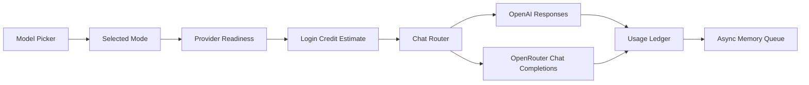

# AI Providers

AI Providers is the architecture boundary that turns a user-facing chat mode into a concrete model request. It decides which external provider is used, which model string is sent, whether reasoning is requested, whether web search is available, how attachments are encoded, and how usage is billed.

The code owner for this boundary is `server/chat-router.js`. The product contract and preflight checks live in `server/product-contracts.js`. The UI reads the mode list from app state and renders it in the composer model picker.

## Mode Matrix

| User-facing mode | Provider | API path | Default model | Reasoning | Web search | Privacy policy |
| --- | --- | --- | --- | --- | --- | --- |
| Private Instant | OpenRouter | `/api/v1/chat/completions` | `deepseek/deepseek-v4-flash` | None | Disabled | `zdr=true`, `data_collection="deny"`, provider allowlist |
| Private Thinking | OpenRouter | `/api/v1/chat/completions` | `deepseek/deepseek-v4-pro` | `high`, excluded from response | Disabled | `zdr=true`, `data_collection="deny"`, provider allowlist, `require_parameters=true` |
| Frontier Instant | OpenAI | `/v1/responses` | `chat-latest` | `medium` | Prompt-governed | Direct OpenAI route, `store=false` |
| Frontier Thinking | OpenAI | `/v1/responses` | `gpt-5.5` | `high` | Prompt-governed | Direct OpenAI route, `store=false` |

## Model Selection

Mode-specific environment variables always win:

- `CHAT_MODEL_PRIVATE_INSTANT`
- `CHAT_MODEL_PRIVATE_THINKING`
- `CHAT_MODEL_FRONTIER_INSTANT`
- `CHAT_MODEL_FRONTIER_THINKING`

For private modes only, `OPENROUTER_MODEL` is the next fallback. Frontier modes intentionally do not use a broad `OPENAI_MODEL` override; they are pinned to the explicit defaults unless the mode-specific variable is set.

Unknown mode strings are rejected with `unknown_chat_mode`. On app load, the default mode prefers Frontier Instant when that route is enabled, then falls back to the first enabled configured route.

## OpenAI Route

Frontier modes call OpenAI through the Responses API. Task Node sends:

- `instructions`: the shared Task Node instruction assembly from `server/chat-memory-context.js::taskNodeInstructions`. This includes the base operational prompt and, by default, the Jobs XML prompt rendered with the current context document, memory, and task state.
- `input`: recent conversation, the user message, and supported attachments.
- `reasoning`: `medium` for Frontier Instant and `high` for Frontier Thinking.
- `store: false`: app history remains in Task Node Postgres instead of provider-hosted state.
- `tools`: `web_search` for Frontier modes, with use governed by the assistant instructions.

Images are sent as `input_image`. Text attachments are sent as `input_text`. Other files are sent as `input_file` with filename and base64 data URL.

## OpenRouter Route

Private modes call OpenRouter through Chat Completions. Task Node sends:

- `messages`: the same shared instruction assembly as the system message, followed by recent conversation and user content.
- `provider.zdr=true`: restrict to Zero Data Retention endpoints.
- `provider.data_collection="deny"`: avoid providers that collect data.
- `provider.order` and `provider.only`: keep routing inside the mode-specific provider allowlist.
- `reasoning.effort="high"` on Private Thinking.
- `reasoning.exclude=true` on Private Thinking so reasoning text is not returned to the UI.
- `provider.require_parameters=true` when reasoning is requested.

Image attachments are sent as `image_url` parts. Text attachments are sent as text parts. File and PDF attachments are sent as file parts. PDFs add the OpenRouter `file-parser` plugin and use `OPENROUTER_PDF_ENGINE` or `cloudflare-ai`.

## Shared Chat Spirit

All four chat modes use one prompt assembly boundary. `prompts/chat/task_node_instructions_v1.md` remains the operational product-truth prompt. `prompts/chat/jobs_chat_os_v1.xml` is then rendered by `server/chat-spirit-context.js` so the model's voice and judgment feel product-led without duplicating provider code. The current user message, history, and attachments remain provider messages; the Jobs XML receives only durable background slots for the context document, task projection, memory context, and pgvector Jobs retrieval.

Jobs retrieval uses OpenAI `/v1/embeddings` through `server/embedding-provider.js`, defaulting to `text-embedding-3-small` with 1536 dimensions. That embedding call is internal retrieval infrastructure; it is not a chat completion provider route and does not enable web search on private modes.

## Profile NFT Image Generation

Profile NFT image generation is not a chat mode. It is a separate profile action backed by `POST /api/profile/nft/generate`.

Current behavior:

- Provider: OpenAI Image API.
- Model: `gpt-image-2`.
- Private prompt source: `private_prompts/profile_nft_image.md`, or `PROFILE_NFT_PROMPT_PATH` when explicitly configured.
- Public fallback prompt: `prompts/profile_nft_image.placeholder.md`.
- Renderer: `server/profile-nft-prompts.js`.
- Generator: `server/profile-nft-generation.js`.
- Persistence: `server/repositories/profile-nfts.js` and `profile_nfts`.
- Browser result: generated image data URL, IPFS image CID, model metadata, and prompt digests; not the prompt body.

The OpenAI image generation guide says the Image API is the right path for a single image from one prompt, while the Responses API image tool is better for conversational or multi-turn image workflows. Task Node uses the Image API for the first profile NFT generation path. `gpt-image-2` supports square `1024x1024` output and `low`, `medium`, `high`, or `auto` quality; the current local route defaults to `1024x1024` and `low` for fast iteration. `gpt-image-2` does not support transparent backgrounds, so profile images should use opaque/light backgrounds.

After generation, the server pins the image bytes to IPFS and records only public-safe metadata: image CID, image hash, prompt digest, template digest, provider/model, and status. The full image prompt remains server-side in `private_prompts/` or a configured private prompt path.

## Web Search Policy

OpenAI Responses supports a hosted `web_search` tool. Task Node exposes that tool only on Frontier modes and instructs the assistant to use it only when the user asks for current, external, or source-grounded information that is not already available in the conversation, attachments, context document, memory, or task state. There is no keyword router for search intent.

OpenRouter now documents an `openrouter:web_search` server tool, but Task Node does not enable it for private modes. That is a product choice: private modes should stay ZDR, open-source, and predictable. If OpenRouter web search is added later, it should be a separate explicit mode or toggle with billing, citation, and privacy behavior documented before launch.

## Usage And Billing

Provider usage is normalized into the app ledger:

- OpenAI usage reads `input_tokens`, `output_tokens`, `total_tokens`, and counts `web_search_call` output items.
- OpenRouter usage reads `prompt_tokens`, `completion_tokens`, `total_tokens`, provider `cost`, and any `server_tool_use.web_search_requests`.
- `chat_model_runs` stores provider, model, mode, response ID, tokens, web-search calls, and cost.
- `billing_ledger_entries` records the actual debit.

The current configured rates live in `chatModePrices`. They are estimates and caps for preflight; provider-returned usage is preferred when available.

Because Frontier requests may use OpenAI-hosted web search, preflight reserves the configured maximum search tool budget for Frontier modes. Actual billing still uses provider-returned token usage plus observed `web_search_call` items.

## Diagram

## External References

- [OpenAI Responses API migration guide](https://developers.openai.com/api/docs/guides/migrate-to-responses)
- [OpenAI web search tool](https://developers.openai.com/api/docs/guides/tools-web-search)
- [OpenAI image generation guide](https://developers.openai.com/api/docs/guides/image-generation)
- [OpenAI images and vision guide](https://developers.openai.com/api/docs/guides/images-vision)
- [OpenRouter provider routing](https://openrouter.ai/docs/guides/routing/provider-selection)
- [OpenRouter PDF inputs](https://openrouter.ai/docs/guides/overview/multimodal/pdfs)
- [OpenRouter web search server tool](https://openrouter.ai/docs/guides/features/server-tools/web-search)

## Failure Modes

- Missing `OPENAI_API_KEY` disables Frontier modes.
- Missing `OPENROUTER_API_KEY` or `OPENROUTER` disables Private modes.
- `OPENROUTER_CHAT_ENABLED=false` or `TASKNODE_ENABLE_OPENROUTER_CHAT=false` disables OpenRouter chat even when the key exists.
- Provider timeout returns a provider failure, not a fake assistant answer.
- Empty provider text is treated as an upstream failure.
- Attachments that cannot be normalized or parsed should fail visibly before or during chat execution.
