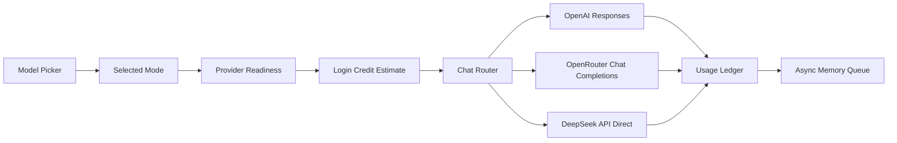

# AI Providers

AI Providers is the architecture boundary that turns a user-facing chat mode into a concrete model request. It decides which external provider is used, which model string is sent, whether reasoning is requested, whether web search is available, how attachments are encoded, and how usage is billed.

The code owner for this boundary is `server/chat-router.js`. The product contract and preflight checks live in `server/product-contracts.js`. The UI reads the mode list from app state and renders it in the composer model picker.

## Mode Matrix

| User-facing mode | Provider | API path | Default model | Reasoning | Web search | Privacy policy |
| --- | --- | --- | --- | --- | --- | --- |
| Private Instant | OpenRouter | `/api/v1/chat/completions` | `deepseek/deepseek-v4-flash` | `none`, excluded from response | Disabled | `zdr=true`, `data_collection="deny"`, provider allowlist, `require_parameters=true` |
| Private Thinking | OpenRouter | `/api/v1/chat/completions` | `deepseek/deepseek-v4-pro` | `high`, excluded from response | Disabled | `zdr=true`, `data_collection="deny"`, provider allowlist, `require_parameters=true` |
| Discount Thinking | DeepSeek API Direct | `/chat/completions` | `deepseek-v4-pro` | `high` | Disabled | Direct DeepSeek API route; not OpenRouter ZDR; text-only attachments |
| Frontier Instant | OpenAI | `/v1/responses` | `chat-latest` | `medium` | Prompt-governed | Direct OpenAI route, `store=false` |
| Frontier Thinking | OpenAI | `/v1/responses` | `gpt-5.5` | `high` | Prompt-governed | Direct OpenAI route, `store=false` |

## Model Selection

Mode-specific environment variables always win:

- `CHAT_MODEL_PRIVATE_INSTANT`
- `CHAT_MODEL_PRIVATE_THINKING`
- `CHAT_MODEL_DISCOUNT_THINKING`
- `CHAT_MODEL_FRONTIER_INSTANT`
- `CHAT_MODEL_FRONTIER_THINKING`

For OpenRouter private modes only, `OPENROUTER_MODEL` is the next fallback.
For Discount Thinking, `DEEPSEEK_CHAT_MODEL` is the next fallback. Frontier
modes intentionally do not use a broad `OPENAI_MODEL` override; they are pinned
to the explicit defaults unless the mode-specific variable is set.

Unknown mode strings are rejected with `unknown_chat_mode`. On app load, the default mode prefers Frontier Instant when that route is enabled, then falls back to the first enabled configured route.

## OpenAI Route

Frontier modes call OpenAI through the Responses API. Task Node sends:

- `instructions`: the shared Task Node instruction assembly from `server/chat-memory-context.js::taskNodeInstructions`. This includes the base operational prompt and, by default, the Jobs Markdown prompt rendered with the current context document, memory, task state, and pgvector Jobs retrieval context.
- `input`: recent conversation, the user message, and supported attachments.
- `reasoning`: `medium` for Frontier Instant and `high` for Frontier Thinking.
- `store: false`: app history remains in Task Node Postgres instead of provider-hosted state.
- `tools`: `web_search` for Frontier modes, with use governed by the assistant instructions.

Images are sent as `input_image`. Text attachments are sent as `input_text`. Other files are sent as `input_file` with filename and base64 data URL.

## OpenRouter Route

Private modes call OpenRouter through Chat Completions. Task Node sends:

- `messages`: the same shared instruction assembly as the system message, followed by recent conversation and user content.
- `provider.zdr=true`: restrict to Zero Data Retention endpoints.
- `provider.data_collection="deny"`: avoid providers that collect data.
- `provider.order` and `provider.only`: keep routing inside the mode-specific provider allowlist.
- `max_tokens=16384` on Private Instant, matching OpenRouter's current `deepseek/deepseek-v4-flash` top-provider completion ceiling.
- `reasoning.effort="none"` and `reasoning.exclude=true` on Private Instant so fast chat spends its answer budget on visible response text instead of returned reasoning text.
- `reasoning.effort="high"` on Private Thinking.
- `reasoning.exclude=true` on Private Thinking so reasoning text is not returned to the UI.
- `provider.require_parameters=true` when reasoning is controlled, so OpenRouter does not silently ignore the reasoning policy.

Image attachments are sent as `image_url` parts. Text attachments are sent as text parts. File and PDF attachments are sent as file parts. PDFs add the OpenRouter `file-parser` plugin and use `OPENROUTER_PDF_ENGINE` or `cloudflare-ai`.

## DeepSeek API Direct Route

Discount Thinking calls DeepSeek directly through the OpenAI-compatible Chat
Completions API:

- `model=deepseek-v4-pro`.
- `thinking.type="enabled"` and `reasoning_effort="high"`.
- `max_tokens=4096`.
- `stream_options.include_usage=true` for streaming calls so the final chunk
  includes usage.
- Text attachments are decoded into the user message. Image, PDF, and binary
  attachments are not sent to DeepSeek API Direct; the request includes a
  notice naming the omitted attachment instead.

This route is labeled `DeepSeek API Direct` in user-facing provider/status copy.
It is not the OpenRouter ZDR route. It exists for lower-cost direct DeepSeek V4
Pro reasoning when the user does not need ZDR routing or multimodal file
inspection.

Discount Thinking has a 120 second default provider budget because direct
DeepSeek V4 Pro can spend noticeable time in provider-side thinking before
visible output. If the streaming response is terminated before any visible text
is emitted, Task Node retries that same request through the non-streaming
DeepSeek completion path and only surfaces an error if that completion also
fails.

## Shared Chat Spirit

All chat modes use one prompt assembly boundary. `prompts/chat/task_node_instructions_v1.md` remains the operational product-truth prompt. `prompts/chat/jobs_standard_chat_codex_style_draft.md` is then rendered by `server/chat-spirit-context.js` so the model's voice and judgment feel product-led without duplicating provider code. The current user message, history, and attachments remain provider messages; the Jobs Markdown prompt receives only durable background slots for the context document, task projection, memory context, and pgvector Jobs retrieval. The chat thinking disclosure exposes the rendered Jobs retrieval context for audit.

Frontier Instant also uses `prompts/chat/frontier_instant_response_gate_v1.md`
with OpenAI Responses structured output. The model must return
`user_prompted_inquiry`, `full_response`, and `conformant_response`. The server
displays `full_response` only when the current user explicitly requested
long-form depth, including a fully thought-out, elaborate, complex, or in-full
treatment; otherwise it displays `conformant_response`. The stream route uses
the same gate for Frontier Instant and emits the selected response. The
complete gate JSON is persisted in assistant thinking metadata and rendered in
the chat thinking disclosure as `Frontier response JSON`, separate from the
Jobs source text audit block.

Jobs retrieval uses OpenAI `/v1/embeddings` through `server/embedding-provider.js`, defaulting to `text-embedding-3-small` with 1536 dimensions. That embedding call is internal retrieval infrastructure; it is not a chat completion provider route and does not enable web search on private modes.

## Hive Board Manager And Planning Workers

Hive planning workers are not user chat modes and are not billed to the user's chat balance. They are async internal coordination jobs.

The target architecture is Board Manager centered. The Board Manager is a leased decision worker that chooses one scoped Hive action per run. It now defaults to OpenRouter `qwen/qwen3.7-max` through Chat Completions because that model supports the long source packet and structured JSON output at lower cost than the prior OpenAI Pro route. Hive Secretary, Hive Active Projects, Product Documents, contributor assignment, Network Task assignment, and evidence review should become action handlers behind that manager instead of independent overactive cron loops.

| Worker | Provider | API path | Default model | Reasoning | Output | Privacy policy |
| --- | --- | --- | --- | --- | --- | --- |
| Hive Immediate Response | DeepSeek direct API | `/chat/completions` | `deepseek-v4-pro` | `none` by default | Immediate user-facing Hive Chat reply | Not ZDR; receives the latest Hive message, readable attachments, recent Hive Chat history, the requesting user's account-scoped Hive Context source packet, the latest Board Manager Secretary Packet, and a compact live Board Manager source snapshot; system-paid, not user-billed |
| Board Manager Secretary | DeepSeek direct API | `/chat/completions` | `deepseek-v4-pro` | `high` | Compact Board Triage packet | Not ZDR; internal Hive state only; no raw private chat/context/secrets |
| Board Manager | OpenRouter | `/api/v1/chat/completions` | `qwen/qwen3.7-max` | `high` | One action from registry | `data_collection="deny"`, structured output |
| Hive Secretary | OpenAI | `/v1/responses` | `gpt-5.5-pro` | `high` | Structured JSON report | `store=false` |
| Hive Active Projects | OpenAI | `/v1/responses` | `gpt-5.5-pro` | `high` | Structured JSON project set | `store=false` |

Hive Immediate Response is the synchronous conversational layer for Hive Chat. It runs after the user message is saved into Hive Context, so its prompt sees the updated account-scoped source packet including bounded text paste attachments for the requesting user. It also reads the latest current `board_manager_secretary_packets` row when available, prefers an exact packet for the live source digest, and falls back to the latest compressed packet plus live board facts when the user's new input has made that packet slightly stale. The live board facts are read-only shared board facts and include current action pressure, open follow-ups, projects, tasks, task requests, candidates, and recent Board Manager run summaries. The prompt separately marks which tasks or follow-ups are tied to the requesting `account_id`; otherwise the response must discuss them as shared board state or other contributors' work. This lets Hive acknowledge and clarify immediately, but it cannot mutate board state; durable mutations still require a later Board Manager action. Set `TASKNODE_HIVE_IMMEDIATE_RESPONSE_ENABLED=false` to disable it, `TASKNODE_HIVE_IMMEDIATE_MODEL` to override the model, `TASKNODE_HIVE_IMMEDIATE_MAX_TOKENS` to tune output length, and `TASKNODE_HIVE_IMMEDIATE_REASONING=high` only if the immediate reply should spend reasoning budget. The default output budget is `1600` tokens, with `TASKNODE_HIVE_IMMEDIATE_MAX_TOKENS` clamped between `120` and `4096`.

The Board Manager model default comes from OpenRouter's `qwen/qwen3.7-max` route. The model page/API report a 1M context window, structured-output support, and pricing of $2.50 per 1M input tokens and $7.50 per 1M output tokens. OpenAI `gpt-5.5-pro` remains available as an explicit override when the operator needs the older higher-cost path: set `TASKNODE_BOARD_MANAGER_PROVIDER=openai` and `TASKNODE_BOARD_MANAGER_MODEL=gpt-5.5-pro`.

Before Qwen runs, the default path now asks the direct DeepSeek API to build a reusable Board Manager Secretary packet when `DEEPSEEK_API_KEY` is present and `TASKNODE_BOARD_MANAGER_SECRETARY_ENABLED` is not `false`. That packet is stored in `board_manager_secretary_packets` and keyed by a semantic source digest. If only generated timestamps, trigger names, freshness age counters, source-text generated lines, or no-op Board Manager runs changed, the stored packet is reused and DeepSeek is not called again. Operators can force the old full-source path with `--no-secretary`.

Hive Project Product Documents are not a separate provider job. When the Board Manager chooses `refresh_project_document`, the Board Manager decision model writes the document in `payload.project_document`; the action hook validates and persists it to `network_project_product_docs`. This keeps core Hive management inside the Board Manager instead of delegating ordinary project-definition work to another model.

Current Hive Secretary and Active Projects workers still exist, but the planning direction is to stop treating them as the decision loop. The Board Manager owns whether a Secretary refresh, project update, product-doc refresh, research action, user follow-up, task allocation, or evidence review should happen.

The Board Manager harness defaults to dry-run for app mutations. `scripts/board-manager-model-exec.mjs` builds the live Hive source packet, calls the configured decision provider with `reasoning.effort="high"` against `schemas/board-manager-action.schema.json`, and records the selected action in `board_manager_runs` when Postgres is enabled. The default provider path is OpenRouter Chat Completions with `qwen/qwen3.7-max`, `response_format=json_schema`, `provider.data_collection="deny"`, and `usage.include=true`. When run with `--execute`, it dispatches supported hooks through `server/board-manager-actions.js`: `message_user`, `refresh_hive_secretary`, `create_project`, `archive_project`, `restore_project`, `refresh_project_document`, `assign_contributor`, and `initiate_network_task`. `message_user` appends an assistant response to the user's default Hive chat conversation, records `board_manager_user_messages` as delivery audit, and opens a `board_manager_followups` blocker row; it does not bill the user.

Board Manager source packets consume compact user routing profiles from `network_task_profiles`. Those profiles are generated asynchronously by the memory worker through the DeepSeek Flash ZDR route, so the Board Manager does not need raw user context documents, full chat history, or full memory bundles for each decision.

Environment overrides:

- `TASKNODE_HIVE_SECRETARY_MODEL`
- `TASKNODE_HIVE_SECRETARY_REASONING_EFFORT`
- `TASKNODE_BOARD_MANAGER_PROVIDER` (`openrouter` by default, `openai` for the override route)
- `TASKNODE_BOARD_MANAGER_MODEL`
- `TASKNODE_BOARD_MANAGER_REASONING_EFFORT`
- `TASKNODE_BOARD_MANAGER_SECRETARY_ENABLED`
- `TASKNODE_BOARD_MANAGER_SECRETARY_MODEL`
- `TASKNODE_BOARD_MANAGER_SECRETARY_REASONING_EFFORT`
- `TASKNODE_BOARD_MANAGER_SECRETARY_TIMEOUT_MS`
- `DEEPSEEK_API_KEY` or `DEEPSEEK`
- `DEEPSEEK_BASE_URL`
- `TASKNODE_HIVE_PROJECT_MODEL`
- `TASKNODE_HIVE_PROJECT_REASONING_EFFORT`
The default reasoning effort is `high`. These workers use structured outputs rather than prompt-only JSON parsing so invalid project shapes fail the job instead of silently changing the UI.

## Profile NFT Image Generation

Profile NFT image generation is not a chat mode. It is a separate profile action backed by `POST /api/profile/nft/generate`.

Current behavior:

- Provider: OpenAI Image API.
- Model: `gpt-image-2`.
- Private prompt source: `PROFILE_NFT_PROMPT_B64` or `PROFILE_NFT_PROMPT_TEXT` in deployed environments; local development can also use ignored `private_prompts/profile_nft_image.md`, or `PROFILE_NFT_PROMPT_PATH` when explicitly configured.
- Dev/test fallback prompt: `prompts/non_production/profile_nft_dev/profile_nft_image.placeholder.md`. Production generation fails closed unless a private prompt is configured.
- Renderer: `server/profile-nft-prompts.js`.
- Generator: `server/profile-nft-generation.js`.
- Persistence: `server/repositories/profile-nfts.js` and `profile_nfts`.
- Browser result: generated image data URL, IPFS image CID, model metadata, and prompt digests; not the prompt body.

The OpenAI image generation guide says the Image API is the right path for a single image from one prompt, while the Responses API image tool is better for conversational or multi-turn image workflows. Task Node uses the Image API for the first profile NFT generation path. `gpt-image-2` supports square `1024x1024` output and `low`, `medium`, `high`, or `auto` quality; the current route defaults to `1024x1024` and `high` so generated profile NFTs are not silently produced as low-quality launch assets. `gpt-image-2` does not support transparent backgrounds, so profile images should use opaque/light backgrounds.

In `NODE_ENV=production`, profile NFT generation refuses to run from the public placeholder prompt unless `PROFILE_NFT_ALLOW_PLACEHOLDER=true` is explicitly set. This prevents live accounts from minting or saving generic images when the private prompt secret is missing.

After generation, the server pins the image bytes to IPFS and records only public-safe metadata: image CID, image hash, prompt digest, template digest, provider/model, and status. The full image prompt remains server-side in `private_prompts/` or a configured private prompt path.

## Web Search Policy

OpenAI Responses supports a hosted `web_search` tool. Task Node exposes that tool only on Frontier modes and instructs the assistant to use it only when the user asks for current, external, or source-grounded information that is not already available in the conversation, attachments, context document, memory, or task state. There is no keyword router for search intent.

OpenRouter now documents an `openrouter:web_search` server tool, but Task Node does not enable it for private modes. That is a product choice: private modes should stay ZDR, open-source, and predictable. If OpenRouter web search is added later, it should be a separate explicit mode or toggle with billing, citation, and privacy behavior documented before launch.

## Usage And Billing

Provider usage is normalized into the app ledger:

- OpenAI usage reads `input_tokens`, `output_tokens`, `total_tokens`, and counts `web_search_call` output items.
- OpenRouter usage reads `prompt_tokens`, `completion_tokens`, `total_tokens`, provider `cost`, and any `server_tool_use.web_search_requests`.
- DeepSeek API Direct usage reads `prompt_tokens`, `completion_tokens`,
  `prompt_cache_hit_tokens`, `prompt_cache_miss_tokens`, and `total_tokens`;
  cost is computed from the configured direct DeepSeek prices because DeepSeek
  returns token usage rather than a USD `cost` field.
- `chat_model_runs` stores provider, model, mode, response ID, tokens, web-search calls, and cost.
- `billing_ledger_entries` records the actual debit.

The current configured rates live in `chatModePrices`. They are estimates and
caps for preflight; provider-returned usage is preferred when available.

Because Frontier requests may use OpenAI-hosted web search, preflight reserves the configured maximum search tool budget for Frontier modes. Actual billing still uses provider-returned token usage plus observed `web_search_call` items.

## Pricing Audit

The Help -> System Status page renders a live Chat Model Pricing section from
`/api/system/status`. The backend snapshot is built in
`server/model-pricing-status.js` and includes:

- current chat modes, models, configured rates, max output caps, reasoning
  policy, provider readiness, and privacy policy;
- cached live OpenRouter model metadata from
  `https://openrouter.ai/api/v1/models`;
- cached OpenRouter endpoint prices for the OpenRouter-backed chat models;
- direct DeepSeek V4 Pro pricing for Discount Thinking from DeepSeek's official
  pricing docs, explicitly labeled `DeepSeek API Direct`.

Configured rates and live metadata are intentionally both visible. Configured
rates drive preflight estimates and confirmation thresholds. OpenRouter live
metadata explains current market/provider pricing. Actual OpenRouter billing uses
the provider-returned `usage.cost` field when present.

The DeepSeek V4 Pro headline price is now available as Discount Thinking through
the direct DeepSeek API. It is still not the same thing as the Task Node ZDR
route. Private Thinking sends `provider.zdr=true`,
`provider.data_collection="deny"`, and a provider allowlist, so eligible
endpoints are the OpenRouter ZDR/provider-policy-compatible endpoints rather
than the cheapest public endpoint.

## Diagram

## External References

- [OpenAI Responses API migration guide](https://developers.openai.com/api/docs/guides/migrate-to-responses)
- [OpenAI web search tool](https://developers.openai.com/api/docs/guides/tools-web-search)
- [OpenAI image generation guide](https://developers.openai.com/api/docs/guides/image-generation)
- [OpenAI images and vision guide](https://developers.openai.com/api/docs/guides/images-vision)
- [OpenRouter provider routing](https://openrouter.ai/docs/guides/routing/provider-selection)
- [OpenRouter PDF inputs](https://openrouter.ai/docs/guides/overview/multimodal/pdfs)
- [OpenRouter web search server tool](https://openrouter.ai/docs/guides/features/server-tools/web-search)
- [OpenRouter Qwen3.7 Max model page](https://openrouter.ai/qwen/qwen3.7-max)
- [OpenRouter model metadata API](https://openrouter.ai/api/v1/models)
- [DeepSeek chat completions](https://api-docs.deepseek.com/api/create-chat-completion)
- [DeepSeek models and pricing](https://api-docs.deepseek.com/quick_start/pricing)

## Failure Modes

- Missing `OPENAI_API_KEY` disables Frontier modes.
- Missing `OPENROUTER_API_KEY` or `OPENROUTER` disables Private modes.
- Missing `DEEPSEEK_API_KEY` or `DEEPSEEK` disables Discount Thinking.
- `OPENROUTER_CHAT_ENABLED=false` or `TASKNODE_ENABLE_OPENROUTER_CHAT=false` disables OpenRouter chat even when the key exists.
- `DEEPSEEK_CHAT_ENABLED=false` or `TASKNODE_ENABLE_DEEPSEEK_CHAT=false` disables DeepSeek API Direct chat even when the key exists.
- Provider timeout returns a provider failure, not a fake assistant answer. The
  default chat provider timeout is 45 seconds; Telegram Discount Thinking uses a
  Telegram-specific 120 second default through
  `TELEGRAM_BOT_DISCOUNT_THINKING_TIMEOUT_MS` or its documented aliases.
- Empty provider text is treated as an upstream failure.
- Attachments that cannot be normalized or parsed should fail visibly before or during chat execution.

## Reviewer To Do List

Review implementation against this document (ai providers). Mark each item when verified.

### Memory Efficiency
- [ ] Hot paths use bounded queries, checkpoints, or projection tables.
- [ ] Background workers dedupe and lock jobs to prevent duplicate work.
- [ ] Provider calls stream where supported; full responses not buffered twice.
- [ ] Board Manager decision worker runs bounded by lease; batch size 1 for network task generation.

### Code Quality
- [ ] Architecture claims map to migrations, repositories, and smoke scripts.
- [ ] Failure modes have operator-visible signals or health endpoints.
- [ ] Mode config centralized in `chat-router.js`; env overrides documented.
- [ ] Worker prompts record provider, model, prompt version on output rows.

### Coherence
- [ ] Canonical vs cache boundaries consistent with wiki index.
- [ ] Cross-links to related architecture pages remain accurate.
- [ ] Private ZDR and Frontier Responses API settings match chat surface doc.
- [ ] Hive/profile workers use documented models (DeepSeek, gpt-5.5-pro, etc.).

### Bloat
- [ ] No parallel implementations of the same protocol concern.
- [ ] Retention policies drop queue noise without losing audit tx rows.
- [ ] Avoid sending full corpus or unclipped context to workers when digest suffices.

### Security
- [ ] Encryption and wallet-role rules enforced at trust boundaries.
- [ ] Secrets and seeds remain server-side or browser-local as designed.
- [ ] API keys server-side only; never exposed to browser bundle.
- [ ] Private modes deny data collection; Frontier uses `store=false`.
- [ ] Profile NFT private prompt path outside repo; placeholder not used in production.
