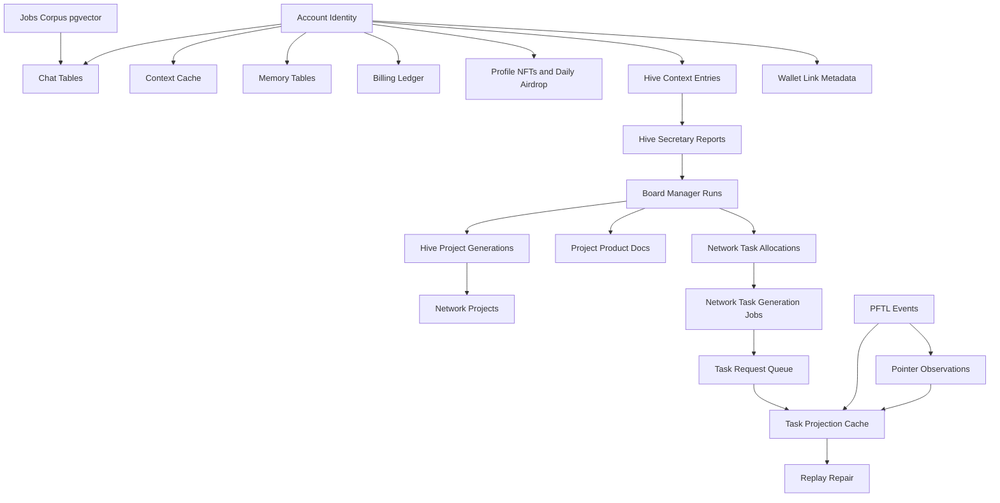

# Database Architecture

Postgres is the product cache and account database. It is critical for speed, UX continuity, billing, chat history, context editing, and memory inspection. It should not become the canonical task protocol.

## Current Caches

- Chat and billing: `server/db/migrations/001_chat_billing.sql`
- Attachments: `server/db/migrations/002_chat_attachments.sql`
- Context cache: `server/db/migrations/003_context_cache.sql`
- Memory rows: `server/db/migrations/004_chat_memory.sql`
- Deep memory rows: `server/db/migrations/005_deep_chat_memory.sql`
- Task projections: `server/db/migrations/006_task_projections.sql`
- PFTL transaction cache: `server/db/migrations/007_pftl_transaction_cache.sql`
- PFTL watcher/reducer queue: `server/db/migrations/008_pftl_cache_watcher.sql`, `009_pftl_cache_reducer_dedupe_key.sql`
- PFTL operations: `server/db/migrations/010_pftl_cache_operations.sql`
- Context projection source metadata: `server/db/migrations/011_context_history_projection_source.sql`
- Task request queue and receipt cache: `server/db/migrations/012_task_requests.sql`
- Deep memory source snapshots: `server/db/migrations/013_deep_memory_snapshots.sql`
- Jobs pgvector corpus: `server/db/migrations/014_jobs_corpus_pgvector.sql`
- Context edit proposals: `server/db/migrations/015_context_edit_proposals.sql`
- Profile NFTs: `server/db/migrations/018_profile_nfts.sql`
- Profile daily airdrop runs: `server/db/migrations/019_profile_daily_airdrop.sql`
- Profile public snapshots: `server/db/migrations/021_profile_public_snapshots.sql`
- PFTL pointer observations: `server/db/migrations/023_pftl_pointer_observations.sql`
- Network task profiles: `server/db/migrations/024_network_task_profiles.sql`
- Hive context entries: `server/db/migrations/027_hive_context_entries.sql`
- Hive Secretary reports: `server/db/migrations/028_hive_secretary_reports.sql`
- Hive network projects: `server/db/migrations/029_hive_network_projects.sql`
- Hive project seed cleanup: `server/db/migrations/030_hive_project_seed_cleanup.sql`
- Hive active project planning: `server/db/migrations/031_hive_project_planning.sql`
- Hive scoping-card archive cleanup: `server/db/migrations/032_archive_rejected_hive_scoping_projects.sql`
- Board Manager v0 run tables: `server/db/migrations/033_board_manager_v0.sql`
- Board Manager action hooks: `server/db/migrations/035_board_manager_action_hooks.sql`
- Board Manager persistent sessions: `server/db/migrations/036_board_manager_persistent_sessions.sql`
- Hive project product documents: `server/db/migrations/038_network_project_product_docs.sql`
- Network task allocations and generation jobs: `server/db/migrations/039_network_task_allocations.sql`
- Board Manager scheduler: `server/db/migrations/042_board_manager_scheduler.sql`
- Board Manager secretary packets: `server/db/migrations/043_board_manager_secretary_packets.sql`

## Table Inventory

| Table | Description | App surfaces that rely on it | Source |
| --- | --- | --- | --- |
| `chat_conversations` | One row per chat thread, including account owner, title, mode, status, last message preview, message count, and soft delete state. | Chat recents, chat rename/delete, chat history restore, Search, Memory context labels. | `001_chat_billing.sql` |
| `chat_messages` | Canonical cached chat turns for a conversation, including role, body, provider/model metadata, response IDs, and JSON metadata. | Chat transcript restore, Memory jobs, Search, attachment linkage, provider debugging. | `001_chat_billing.sql` |
| `chat_model_runs` | One row per model execution with provider, model, mode, response IDs, status, token counts, web search calls, tool cost, model cost, and total cost. | Chat usage display, billing ledger creation, cost audit, provider reliability review. | `001_chat_billing.sql` |
| `billing_accounts` | Per-account billing balance cache with current spend, current credit, currency, status, and ledger count. | Wallet/Billing page, chat credit display, chat send eligibility, top-up reconciliation. | `001_chat_billing.sql` |
| `billing_ledger_entries` | Append-style billing ledger for credits and debits, including model run linkage, token usage, provider/model, source, idempotency key, and metadata. | Wallet/Billing page, usage audit, top-up accounting, chat cost history. | `001_chat_billing.sql` |
| `account_deletion_audit` | Durable account deletion audit keyed by account/archive id, wallet/deposit addresses, hashed provider identities, hashed email, non-secret provider labels, reason, and deletion time. | Account deletion review, faucet-abuse guard for wallet initiation grants, QA account exemptions. | `048_account_deletion_audit.sql` |
| `chat_attachments` | Attachment metadata and extracted text for a chat message, including filename, MIME type, size, hash, source, text content, excerpt, and optional storage URI. | Chat file uploads, drag-and-drop attachments, PDF/DOCX/image text context, Search. | `002_chat_attachments.sql` |
| `context_documents` | One active context document per account, tracking title, current draft revision, revision number, and soft delete state. | Context page, chat context grounding, Context Refine. | `003_context_cache.sql` |
| `context_revisions` | Current draft body cache for the active context document. Native editor saves update this row in place; it is not long-term version history. | Context editing, current document restore, publish preparation, Search. | `003_context_cache.sql`, `016_context_current_draft_only.sql` |
| `context_history_imports` | Context projection run records, including wallet address, projection source, pointer counts, task event counts, status, and errors. | Context historical restore, wallet-linked context recovery, reducer diagnostics. | `003_context_cache.sql`, `011_context_history_projection_source.sql` |
| `context_history_pointers` | Cached PFTL pointer projection rows from wallet history, including CID, tx hash, ledger index, memo index, pointer kind, task/thread/context IDs, event metadata, and source fields. This is the durable context history path. | Context revision history, restore previews, PFTL replay, task projection cache seed. | `003_context_cache.sql` |
| `context_edit_proposals` | Account-scoped Context Refine proposals tied to a chat conversation, assistant message, base context revision/body hash, edit operation, target text, replacement text, state, and saved revision metadata. | Chat Context Refine proposal cards, proposal accept/reject, Context page saved revisions after accepted edits. | `015_context_edit_proposals.sql` |
| `chat_memory_jobs` | Async queue row for one memory summarization job tied to a user message and assistant message, with retry and lock fields. | Memory worker, non-blocking chat memory writes, worker diagnostics. | `004_chat_memory.sql` |
| `chat_memory_entries` | Memory output rows containing user request summary, system response summary, memory text, source excerpts, provider/model, prompt version, usage JSON, and deep memory classification fields. Deep-memory rows are unique per account/block. | Memory page, chat memory injection, Search, future profile export. | `004_chat_memory.sql`, `005_deep_chat_memory.sql`, `013_deep_memory_snapshots.sql` |
| `chat_deep_memory_jobs` | Async queue row for every 36-memory deep compression block, with account/block uniqueness, exact source memory entry IDs, and retry/lock fields. | Deep Memory section, chat memory injection, memory worker diagnostics. | `005_deep_chat_memory.sql`, `013_deep_memory_snapshots.sql` |
| `network_task_profile_jobs` | Async queue rows for private Network Task Profile generation, including account, source packet JSON/text, digest, lock/retry state, and last error. | Memory Network Task Profile panel, future network task routing diagnostics. | `024_network_task_profiles.sql` |
| `network_task_profiles` | Completed private routing profiles with source packet, model output, provider/model/prompt metadata, source digest, usage JSON, and superseded timestamp for audit history. | Memory page generated Network Task Profile, user-visible source packet audit, future task routing input. | `024_network_task_profiles.sql` |
| `hive_context_entries` | Signed-in user Hive chat entries grouped into the Hive Context document. Stores body text, display-name snapshot, source conversation metadata, linked-wallet validation flag/address, attachment metadata, bounded text paste content for source packets, body hash, and timestamps. The public Hive Context API redacts attachment text; Secretary and Board Manager packets receive the bounded text content. The `source_conversation_id` is also the return route when Board Manager `message_user` responds to a specific Hive chat entry. | Default `Hive` chat, Hive page collapsed `Hive Context` section, Hive Secretary source packet, Board Manager source packet, Board Manager response routing. | `027_hive_context_entries.sql`, `028_hive_secretary_reports.sql` |
| `hive_secretary_jobs` | Async queue rows for regenerating the Hive Secretary report after validated-wallet Hive chat entries arrive. Stores source packet JSON/text, packet digest, source entry id, lock/retry state, and errors. | Hive Secretary worker, Hive page report status, operator diagnostics. | `028_hive_secretary_reports.sql` |
| `hive_secretary_reports` | Completed Hive Secretary reports over validated-wallet Hive chat entries, with source packet, OpenAI output JSON/text, provider/model/prompt metadata, usage JSON, and supersession timestamp. | Hive page Secretary report, Hive Active Projects worker input, future system Network Task worker input, prompt audit. | `028_hive_secretary_reports.sql` |
| `hive_project_planning_jobs` | Async queue rows for turning the latest Hive Secretary report into active project records with OpenAI `gpt-5.5-pro`. | Hive Active Projects worker, Hive project diagnostics. | `031_hive_project_planning.sql` |
| `hive_project_generations` | Completed active-project generations with source report, structured OpenAI output, provider/model/prompt metadata, response id, and usage JSON. | Hive active project audit, project registry rebuilds, future network task allocation. | `031_hive_project_planning.sql` |
| `network_projects` | Active Hive project records that exist before task allocation. Stores type, title, summary, objective/about text, phase, priority, planned route budget, scoped task target, target contributor count, and latest Hive Secretary input reference. Operator-archived rows carry an archive lock so generated project planning cannot silently reactivate rejected cards. | Hive active project cards, Hive project detail, future network task allocation. | `029_hive_network_projects.sql`, `030_hive_project_seed_cleanup.sql`, `032_archive_rejected_hive_scoping_projects.sql`, `034_lock_operator_archived_hive_projects.sql` |
| `network_project_contributors` | Optional materialized contributor/operator rollups. The current Hive read model can derive operator rows from `network_project_task_refs` when this table is empty. | Hive contributor previews, allotted operators, project detail contributors. | `029_hive_network_projects.sql`, `030_hive_project_seed_cleanup.sql` |
| `network_project_task_refs` | Project-scoped task refs linking concrete PFTL tasks to Hive projects. Current rows mirror `task_projections.status`, reward, assignee wallet, and task title for fast Hive reads. | Hive project task board, routing feed derivation, allotted operator derivation, profile NFT assignee badges. | `029_hive_network_projects.sql`, `030_hive_project_seed_cleanup.sql` |
| `network_project_activity` | Optional materialized project activity feed rows. The current Hive read model can derive routing-feed rows from `network_project_task_refs` and `task_projections` when this table is empty. | Hive routing feed and project activity section. | `029_hive_network_projects.sql`, `030_hive_project_seed_cleanup.sql` |
| `network_project_product_docs` | Current and superseded agent-written project documents linked to `network_projects`. Stores Project Status, key points, blockers, next actions, source packet, prompt/provider metadata, and Board Manager run id. | Hive project About `Project Status`, Board Manager `refresh_project_document`, future project-linked task generation inputs. | `038_network_project_product_docs.sql` |
| `network_task_allocations` | Durable project-linked allocation rows for system-pushed Network Tasks and Alpha Tasks before and after a concrete PFTL task offer exists. Stores project id, task class, candidate account/wallet, candidate diagnostic profile digest, routing reason, project need, reward band, accept window, request id, generated task id, and allocation status. After publication, allocation status mirrors the task projection lifecycle, for example `completed` after a rewarded task. | Board Manager `initiate_network_task`, Hive allocated-operator view, network-pushed task routing audit, project-linked task reconciliation. | `039_network_task_allocations.sql` |
| `network_task_intents` | Semantic idempotency ledger for Board Manager-initiated Network Tasks. Stores project, candidate, task class, normalized need hash, reward band, linked allocation/job/task ids, and expiry. | Duplicate Network Task suppression, Hive audit, Board Manager state awareness. | `050_board_manager_state_guardrails.sql` |
| `network_task_generation_jobs` | Durable async jobs that convert a Board Manager allocation decision into a normal task-generation request bundle. Stores allocation id, project id, candidate account/wallet, reward band, source packet digest/text/json, request bundle CID, generated task payload, task id, offer CID/tx hash, attempts, and failure state. | Network task generation worker, Board Manager action hook smoke, future operator job monitor, project-linked task creation. | `039_network_task_allocations.sql` |
| `board_manager_leases` | One lease per manager scope, starting with `global_hive`, so only one Board Manager runs across Fly instances. | Board Manager executor, future Hive manager loop, operator diagnostics. | `033_board_manager_v0.sql` |
| `board_manager_sessions` | One persistent Codex session per Board Manager scope. Stores the session id/path, model, reasoning effort, and latest run id so future ticks resume the same agent instead of starting over. | Board Manager Codex Exec resume path, Hive Mind Agent continuity, operator diagnostics. | `036_board_manager_persistent_sessions.sql` |
| `board_manager_runs` | Durable Board Manager run log with trigger, source packet digest, selected action, action payload, decision JSON, Codex model, reasoning effort, dry-run flag, status, errors, and the compact `micro_summary_json` / `micro_summary_text` artifact generated at the end of each run. Runs with `do_nothing` or no selected action still render in the Hive Mind Agent feed. Future Board Manager source packets read the micro summaries instead of reinjecting full prior decisions. | Board Manager Codex Exec audit, Hive Mind Agent feed, future Hive manager UI/operator controls, Board Manager source-packet continuity. | `033_board_manager_v0.sql`, `041_board_manager_run_micro_summaries.sql` |
| `board_manager_action_results` | Audit log for executed manager actions. Current hooks record message-user, Secretary refresh, project create/archive, project-document refresh, contributor assignment, and do-nothing results. | Hive Mind Agent feed, project action history, operator diagnostics. | `033_board_manager_v0.sql` |
| `board_manager_user_messages` | Delivery audit for Board Manager `message_user` actions keyed by account and run id. Metadata stores the source Hive Context entry, destination conversation id, and inserted chat message id. The visible user response is appended to `chat_messages`. | Board Manager message delivery audit, Hive Mind Agent action diagnostics, future notification surfaces. | `035_board_manager_action_hooks.sql` |
| `board_manager_followups` | Durable open/answered/resolved user follow-up rows created by `message_user`. Stores account, optional project, source Hive Context entry, delivery ids, blocker summary, expected response, and expiry. | Hive message anti-spam, Board Manager blocked-state tracking, user reply resolution. | `050_board_manager_state_guardrails.sql` |
| `board_manager_scopes` | Durable Board Manager scope configuration, starting with `global_hive`, including cadence, pause state, max actions per hour, and next due timestamp. | Board Manager worker, operator controls, Fly process scheduling. | `042_board_manager_scheduler.sql` |
| `board_manager_jobs` | Durable Board Manager trigger queue with idempotency key, run-after time, claim state, completion/failure state, attempt count, and error text. | Board Manager worker, operator controls, periodic and event-triggered Hive agent runs. | `042_board_manager_scheduler.sql` |
| `board_manager_secretary_packets` | Reusable DeepSeek-generated Board Manager Secretary packets keyed by semantic source digest. Stores compact packet JSON/text, provider/model/prompt metadata, response id, usage, status, and supersession timestamps. | Board Manager Qwen decision source, Hive Mind Agent audit follow-up, provider cost diagnostics. | `043_board_manager_secretary_packets.sql` |
| `pftl_task_sync_runs` | One row per task replay/import run with account, wallet, source, status, task count, pointer event count, and metadata. | Tasks replay diagnostics, operator recovery, Python replay imports. | `006_task_projections.sql` |
| `task_requests` | Durable receipt and worker claim table for browser/chat task requests, including account, subject wallet, request/bundle CIDs, request transaction, generated task ID, worker attempts, status, and errors. | Tasks request strip, task generation worker, chat task request receipts, operator debugging. | `012_task_requests.sql` |
| `pftl_task_pointer_events` | Typed task pointer events hydrated from PFTL pointer memos and IPFS payloads. | Tasks, task replay repair, reward traceability, audit. | `006_task_projections.sql` |
| `task_events` | Normalized task lifecycle events keyed by task ID, event type, source tx hash, CID, payload, and pointer JSON. | Tasks state rebuild, task history, verification/reward audit. | `006_task_projections.sql` |
| `task_projections` | Current task state projection with status, title, description, wallets, rewards, submission requirement, verification policy, and source references. | Tasks page, chat task context injection, wallet task panels. | `006_task_projections.sql` |
| `pftl_sync_wallets` | Watchlist and checkpoint table for every wallet the app tracks, including account owner, role, status, hot sync state, archive marker, archive completeness, and last error. | Wallet activity feed, Context history backfill, Tasks replay, PFTL cache workers, operator health. | `007_pftl_transaction_cache.sql` |
| `pftl_transactions` | Global transaction mirror keyed by tx hash with full tx JSON, meta JSON, ledger index, type, result, accounts, and close time. | Wallet activity, pointer memo extraction, replay repair, audit. | `007_pftl_transaction_cache.sql` |
| `pftl_wallet_transactions` | Per-wallet transaction index linking tracked wallets to global tx rows with direction, counterparty, delivered drops, fee, ledger, and close time. | Wallet transaction feed, cache-compatible `account_tx` reads, future contact/message surfaces. | `007_pftl_transaction_cache.sql` |
| `pftl_pointer_memos` | Global decoded and raw pointer memo facts keyed by transaction hash and memo index, including pointer kind, CID, task/request/context/thread IDs, memo hex, decoded JSON, and decode error. The old `wallet_address` column is compatibility metadata, not ownership. | Context restore, Tasks replay, future wallet-native messages, audit. | `007_pftl_transaction_cache.sql` |
| `pftl_pointer_observations` | Wallet/account observation bridge for pointer memos. It records which tracked wallet saw a global pointer, account ownership, wallet role, direction, pointer kind, CID, task/request/context/thread IDs, and source. | PFTL cache reducer, Tasks replay across user/authority wallets, Context pointer hydration, operator repair, data architecture audit. | `023_pftl_pointer_observations.sql` |
| `pftl_cache_watcher_state` | Operational state for WSS cache watchers, including endpoint, status, subscribed wallet count, last ledger, last event, and error. | Operator health, cache diagnostics, deployment monitoring. | `008_pftl_cache_watcher.sql` |
| `pftl_cache_reducer_events` | Idempotent reducer queue for wallet balance refresh, context pointer hydration, and task projection replay. | Context history projection, Tasks projection, wallet refresh, repair workers. | `008_pftl_cache_watcher.sql`, `009_pftl_cache_reducer_dedupe_key.sql` |
| `pftl_cache_maintenance_runs` | Recent archive/retention/maintenance run summaries with status, optional wallet, metrics JSON, and errors. | Operator health, retention diagnostics, cache operations audit. | `010_pftl_cache_operations.sql` |
| `jobs_corpus_sources` | Source manifest for the Jobs reference corpus, including raw URL, raw SHA-256, byte size, label, fetch time, and metadata. | Chat Jobs spirit retrieval, operator ingestion audit, future prompt source diagnostics. | `014_jobs_corpus_pgvector.sql` |
| `jobs_corpus_chunks` | Chunked Jobs reference text with stable chunk index, content hash, embedding model/provider, 1536-dimension pgvector embedding, and metadata. | Chat Jobs spirit retrieval through `server/jobs-corpus.js`, future prompt diagnostics. | `014_jobs_corpus_pgvector.sql` |
| `profile_nfts` | Account-scoped profile NFT records with generated image CID, prompt/template digests, OpenAI model metadata, mint status, XLS-24 metadata CID, prepared `NFTokenMint` JSON, tx hash, and token id. The private prompt body is not stored. | Profile Studio, NFT gallery, profile NFT mint flow, public profile avatar selection, Hive assignee/operator profile badges. | `018_profile_nfts.sql` |
| `profile_daily_airdrop_runs` | Account-scoped daily airdrop scoring rows with dry-run/production mode, scenario id, model output fields, contributor reasoning, identity-cloud input snapshot, deterministic recipient metadata, alignment numerator/denominator, provider/model/prompt metadata, and status timestamps. | Profile Daily Airdrop panel, recurring daily airdrop worker, dry-run scoring audit, operator review. | `019_profile_daily_airdrop.sql` |
| `profile_daily_airdrop_issuances` | Submitted daily airdrop payments with source wallet, recipient wallet, PFT amount, payload digest, pointer CID, tx hash, ledger index, and account/day uniqueness. | Private Profile paid airdrop display, reward history chart, public profile lifetime earned PFT. | `020_profile_daily_airdrop_issuance.sql` |
| `profile_public_snapshots` | Account-scoped public profile role snapshots with deterministic input snapshot/fingerprint, DeepSeek output fields, provider/model/prompt metadata, status, and completion timestamps. Numeric scores and NFT state are not model-generated. | Public Profile role title, summary, skills, archetype, useful-to copy, profile snapshot audit. | `021_profile_public_snapshots.sql` |

## Planned Board Manager Tables

These tables are still planned. The v0 lease/run/session tables and project-document table above are implemented; this remaining table completes richer manager memory.

| Table | Description | App surfaces that rely on it | Source |
| --- | --- | --- | --- |
| `board_manager_context_docs` | Versioned Board Manager context document used by the manager to retain network-level assumptions, unresolved questions, and decisions. | Hive Context, Board Manager source packet, future project/task generation. | Planned |

## Hive Derived Read Models

The current Hive board has one canonical chain-backed task path:

```text
PFTL task pointers -> task_projections -> network_project_task_refs -> Hive project tasks/routing/operators
```

`network_project_contributors` and `network_project_activity` are available for future materialized rollups, but the current UI does not require those tables to be populated before it can show real project-linked work. `server/repositories/hive-projects.js` derives contributor/operator rows and routing-feed rows from `network_project_task_refs` when explicit rows are absent.

This matters because task lifecycle state is not owned by the Hive agent. The Board Manager can allocate a task and record why it was routed, but after the offer exists the status is owned by signed PFTL task events reduced into `task_projections`. `server/repositories/network-tasks.js` reconciles project task refs and allocation rows from that projection so Hive cannot show `proposed` after a task has already been rewarded.

## Known Gaps

- Wallet link, auth identity linkage, initiation grants, and Ethereum deposit state are partially represented outside the typed migration set. Those should be pulled into explicit account, identity, wallet link, grant, and deposit tables before the billing and task surfaces become public production surfaces.
- Account-scoped semantic search over user chat/context/task data is not implemented yet. The current pgvector implementation is limited to the global Jobs reference corpus used by chat style retrieval.

## Architecture

Repositories live under `server/repositories/`. Runtime fallback behavior remains in `server/runtime-store.js`, but new feature work should prefer scoped repositories and migrations.

The database should cache projections that the app can render quickly. For chain-backed features, every cache row should preserve enough pointer or transaction identity to replay or repair the cache.

Current task/cache integrity tooling:

| Command | Purpose |
| --- | --- |
| `npm run db:pftl-pointer-observation-backfill -- --limit=10000` | Idempotently populates `pftl_pointer_observations` from existing wallet transactions and pointer memos. |
| `npm run data-architecture-audit` | Fails on current task projection drift, missing pointer observations, orphan observations, billing projection mismatch, and stuck memory jobs. |
| `npm run task-replay-repair -- --task-id=<task_id> --apply` | Requeues reducer work and rebuilds one task projection from cached PFTL pointers. |
| `npm run pftl-reducer-requeue -- --id=<reducer_event_id> --apply` | Requeues a failed reducer row and runs the reducer without hand-editing cache tables. |

## Diagram



## Failure Modes

- Database outage should fail visibly.
- Cache refresh should not mutate canonical chain state.
- JSON blobs should migrate into typed tables when a feature becomes real.
- Future chat retrieval should use `pgvector` over typed cached text.

## Reviewer To Do List

Review implementation against this document (database). Mark each item when verified.

### Memory Efficiency
- [ ] Hot paths use bounded queries, checkpoints, or projection tables.
- [ ] Background workers dedupe and lock jobs to prevent duplicate work.
- [ ] Table inventory matches migrations; no orphan hot paths reading JSON runtime store when Postgres enabled.
- [ ] Reducer/watcher queues dedupe events; failed rows visible, not silently retried forever.
- [ ] pgvector Jobs corpus uses indexed cosine search, not linear scan at chat time.

### Code Quality
- [ ] Architecture claims map to migrations, repositories, and smoke scripts.
- [ ] Failure modes have operator-visible signals or health endpoints.
- [ ] Repository modules own table access; routes stay thin.
- [ ] Migration numbering sequential; new tables documented in inventory.

### Coherence
- [ ] Canonical vs cache boundaries consistent with wiki index.
- [ ] Cross-links to related architecture pages remain accurate.
- [ ] Each table row lists consuming app surfaces; verify those surfaces still exist.
- [ ] Cache vs canonical boundaries consistent with wiki index and task docs.

### Bloat
- [ ] No parallel implementations of the same protocol concern.
- [ ] Retention policies drop queue noise without losing audit tx rows.
- [ ] Derived Hive read models prefer projection sources over duplicate rollup writes when empty.
- [ ] Avoid storing full provider payloads where digest + excerpt suffices.

### Security
- [ ] Encryption and wallet-role rules enforced at trust boundaries.
- [ ] Secrets and seeds remain server-side or browser-local as designed.
- [ ] Account ownership enforced on all user-data tables in repository queries.
- [ ] Billing ledger append-only; no silent balance mutation outside ledger path.
