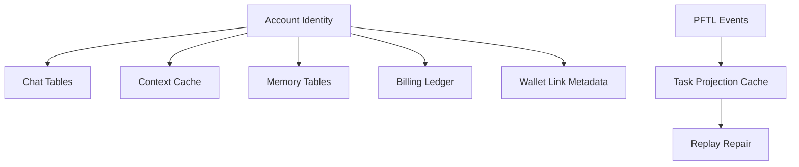

# Database Architecture

Postgres is the product cache and account database. It is critical for speed, UX continuity, billing, chat history, context editing, and memory inspection. It should not become the canonical task protocol.

## Current Caches

- Chat and billing: `server/db/migrations/001_chat_billing.sql`
- Attachments: `server/db/migrations/002_chat_attachments.sql`
- Context cache: `server/db/migrations/003_context_cache.sql`
- Memory rows: `server/db/migrations/004_chat_memory.sql`
- Deep memory rows: `server/db/migrations/005_deep_chat_memory.sql`

## Table Inventory

| Table | Description | App surfaces that rely on it | Source |
| --- | --- | --- | --- |
| `chat_conversations` | One row per chat thread, including account owner, title, mode, status, last message preview, message count, and soft delete state. | Chat recents, chat rename/delete, chat history restore, Search, Memory context labels. | `001_chat_billing.sql` |
| `chat_messages` | Canonical cached chat turns for a conversation, including role, body, provider/model metadata, response IDs, and JSON metadata. | Chat transcript restore, Memory jobs, Search, attachment linkage, provider debugging. | `001_chat_billing.sql` |
| `chat_model_runs` | One row per model execution with provider, model, mode, response IDs, status, token counts, web search calls, tool cost, model cost, and total cost. | Chat usage display, billing ledger creation, cost audit, provider reliability review. | `001_chat_billing.sql` |
| `billing_accounts` | Per-account billing balance cache with current spend, current credit, currency, status, and ledger count. | Wallet/Billing page, chat credit display, chat send eligibility, top-up reconciliation. | `001_chat_billing.sql` |
| `billing_ledger_entries` | Append-style billing ledger for credits and debits, including model run linkage, token usage, provider/model, source, idempotency key, and metadata. | Wallet/Billing page, usage audit, top-up accounting, chat cost history. | `001_chat_billing.sql` |
| `chat_attachments` | Attachment metadata and extracted text for a chat message, including filename, MIME type, size, hash, source, text content, excerpt, and optional storage URI. | Chat file uploads, drag-and-drop attachments, PDF/DOCX/image text context, Search. | `002_chat_attachments.sql` |
| `context_documents` | One active context document per account, tracking title, current revision, revision number, and soft delete state. | Context page, chat context grounding, Motivation, Brainstorming Context, Refine Context, Rewrite. | `003_context_cache.sql` |
| `context_revisions` | Immutable context revision rows with body, body hash, word count, source, provenance, and revision number. | Context editing, version restore, publish preparation, Search, future audit/diff UX. | `003_context_cache.sql` |
| `context_history_imports` | Import run records for historical wallet context discovery, including wallet address, source, pointer counts, task event counts, status, and errors. | Context historical restore, wallet-linked context recovery, import diagnostics. | `003_context_cache.sql` |
| `context_history_pointers` | Indexed PFTL pointer rows discovered from wallet history, including CID, tx hash, ledger index, memo index, pointer kind, task/thread/context IDs, event metadata, and source fields. | Context revision history, restore previews, PFTL replay, future task projection cache seed. | `003_context_cache.sql` |
| `chat_memory_jobs` | Async queue row for one memory summarization job tied to a user message and assistant message, with retry and lock fields. | Memory worker, non-blocking chat memory writes, worker diagnostics. | `004_chat_memory.sql` |
| `chat_memory_entries` | Memory output rows containing user request summary, system response summary, memory text, source excerpts, provider/model, prompt version, usage JSON, and deep memory classification fields. | Memory page, chat memory injection, Search, future profile export. | `004_chat_memory.sql`, `005_deep_chat_memory.sql` |
| `chat_deep_memory_jobs` | Async queue row for every 36-memory deep compression block, with account/block uniqueness and retry/lock fields. | Deep Memory section, chat memory injection, memory worker diagnostics. | `005_deep_chat_memory.sql` |

## Known Gaps

- Task projection tables are not yet migrated. Today, task UX is not backed by a typed Postgres task cache; the desired design is a replayable PFTL pointer core with a fast task projection table built on top.
- Wallet link, auth identity linkage, initiation grants, and Ethereum deposit state are partially represented outside the typed migration set. Those should be pulled into explicit account, identity, wallet link, grant, and deposit tables before the billing and task surfaces become public production surfaces.
- `pgvector` is not yet installed or migrated. Future semantic chat/context search should add explicit embedding tables rather than hiding vectors inside JSON blobs.

## Architecture

Repositories live under `server/repositories/`. Runtime fallback behavior remains in `server/runtime-store.js`, but new feature work should prefer scoped repositories and migrations.

The database should cache projections that the app can render quickly. For chain-backed features, every cache row should preserve enough pointer or transaction identity to replay or repair the cache.

## Diagram

## Failure Modes

- Database outage should fail visibly.
- Cache refresh should not mutate canonical chain state.
- JSON blobs should migrate into typed tables when a feature becomes real.
- Future chat retrieval should use `pgvector` over typed cached text.
