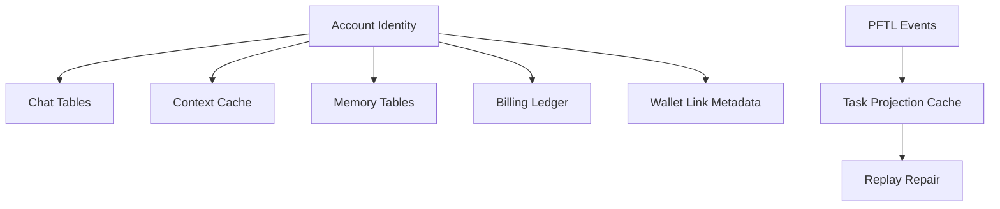

# Database Architecture

Postgres is the product cache and account database. It is critical for speed, UX continuity, billing, chat history, context editing, and memory inspection. It should not become the canonical task protocol.

## Current Caches

- Chat and billing: `server/db/migrations/001_chat_billing.sql`
- Attachments: `server/db/migrations/002_chat_attachments.sql`
- Context cache: `server/db/migrations/003_context_cache.sql`
- Memory rows: `server/db/migrations/004_chat_memory.sql`
- Deep memory rows: `server/db/migrations/005_deep_chat_memory.sql`

## Architecture

Repositories live under `server/repositories/`. Runtime fallback behavior remains in `server/runtime-store.js`, but new feature work should prefer scoped repositories and migrations.

The database should cache projections that the app can render quickly. For chain-backed features, every cache row should preserve enough pointer or transaction identity to replay or repair the cache.

## Diagram

## Failure Modes

- Database outage should fail visibly.
- Cache refresh should not mutate canonical chain state.
- JSON blobs should migrate into typed tables when a feature becomes real.
- Future chat retrieval should use `pgvector` over typed cached text.

