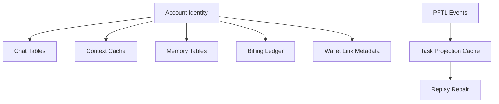

# Database Architecture

Postgres is the product cache and account database. It is critical for speed, UX continuity, billing, chat history, context editing, and memory inspection. It should not become the canonical task protocol.

## Current Caches

- Chat and billing: `server/db/migrations/001_chat_billing.sql`
- Attachments: `server/db/migrations/002_chat_attachments.sql`
- Context cache: `server/db/migrations/003_context_cache.sql`
- Memory rows: `server/db/migrations/004_chat_memory.sql`
- Deep memory rows: `server/db/migrations/005_deep_chat_memory.sql`
- Task projections: `server/db/migrations/006_task_projections.sql`
- PFTL transaction cache: `server/db/migrations/007_pftl_transaction_cache.sql`
- PFTL watcher/reducer queue: `server/db/migrations/008_pftl_cache_watcher.sql`, `009_pftl_cache_reducer_dedupe_key.sql`
- PFTL operations: `server/db/migrations/010_pftl_cache_operations.sql`
- Context projection source metadata: `server/db/migrations/011_context_history_projection_source.sql`
- Task request queue and receipt cache: `server/db/migrations/012_task_requests.sql`
- Deep memory source snapshots: `server/db/migrations/013_deep_memory_snapshots.sql`

## Table Inventory

| Table | Description | App surfaces that rely on it | Source |
| --- | --- | --- | --- |
| `chat_conversations` | One row per chat thread, including account owner, title, mode, status, last message preview, message count, and soft delete state. | Chat recents, chat rename/delete, chat history restore, Search, Memory context labels. | `001_chat_billing.sql` |
| `chat_messages` | Canonical cached chat turns for a conversation, including role, body, provider/model metadata, response IDs, and JSON metadata. | Chat transcript restore, Memory jobs, Search, attachment linkage, provider debugging. | `001_chat_billing.sql` |
| `chat_model_runs` | One row per model execution with provider, model, mode, response IDs, status, token counts, web search calls, tool cost, model cost, and total cost. | Chat usage display, billing ledger creation, cost audit, provider reliability review. | `001_chat_billing.sql` |
| `billing_accounts` | Per-account billing balance cache with current spend, current credit, currency, status, and ledger count. | Wallet/Billing page, chat credit display, chat send eligibility, top-up reconciliation. | `001_chat_billing.sql` |
| `billing_ledger_entries` | Append-style billing ledger for credits and debits, including model run linkage, token usage, provider/model, source, idempotency key, and metadata. | Wallet/Billing page, usage audit, top-up accounting, chat cost history. | `001_chat_billing.sql` |
| `chat_attachments` | Attachment metadata and extracted text for a chat message, including filename, MIME type, size, hash, source, text content, excerpt, and optional storage URI. | Chat file uploads, drag-and-drop attachments, PDF/DOCX/image text context, Search. | `002_chat_attachments.sql` |
| `context_documents` | One active context document per account, tracking title, current revision, revision number, and soft delete state. | Context page, chat context grounding, Motivation, Brainstorming Context, Refine Context, Rewrite. | `003_context_cache.sql` |
| `context_revisions` | Immutable context revision rows with body, body hash, word count, source, provenance, and revision number. | Context editing, version restore, publish preparation, Search, future audit/diff UX. | `003_context_cache.sql` |
| `context_history_imports` | Context projection run records, including wallet address, projection source, pointer counts, task event counts, status, and errors. | Context historical restore, wallet-linked context recovery, reducer diagnostics. | `003_context_cache.sql`, `011_context_history_projection_source.sql` |
| `context_history_pointers` | Cached PFTL pointer projection rows from wallet history, including CID, tx hash, ledger index, memo index, pointer kind, task/thread/context IDs, event metadata, and source fields. | Context revision history, restore previews, PFTL replay, task projection cache seed. | `003_context_cache.sql` |
| `chat_memory_jobs` | Async queue row for one memory summarization job tied to a user message and assistant message, with retry and lock fields. | Memory worker, non-blocking chat memory writes, worker diagnostics. | `004_chat_memory.sql` |
| `chat_memory_entries` | Memory output rows containing user request summary, system response summary, memory text, source excerpts, provider/model, prompt version, usage JSON, and deep memory classification fields. Deep-memory rows are unique per account/block. | Memory page, chat memory injection, Search, future profile export. | `004_chat_memory.sql`, `005_deep_chat_memory.sql`, `013_deep_memory_snapshots.sql` |
| `chat_deep_memory_jobs` | Async queue row for every 36-memory deep compression block, with account/block uniqueness, exact source memory entry IDs, and retry/lock fields. | Deep Memory section, chat memory injection, memory worker diagnostics. | `005_deep_chat_memory.sql`, `013_deep_memory_snapshots.sql` |
| `pftl_task_sync_runs` | One row per task replay/import run with account, wallet, source, status, task count, pointer event count, and metadata. | Tasks replay diagnostics, operator recovery, Python replay imports. | `006_task_projections.sql` |
| `task_requests` | Durable receipt and worker claim table for browser/chat task requests, including account, subject wallet, request/bundle CIDs, request transaction, generated task ID, worker attempts, status, and errors. | Tasks request strip, task generation worker, chat task request receipts, operator debugging. | `012_task_requests.sql` |
| `pftl_task_pointer_events` | Typed task pointer events hydrated from PFTL pointer memos and IPFS payloads. | Tasks, task replay repair, reward traceability, audit. | `006_task_projections.sql` |
| `task_events` | Normalized task lifecycle events keyed by task ID, event type, source tx hash, CID, payload, and pointer JSON. | Tasks state rebuild, task history, verification/reward audit. | `006_task_projections.sql` |
| `task_projections` | Current task state projection with status, title, description, wallets, rewards, submission requirement, verification policy, and source references. | Tasks page, chat task context injection, wallet task panels. | `006_task_projections.sql` |
| `pftl_sync_wallets` | Watchlist and checkpoint table for every wallet the app tracks, including account owner, role, status, hot sync state, archive marker, archive completeness, and last error. | Wallet activity feed, Context history backfill, Tasks replay, PFTL cache workers, operator health. | `007_pftl_transaction_cache.sql` |
| `pftl_transactions` | Global transaction mirror keyed by tx hash with full tx JSON, meta JSON, ledger index, type, result, accounts, and close time. | Wallet activity, pointer memo extraction, replay repair, audit. | `007_pftl_transaction_cache.sql` |
| `pftl_wallet_transactions` | Per-wallet transaction index linking tracked wallets to global tx rows with direction, counterparty, delivered drops, fee, ledger, and close time. | Wallet transaction feed, cache-compatible `account_tx` reads, future contact/message surfaces. | `007_pftl_transaction_cache.sql` |
| `pftl_pointer_memos` | Decoded and raw pointer memo rows, including pointer kind, CID, task/request/context/thread IDs, memo hex, decoded JSON, and decode error. | Context restore, Tasks replay, future wallet-native messages, audit. | `007_pftl_transaction_cache.sql` |
| `pftl_cache_watcher_state` | Operational state for WSS cache watchers, including endpoint, status, subscribed wallet count, last ledger, last event, and error. | Operator health, cache diagnostics, deployment monitoring. | `008_pftl_cache_watcher.sql` |
| `pftl_cache_reducer_events` | Idempotent reducer queue for wallet balance refresh, context pointer hydration, and task projection replay. | Context history projection, Tasks projection, wallet refresh, repair workers. | `008_pftl_cache_watcher.sql`, `009_pftl_cache_reducer_dedupe_key.sql` |
| `pftl_cache_maintenance_runs` | Recent archive/retention/maintenance run summaries with status, optional wallet, metrics JSON, and errors. | Operator health, retention diagnostics, cache operations audit. | `010_pftl_cache_operations.sql` |

## Known Gaps

- Wallet link, auth identity linkage, initiation grants, and Ethereum deposit state are partially represented outside the typed migration set. Those should be pulled into explicit account, identity, wallet link, grant, and deposit tables before the billing and task surfaces become public production surfaces.
- `pgvector` is not yet installed or migrated. Future semantic chat/context search should add explicit embedding tables rather than hiding vectors inside JSON blobs.

## Architecture

Repositories live under `server/repositories/`. Runtime fallback behavior remains in `server/runtime-store.js`, but new feature work should prefer scoped repositories and migrations.

The database should cache projections that the app can render quickly. For chain-backed features, every cache row should preserve enough pointer or transaction identity to replay or repair the cache.

## Diagram

## Failure Modes

- Database outage should fail visibly.
- Cache refresh should not mutate canonical chain state.
- JSON blobs should migrate into typed tables when a feature becomes real.
- Future chat retrieval should use `pgvector` over typed cached text.
