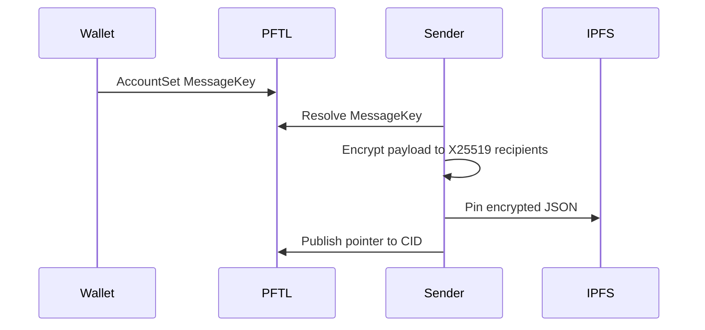

# Encryption And MessageKey

Encrypted payloads are stored on IPFS and shared only with intended wallet identities. A PFTL address alone is not enough to encrypt to a wallet. The wallet must publish an encryption public key or the sender must already have a trusted key from another source.

## Canonical Standard

New protocol wallets derive a recoverable, domain-separated X25519 encryption identity from the wallet seed. The public key is published on PFTL using `AccountSet.MessageKey` as:

```text
ED<32-byte-x25519-public-key-hex>
```

The Python reference is `reference_clients/python/tasknode_pftl/scenarios/encryption_pubkey_demo.py`.

## Technical Architecture

- Key derivation: `reference_clients/python/tasknode_pftl/encryption.py`
- Wallet creation and MessageKey publishing: `reference_clients/python/tasknode_pftl/wallets.py`
- PFTL AccountSet helper: `reference_clients/python/tasknode_pftl/pftl.py`
- Browser wallet encryption and context hydration: `src/wallet-core.js`

## Encryption Flow



## Failure Modes

- If no MessageKey exists, do not guess a pubkey from the address.
- If a recipient shard is missing, decryption must fail.
- Private receipts and seeds must stay out of git.
- Any encryption demo that prints seeds is not a public reference.

