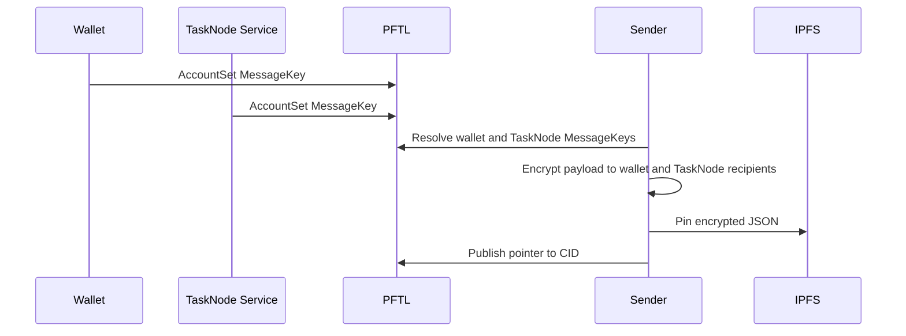

# Encryption And MessageKey

Encrypted payloads are stored on IPFS and shared only with intended wallet identities. A PFTL address alone is not enough to encrypt to a wallet. The wallet must publish an encryption public key or the sender must already have a trusted key from another source.

## Canonical Standard

Encryption uses X25519 recipients and encrypted IPFS payloads. The public key is published on PFTL using `AccountSet.MessageKey` as:

```text
ED<32-byte-x25519-public-key-hex>
```

A PFTL address does not reveal this key. Consumers must resolve `MessageKey` from `account_info`, or use an explicitly trusted bootstrap key.

Key derivation is source-specific:

- Browser BIP39 wallets derive X25519 from `sha256(BIP39 seed bytes)`. This matches the wallet vault path in `src/wallet-core.js` and the PFTasks context code.
- Python/XRPL seed wallets derive X25519 by converting the wallet Ed25519 signing key to Curve25519. This matches the PFTasks messaging tests and lets seed-based reference clients publish recoverable keys.
- The TaskNode service key derives X25519 from `sha256(service seed string)`. Production should use `TASKNODE_SERVICE_SEED` or `TASKNODE_ENCRYPTION_SEED`; local/dev can fall back to `TASKNODE_PFT_FAUCET_SEED` or `FAUCET_SEED`.

The TaskNode service wallet must also publish that service public key as its on-chain `MessageKey`. The app can derive the key locally, but canonical replay clients need the on-chain value.

Inspect or publish the service key:

```bash
npm run tasknode-service-message-key -- --publish
```

The Python reference is `reference_clients/python/tasknode_pftl/scenarios/encryption_pubkey_demo.py`.

## Default TaskNode Sharing

PFTL pointers do not share encryption keys. A pointer is a public transaction memo that says, in effect, "the encrypted payload for this context or task is at this CID." The sharing decision lives inside the JSON pinned to IPFS.

The encrypted IPFS JSON contains:

- `ciphertext`: the encrypted payload bytes.
- `recipients`: one file-key shard per reader.
- `recipients[].recipient_id`: `sha256(x25519_public_key_bytes)` for that reader.

For Context publishing in the app, the default reader set is:

- the user's unlocked wallet pubkey, so the user can restore and preview the document;
- the TaskNode service pubkey, resolved from the service wallet `MessageKey`, so TaskNode can hydrate the pointer during replay or automation.

The browser path is explicit in `src/features/context/context-publish.js`: it requests publish config, receives `tasknodeEncryptionPubkey`, derives the user pubkey, then calls `encryptTaskNodePayload({ recipientPublicKeys: [userPubkey, tasknodeEncryptionPubkey] })`.

The server does not trust that blindly. Before pinning, `server/context-publish.js` resolves the TaskNode service key, computes the expected recipient id, and rejects the publish if the encrypted IPFS payload does not contain a matching TaskNode recipient shard. That means a malformed client cannot publish a context pointer that TaskNode itself cannot decrypt.

For the Python full lifecycle replay, `reference_clients/python/tasknode_pftl/scenarios/full_lifecycle.py` builds recipients with `user_wallet.encryption`, `tasknode_identity`, and the verification service identity before uploading encrypted payloads to IPFS.

To verify the service pubkey itself is discoverable:

```bash
npm run tasknode-service-message-key
```

To verify a published encrypted CID manually, fetch the IPFS JSON and check that one `recipients[].recipient_id` equals the `expectedRecipientId` printed by that command.

## Technical Architecture

- Key derivation: `reference_clients/python/tasknode_pftl/encryption.py`
- Wallet creation and MessageKey publishing: `reference_clients/python/tasknode_pftl/wallets.py`
- PFTL AccountSet helper: `reference_clients/python/tasknode_pftl/pftl.py`
- Browser wallet encryption and context hydration: `src/wallet-core.js`
- TaskNode service key inspection/publish: `reference_clients/python/tasknode_pftl/scenarios/service_message_key.py`

## Encryption Flow



## Failure Modes

- If no MessageKey exists, do not guess a pubkey from the address.
- If the TaskNode service wallet has a mismatched MessageKey, stop publishing until the mismatch is resolved.
- If a recipient shard is missing, decryption must fail.
- Private receipts and seeds must stay out of git.
- Any encryption demo that prints seeds is not a public reference.

## Reviewer To Do List

Review implementation against this document (encryption). Mark each item when verified.

### Memory Efficiency
- [ ] Hot paths use bounded queries, checkpoints, or projection tables.
- [ ] Background workers dedupe and lock jobs to prevent duplicate work.
- [ ] Decryption lazy-loaded for forensics/detail views, not bulk-decrypt on list endpoints.

### Code Quality
- [ ] Architecture claims map to migrations, repositories, and smoke scripts.
- [ ] Failure modes have operator-visible signals or health endpoints.
- [ ] Browser BIP39, Python seed, and service key derivations match documented algorithms.
- [ ] Publish path validates TaskNode recipient id before IPFS pin.

### Coherence
- [ ] Canonical vs cache boundaries consistent with wiki index.
- [ ] Cross-links to related architecture pages remain accurate.
- [ ] MessageKey format and resolution match PFTL and IPFS docs.
- [ ] Context and task payloads use same recipient shard structure.

### Bloat
- [ ] No parallel implementations of the same protocol concern.
- [ ] Retention policies drop queue noise without losing audit tx rows.
- [ ] No duplicate crypto helpers across browser and server without shared test vectors.

### Security
- [ ] Encryption and wallet-role rules enforced at trust boundaries.
- [ ] Secrets and seeds remain server-side or browser-local as designed.
- [ ] Service seed env vars documented; production must not rely on faucet seed fallback.
- [ ] PFTL address alone insufficient to encrypt; MessageKey resolution required.
- [ ] Ciphertext never logged in plaintext in server logs.
