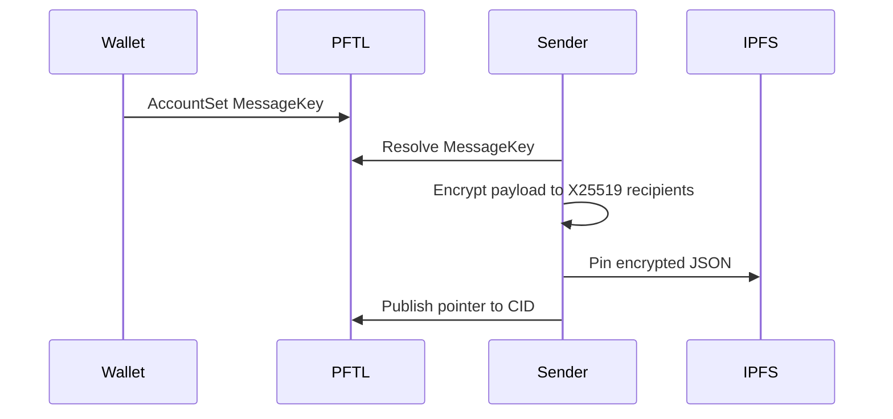

# Encryption And MessageKey

Encrypted payloads are stored on IPFS and shared only with intended wallet identities. A PFTL address alone is not enough to encrypt to a wallet. The wallet must publish an encryption public key or the sender must already have a trusted key from another source.

## Canonical Standard

Encryption uses X25519 recipients and encrypted IPFS payloads. The public key is published on PFTL using `AccountSet.MessageKey` as:

```text
ED<32-byte-x25519-public-key-hex>
```

A PFTL address does not reveal this key. Consumers must resolve `MessageKey` from `account_info`, or use an explicitly trusted bootstrap key.

Key derivation is source-specific:

- Browser BIP39 wallets derive X25519 from `sha256(BIP39 seed bytes)`. This matches the wallet vault path in `src/wallet-core.js` and the PFTasks context code.
- Python/XRPL seed wallets derive X25519 by converting the wallet Ed25519 signing key to Curve25519. This matches the PFTasks messaging tests and lets seed-based reference clients publish recoverable keys.
- The TaskNode service key derives X25519 from `sha256(service seed string)`. Production should use `TASKNODE_SERVICE_SEED` or `TASKNODE_ENCRYPTION_SEED`; local/dev can fall back to `TASKNODE_PFT_FAUCET_SEED` or `FAUCET_SEED`.

The TaskNode service wallet must also publish that service public key as its on-chain `MessageKey`. The app can derive the key locally, but canonical replay clients need the on-chain value.

Inspect or publish the service key:

```bash
npm run tasknode-service-message-key -- --publish
```

The Python reference is `reference_clients/python/tasknode_pftl/scenarios/encryption_pubkey_demo.py`.

## Technical Architecture

- Key derivation: `reference_clients/python/tasknode_pftl/encryption.py`
- Wallet creation and MessageKey publishing: `reference_clients/python/tasknode_pftl/wallets.py`
- PFTL AccountSet helper: `reference_clients/python/tasknode_pftl/pftl.py`
- Browser wallet encryption and context hydration: `src/wallet-core.js`
- TaskNode service key inspection/publish: `reference_clients/python/tasknode_pftl/scenarios/service_message_key.py`

## Encryption Flow



## Failure Modes

- If no MessageKey exists, do not guess a pubkey from the address.
- If the TaskNode service wallet has a mismatched MessageKey, stop publishing until the mismatch is resolved.
- If a recipient shard is missing, decryption must fail.
- Private receipts and seeds must stay out of git.
- Any encryption demo that prints seeds is not a public reference.
