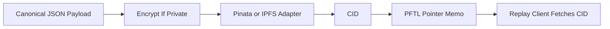

# IPFS Standards

IPFS stores content-addressed payloads that PFTL pointers reference by CID. Private payloads should be encrypted before upload. Public metadata can be attached to the pin when it does not leak private content.

## Payload Classes

- Context documents.
- Task requests.
- Task proposals.
- Task submissions.
- Verification evidence packets.
- Reward receipts.
- Private NFT prompt series.
- Private NFT generation run receipts.
- Public profile NFT images.
- Public NFT metadata.

## Private NFT Prompt Series

NFT art prompts are private product assets. The full prompt text must not be stored in public NFT metadata, public profile JSON, visible docs, or plaintext prompt files in the repository.

The canonical storage pattern is:

1. Build a stable JSON payload with schema `pf.asset.nft_prompt_series.v1`.
2. Include the private `prompt_body`, negative prompt, provider policy, render contract, series id, and revision.
3. Canonically serialize the unencrypted JSON and compute `sha256`.
4. Encrypt the payload to the TaskNode service key and prompt authority key.
5. Pin the encrypted payload to IPFS.
6. Publish a `pf.ptr/v4` `ASSET` pointer on PFTL with `thread_id` set to the prompt series id.
7. Cache the latest pointer in Postgres for speed.

Generated NFT metadata may include the safe commitment fields `series_id`, `series_revision`, and `prompt_digest`. It must not include the private prompt body. The digest lets a prompt series be audited or revealed later without making it public at mint time.

Each image generation should also create an encrypted run receipt with schema `pf.profile.nft_generation_run.v1`. That receipt records the series pointer, prompt digest, profile snapshot digest, provider/model, image CID, and metadata CID. It makes generation replayable for TaskNode without leaking private prompt text.

Current profile NFT implementation pins generated image bytes publicly at generation time and stores the resulting image CID in `profile_nfts`. Mint preparation pins public XLS-24 metadata JSON with `image: "ipfs://<imageCid>"`. The generated image and metadata are public assets; the private prompt is not included in either payload.

Profile NFT image rendering uses `/api/profile/nft/image/:cid` for rows with an `imageCid`. The route validates the CID, fetches the image through configured IPFS gateways, accepts only image content types, enforces the default 8 MB binary limit, and caches successful image bytes in memory. This keeps profile galleries from depending on one public gateway and prevents the browser from eagerly opening many large public gateway requests at once.

## Technical Architecture

Server IPFS helpers live in `server/context-ipfs.js`. JSON pins use `pinContextIpfsJson`; binary profile NFT image pins use `pinIpfsFile` with an 8 MB server-side size limit. Context publishing uses `server/context-publish.js` and `src/features/context/context-publish.js`. Python reference IPFS upload and fetch code lives in `reference_clients/python/tasknode_pftl/ipfs.py`.

Pinata is the current simple pinning path. A self-hosted IPFS node can be added as another adapter as long as the CID and payload schema stay stable.

`server/context-ipfs.js` enforces a 1 MB JSON pin limit. That limit is intentional: IPFS pointers should carry compact canonical JSON, not raw media blobs. Screenshot and binary evidence must be processed before signing so the encrypted payload contains extracted text, SHA-256 digest metadata, file metadata, and processing metadata rather than base64 image or file bytes. The current screenshot path uses `server/task-evidence-processing.js` and `prompts/task_engine/evidence_screenshot_read_v1.md` before the browser encrypts and publishes the task submission pointer.

## Diagram

## Failure Modes

- Never upload private context or task content in plaintext.
- CID fetch failure should not erase the on-chain pointer.
- Payload schema should be versioned.
- Pinning metadata should not include secrets.
- Raw screenshot/file base64 should not be embedded directly in task evidence JSON.

## Reviewer To Do List

Review implementation against this document (ipfs). Mark each item when verified.

### Memory Efficiency
- [ ] Hot paths use bounded queries, checkpoints, or projection tables.
- [ ] Background workers dedupe and lock jobs to prevent duplicate work.
- [ ] 1 MB JSON limit enforced before pin; large evidence processed to compact summaries.
- [ ] Screenshot pipeline strips raw bytes from final encrypted JSON.

### Code Quality
- [ ] Architecture claims map to migrations, repositories, and smoke scripts.
- [ ] Failure modes have operator-visible signals or health endpoints.
- [ ] IPFS pin/unpin errors surfaced with actionable operator messages.

### Coherence
- [ ] Canonical vs cache boundaries consistent with wiki index.
- [ ] Cross-links to related architecture pages remain accurate.
- [ ] Payload schemas referenced match Task Async Engine and Task Lifecycle evidence docs.

### Bloat
- [ ] No parallel implementations of the same protocol concern.
- [ ] Retention policies drop queue noise without losing audit tx rows.
- [ ] No duplicate IPFS client wrappers; single pin path per payload type.

### Security
- [ ] Encryption and wallet-role rules enforced at trust boundaries.
- [ ] Secrets and seeds remain server-side or browser-local as designed.
- [ ] All task/context payloads encrypted before upload.
- [ ] CID in pointer must match pinned content; integrity checked on reducer ingest.
