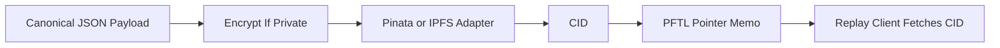

# IPFS Standards

IPFS stores content-addressed payloads that PFTL pointers reference by CID. Private payloads should be encrypted before upload. Public metadata can be attached to the pin when it does not leak private content.

## Payload Classes

- Context documents.
- Task requests.
- Task proposals.
- Task submissions.
- Verification evidence packets.
- Reward receipts.
- Private NFT prompt series.
- Private NFT generation run receipts.
- Public profile NFT images.
- Public NFT metadata.

## Private NFT Prompt Series

NFT art prompts are private product assets. The full prompt text must not be stored in public NFT metadata, public profile JSON, visible docs, or plaintext prompt files in the repository.

The canonical storage pattern is:

1. Build a stable JSON payload with schema `pf.asset.nft_prompt_series.v1`.
2. Include the private `prompt_body`, negative prompt, provider policy, render contract, series id, and revision.
3. Canonically serialize the unencrypted JSON and compute `sha256`.
4. Encrypt the payload to the TaskNode service key and prompt authority key.
5. Pin the encrypted payload to IPFS.
6. Publish a `pf.ptr/v4` `ASSET` pointer on PFTL with `thread_id` set to the prompt series id.
7. Cache the latest pointer in Postgres for speed.

Generated NFT metadata may include the safe commitment fields `series_id`, `series_revision`, and `prompt_digest`. It must not include the private prompt body. The digest lets a prompt series be audited or revealed later without making it public at mint time.

Each image generation should also create an encrypted run receipt with schema `pf.profile.nft_generation_run.v1`. That receipt records the series pointer, prompt digest, profile snapshot digest, provider/model, image CID, and metadata CID. It makes generation replayable for TaskNode without leaking private prompt text.

Current profile NFT implementation pins generated image bytes publicly at generation time and stores the resulting image CID in `profile_nfts`. Mint preparation pins public XLS-24 metadata JSON with `image: "ipfs://<imageCid>"`. The generated image and metadata are public assets; the private prompt is not included in either payload.

Profile NFT image rendering uses `/api/profile/nft/image/:cid` for rows with an `imageCid`. The route validates the CID, fetches the image through configured IPFS gateways, accepts only image content types, enforces the default 8 MB binary limit, and caches successful image bytes in memory. This keeps profile galleries from depending on one public gateway and prevents the browser from eagerly opening many large public gateway requests at once.

## Exact-CID Repin For Legacy Public Assets

Public NFT assets are different from encrypted task/context payloads because the CID is part of the public on-chain artifact. If an old NFT metadata URI says `ipfs://<metadataCid>` and that metadata says `image: "ipfs://<imageCid>"`, Task Node must preserve those exact CIDs. Re-uploading bytes and rendering a different CID is not a valid repair for the existing token.

The preferred recovery path is exact-CID repinning:

1. Export every historical NFT metadata, image, and thumbnail CID from the old cache.
2. Deduplicate by CID.
3. Verify each CID against current gateways.
4. Verify unresolved CIDs against legacy PFTasks gateways.
5. For legacy-proven CIDs, request `pinByHash` from the current pinning provider.
6. Rerun current-gateway verification until every migrated CID resolves without the legacy gateways.
7. Only then retire legacy gateways from recovery tooling.

Operator command:

```bash
npm run --silent profile-nft-cid-repin -- \
  --source-json /tmp/pftasks-nft-mints-all.json \
  --dry-run

npm run --silent profile-nft-cid-repin -- \
  --source-json /tmp/pftasks-nft-mints-all.json \
  --execute \
  --limit 250 \
  --offset 0 \
  --no-verify-after

npm run --silent profile-nft-cid-repin -- \
  --source-json /tmp/pftasks-nft-mints-all.json \
  --verify-only
```

Repeat execute batches by increasing `--offset` by the batch size until the report's `uniqueCids` count is covered. Use `--verify-only` as the final gate before retiring legacy gateways from recovery tooling.

If `pinByHash` cannot verify a CID that an old gateway can still serve, the next repair is block-level migration from the old IPFS node into current IPFS infrastructure. That may be a CAR export/import or another exact-CID block transfer. Do not treat a new CID from a normal file upload as a fix for an already minted NFT unless the returned CID exactly matches the original CID.

## Technical Architecture

Server IPFS helpers live in `server/context-ipfs.js`. JSON pins use `pinContextIpfsJson`; binary profile NFT image pins use `pinIpfsFile` with an 8 MB server-side size limit; legacy public CID repair uses `pinIpfsCidByHash`. Context publishing uses `server/context-publish.js` and `src/features/context/context-publish.js`. Python reference IPFS upload and fetch code lives in `reference_clients/python/tasknode_pftl/ipfs.py`.

Pinata is the current simple pinning path. A self-hosted IPFS node can be added as another adapter as long as the CID and payload schema stay stable.

`server/context-ipfs.js` enforces a 1 MB JSON pin limit. That limit is intentional: IPFS pointers should carry compact canonical JSON, not raw media blobs. Screenshot and binary evidence must be processed before signing so the encrypted payload contains extracted text, SHA-256 digest metadata, file metadata, and processing metadata rather than base64 image or file bytes. The current screenshot path uses `server/task-evidence-processing.js` and `prompts/task_engine/evidence_screenshot_read_v1.md` before the browser encrypts and publishes the task submission pointer.

The gateway list for task indexing is assembled from `TASKNODE_IPFS_GATEWAY`, then the comma-separated `TASKNODE_IPFS_GATEWAYS`, then `IPFS_GATEWAY_FALLBACKS`, then built-in defaults (`https://pft-ipfs-testnet-clean.fly.dev/ipfs/`, Pinata, `dweb.link`, `ipfs.io`), then legacy `IPFS_GATEWAY_URL`. Note the fetch itself is a concurrent race (`Promise.any`) across the assembled list, not a sequential fallback: every configured gateway is queried in parallel and the first successful response wins, so list position controls membership, not priority. Retired PFTasks/Fly gateways should not be default app reads; pass them explicitly only to inventory or recovery tools when investigating legacy CIDs.

New writes are also replicated into the clean first-party cluster through the
durable `ipfs_replication_jobs` queue. The replication worker claims a batch and
processes jobs with bounded concurrency from
`TASKNODE_IPFS_REPLICATION_CONCURRENCY` (default 6) instead of serially
verifying one CID at a time (`server/ipfs-replication-worker.js:52`,
`server/ipfs-replication-worker.js:372`). Verification is by existence: `HEAD`
to the clean gateway, falling back to ranged `GET bytes=0-0` when a gateway
returns 405. 2xx and 206 are accepted; the old full-body verification download,
JSON parse, and 1 MiB cap are not used on this path
(`server/ipfs-replication-worker.js:78`,
`server/ipfs-replication-worker.js:96`). Operator requeue uses
`scripts/ipfs-replication-requeue.mjs`, which is dry-run by default and mutates
terminal jobs only with `--execute`.

Encrypted task payload reads add a bounded retry around the IPFS JSON fetch so a
transient gateway miss does not immediately surface as an undecryptable payload.
`TASKNODE_IPFS_READ_RETRY_ATTEMPTS` defaults to 3 and
`TASKNODE_IPFS_READ_RETRY_BACKOFF_MS` defaults to 600 ms. The retry happens only
while `fetchIpfsJson` returns `!ok`; once ciphertext is fetched, decryption
errors are not retried or masked (`server/task-payloads.js:24`,
`server/task-payloads.js:160`).

Profile NFT image rendering follows the same policy through `/api/profile/nft/image/:cid`. `TASKNODE_PROFILE_NFT_IMAGE_GATEWAYS` can override the proxy list, but the default proxy reads from the clean first-party gateway before public fallbacks. As of June 6, 2026 at 20:40 UTC, all 79 public profile NFT metadata, thumbnail, and image CIDs in the current Task Node database resolve through the clean first-party gateway. Do not replace unresolved minted artifacts with new CIDs. Profile galleries must show an explicit unavailable-image state for any future CID failure until the original blocks are recovered.

## Diagram



## Failure Modes

- Never upload private context or task content in plaintext.
- CID fetch failure should not erase the on-chain pointer.
- Payload schema should be versioned.
- Pinning metadata should not include secrets.
- Raw screenshot/file base64 should not be embedded directly in task evidence JSON.
