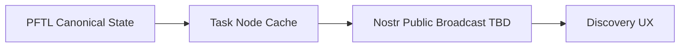

# Nostr Integration

Nostr integration is TBD. It should be documented here before implementation because identity, publication, and private-message behavior can easily become confusing if mixed with PFTL wallet identity.

## Intended Role

Nostr may become a broadcast or discovery layer for public task, agent, or profile events. It should not replace PFTL for canonical task rewards or wallet-backed task state.

## Design Questions

- Which events are public enough to publish?
- Does the Nostr identity map to signup identity, PFT wallet identity, or a separate key?
- Are encrypted Nostr DMs ever allowed for task payloads, or do they only carry pointers?
- How are deletes, redactions, and profile updates represented?

## Proposed Boundary

## Failure Modes

- Do not make Nostr the canonical reward ledger.
- Do not publish private task or context content.
- Do not merge Nostr identity with wallet identity without explicit user consent.
