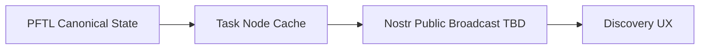

# Nostr Integration

Nostr integration is TBD. It should be documented here before implementation because identity, publication, and private-message behavior can easily become confusing if mixed with PFTL wallet identity.

## Intended Role

Nostr may become a broadcast or discovery layer for public task, agent, or profile events. It should not replace PFTL for canonical task rewards or wallet-backed task state.

## Design Questions

- Which events are public enough to publish?
- Does the Nostr identity map to signup identity, PFT wallet identity, or a separate key?
- Are encrypted Nostr DMs ever allowed for task payloads, or do they only carry pointers?
- How are deletes, redactions, and profile updates represented?

## Proposed Boundary

## Failure Modes

- Do not make Nostr the canonical reward ledger.
- Do not publish private task or context content.
- Do not merge Nostr identity with wallet identity without explicit user consent.

## Reviewer To Do List

Review implementation against this document (nostr). Mark each item when verified.

### Memory Efficiency
- [ ] Hot paths use bounded queries, checkpoints, or projection tables.
- [ ] Background workers dedupe and lock jobs to prevent duplicate work.
- [ ] Future Nostr layer must not duplicate full PFTL history in relay memory.

### Code Quality
- [ ] Architecture claims map to migrations, repositories, and smoke scripts.
- [ ] Failure modes have operator-visible signals or health endpoints.
- [ ] TBD sections clearly marked; no fake integration code paths.

### Coherence
- [ ] Canonical vs cache boundaries consistent with wiki index.
- [ ] Cross-links to related architecture pages remain accurate.
- [ ] Doc states Nostr cannot replace PFTL for rewards or canonical task state.

### Bloat
- [ ] No parallel implementations of the same protocol concern.
- [ ] Retention policies drop queue noise without losing audit tx rows.
- [ ] Avoid implementing parallel social graph before core task protocol is stable.

### Security
- [ ] Encryption and wallet-role rules enforced at trust boundaries.
- [ ] Secrets and seeds remain server-side or browser-local as designed.
- [ ] Identity mapping questions documented before any public key broadcast.
