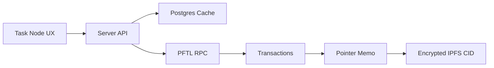

# PFTL Usage

PFTL is the Post Fiat L1. The app uses `xrpl` tooling because the network speaks that transaction shape, but PFTL is not XRP. Documentation and errors should say PFTL unless referring to a library type.

## What Goes On Chain

- Wallet payments.
- Balance and transaction history.
- Pointer memos that reference IPFS CIDs.
- Task lifecycle events.
- MessageKey pubkey settings.
- Reward transactions.
- Encrypted `ASSET` pointers for private NFT prompt series and NFT generation run receipts.

## What Does Not Go On Chain Directly

- Raw private task content.
- Raw private context documents.
- Full chat history.
- Browser vault secrets.
- Postgres-only product caches.

## Technical Architecture

Backend PFTL helpers live in `server/pftl-balance.js`, `server/pftl-transactions.js`, `server/pftl-submit.js`, `server/pftl-pointer.js`, and `server/pftl-faucet.js`. The Python canonical replay client lives in `reference_clients/python/tasknode_pftl/`.

The app should prefer the local fast RPC for routine balance and pointer reads, with production RPC checks used when historical completeness matters.

The backend transaction mirror is described in Help under `PFTL Transaction Cache`, backed by `docs/wiki/architecture/pftl-transaction-cache.md`. It is the cache layer for wallet feeds, context history, task replay, and future wallet-native messaging.

## Private NFT Prompt Pointers

Private NFT prompt series use the same pointer family as tasks and context:

- `MemoType`: `pf.ptr`
- `MemoFormat`: `v4`
- `kind`: `ASSET`
- `schema`: `1`
- `flags`: `encrypted`
- `thread_id`: stable prompt series id, such as `nft_series_profile_avatar_v1`

The pointer CID resolves to encrypted IPFS JSON, not to a public prompt. Public NFT metadata may cite the prompt series id and prompt digest, but never the plaintext prompt body. A later reveal can publish the plaintext prompt or decrypt it for auditors; the digest proves it matches the prompt used for the minted image.

## Diagram

## Failure Modes

- RPC timeout should surface as a PFTL connectivity issue.
- Cache must not pretend to be canonical.
- Replay should be able to reconstruct task state from wallet history and pointers.
