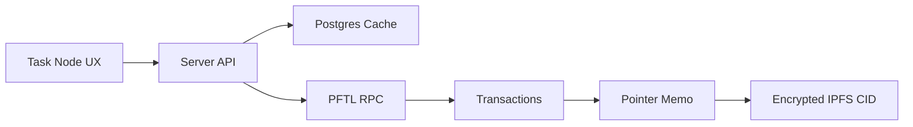

# PFTL Usage

PFTL is the Post Fiat L1. The app uses `xrpl` tooling because the network speaks that transaction shape, but PFTL is not XRP. Documentation and errors should say PFTL unless referring to a library type.

## What Goes On Chain

- Wallet payments.
- Balance and transaction history.
- Pointer memos that reference IPFS CIDs.
- Task lifecycle events.
- MessageKey pubkey settings.
- Reward transactions.
- Profile NFT `NFTokenMint` transactions.
- Encrypted `ASSET` pointers for private NFT prompt series and NFT generation run receipts.

## What Does Not Go On Chain Directly

- Raw private task content.
- Raw private context documents.
- Full chat history.
- Browser vault secrets.
- Postgres-only product caches.

## Technical Architecture

Backend PFTL helpers live in `server/pftl-balance.js`, `server/pftl-transactions.js`, `server/pftl-submit.js`, `server/pftl-pointer.js`, and `server/pftl-faucet.js`. `server/pftl-submit.js` prepares/submits signed pointer payments and profile NFT `NFTokenMint` transactions. The Python canonical replay client lives in `reference_clients/python/tasknode_pftl/`.

The app should prefer the local fast RPC for routine balance and pointer reads, with production RPC checks used when historical completeness matters.

The backend transaction mirror is described in Help under `PFTL Transaction
Cache`. It is the cache layer for wallet feeds, context history, task replay,
and future wallet-native messaging.

## Private NFT Prompt Pointers

Private NFT prompt series use the same pointer family as tasks and context:

- `MemoType`: `pf.ptr`
- `MemoFormat`: `v4`
- `kind`: `ASSET`
- `schema`: `1`
- `flags`: `encrypted`
- `thread_id`: stable prompt series id, such as `nft_series_profile_avatar_v1`

The pointer CID resolves to encrypted IPFS JSON, not to a public prompt. Public NFT metadata may cite the prompt series id and prompt digest, but never the plaintext prompt body. A later reveal can publish the plaintext prompt or decrypt it for auditors; the digest proves it matches the prompt used for the minted image.

## Profile NFT Minting

Profile NFT minting is wallet-signed, not server-custodied:

1. `POST /api/profile/nft/mint` with `phase: "prepare"` pins public XLS-24 metadata JSON and prepares an `NFTokenMint` transaction for the linked PFTL wallet.
2. The browser signs the prepared transaction with `src/wallet-core.js` and the unlocked local seed vault.
3. `POST /api/profile/nft/mint` with `phase: "submit"` validates the signed transaction type, linked wallet account, network id, and prepared URI before submitting it to PFTL.
4. `profile_nfts` records the tx hash and `NFTokenID` when the ledger response or account NFT lookup exposes it.

The NFT metadata URI is public. The private image prompt remains outside the mint transaction and outside public metadata.

## Wallet NFT Inventory

PFTL wallet NFT discovery uses the same XRPL-shaped `account_nfts` RPC method the chain exposes for XLS-24 NFTs. Task Node should be able to reconstruct renderable profile NFTs from chain and IPFS without the old PFTasks database.

The implemented helper is `server/pftl-nfts.js::fetchWalletNftInventory`.

It performs this sequence:

1. Connect to `PFTL_WSS_URL`, `PFTL_WSS_URL_FALLBACKS`, or websocket-compatible `PFTL_RPC_URL`.
2. Call `account_nfts` with `ledger_index: "validated"`.
3. Decode each NFT's hex `URI` into UTF-8.
4. Extract the metadata CID from `ipfs://...` or gateway `/ipfs/...` URIs.
5. Fetch metadata through the shared IPFS gateway helper.
6. Extract the image CID from metadata fields such as `image`.
7. Return renderable rows containing `nftTokenId`, `metadataCid`, `imageCid`, `imageGatewayUrl`, title, and description.

CLI:

```bash
npm run wallet-nft-inventory -- --wallet r... --pretty
```

Use `--no-metadata` for a fast chain-only inventory that returns token ids and decoded metadata URIs without fetching IPFS JSON. Use `--timeout-ms` and `--metadata-concurrency` to keep metadata resolution bounded:

```bash
npm run wallet-nft-inventory -- \
  --wallet r... \
  --pretty \
  --timeout-ms 3000 \
  --metadata-concurrency 6
```

Local PFTL endpoints may use self-signed TLS. For those internal endpoints only, prefix the command with `PFTL_WSS_REJECT_UNAUTHORIZED=false TASKNODE_ALLOW_INSECURE_PFTL_TLS=true`.

If IPFS metadata cannot be fetched, the inventory still returns the NFT token id, decoded metadata URI, metadata CID, and `metadataFetch` status. Cache import only upserts rows with both `metadataCid` and `imageCid`.

Profile cache import:

```bash
npm run wallet-nft-inventory -- \
  --wallet r... \
  --account-id acct_oauth_... \
  --import-profile-cache \
  --execute
```

The cache import upserts `profile_nfts` by existing `nft_token_id` or `metadata_cid` first, then falls back to a stable `nft_chain_<digest>` id. This prevents duplicate profile NFT rows when an old PFTasks cache row already exists.

Minimal code example:

```js
import { fetchWalletNftInventory } from "./server/pftl-nfts.js";

const inventory = await fetchWalletNftInventory({ walletAddress: "r..." });

if (inventory.ok) {
  for (const nft of inventory.nfts) {
    console.log(nft.nftTokenId, nft.metadataUri, nft.imageGatewayUrl);
  }
}
```

## Diagram



## Failure Modes

- RPC timeout should surface as a PFTL connectivity issue.
- Cache must not pretend to be canonical.
- Replay should be able to reconstruct task state from wallet history and pointers.

## Reviewer To Do List

Review implementation against this document (pftl). Mark each item when verified.

### Memory Efficiency
- [ ] Hot paths use bounded queries, checkpoints, or projection tables.
- [ ] Background workers dedupe and lock jobs to prevent duplicate work.
- [ ] Pointer submission batches respect wallet sequence; no unbounded pending tx memory client-side.

### Code Quality
- [ ] Architecture claims map to migrations, repositories, and smoke scripts.
- [ ] Failure modes have operator-visible signals or health endpoints.
- [ ] `pftl-pointer.js` and `pftl-submit.js` share memo encoding rules.

### Coherence
- [ ] Canonical vs cache boundaries consistent with wiki index.
- [ ] Cross-links to related architecture pages remain accurate.
- [ ] Pointer kinds and schemas align with task lifecycle and IPFS payload docs.

### Bloat
- [ ] No parallel implementations of the same protocol concern.
- [ ] Retention policies drop queue noise without losing audit tx rows.
- [ ] Avoid duplicate pointer construction logic in browser and server without shared constants.

### Security
- [ ] Encryption and wallet-role rules enforced at trust boundaries.
- [ ] Secrets and seeds remain server-side or browser-local as designed.
- [ ] Signing stays client-side for user wallets; server submits only signed blobs.
- [ ] MessageKey publish verified before relying on encryption to new wallets.
