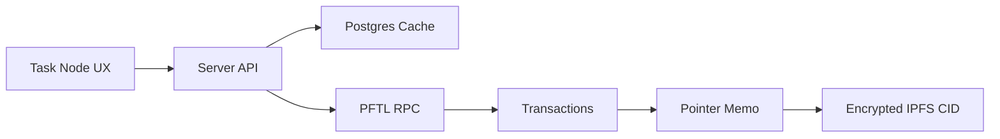

# PFTL Usage

PFTL is the Post Fiat L1. The app uses `xrpl` tooling because the network speaks that transaction shape, but PFTL is not XRP. Documentation and errors should say PFTL unless referring to a library type.

## What Goes On Chain

- Wallet payments.
- Balance and transaction history.
- Pointer memos that reference IPFS CIDs.
- Task lifecycle events.
- MessageKey pubkey settings.
- Reward transactions.

## What Does Not Go On Chain Directly

- Raw private task content.
- Raw private context documents.
- Full chat history.
- Browser vault secrets.
- Postgres-only product caches.

## Technical Architecture

Backend PFTL helpers live in `server/pftl-balance.js`, `server/pftl-transactions.js`, `server/pftl-submit.js`, `server/pftl-pointer.js`, and `server/pftl-faucet.js`. The Python canonical replay client lives in `reference_clients/python/tasknode_pftl/`.

The app should prefer the local fast RPC for routine balance and pointer reads, with production RPC checks used when historical completeness matters.

## Diagram

## Failure Modes

- RPC timeout should surface as a PFTL connectivity issue.
- Cache must not pretend to be canonical.
- Replay should be able to reconstruct task state from wallet history and pointers.

