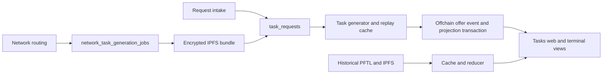

# Task Async Engine

Current implementation reviewed September 5, 2026.

Task Node uses durable Postgres queues for task preparation, generation and
review. Current production uses the offchain task lifecycle; historical signed
PFTL/IPFS task records remain supported by the cache/reducer. A durable request,
a generated offer, a visible task and a settled reward are distinct outcomes.

## Current request paths

| Intake | Durable input | Next stage |
| --- | --- | --- |
| Browser Tasks or Request task mode | Request service chooses the configured offchain or signed compatibility path | `task_requests` |
| Corbanu terminal API | Minimal bundle in `task_requests.metadata_json`; `postgres:` / `offchain:` references | Shared task generator |
| Kimi board CLI | Intent, allocation and network generation job | Encrypted IPFS request bundle, then `task_requests` |
| Historical signed request | PFTL pointer and encrypted IPFS bundle | Cache/reducer and durable request processing |

Browser and terminal direct intake share immutable receipts. The owning worker
attaches saved Context, memories, recent chat and task history asynchronously,
and saves that account-scoped snapshot once before generation. Network
preparation uses the same context builder. See the [terminal contract](tasknode-terminal-contract.md).

## Generation and visibility

`server/task-generation-worker.js` claims `published` or `queued` receipts,
reads a Postgres bundle or decrypts an IPFS bundle, projects the taskgen input,
and checks `taskgen_replay_cache`. It calls the shared strict-JSON inference
capability when no reusable output exists: Vercel GLM 5.3 first, Ambient backup.
The production network-v2 flag selects `taskgen_network_v2.md`; personal work
uses `taskgen_personal_v1.md`.

The current `publishOffer` implementation calls `applyOffchainTaskOffer`.
`task_events`, `task_projections` and receipt completion are written in one
transaction under the generation attempt lock. It does not submit a signed
offer pointer or wait for reducer replay. Replay metadata and network allocation
links retain their subsequent repairable writes.
The UI reads real projections; a request receipt alone must not become a task
card. Synthetic `postgres:` and `offchain:` references are not ledger evidence.

## Queue and process ownership

| Work | State | Periodic owner |
| --- | --- | --- |
| Network selection | `hive_decision_runs`, selector lease | `worker-hive` |
| Network bundle preparation | `network_task_generation_jobs` | `worker-taskgen` |
| Task generation | `task_requests`, `taskgen_replay_cache` | `worker-taskgen` |
| Verification and reward | Task projections/events and `task_review_publications` | `worker-task-review` |
| Historical pointer ingestion/replay | PFTL cache and reducer tables | `worker-pftl` |
| Advisory board memos | `hive_board_secretary_memos` | `board-secretary` |
| Independent Kimi board agent | Local tmux/cron, journals and board audit records | Operator-host Corbanu runtime |

`fly.toml` and `server/background-workers.js` define the split process map.
There is no current monolithic Fly `worker` or automatic `board-manager`
process. A healthy `/health` does not prove any queue is making progress.

Immediate scheduling is an additional current behavior: request and handoff
services call in-process scheduling functions controlled by enable flags.
Those helpers do not enforce the split process role, so dedicated periodic
ownership does not imply all generation executes only in that worker. The
durable rows, rather than the timers, are the recovery boundary.

## Existing recovery guarantees and limits

The shared request queue uses `FOR UPDATE SKIP LOCKED`, attempt IDs,
heartbeat/ownership checks, bounded transient retries and durable retry times.
The replay cache preserves generated output and recorded offers. It avoids
requiring a fresh model call to reproduce the same prose after a crash.

Network preparation has a different claim contract: `locked_at`, attempt count
and stale-job recovery, without the request queue's attempt-token fencing.
Queue claim success is not proof that offer, request, allocation and projection
links all completed. Recovery must inspect the whole lineage.

Terminal create idempotency is not guaranteed by the client-supplied
`idempotencyKey` today. See the terminal contract for current receipt and
pagination limitations. These limitations must be resolved before safe
automatic mutation retries or increased producer concurrency are claimed.

## Lifecycle and payment boundaries

Task action/submission services use the configured offchain lifecycle for
current production and retain signed compatibility paths. The
[review/reward worker](task-review-reward-worker.md) owns verification and
reward publication. An economic PFT payment still requires its actual recorded
ledger outcome; an offchain task status is not evidence of settlement.
Unknown payment submissions require reconciliation before retry.

See [task lifecycle and replay](task-lifecycle.md) for event semantics and
[network generation](network-task-generation-worker.md) for allocation lineage.
Use worker liveness, receipt/attempt metadata, publication records and canonical
events when diagnosing a stalled task. Do not repair it by inventing a visible
projection or deleting unresolved publication evidence.

## Historical reference

The earlier chain-only diagrams, Python scaling examples, allocation-wallet
provisioning proposals and wallet transaction queue design are preserved in the
[pre-audit architecture snapshot](../../archive/2026-09-05-task-architecture/task-async-engine.md).
They are not descriptions of the current production process map or offer path.

## Reliability controls

Direct request retries return the original account-owned receipt. Reusing a key
with different input returns a conflict. Receipt lookup is independent of list
size; lists prioritize unresolved work and provide an opaque `nextCursor`.
Unresolved requests remain visible until a terminal outcome.

Only the taskgen process schedules generation. Both preparation and generation
claim one immediately executable job per process. Network preparation uses
attempt tokens, renewable leases, and an atomic request/link commit. Contributor
capacity is rechecked under an account lock in the allocation transaction.

Task generation allows 65,536 output tokens by default, with a 240-second
per-provider limit and a nine-minute total inference deadline. Receipt metadata
records queue wait, context, provider, and publication times. System status
serves a timestamped snapshot for up to 15 seconds.
