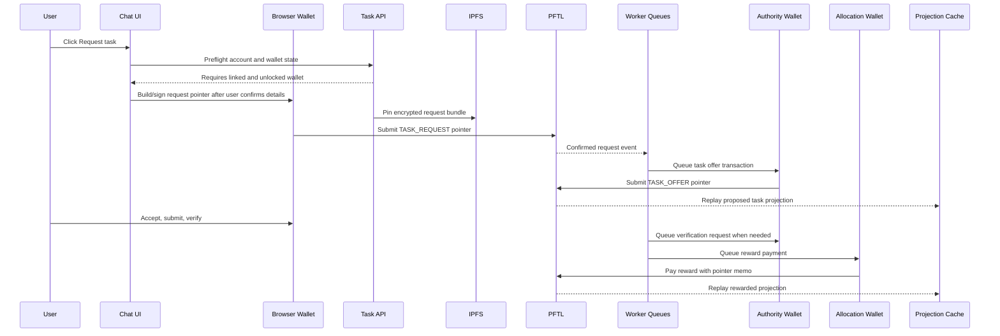
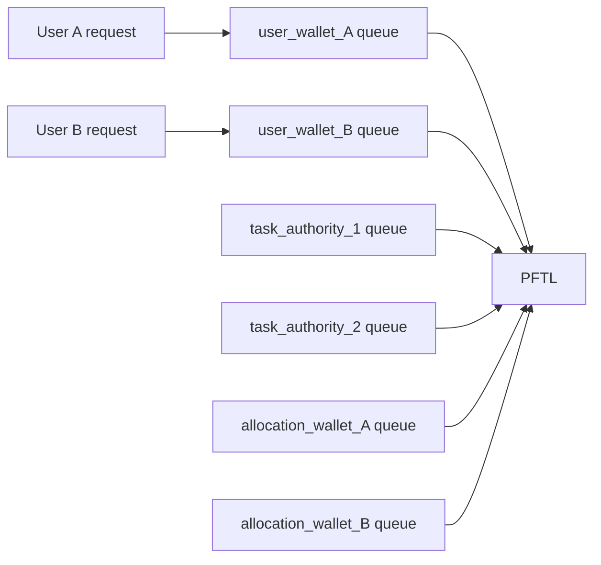

# Task Async Engine

Task requests cannot be treated like normal chat requests. A chat response can be one provider call. A task request becomes a wallet-signed PFTL event, encrypted IPFS payloads, system-issued task offers, verification messages, and reward payments. The engine must be asynchronous because PFTL signing is effectively synchronous per wallet.

## Current State

The current web app has the first request-intent surface, but not the production on-chain request engine.

Already implemented:

- Chat `Request a task` mode records a structured `task_request_intent` turn through `server/task-request-intent.js`.
- The Python reference can consume app data from Postgres and run an on-chain lifecycle through `reference_clients/python/tasknode_pftl/scenarios/app_request_lifecycle.py`.
- Task projection reads are wired through `server/repositories/tasks.js` and `task_projections`.
- Replay receipts can be imported with `npm run db:import-task-replays`.

Not implemented yet:

- Production `request task` API that signs a PFTL request pointer from the browser wallet.
- Production task-generation worker that watches request events and emits authority offers.
- Production wallet transaction queue tables and workers.
- Allocation wallet provisioner and treasury top-up worker.

Until those exist, a task request must not create fake task cards. It should either create a real signed request path or fail with a clear reason.

## Why Async

PFTL transactions are ordered by signing wallet. A single wallet should have one in-flight transaction at a time unless the client has a proven sequence reservation strategy. If a wallet takes 3 to 5 seconds to submit and confirm a transaction, that wallet can only handle roughly 12 to 20 confirmed transactions per minute.

The way to scale is not to submit many transactions at once from one wallet. The way to scale is:

- serialize each signing wallet;
- shard work across multiple wallets;
- use Postgres queues and advisory locks so only one worker owns a wallet at a time;
- update the UX from projections after confirmation.

## Wallet Roles

| Wallet role | Who controls it | Signs | Provisioning | Spin down |
| --- | --- | --- | --- | --- |
| `user_wallet` | User browser vault or external agent | Task request, accept/reject, submissions, verification evidence, context publish | Created or linked in Wallet tab. The app stores only server-side proof plus browser-local encrypted vault. | Lock clears browser memory. Delink removes active account binding. The app cannot destroy the user's wallet. |
| `task_authority_root` | Task Node operator | Authority shard grants and policy changes | Manually created operator wallet, stored in production secrets, used rarely. | Rotate by publishing a new policy grant and retiring the old root after replay compatibility is preserved. |
| `task_authority_wallet` | Task Node worker pool | Proposed task offers and verification requests | Assigned from an operator-managed authority wallet pool. V1 can start with one authority wallet; high volume can shard to `task_authority_1`, `task_authority_2`, etc. | Mark inactive, drain queue, stop assigning new tasks, keep history replayable. |
| `tasknode_service_encryption_identity` | Task Node service | Does not need to pay rewards; decrypts service-readable payloads | Derived from `TASKNODE_SERVICE_SEED` or equivalent secret and published as the service `MessageKey`. | Rotate by publishing a new key and keeping old key material available for historical hydration until migration is complete. |
| `allocation_reward_wallet` | Task Node reward worker | Reward payments for one user or a small shard of users | Provisioned by an allocation wallet provisioner when a user first needs task rewards. Store public mapping in Postgres and secret material in the operator secret store. | Pause, drain, reconcile balance, then retire. Do not delete mapping while historical rewards can replay. |
| `treasury_wallet` | Task Node operator | Top-ups to allocation wallets only | Manually funded operator wallet. It should not pay every user reward directly. | Rotate by funding a new treasury and updating top-up policy. Historical rewards remain tied to allocation wallets. |

## Engine Components

The production engine should be a set of small workers, not one giant request handler.

| Component | Responsibility | Canonical source | Cache/write target |
| --- | --- | --- | --- |
| `task_request_preflight` | Validate login, linked wallet, unlocked vault, MessageKey readiness, fee readiness, and request payload shape. | App session plus browser wallet state. | No task state writes. |
| `task_request_submitter` | Build request bundle from context, memory, recent chat, and user detail text; encrypt to recipients; pin IPFS; ask browser wallet to sign request pointer. | User wallet signed PFTL transaction. | `task_request_bundles`, pending UI receipt. |
| `wallet_tx_queue_worker` | Submit one transaction at a time per signing wallet using idempotency keys and advisory locks. | PFTL transaction result. | `wallet_tx_queue`, pointer event cache. |
| `task_generation_worker` | Watch confirmed request pointers, hydrate bundle, call task-generation prompt, emit proposed task from authority wallet. | Authority wallet PFTL pointer. | `task_events`, `task_projections`. |
| `verification_worker` | Process submissions and emit follow-up verification requests when needed. | Authority wallet PFTL pointer. | `task_events`, `task_projections`. |
| `reward_worker` | Score approved evidence, select allocation wallet, queue reward payment, and emit reward pointer/payment. | Allocation wallet PFTL payment. | `task_events`, `task_projections`, reward ledger diagnostics. |
| `allocation_wallet_provisioner` | Assign or create allocation wallets, enforce shard policy, and request treasury top-ups. | Operator policy plus wallet funding transactions. | `task_wallet_allocations`, funding status. |
| `task_replay_indexer` | Read hot wallet history, reconcile archive history, hydrate IPFS, decrypt service-readable payloads, rebuild projection cache. | PFTL plus IPFS. | `pftl_task_pointer_events`, `task_payload_cache`, `task_events`, `task_projections`. |

The Python reference currently demonstrates the lifecycle and queue shape. The production web engine should move those concepts into server workers with explicit tables, idempotency, locks, and monitoring.

## Request Task Pipeline



## Request Edge States

The `Request task` control must fail before chain work when the required wallet boundary is missing.

| State | Behavior |
| --- | --- |
| User is not signed in | Show login requirement. Do not create a task request. |
| User has no linked wallet | Show `Link or create a PFT wallet before requesting tasks`. Do not create a task request. |
| Wallet is linked but local vault is missing | Route to Wallet tab to restore, relink, or create a local encrypted vault. Do not create a task request. |
| Wallet is locked | Open the shared unlock modal. If the user closes it or password fails, the task request does not proceed. |
| Unlocked wallet does not match linked wallet | Fail with wallet mismatch. Clear unlock state and require relink or correct vault unlock. |
| User wallet lacks MessageKey | Queue or prompt a MessageKey publish transaction before private task payloads are used. |
| User wallet lacks fee balance | Fail before request pointer submission and show the wallet funding requirement. |
| IPFS pin fails | Keep local request draft/error; do not submit a pointer to a missing CID. |
| PFTL submit times out | Mark request as `pending_chain` only if a tx hash exists; otherwise show retryable failure with the same idempotency key. |
| Authority or reward worker is delayed | Keep task state pending and let projection update after confirmed events. Do not fake proposed or rewarded state. |

## Queue Model

Every signing wallet has its own queue.

```text
wallet_tx_queue
  id
  signing_wallet
  role
  event_type
  task_id nullable
  request_id nullable
  payload_cid nullable
  idempotency_key
  status prepared | submitting | submitted | confirmed | failed_retryable | failed_final
  tx_hash nullable
  ledger_index nullable
  attempts
  available_at
  locked_by nullable
  locked_at nullable
  created_at
  updated_at
```

Idempotency key:

```text
sha256(signing_wallet + event_type + task_id + request_id + payload_cid)
```

Worker rule:

```text
SELECT queued tx for wallet
TAKE advisory lock on signing_wallet
submit one tx
wait for result or timeout
record tx hash and confirmation status
release lock
```

Different wallets can proceed in parallel:



Capacity estimate:

```text
wallet_capacity_per_minute = 60 / average_confirm_seconds
role_capacity_per_minute = active_wallet_count_for_role * wallet_capacity_per_minute
```

If average confirmation is 4 seconds, one reward wallet is about 15 reward transactions per minute. Ten allocation wallets are about 150 reward transactions per minute, assuming RPC and worker capacity keep up.

## Provisioning And Retirement

### User wallets

User wallets are created or linked in the Wallet tab. The browser stores an encrypted vault. The app can require unlock, but it does not own the seed and cannot spin the wallet down. Locking clears decrypted material from memory.

### Authority wallets

Authority wallets should be operator-controlled. V1 can run one `task_authority_wallet`. When queue depth or latency requires it, the operator provisions more authority wallets and grants them through `task_authority_root` policy. Retiring an authority wallet means:

1. mark inactive in policy/config;
2. stop assigning new tasks;
3. drain in-flight queue;
4. keep its public address in replay policy forever or until a migration proves old events remain valid.

### Allocation reward wallets

Allocation wallets should be provisioned by policy, not ad hoc in request handlers. V1 options:

- one allocation wallet per account;
- one allocation wallet per subject wallet;
- one allocation wallet per small shard, such as 10 users.

The mapping should be stable:

```text
task_wallet_allocations
  account_id
  subject_wallet
  allocation_wallet
  authority_wallet
  shard_key
  status active | paused | retiring | retired
```

Spin-up:

1. check for an existing active allocation row;
2. if none exists, select an available wallet from pool or derive/create a new wallet under operator control;
3. publish or record its encryption identity if it needs payload access;
4. fund from treasury to a target balance;
5. mark active only after funding is confirmed.

Spin-down:

1. mark paused so no new rewards are assigned;
2. drain queued rewards;
3. reconcile PFT balance and outstanding liabilities;
4. sweep surplus if policy allows;
5. mark retired while preserving replay mapping.

### Treasury wallet

Treasury is a funding source only. It should top up allocation wallets asynchronously and should not be in the hot path for every user reward. This prevents one central sequence queue from becoming the reward bottleneck.

## Worker Ownership

Recommended production processes:

```text
tasknode-api
  request preflight
  request bundle assembly
  browser signing coordination
  read projection state

tasknode-task-worker
  request event hydration
  task generation
  authority offer queueing
  verification request queueing

tasknode-wallet-tx-worker
  per-wallet transaction submission
  confirmation tracking
  retry handling

tasknode-reward-worker
  allocation wallet selection
  reward queueing
  treasury top-up requests

tasknode-indexer
  hot WSS sync
  archive reconciliation
  IPFS hydration
  projection rebuilds
```

These can start as one Node process with separate loops, but the architecture should preserve the boundaries so they can be split later.

## UX Contract

The app should show task request status from real pipeline state:

- `needs_wallet`: no linked wallet;
- `needs_unlock`: linked wallet exists but local vault is locked;
- `needs_local_vault`: linked wallet exists but no browser vault is available;
- `preparing_bundle`: context, memory, and chat packet is being assembled;
- `awaiting_signature`: browser wallet confirmation is needed;
- `pending_chain`: signed pointer submitted, waiting for confirmation;
- `requested`: request pointer confirmed;
- `proposed`: authority offer confirmed;
- `accepted`, `pending_verification`, `refused`, `rewarded`: derived from replay.

The Tasks surface should read `task_projections`. The chat surface may show transient request status, but durable task cards should come from projection replay.

## Implementation Order

1. Implement request preflight and edge-state UI.
2. Promote request intent into bundle creation and user-wallet request pointer signing.
3. Add `wallet_tx_queue` and one transaction worker for authority/allocation wallets.
4. Add authority task-generation worker.
5. Add replay/indexer updates into `task_projections`.
6. Add allocation wallet provisioner and treasury top-up worker.
7. Scale authority and allocation wallets only after single-wallet correctness is proven.
