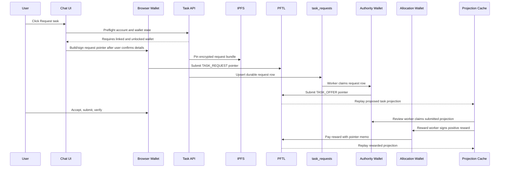
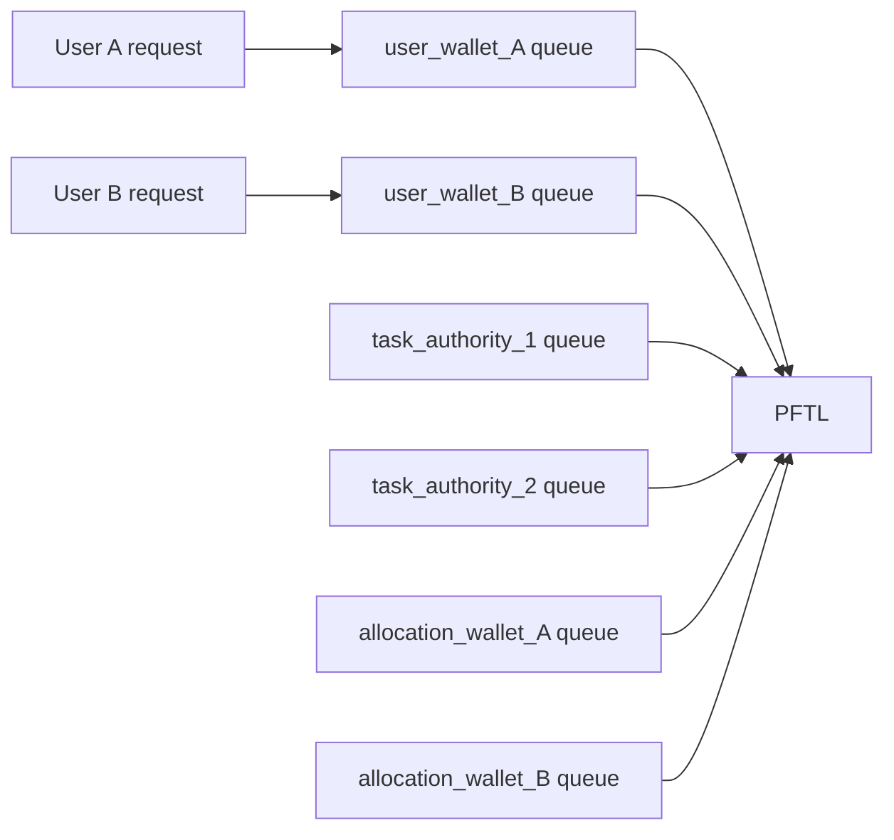

# Task Async Engine

Task requests cannot be treated like normal chat requests. A chat response can be one provider call. A task request becomes a wallet-signed PFTL event, encrypted IPFS payloads, system-issued task offers, verification messages, and reward payments. The engine must be asynchronous because PFTL signing is effectively synchronous per wallet.

## Current State

The current web app has a live chain-backed task loop for a single configured authority/reward seed path. It is no longer just a request-intent or Python-only reference.

Implemented in the app:

- Tasks modal and chat `Request task` mode publish encrypted `pf.task.request.v1` PFTL pointers from the linked browser wallet through `POST /api/tasks/request`.
- `server/task-request.js` builds the request bundle from the saved context document, last 3 deep memories, last 36 recent memories, recent chats, and current task queue projection.
- `task_requests` is the durable request receipt and worker claim table.
- `server/task-generation-worker.js` claims published requests, decrypts the bundle, selects `prompts/task_engine/taskgen_personal_v1.md` for personal requests or `prompts/task_engine/taskgen_network_v1.md` for Network/Alpha routing packets, calls OpenAI `chat-latest`, publishes encrypted `pf.task.offer.v1` pointers from the authority wallet, syncs PFTL, and runs the reducer.
- The Tasks page renders real task cards from `task_projections`, not fabricated local cards.
- The task detail page publishes user-signed accept, refuse, and cancel transitions through `POST /api/tasks/action`.
- The Submit tab publishes user-signed initial evidence and verification evidence through `POST /api/tasks/submission`.
- Evidence packets can contain one or two compact artifacts. Screenshot files are described by the OpenAI vision evidence reader before being included in the encrypted payload.
- `server/task-review-worker.js` claims submitted tasks, generates a follow-up verification request with `verification_request_v1`, publishes a `pf.task.update.v1` pointer, then scores verification responses with `reward_scoring_v1`.
- Reward scoring publishes exactly one terminal `pf.reward.v1`. Positive and partial rewards use the transaction amount as the economic PFT payout. Zero-reward outcomes use a one-drop carrier transaction while the encrypted payload records `reward_pft: "0.00"`.
- The Python reference still exists for external agent playback and multi-wallet protocol stress tests, but the app path now uses the JavaScript server modules listed above.

Still not implemented:

- A Postgres `wallet_tx_queue` that serializes every authority and reward wallet transaction independently. Current authority/reward worker transactions are signed inline by the worker process.
- Per-user or per-shard allocation wallet provisioning. Current reward signing uses configured service/reward seeds.
- Treasury top-up worker for allocation wallets.
- A complete user-facing retry panel for worker failures. Errors are retained in `task_requests`, projection worker metadata, and logs, but the UX does not yet expose all retry controls.

A task request must not create a fake task card. The card appears only after the authority publishes `pf.task.offer.v1` and the PFTL cache reducer writes `task_projections`.

## Production Worker Requirement

On Fly, the async engine depends on the non-HTTP `worker` process group. A
healthy `/health` response only proves the public `app` process is running. It
does not prove task generation, review, PFTL cache sync, or reducer loops are
alive.

Use `npm run fly:deploy:prod` for releases so the post-deploy `npm run
fly:worker-guard` step starts one `worker` machine and enforces
`restart=always`. If a request row is published but no task offer appears, or a
task reaches `submitted` but no verification request appears, check
`npm run fly:worker-guard` and `fly status -a tasknodeofficial-dev` before
editing task rows.

## Why Async

PFTL transactions are ordered by signing wallet. A single wallet should have one in-flight transaction at a time unless the client has a proven sequence reservation strategy. If a wallet takes 3 to 5 seconds to submit and confirm a transaction, that wallet can only handle roughly 12 to 20 confirmed transactions per minute.

The way to scale is not to submit many transactions at once from one wallet. The way to scale is:

- serialize each signing wallet;
- shard work across multiple wallets;
- use Postgres queues and advisory locks so only one worker owns a wallet at a time;
- update the UX from projections after confirmation.

## Wallet Roles

| Wallet role | Who controls it | Signs | Provisioning | Spin down |
| --- | --- | --- | --- | --- |
| `user_wallet` | User browser vault or external agent | Task request, accept/reject, submissions, verification evidence, context publish | Created or linked in Wallet tab. The app stores only server-side proof plus browser-local encrypted vault. | Lock clears browser memory. Delink removes active account binding. The app cannot destroy the user's wallet. |
| `task_authority_root` | Task Node operator | Authority shard grants and policy changes | Manually created operator wallet, stored in production secrets, used rarely. | Rotate by publishing a new policy grant and retiring the old root after replay compatibility is preserved. |
| `task_authority_wallet` | Task Node worker pool | Proposed task offers and verification requests | Assigned from an operator-managed authority wallet pool. V1 can start with one authority wallet; high volume can shard to `task_authority_1`, `task_authority_2`, etc. | Mark inactive, drain queue, stop assigning new tasks, keep history replayable. |
| `tasknode_service_encryption_identity` | Task Node service | Does not need to pay rewards; decrypts service-readable payloads | Derived from `TASKNODE_SERVICE_SEED` or equivalent secret and published as the service `MessageKey`. | Rotate by publishing a new key and keeping old key material available for historical hydration until migration is complete. |
| `allocation_reward_wallet` | Task Node reward worker | Reward payments for one user or a small shard of users | Provisioned by an allocation wallet provisioner when a user first needs task rewards. Store public mapping in Postgres and secret material in the operator secret store. | Pause, drain, reconcile balance, then retire. Do not delete mapping while historical rewards can replay. |
| `treasury_wallet` | Task Node operator | Top-ups to allocation wallets only | Manually funded operator wallet. It should not pay every user reward directly. | Rotate by funding a new treasury and updating top-up policy. Historical rewards remain tied to allocation wallets. |

## Engine Components

The current engine is a set of small modules inside the Node API process. The boundaries are intentionally explicit so authority, reward, indexer, and wallet transaction workers can be split into separate processes later.

| Component | Current code | Responsibility | Canonical source | Cache/write target |
| --- | --- | --- | --- | --- |
| Request preflight and bundle assembly | `server/task-request.js` | Validate session and linked wallet, build app-shaped context/memory/chat/task bundle, return Task Node encryption key and transaction-prep phases. | Browser wallet state plus account cache. | `task_requests` after signed request submit. |
| Browser request signer | `src/features/tasks/task-request-actions.js` | Encrypt request bundle and event payload locally, pin IPFS, sign the PFTL pointer with the unlocked seed vault. | User wallet signed PFTL transaction. | Hidden request intent row and `task_requests`. |
| Task generation worker | `server/task-generation-worker.js` | Claim request rows, decrypt bundle, call task generation model, validate that generated tasks have 2 to 5 steps and app-supported evidence surfaces, publish `pf.task.offer.v1`. | Authority wallet PFTL pointer. | `task_requests`, PFTL cache, `task_projections`. |
| Lifecycle action route | `server/task-actions.js` | Prepare and submit signed accept, refuse, and cancel pointers. | User wallet signed PFTL transaction. | PFTL cache and `task_projections`. |
| Evidence submission route | `server/task-submission.js` | Prepare and submit signed initial or verification evidence pointers. | User wallet signed PFTL transaction. | PFTL cache and `task_projections`. |
| Evidence processor | `server/task-evidence-processing.js` | Read screenshots/files before payload construction so raw media is not embedded in encrypted JSON. | User-provided artifact plus model extraction. | Compact evidence metadata in IPFS payload. |
| Review and reward worker | `server/task-review-worker.js` | Publish verification requests and terminal reward outcomes. | Authority/reward wallet PFTL pointers. | Worker metadata, PFTL cache, `task_projections`. |
| Projection reducer | `server/pftl-cache-reducer.js` | Hydrate/decrypt task pointers and rebuild current task state. | PFTL plus encrypted IPFS. | `pftl_task_pointer_events`, `task_events`, `task_projections`. |

Projection ownership is anchored to the durable `task_requests` row when a
`request_id` is present. Authority-wallet replays can update status and payload
fields, but they must not move a user-requested task into the authority account.

The task-generation evidence contract is intentionally the same contract exposed by the browser evidence modal: text, URL, screenshot/image, uploaded file or document, public commit link when explicitly appropriate, and mixed evidence made from those surfaces. Unsupported proof types such as video or screen recording are not part of the app contract. The reducer preserves offer steps from `pf.task.offer.v1` into projection metadata so the task UI renders the model's actual 2 to 5 step plan instead of replacing it with the submission requirement.

## Stage B Speedrun

`reference_clients/python/tasknode_pftl/scenarios/task_engine_speedrun.py --stage n10` is the canonical Python reference demo for this architecture. It exists so external agents and Codex workflows can reproduce the wallet-native task loop outside the web UX, and it remains useful for multi-wallet stress testing even though the web `Request task` path is now live.

Run it:

```bash
cd /home/pfrpc/repos/tasknodeofficial/reference_clients/python
python3 -m tasknode_pftl.scenarios.task_engine_speedrun --stage n10 --provider frontier --taskgen-model chat-latest
```

Default topology:

- 10 fresh `user_wallet_*` wallets.
- 2 `task_authority_*` wallets.
- 2 `allocation_reward_*` wallets.
- 5 users per allocation wallet shard.
- Per-wallet queue locks for every signing wallet.
- representative URL, screenshot, text, code, file, mixed, faulty, wrong-evidence, refusal/re-request, and duplicate-guard paths.

For each accepted user wallet path, the demo:

1. creates and funds a fresh PFTL user wallet;
2. publishes the wallet `MessageKey`;
3. builds a task request bundle from app-shaped context, memory, recent chat, and task queue cache;
4. encrypts the request bundle and lifecycle payloads to the user, authority, allocation, TaskNode service, and verification identities;
5. pins encrypted payloads to IPFS;
6. submits a user-signed task request pointer;
7. queues a task offer and verification request from the assigned authority wallet;
8. submits accept, evidence, and verification response pointers from the user wallet;
9. scores the response through the configured model path;
10. sends one terminal `pf.reward.v1` from the assigned allocation wallet, using the economic reward amount for positive outcomes or one drop for zero outcomes;
11. replays wallet histories and encrypted IPFS payloads into final projections.

The demo writes generated run artifacts under `reference_clients/python/runs/`, which is gitignored because private receipts contain generated testnet seeds and encryption private keys. Public receipts contain addresses, CIDs, transaction hashes, queue summaries, and replay status only.

The latest verified run at the time this page was updated:

```text
run_id: task_engine_n10_2026-05-18T200932453687
wallets: 10 user wallets
authority wallets: 2
allocation wallets: 2
task receipts: 11
result: 8 rewarded, 1 refused, 2 verification_response_submitted
```

Public artifacts from that run:

- `reference_clients/python/runs/task_engine_n10_2026-05-18T200932453687/receipt_public.json`
- `reference_clients/python/runs/task_engine_n10_2026-05-18T200932453687/TASK_ENGINE_N10.md`

The run proves the scaling boundary directly: user-wallet transactions proceed independently, authority wallets serialize only their own offer/verification queues, and allocation wallets serialize only their own reward queues. It does not yet prove production worker durability, because the queue is an in-process Python reference queue rather than a Postgres-backed worker table.

## Request Task Pipeline



## Request Edge States

The `Request task` control must fail before chain work when the required wallet boundary is missing.

The deterministic policy lives in `src/features/tasks/task-request-unlock-policy.js` and is shared by:

- chat `+` → `Request task` mode in `src/main.jsx`;
- the Tasks page request modal in `src/features/tasks/TaskRequestModal.jsx`;
- the browser signing publisher in `src/features/tasks/task-request-actions.js`, which keeps a final mismatch guard before encryption, IPFS pinning, and PFTL submission.

| State | Behavior |
| --- | --- |
| User is not signed in | Show login requirement. Do not create a task request. |
| User has no linked wallet | Show `Link or create a PFT wallet before requesting tasks`. Do not create a task request. |
| Wallet is linked but local vault is missing | Route to Wallet tab to restore, relink, or create a local encrypted vault. Do not create a task request. |
| Wallet is locked | Open the shared unlock modal. If the user closes it or password fails, the task request does not proceed. |
| Unlock modal is already open | Treat the request as `unlock_pending`; do not submit or open a second modal. |
| Unlocked wallet does not match linked wallet | Fail with wallet mismatch. Clear unlock state and require relink or correct vault unlock. |
| User wallet lacks MessageKey | Queue or prompt a MessageKey publish transaction before private task payloads are used. |
| User wallet lacks fee balance | Fail before request pointer submission and show the wallet funding requirement. |
| IPFS pin fails | Keep local request draft/error; do not submit a pointer to a missing CID. |
| PFTL submit times out | Mark request as `pending_chain` only if a tx hash exists; otherwise show retryable failure with the same idempotency key. |
| Authority or reward worker is delayed | Keep task state pending and let projection update after confirmed events. Do not fake proposed or rewarded state. |

## Current Queue Boundaries

Current queue ownership is split across two Postgres-backed claim paths:

| Queue boundary | Table/projection | Claim rule |
| --- | --- | --- |
| Request generation | `task_requests` | `claimTaskGenerationRequests` claims `published` request rows and marks worker attempt metadata. |
| Verification request | `task_projections` | `claimSubmittedTasks` claims `submitted` projections that do not have a published verification worker marker. |
| Reward scoring/payment | `task_projections` | `claimVerificationResponses` claims `verification_response_submitted` projections that do not have a published reward worker marker. |

These queues prevent duplicate worker processing for the same request or task phase, but they do not yet serialize all transactions per signing wallet. The current worker signs authority and reward transactions inline. That is acceptable for low-volume local/testnet use, but the scalable design still needs a `wallet_tx_queue` table and one-at-a-time execution per authority/reward wallet before public load.

Target wallet-level parallelism:



Capacity estimate:

```text
wallet_capacity_per_minute = 60 / average_confirm_seconds
role_capacity_per_minute = active_wallet_count_for_role * wallet_capacity_per_minute
```

If average confirmation is 4 seconds, one reward wallet is about 15 reward transactions per minute. Ten allocation wallets are about 150 reward transactions per minute, assuming RPC and worker capacity keep up.

## Provisioning And Retirement

### User wallets

User wallets are created or linked in the Wallet tab. The browser stores an encrypted vault. The app can require unlock, but it does not own the seed and cannot spin the wallet down. Locking clears decrypted material from memory.

### Authority wallets

Authority wallets should be operator-controlled. V1 can run one `task_authority_wallet`. When queue depth or latency requires it, the operator provisions more authority wallets and grants them through `task_authority_root` policy. Retiring an authority wallet means:

1. mark inactive in policy/config;
2. stop assigning new tasks;
3. drain in-flight queue;
4. keep its public address in replay policy forever or until a migration proves old events remain valid.

### Allocation reward wallets

Allocation wallets should be provisioned by policy, not ad hoc in request handlers. V1 options:

- one allocation wallet per account;
- one allocation wallet per subject wallet;
- one allocation wallet per small shard, such as 10 users.

The mapping should be stable:

```text
task_wallet_allocations
  account_id
  subject_wallet
  allocation_wallet
  authority_wallet
  shard_key
  status active | paused | retiring | retired
```

Spin-up:

1. check for an existing active allocation row;
2. if none exists, select an available wallet from pool or derive/create a new wallet under operator control;
3. publish or record its encryption identity if it needs payload access;
4. fund from treasury to a target balance;
5. mark active only after funding is confirmed.

Spin-down:

1. mark paused so no new rewards are assigned;
2. drain queued rewards;
3. reconcile PFT balance and outstanding liabilities;
4. sweep surplus if policy allows;
5. mark retired while preserving replay mapping.

### Treasury wallet

Treasury is a funding source only. It should top up allocation wallets asynchronously and should not be in the hot path for every user reward. This prevents one central sequence queue from becoming the reward bottleneck.

## Worker Ownership

Current local Docker starts the task workers from `server/index.js` in the API process:

```text
tasknode-api
  request preflight
  browser signing coordination
  read projection state
  startTaskGenerationWorker()
  startTaskReviewWorker()
```

Recommended production split once volume requires it:

```text
tasknode-api
  request preflight
  request bundle assembly
  browser signing coordination
  read projection state

tasknode-task-worker
  request event hydration
  task generation
  authority offer queueing
  verification request queueing

tasknode-wallet-tx-worker
  per-wallet transaction submission
  confirmation tracking
  retry handling

tasknode-reward-worker
  allocation wallet selection
  reward queueing
  treasury top-up requests

tasknode-indexer
  hot WSS sync
  archive reconciliation
  IPFS hydration
  projection rebuilds
```

These can start as one Node process with separate loops, but the architecture should preserve the boundaries so they can be split later.

## UX Contract

The app should show task request status from real pipeline state:

- `needs_wallet`: no linked wallet;
- `needs_unlock`: linked wallet exists but local vault is locked;
- `needs_local_vault`: linked wallet exists but no browser vault is available;
- `preparing_bundle`: context, memory, and chat packet is being assembled;
- `awaiting_signature`: browser wallet confirmation is needed;
- `pending_chain`: signed pointer submitted, waiting for confirmation;
- `requested`: request pointer confirmed;
- `proposed`: authority offer confirmed;
- `accepted`, `pending_verification`, `refused`, `rewarded`: derived from replay.

The Tasks surface should read `task_projections`. The chat surface may show transient request status, but durable task cards should come from projection replay.

## Current Remaining Work

1. Add `wallet_tx_queue` and one transaction worker for authority/allocation wallets.
2. Add allocation wallet provisioner and treasury top-up worker.
3. Expose worker failure and retry state directly in task detail.
4. Add operator monitoring around request generation, review, scoring, reward payout, and projection lag.
5. Scale authority and allocation wallets only after single-wallet correctness remains stable.
