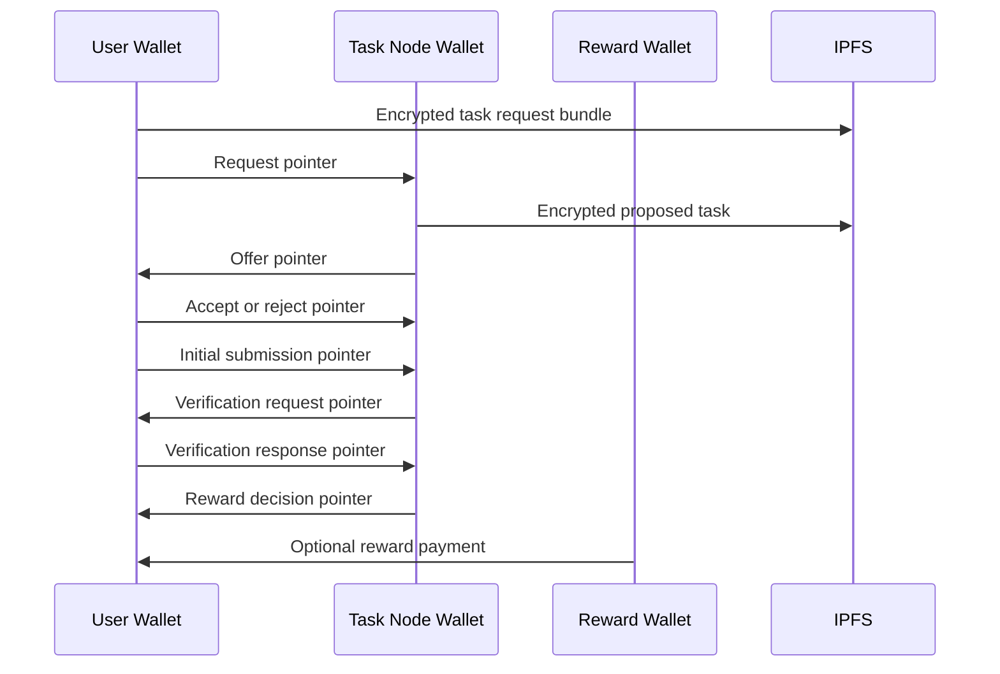

# Task Lifecycle Replay

Task lifecycle replay is the ability to reconstruct task state from PFTL wallet history and encrypted IPFS payloads. This is the core reason to deprecate app-only task state from the old PFTasks interface.

## Canonical Lifecycle

1. User requests a task with a signed `pf.task.request.v1` pointer and encrypted request bundle.
2. System issues a proposed task with `pf.task.offer.v1`.
3. User accepts, refuses, or later cancels the task.
4. Accepted task moves onto the user's plate.
5. User submits the required work product as `pf.task.submission.v1`.
6. System requests verification with a `pf.task.update.v1` transition to `verification_requested`.
7. User submits verification evidence as `pf.task.verification_response.v1`.
8. System processes evidence and records `pf.task.reward_decision.v1`.
9. If the decision pays PFT, a reward wallet sends `pf.reward.v1`.

## Technical Architecture

The protocol plan is `docs/PFTL_TASK_ENGINE_SPEC.md`. The async worker design is in Help under `Task Async Engine`, backed by `docs/wiki/architecture/task-async-engine.md`. The live replay reference is `reference_clients/python/tasknode_pftl/scenarios/full_lifecycle.py`. The encryption-specific onboarding reference is `reference_clients/python/tasknode_pftl/scenarios/encryption_pubkey_demo.py`.

The app maintains a task projection cache for speed. The cache is rebuildable by scanning relevant wallet histories and fetching referenced IPFS CIDs.

The current Tasks UX reads from `task_projections` and opens task detail through `GET /api/tasks/detail`. Detail pages include a server-derived action model from `server/task-lifecycle-policy.js`. Non-terminal tasks can be stopped from the Overview tab. Proposed tasks use `refused`; accepted/submitted/verification-loop tasks use `cancelled`. The stop action is published as an encrypted `pf.task.update.v1` payload and a user-signed `TASK_UPDATE` PFTL pointer through `POST /api/tasks/action`.

Request creation, evidence submission, verification requests, reward decisions, and positive reward payments are now wired into the app path:

- `POST /api/tasks/request` coordinates browser-signed `pf.task.request.v1` publishing and durable `task_requests` rows.
- `server/task-generation-worker.js` emits `pf.task.offer.v1` from the authority wallet.
- `POST /api/tasks/submission` publishes initial evidence and verification evidence from the user wallet.
- `server/task-review-worker.js` emits verification requests, reward decisions, and positive reward payments.
- `server/pftl-cache-reducer.js` hydrates the encrypted IPFS payloads and projects the task state.

Reward display is also projection-derived. A terminal reward decision with `reward_pft: 0` is still shown under the Rewarded bucket, but the UI explains that no PFT was paid and renders the verifier reason from the indexed `pf.task.reward_decision.v1` payload.

Evidence packets can include one or two compact artifacts. Screenshot/image evidence is processed into a vision description and digest metadata before the encrypted payload is pinned; raw image bytes should not be embedded in task payload JSON.

## Review Loop Refresh Contract

Task lifecycle state is shared between server and client through `shared/task-lifecycle.js`. That file is the source of truth for labels, tabs, allowed actions, terminal states, and refresh behavior.

Review-loop states are not final. `submitted`, `verification_requested`, `verification_response_submitted`, and `reward_decided` can all be followed by worker-published events. The app must keep refreshing projections while a visible task is in one of those states. This prevents a split-brain UX where the detail route has already observed a reward but the list route still shows the older Verification card.

The current contract is:

| State | Why it refreshes |
| --- | --- |
| `submitted` | The authority worker may publish a verification request. |
| `verification_requested` | The user may submit verification evidence and the worker may later review it. |
| `verification_response_submitted` | The authority worker may publish a reward decision. |
| `reward_decided` | A positive decision may still be followed by the actual reward payment pointer. |

Terminal states such as `rewarded`, `refused`, `cancelled`, `expired`, and `rejected` do not request ongoing list refresh. They can still be opened and audited through detail/forensics, but the normal lifecycle is finished.

## Diagram

## Failure Modes

- PFTL is synchronous per wallet, so transaction queues are required.
- Cache updates should tolerate delayed or out-of-order replay.
- Encrypted payload fetch failures should be retried without losing pointer events.
- A rewarded projection can correctly have `0 PFT` when the reward decision rejects evidence or assigns no payout.
- User stop actions must be signed by the linked wallet and must not mutate the task projection directly before chain replay confirms the update.
- Date-only deadlines must render as dates, while PFTL events and review timestamps must render as exact times with timezone.
- If the cache lags after a submit, the UI should show the submitted transaction and poll projection state rather than pretending the task did not change.
