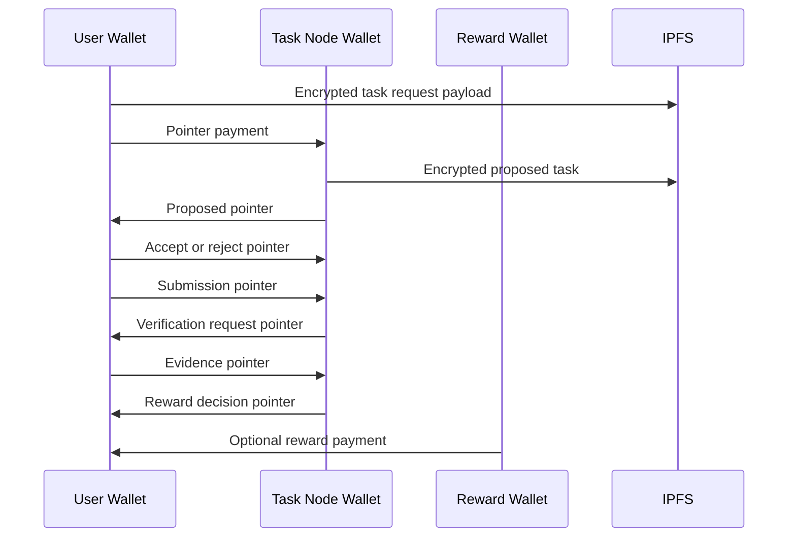

# Task Lifecycle Replay

Task lifecycle replay is the ability to reconstruct task state from PFTL wallet history and encrypted IPFS payloads. This is the core reason to deprecate app-only task state from the old PFTasks interface.

## Canonical Lifecycle

1. User requests a task with a context block.
2. System issues a proposed task.
3. User accepts, refuses, or later cancels the task.
4. Accepted task moves onto the user's plate.
5. User submits the required work product.
6. System requests verification.
7. User submits evidence.
8. System processes evidence and records a reward decision.
9. If the decision pays PFT, a reward wallet sends the reward payment.

## Technical Architecture

The protocol plan is `docs/PFTL_TASK_ENGINE_SPEC.md`. The async worker and wallet queue design is in Help under `Task Async Engine`, backed by `docs/wiki/architecture/task-async-engine.md`. The live replay reference is `reference_clients/python/tasknode_pftl/scenarios/full_lifecycle.py`. The encryption-specific onboarding reference is `reference_clients/python/tasknode_pftl/scenarios/encryption_pubkey_demo.py`.

The app maintains a task projection cache for speed. The cache is rebuildable by scanning relevant wallet histories and fetching referenced IPFS CIDs.

The current Tasks UX reads from `task_projections` and opens task detail through `GET /api/tasks/detail`. Detail pages include a server-derived action model from `server/task-lifecycle-policy.js`. Non-terminal tasks can be stopped from the Overview tab. Proposed tasks use `refused`; accepted/submitted/verification-loop tasks use `cancelled`. The stop action is published as an encrypted `pf.task.update.v1` payload and a user-signed `TASK_UPDATE` PFTL pointer through `POST /api/tasks/action`.

Reward display is also projection-derived. A terminal reward decision with `reward_pft: 0` is still shown under the Rewarded bucket, but the UI explains that no PFT was paid and renders the verifier reason from the indexed `pf.task.reward_decision.v1` payload.

## Diagram

## Failure Modes

- PFTL is synchronous per wallet, so transaction queues are required.
- Cache updates should tolerate delayed or out-of-order replay.
- Encrypted payload fetch failures should be retried without losing pointer events.
- A rewarded projection can correctly have `0 PFT` when the reward decision rejects evidence or assigns no payout.
- User stop actions must be signed by the linked wallet and must not mutate the task projection directly before chain replay confirms the update.
