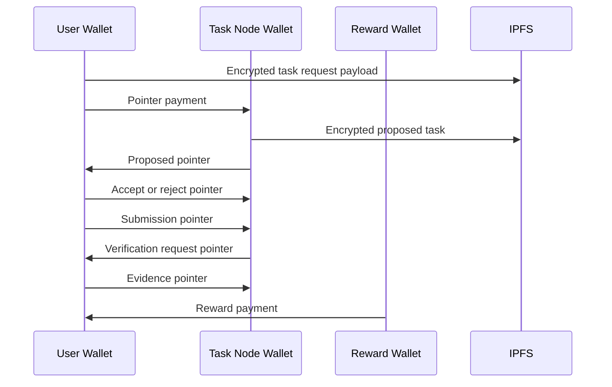

# Task Lifecycle Replay

Task lifecycle replay is the ability to reconstruct task state from PFTL wallet history and encrypted IPFS payloads. This is the core reason to deprecate app-only task state from the old PFTasks interface.

## Canonical Lifecycle

1. User requests a task with a context block.
2. System issues a proposed task.
3. User accepts or rejects the task.
4. Accepted task moves onto the user's plate.
5. User submits the required work product.
6. System requests verification.
7. User submits evidence.
8. System processes evidence and sends reward.

## Technical Architecture

The protocol plan is `docs/PFTL_TASK_ENGINE_SPEC.md`. The async worker and wallet queue design is in Help under `Task Async Engine`, backed by `docs/wiki/architecture/task-async-engine.md`. The live replay reference is `reference_clients/python/tasknode_pftl/scenarios/full_lifecycle.py`. The encryption-specific onboarding reference is `reference_clients/python/tasknode_pftl/scenarios/encryption_pubkey_demo.py`.

The app should maintain a task projection cache for speed. The cache should be rebuildable by scanning relevant wallet histories and fetching referenced IPFS CIDs.

## Diagram

## Failure Modes

- PFTL is synchronous per wallet, so transaction queues are required.
- Cache updates should tolerate delayed or out-of-order replay.
- Encrypted payload fetch failures should be retried without losing pointer events.
