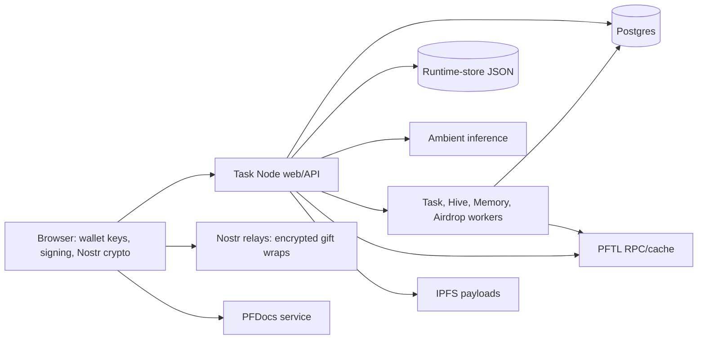

# Task Node Wiki

Task Node is a chat-first work system connecting account context, model
assistance, tasks, wallet identity, collaborative documents, network
coordination, and PFTL replay. Start with the [User Guide](#docs/user-guide) for
normal product use.

## Documentation Authority

Documentation authority is scoped, not directory-wide:

1. Current implementation, migrations, deployment configuration, and
   executable tests define actual behavior.
2. Current pages under **Product Surfaces** explain supported user behavior and
   limits.
3. Current architecture pages explain trust boundaries and operator-visible
   state. They must be corrected when code changes.
4. Dated plans are proposals or historical execution records unless explicitly
   designated as the one active plan. Completed plans do not override code.
5. `docs/archive/` is historical reference only. Legacy PFTasks is not this
   repository's runtime; PFDocs is a separate service used by Docs.

The in-app Help frontend imports Markdown and complete prompt files at build
time. Imported content is public to every production browser. The current import
set still includes material that must be classified or removed before the
repository is open sourced; see `docs/open-source-readiness.md`.

## Product Map

- **Chat** is the main AI work surface. Its message bodies are stored by Task
  Node and sent to the configured inference provider.
- **Context** is the durable account profile used to ground eligible work.
- **Memory** is an inspectable compression of prior Chat and rewarded work.
- **Tasks** handles personal and network work from generation through evidence,
  verification, reward, projection, and replay.
- **Hive** coordinates network projects, Hive Chat, routing, and contributor
  work.
- **Docs** is the wallet-encrypted collaborative document library backed by a
  separate embedded PFDocs deployment.
- **Team** grants directional read-only task-history access; it does not grant
  wallet, Context, Docs, Memory, or Messages access.
- **Messages** is the wallet-bound NIP-17 inbox addressed by Task Node handle.
  Task Node stores its public identity binding, not message bodies or private
  keys; independent relays retain encrypted gift wraps.
- **Wallet** provides PFTL identity, balance/activity, transfers, signing,
  rewards, and applicable publication authority.
- **Directory** and **Profile** expose opted-in identity, contribution, badge,
  NFT, and connection information.
- **System Status** reports many worker, queue, provider, and protocol signals;
  a green HTTP process alone is not full-system health.

## System Boundary

Important rules:

- application login, wallet linkage, and local wallet unlock are different
  states;
- recovery phrases/private keys remain browser-side;
- AI Chat and native Context are server-side product data, not end-to-end
  encrypted from Task Node;
- Nostr Messages are encrypted/decrypted in the browser and bypass the Task
  Node message database;
- Postgres is the fast application/projection store, while the canonical
  protocol record varies by event type and must be named explicitly; and
- implemented code can still be configuration-disabled or externally unhealthy.

## Primary Help Pages

| Need | Page |
| --- | --- |
| Normal product walkthrough | [User Guide](#docs/user-guide) |
| Implemented runtime and data boundaries | [Current System](#docs/current-system) |
| Local checkout/startup and focused checks | [Bootup](#docs/bootup) |
| Account auth and wallet custody | [Identity & Wallets](#docs/identity-wallets), [Wallet](#docs/wallet) |
| Chat, persistence, personas, and recovery | [Chat](#docs/chat) |
| Context and rewrite behavior | [Context](#docs/context), [Context Rewrite](#docs/context-rewrite) |
| Task lifecycle and replay | [Task Generation](#docs/task-generation), [PFTL](#docs/pftl), [Tasks](#docs/tasks) |
| Hive and network routing | [Hive](#docs/hive), [Hive & Board Operations](#docs/hive-operations) |
| Docs and Team permissions | [Docs](#docs/docs), [Team](#docs/team) |
| Private user-to-user transport | [Messages](#docs/messages) |
| Worker/provider state | [System Status](#docs/system-status-home) |
| User-specific support investigations | [User Observability Logging](#docs/user-observability-logging) |
| General defect-repair rule | [Defect Repair Rule](#docs/defect-repair-rule) |

The current Deployment page is an accuracy record and extraction warning, not
a public authorization to operate the official service. Production runbooks,
incident response, credential ownership, and remote-data mutation procedures
must live privately before open-source release.

## Documentation Policy

- Describe behavior as implemented, configuration-gated, intentionally
  disabled, deprecated, or proposed.
- Do not publish secrets, credential suffixes, incident narratives, recovery
  phrases, private user data, or machine-specific paths.
- Do not treat public-chain identity linkages as non-sensitive merely because
  the individual transactions are public.
- Keep dated plans and verification evidence out of current product authority.
- Do not append generic reviewer checklists. Use a focused verification section
  with runnable checks when necessary.
- Prefer generated API, process, environment, and prompt inventories over copied
  lists that drift.

## Primary Code References

- `src/main.jsx` and `src/features/`
- `server/index.js` and route modules under `server/`
- `server/route-policies.js`
- `server/repositories/`
- `server/db/migrations/`
- `scripts/`
- `fly.toml`
- `src/features/docs/docs-content.js`

Open-source publication blockers and objective exit gates are maintained in
`docs/open-source-readiness.md`.
