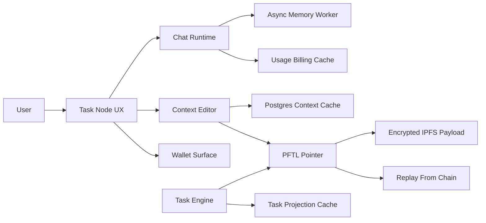

# Task Node Wiki

Task Node is a chat-first work system that connects human context, model assistance, wallet identity, and PFTL task playback. The app should feel simple at the surface: chat about work, maintain context, receive or create tasks, and understand wallet state. Underneath, the system separates fast product caches from canonical chain-verifiable records.

The most important distinction is canonical state versus convenience state. Postgres exists so the product is fast and recoverable. PFTL pointers, encrypted IPFS payloads, wallet events, and task lifecycle messages are the replayable protocol layer.

For a normal user-facing explanation, start with [User Guide](#docs/user-guide).

## Product Map

- Chat is where users work.
- Context is the durable profile of what the user is building and what matters.
- Tasks are portable work objects that request, accept, submit, verify, and reward through PFTL/IPFS while Postgres provides the fast read model.
- Hive is the network coordination board and Hive Chat is the default conversation for contributing validated network context.
- Wallet is identity, rewards, publishing authority, and balance visibility.
- Memory is lightweight compression of user and assistant turns so future chats can carry continuity.
- Context Refine is the active specialized chat tool for targeted edits to the current context document. Context Rewrite is the active billed full-document rewrite pipeline that returns copyable/downloadable Markdown without replacing the current document. Motivation, Brainstorming Context, and general Rewrite are not exposed.

## System Diagram

## Canonical Rules

- A user can have context without a linked wallet.
- Tasks require a wallet because task state and rewards must be attributable.
- Caches should make the product fast, but not become the protocol source of truth.
- Encrypted payloads should be recoverable by intended wallet identities and unreadable by outsiders.
- Any new surface should name its database cache, canonical protocol record, and failure behavior.
- Deployment is documented under Architecture -> Deployment. Production is `https://tasknode.postfiat.org`, served by the promoted `tasknodeofficial-dev` Fly app (the app keeps its original Fly name); local Docker can either use isolated local data or the Fly data bridge for QA against the same Postgres rows. Fly releases must use `npm run fly:deploy` (or `npm run fly:deploy:prod` for the explicit production confirmation) so the non-HTTP `worker` process group is started and guarded after deploy.
- Scheduler, worker, and RPC audit state is documented under Architecture -> System Status and rendered live in Help from `/api/system/status`.
- Browser-control release testing is documented under Architecture -> [Browser-Control QA](#docs/codex-computer-control-qa).
- The single active beta plan is documented under Plans -> [Task Node Production Scope](#docs/task-node-production-scope). That page now consolidates production scope, beta acceptance gates, completed implementation areas, contributor trust/reward policy, and the remaining P0/P1 beta work. Remaining onboarding and wallet-friction recommendations are tracked in Plans -> [Onboarding Wallet Friction Memo](#docs/onboarding-wallet-friction-memo). The production domain migration package is tracked in Plans -> [Task Node Production Cutover Package](#docs/task-node-production-cutover-package).

## Canonical Wiki Locations

Root-level legacy runbooks are not the app Help source of truth. Use these wiki
locations instead:

| Topic | Canonical Help page |
| --- | --- |
| Plain-English app walkthrough and feature catalogue | [User Guide](#docs/user-guide) |
| Full-document context rewrite pipeline | [Context Rewrite](#docs/context-rewrite) |
| Fresh checkout, local setup, smoke checks, first failure triage | [Bootup](#docs/bootup) |
| Current product boundary, route map, enabled surfaces, and deferrals | [Current System](#docs/current-system) |
| Account auth, wallet proof, local vault unlock, and seed custody | [Identity & Wallets](#docs/identity-wallets), [Wallet](#docs/wallet) |
| Docker, Fly deploys, secrets, process groups, production pause/restart | [Deployment](#docs/deployment) |
| User-specific support, wallet-scoped eligibility, rewards, memory, profile, Hive, Telegram, and usage logging | [User Observability Logging](#docs/user-observability-logging) |
| Hive Chat first-run onboarding, wallet validation, Network Tasks, and onboarding friction | [Hive](#docs/hive) |
| Badge-based Network Task eligibility, profile badge rendering, capacity gating, and Board Manager routing enforcement | [Hive & Board Operations](#docs/hive-operations) |
| PFTasks to Task Node Official account, wallet, context, task, NFT, and URL cutover | [Task Node Production Cutover Package](#docs/task-node-production-cutover-package), [PFTasks Cutover](#docs/pftasks-cutover) |
| PFTasks production transaction shutdown before cutover | [PFTasks Transaction Shutdown Cutover Plan](#docs/pftasks-transaction-shutdown-cutover-plan) |
| Postgres schema target and context history restore | [Database](#docs/database), [PFTL](#docs/pftl) |
| Ethereum deposit addresses, xpub custody, balance sync, sweep boundary | [Ethereum Deposit RPC](#docs/ethereum-deposit-rpc), [Wallet](#docs/wallet), [Database](#docs/database) |
| PFTL task protocol, async task engine, lifecycle replay, evidence and rewards | [Task Generation](#docs/task-generation), [PFTL](#docs/pftl), [Tasks](#docs/tasks) |
| Orc operators, Nazgul oversight, shared review state, triage labels, evidence rules, Sybil review flags, and guardrails | [Orc Operator Runtime](#docs/orc-operator-runtime), [Orc Army And On-Chain Agent Overview](#docs/orc-army-overview), [Grashnuk On-Chain Agent](#docs/grashnuk-on-chain-agent), [Sybil Review Detection](#docs/sybil-review-detection), [Agents](#docs/agents) |
| IPFS payload standards, gateway order, first-party IPFS rebuild, fresh CID replication, and legacy NFT CID migration | [IPFS](#docs/ipfs), [IPFS Infrastructure Rebuild](#docs/ipfs-infrastructure-rebuild), [IPFS New Write Replication](#docs/ipfs-new-write-replication), [Profile](#docs/profile), [PFTasks Cutover](#docs/pftasks-cutover) |
| Local Discord task-event posting harness | [Deathmarch Local Harness](#docs/deathmarch) |
| Generalized defect repair rule for concrete bug reports | [Defect Repair Rule](#docs/defect-repair-rule) |

## Documentation Review Policy

The wiki is the source of truth for the app, not an unfinished review queue.
Pages should describe current behavior, current limits, operator commands, and
verified checks. Do not add generic `Reviewer To Do List` sections or
placeholder checklists that ask an unnamed reviewer to inspect the page later.

If a document needs active verification, use one of these explicit forms:

- `Verification Checklist` for checks that operators should run when changing a
  specific surface;
- `Current Limits` for known incomplete or constrained behavior;
- `Deprecated` or `Not Exposed` when a surface or workflow is no longer live;
- a dated evidence note with commands, task IDs, transaction hashes, CIDs,
  screenshots, or links when a review was actually performed.

## Primary Code References

- `src/main.jsx`
- `src/features/wallet/WalletView.jsx`
- `src/features/memory/MemoryView.jsx`
- `src/features/context/context-publish.js`
- `server/index.js`
- `server/chat-router.js`
- `server/repositories/chat-billing.js`
- `server/repositories/context.js`
- `server/repositories/chat-memory.js`
- `reference_clients/python/tasknode_pftl/`
