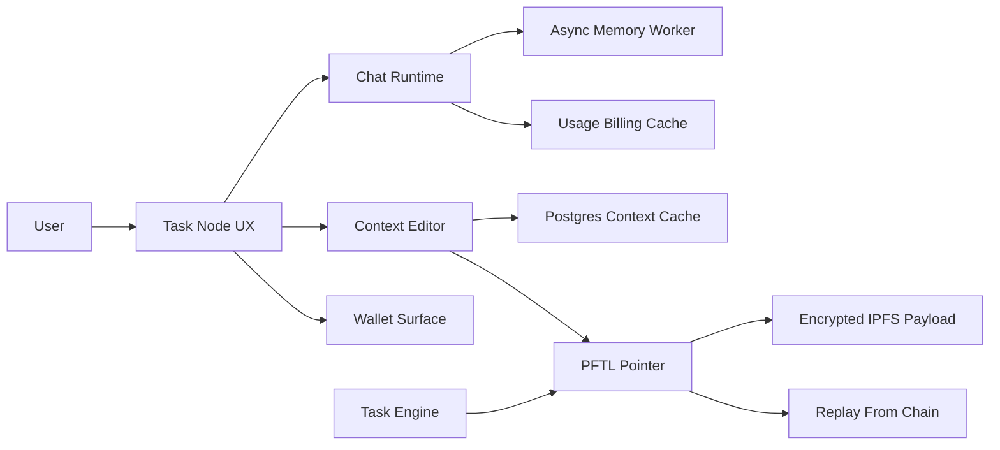

# Task Node Wiki

Task Node is a chat-first work system that connects human context, model assistance, wallet identity, and PFTL task playback. The app should feel simple at the surface: chat about work, maintain context, receive or create tasks, and understand wallet state. Underneath, the system separates fast product caches from canonical chain-verifiable records.

The most important distinction is canonical state versus convenience state. Postgres exists so the product is fast and recoverable. PFTL pointers, encrypted IPFS payloads, wallet events, and task lifecycle messages are the replayable protocol layer.

## Product Map

- Chat is where users work.
- Context is the durable profile of what the user is building and what matters.
- Tasks are portable work objects that should replay from PFTL without trusting Postgres.
- Wallet is identity, rewards, publishing authority, and balance visibility.
- Memory is lightweight compression of user and assistant turns so future chats can carry continuity.
- Motivation, Brainstorming Context, Refine Context, and Rewrite are specialized chat tools that operate against the current context and recent conversation.

## System Diagram

## Canonical Rules

- A user can have context without a linked wallet.
- Tasks require a wallet because task state and rewards must be attributable.
- Caches should make the product fast, but not become the protocol source of truth.
- Encrypted payloads should be recoverable by intended wallet identities and unreadable by outsiders.
- Any new surface should name its database cache, canonical protocol record, and failure behavior.

## Primary Code References

- `src/main.jsx`
- `src/features/wallet/WalletView.jsx`
- `src/features/memory/MemoryView.jsx`
- `src/features/context/context-publish.js`
- `server/index.js`
- `server/chat-router.js`
- `server/repositories/chat-billing.js`
- `server/repositories/context.js`
- `server/repositories/chat-memory.js`
- `reference_clients/python/tasknode_pftl/`

