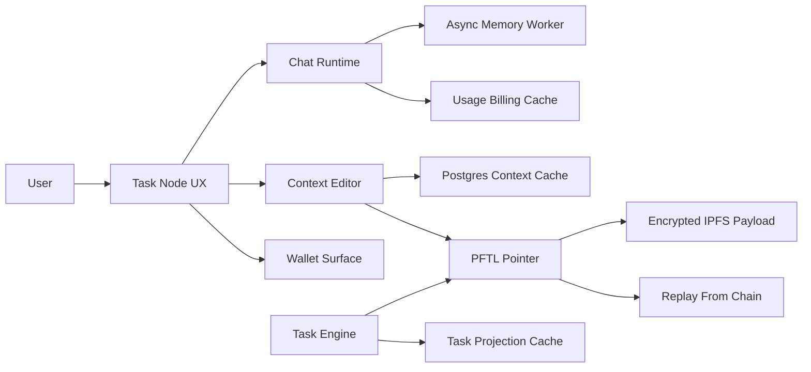

# Task Node Wiki

Task Node is a chat-first work system that connects human context, model assistance, wallet identity, and PFTL task playback. The app should feel simple at the surface: chat about work, maintain context, receive or create tasks, and understand wallet state. Underneath, the system separates fast product caches from canonical chain-verifiable records.

The most important distinction is canonical state versus convenience state. Postgres exists so the product is fast and recoverable. PFTL pointers, encrypted IPFS payloads, wallet events, and task lifecycle messages are the replayable protocol layer.

## Product Map

- Chat is where users work.
- Context is the durable profile of what the user is building and what matters.
- Tasks are portable work objects that request, accept, submit, verify, and reward through PFTL/IPFS while Postgres provides the fast read model.
- Wallet is identity, rewards, publishing authority, and balance visibility.
- Memory is lightweight compression of user and assistant turns so future chats can carry continuity.
- Context Refine is the active specialized chat tool for editing the current context document. Motivation, Brainstorming Context, and Rewrite are not exposed in the interface right now.

## System Diagram

## Canonical Rules

- A user can have context without a linked wallet.
- Tasks require a wallet because task state and rewards must be attributable.
- Caches should make the product fast, but not become the protocol source of truth.
- Encrypted payloads should be recoverable by intended wallet identities and unreadable by outsiders.
- Any new surface should name its database cache, canonical protocol record, and failure behavior.
- Deployment is documented under Architecture -> Deployment. The current public dev app is `tasknodeofficial-dev` on Fly; local Docker can either use isolated local data or the Fly dev data bridge for QA against the same Postgres rows. Fly releases must use `npm run fly:deploy` so the non-HTTP `worker` process group is started and guarded after deploy.
- Scheduler, worker, and RPC audit state is documented under Architecture -> System Status and rendered live in Help from `/api/system/status`.
- Hive board professionalism is documented under Plans -> [Hive Board Professionalism Diagnosis](plans/hive-board-professionalism-diagnosis.md). Active board counts must be live rows, and Board Manager archives must be resurrectable unless explicitly operator-locked.

## Primary Code References

- `src/main.jsx`
- `src/features/wallet/WalletView.jsx`
- `src/features/memory/MemoryView.jsx`
- `src/features/context/context-publish.js`
- `server/index.js`
- `server/chat-router.js`
- `server/repositories/chat-billing.js`
- `server/repositories/context.js`
- `server/repositories/chat-memory.js`
- `reference_clients/python/tasknode_pftl/`

## Reviewer To Do List

Review implementation against this document (index). Mark each item when verified.

### Memory Efficiency
- [ ] Operational paths use checkpoints, caches, or bounded batch sizes.
- [ ] Confirm the product map names only surfaces that exist or are explicitly marked hidden/TBD.
- [ ] Verify the system diagram does not imply unbounded in-memory fan-out (e.g., full chain replay on every page load).

### Code Quality
- [ ] Commands, env vars, and file paths verified against repo.
- [ ] Cross-check Primary Code References against current entry points; remove dead paths.
- [ ] Ensure canonical-vs-cache rules are stated once and not contradicted by linked surface docs.

### Coherence
- [ ] Doc aligns with wiki and spec docs for same topic.
- [ ] Every surface in the product map links to an existing wiki page or is labeled not exposed.
- [ ] Diagram arrows match actual data flow described in Architecture docs.

### Bloat
- [ ] Engineering doc scoped to its audience; defers product detail to wiki.
- [ ] Index stays overview-level; deep implementation detail belongs in surface/architecture pages.
- [ ] Avoid duplicating full mode matrices or table inventories here.

### Security
- [ ] No secrets committed; custody boundaries explicit.
- [ ] Canonical rules state wallet requirements and encryption expectations without overstating guarantees.
- [ ] No secrets, seed examples, or operator keys in the index doc.
