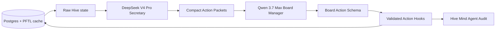

# Board Manager DeepSeek Secretary Packets

Status: deprecated implemented milestone. Current product truth lives in `Surfaces -> Hive`, `Architecture -> AI Providers`, and `Architecture -> System Status Runbooks`.

This milestone implements the first two-stage Board Manager architecture: direct DeepSeek API `deepseek-v4-pro` acts as a secretary/workhorse that condenses the full Hive state into a compact Board Triage packet, then OpenRouter `qwen/qwen3.7-max` acts as the Board Manager decision model.

The goal is to reduce recurring Board Manager cost and improve decision quality without weakening the existing action-hook boundary.

What exists now:

- prompt: `prompts/hive/board_manager_secretary_v1.md`;
- provider/repository boundary: `server/board-manager-secretary-packets.js`;
- migration: `server/db/migrations/043_board_manager_secretary_packets.sql`;
- one-shot executor integration: `scripts/board-manager-model-exec.mjs`;
- smoke: `scripts/board-manager-secretary-packet-smoke.mjs`;
- docs prompt registry: Prompts -> Board Manager Secretary Packet.

The current implementation only creates `board_triage` packets. Project focus, contributor focus, and network-task evidence packets remain planned follow-ups.

## Problem

The current Board Manager can already run through OpenRouter Qwen and choose validated actions. The expensive part is not the output; it is repeatedly loading the whole Hive board state into every decision call.

The latest measured local packet was about `88 KB` and produced roughly:

- `31.5k` input tokens;
- `1.9k` output tokens;
- `1.3k` reasoning tokens;
- about `$0.093` per Qwen run.

The largest packet sections were:

| Section | Approx bytes | Why it is expensive |
| --- | ---: | --- |
| `hiveProjects` | `19.7 KB` | Full active-project payloads, docs, tasks, contributor state. |
| `networkTaskContent` | `18.1 KB` | Completed, outstanding, stopped, and pending network-task summaries. |
| `hiveSecretary` | `7.0 KB` | High-level Hive digest and report text. |
| `recentBoardManagerRuns` | `7.0 KB` | Prior decisions and action summaries. |
| `projectPlanning` | `5.7 KB` | Planner job/generation detail. |
| `taskRequests` | `5.4 KB` | Recent request rows and task-generation state. |
| `networkTaskCandidates` | `4.9 KB` | Candidate routing profiles and wallet state. |
| `taskState` | `4.8 KB` | Global task projection counts and recents. |
| `boardActionPressure` | `4.5 KB` | Deterministic health signals and policy context. |

When the board is quiet, most of that context is not needed. A recurring agent should first ask: what changed, what needs attention, and what exact context is required next?

## Core Design

The Board Manager now runs as two coordinated model calls when the secretary path is enabled:

1. **Secretary packet builder**: direct DeepSeek API `deepseek-v4-pro`.
2. **Board decision model**: OpenRouter `qwen/qwen3.7-max`.

DeepSeek does not execute actions. It reads raw state and produces compact packets. Qwen receives only the compact packet required to choose a validated Board Manager action.

## Provider Choice

Use the direct DeepSeek API key, not the OpenRouter ZDR route, for this secretary job.

Reasoning:

- the secretary job is internal infrastructure, not user chat;
- it is allowed to inspect operational Hive board state;
- direct DeepSeek API should be cheaper than routing large internal summarization through Qwen every tick;
- DeepSeek V4 Pro is appropriate for long-context compression, planning notes, and workhorse summarization;
- Qwen remains the action-deciding agent because its job is to choose one validated action from a smaller packet.

Privacy posture:

- this is **not ZDR**;
- do not send private chat transcripts, raw user context documents, wallet seeds, private keys, OAuth tokens, or encrypted payload plaintext;
- allow only board-operational state that is already used for Hive routing: project state, public/derived profile text, network task summaries, Hive Context entries, task titles/descriptions/outcomes, and Board Manager run summaries;
- record source digests and generated packet digests for audit.

## Proposed Packet Types

The secretary should produce small, typed packets. Each packet should be written to Postgres and referenced by digest.

### Board Triage Packet

Purpose: decide whether the board needs any action.

Inputs:

- board health summary;
- changed-since-last-run summary;
- active project IDs and short health;
- outstanding/pending/stopped Network Task counts;
- candidate capacity summary;
- latest Hive Context deltas;
- recent Board Manager micro summaries.

Expected size: `3k-8k` tokens.

Output fields:

- `motion_state`;
- `requires_attention`;
- `attention_targets`;
- `recommended_context_request`;
- `reason_summary`;
- `staleness_summary`;
- `do_nothing_allowed`.

### Project Focus Packet

Purpose: let Qwen decide whether to refresh a project document, initiate a Network Task, message a user, assign a contributor, or archive a project.

Inputs:

- one project;
- its current product document;
- last 5 related Network Tasks by title, state, reward, and outcome;
- project-linked contributors;
- relevant Hive Secretary text;
- relevant Hive Context snippets.

Expected size: `5k-12k` tokens.

Output fields:

- `project_id`;
- `current_state_plain_english`;
- `blocked_or_moving`;
- `missing_information`;
- `candidate_actions`;
- `recommended_action_context`;
- `facts_to_preserve`.

### Contributor Focus Packet

Purpose: route tasks to the right contributor without loading large memory/profile blocks into Qwen.

Inputs:

- network task profile;
- public profile role summary;
- active wallet;
- outstanding Network Tasks;
- recent rewarded/refused/cancelled task summaries;
- alignment/airdrop/task contribution summaries when relevant.

Expected size: `4k-10k` tokens.

Output fields:

- `account_id`;
- `wallet_address`;
- `current_focus`;
- `demonstrated_capabilities`;
- `constraints`;
- `best_fit_project_ids`;
- `capacity_status`;
- `routing_notes`.

### Network Task Evidence Packet

Purpose: summarize completed or refused Network Tasks so the Board Manager understands what happened without replaying full forensics.

Inputs:

- task title/description;
- state;
- verification request only if it changes outcome interpretation;
- reward decision text;
- reward amount;
- refusal/cancellation reason when present;
- linked project.

Expected size: `2k-6k` tokens.

Output fields:

- `task_id`;
- `project_id`;
- `state`;
- `what_was_learned`;
- `did_it_move_project_forward`;
- `followup_needed`;
- `recommended_next_context`.

## Runtime Flow

### Quiet Tick

1. Worker claims a due Board Manager job.
2. Server builds raw deterministic health data.
3. If no material state changed since the last secretary digest, reuse the latest Board Triage Packet from `board_manager_secretary_packets`.
4. Qwen receives only the Board Triage Packet.
5. If Qwen chooses `do_nothing`, stop.

This is the expected common path.

The secretary source digest is semantic rather than clock-based. It ignores trigger labels, generated timestamps, exact age counters, generated lines in source text, and churn from no-op Board Manager runs. It still changes when board pressure, project state, task state, candidate state, Hive Context, or material Board Manager actions change.

### Targeted Action Tick

1. Worker claims a due Board Manager job.
2. DeepSeek builds or refreshes the Board Triage Packet.
3. Triage identifies one target, for example `project:task_node`.
4. DeepSeek builds a Project Focus Packet for only that target.
5. Qwen receives the triage packet plus the target packet.
6. Qwen chooses one validated action.
7. Existing action hooks execute the action.
8. The Hive Mind Agent feed shows both:
   - the Qwen decision;
   - the secretary packets used as evidence.

### Event-Triggered Tick

Some events should enqueue a targeted secretary refresh without waiting for periodic cadence:

- new Hive Context entry;
- Network Task rewarded/refused/cancelled/failed;
- project document stale;
- active project has planned task count but no live tasks;
- candidate capacity changed;
- Board Manager action failed.

## Database

`server/db/migrations/043_board_manager_secretary_packets.sql` adds `board_manager_secretary_packets`.

Suggested fields:

| Field | Purpose |
| --- | --- |
| `id` | Stable packet id. |
| `scope` | `global_hive` or later project/user scope. |
| `packet_type` | `board_triage`, `project_focus`, `contributor_focus`, `network_task_evidence`. |
| `target_type` | Optional target such as `network_project`, `account`, `task`. |
| `target_id` | Optional target id. |
| `source_digest` | Digest of raw deterministic input. |
| `packet_digest` | Digest of generated packet output. |
| `packet_json` | Structured model output. |
| `packet_text` | Human-readable compact summary. |
| `provider` | `deepseek`. |
| `model` | `deepseek-v4-pro`. |
| `prompt_version` | Prompt id. |
| `usage_json` | Token/cost/latency metadata. |
| `status` | `current`, `superseded`, `failed`. |
| `created_at` | Creation time. |
| `superseded_at` | Replacement time. |

The table answers: what did the secretary compress, from what source, at what cost, and what did Qwen rely on?

## Prompt Proposal

The secretary prompt should not decide actions. It should prepare context for an agent that decides actions.

Prompt principles:

- compress for decision utility, not completeness;
- preserve exact IDs and facts needed for action hooks;
- remove duplicate prose;
- call out uncertainty explicitly;
- identify what changed since the last packet;
- separate facts from interpretation;
- never fabricate tasks, contributors, or project state;
- never issue instructions to the downstream Board Manager beyond describing available facts.

The Qwen prompt should then be simpler:

- read the secretary packet;
- choose one action from the registry;
- explain why that action is justified;
- output only schema-valid JSON.

## Cost Model

Current single-stage Qwen path:

- about `$0.093` per measured full packet run;
- 96 scheduled runs/day at 15-minute cadence is about `$9/day` before follow-ups.

Expected two-stage path:

- quiet tick: Qwen sees a small triage packet, likely `3k-8k` tokens;
- targeted tick: one DeepSeek packet plus one smaller Qwen decision;
- no-op runs should avoid loading full project/task/candidate payloads.

Expected practical outcome:

- quiet board: materially below current `$9/day`;
- active board: spend shifts toward targeted runs that actually produce useful actions;
- 5.5 Pro remains an emergency/manual override, not a continuous path.

The exact DeepSeek cost depends on the final direct API pricing at the time of implementation. As of the checked DeepSeek docs, `deepseek-v4-pro` is listed in the API pricing page and the docs note a 75% discount window extended until 2026-05-31 15:59 UTC.

## Implementation Status

### Phase 1: packet contracts

- Done for Board Triage. The prompt file is `prompts/hive/board_manager_secretary_v1.md`.
- The source digest smoke proves unchanged board state does not regenerate a secretary packet when only generated timestamps, triggers, freshness ages, source-text generated lines, or no-op runs changed.
- Targeted packet source builders for Project Focus, Contributor Focus, and Network Task Evidence are not implemented yet.

### Phase 2: DeepSeek direct API provider

- Done in `server/board-manager-secretary-packets.js`.
- Uses `DEEPSEEK_API_KEY` or `DEEPSEEK`, with optional `DEEPSEEK_BASE_URL`.
- Default model is `deepseek-v4-pro`.
- Stores provider response id, usage, latency, prompt version, prompt digest, packet digest, and normalized JSON/text output.
- Invalid JSON fails closed before Qwen sees the packet.

### Phase 3: secretary packet persistence

- Done for current-packet reuse and supersession.
- Current helpers are `getCurrentBoardManagerSecretaryPacket`, `ensureBoardManagerSecretaryPacket`, and the internal insert/supersede transaction.
- Listing packets by run is not implemented yet.

### Phase 4: Qwen targeted decision path

- Done for triage mode through `scripts/board-manager-model-exec.mjs`.
- `--no-secretary` forces the old full-source path for debugging.
- `--packet-only` still prints the full raw source without calling providers.
- `--prompt-only` prints the full-source prompt today; a secretary prompt-only mode should be added if needed.
- Targeted packet chaining after triage is not implemented yet.

### Phase 5: audit UI

- Partial. Recorded Board Manager runs store source packet data and run summaries. The one-shot executor prints secretary packet id, source digest, reuse flag, provider, model, and usage.
- Hive Mind Agent does not yet render secretary packet id/reuse/cost as first-class fields.

## Live Verification

Local Docker was tested against the same API container environment used by the app.

Fresh secretary run:

- raw source packet: about `87.8 KB`;
- Qwen decision packet after secretary compression: about `16.6 KB`;
- DeepSeek secretary usage: `26,162` input tokens, `4,154` output tokens, `2,423` reasoning tokens, `78.2s` latency;
- Qwen usage after compression: `7,706` input tokens, `1,621` output tokens, `1,083` reasoning tokens, about `$0.031`.

Immediate reuse run:

- reused packet id: `bmsec_0aac387c-b371-49f9-94a8-38e76261df98`;
- `secretaryPacket.reused = true`;
- no new DeepSeek call;
- Qwen compact source remained about `16.6 KB`.

Compared with the earlier full-source Qwen run, Qwen input dropped from roughly `31.5k` tokens to roughly `7.7k` tokens on the measured board state.

This keeps agentic efficiency visible and debuggable.

## Failure Modes

| Failure | Required behavior |
| --- | --- |
| DeepSeek timeout | Reuse the latest current packet if source digest matches; otherwise defer job. |
| DeepSeek invalid JSON | Mark packet failed; do not pass malformed text to Qwen. |
| Packet source too large | Reduce source by deterministic section selection, not by arbitrary string truncation. |
| Qwen action invalid | Do not execute; record failed run with packet ids. |
| Secretary summary omits required ID | Schema validation fails before Qwen action execution. |
| Sensitive data candidate detected | Drop the field before provider call and record a redaction count. |

## Done Criteria

- Done: a dry-run command can build a Board Triage Packet through direct DeepSeek API and store it.
- Done: Qwen can run from the stored packet and produce a schema-valid action.
- Done: quiet ticks can reuse a stored secretary packet instead of sending the full `88 KB` source packet to Qwen.
- Partial: Hive Mind Agent does not yet show secretary packet id/reuse/cost directly in the UI.
- Partial: smoke covers request shape, output normalization, decision packet construction, semantic digest reuse, and material-state refresh. Invalid DeepSeek output and persisted DB reuse should receive additional smoke coverage.
- Done: docs state that this DeepSeek route is not ZDR and should not receive private raw chat/context/secret data.

## Source References

- DeepSeek Chat Completions docs: `https://api-docs.deepseek.com/api/create-chat-completion`
- DeepSeek Models and Pricing docs: `https://api-docs.deepseek.com/quick_start/pricing`
- DeepSeek change log noting V4-Pro/V4-Flash availability: `https://api-docs.deepseek.com/updates`
