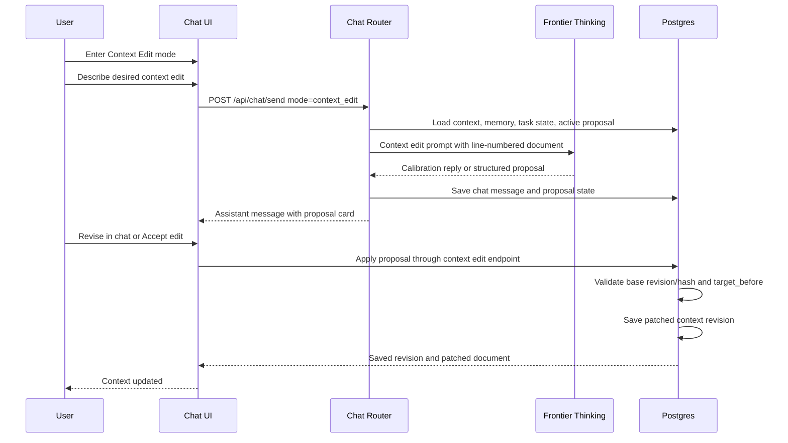

# Context Edit Chat Mode Plan

This plan is now the implementation reference for the first working Context Refine pass. The active shipped path is: Chat `+` menu activates `context_edit`, the server uses the dedicated context-edit Jobs XML prompt with structured output, proposals render inline in chat, and accepting a proposal saves a new Postgres Context revision.

The product direction is: context editing happens in Chat, in a dedicated Context Edit mode. There should not be a separate context-edit modal or a second app surface. The user is already in conversation with the system; editing the Context document should be another mode of that conversation.

The Context page remains the document editor, version browser, and PFT publish surface. Chat is where the iterative thinking and proposal generation happen.

## Product Target

The user should feel like Steve Jobs is helping edit the Context document: direct, high-standard, surgical, and focused on what deserves to remain. The experience should still be ordinary Task Node chat. It should not expose prompt machinery, provider routing, or a new workflow cockpit.

The user flow should be:

1. User clicks `+` in Chat and chooses `Context Refine`.
2. The chat composer clearly shows that the next messages are about editing the Context document.
3. The system silently loads the current Context document, line-numbered document text, memory, task state, and recent chat.
4. User describes what they want changed.
5. The assistant either asks one focused calibration question or returns one concrete edit proposal.
6. The edit proposal appears inline as a chat message card.
7. User can keep talking to revise the proposal, reject it, or click `Accept edit`.
8. `Accept edit` validates the proposal server-side, applies it to the current Context document, and saves a new Postgres context revision.
9. Chat confirms the saved revision and exits or remains in Context Edit mode based on user choice.
10. Publishing to PFT remains a separate explicit action from the Context page.

The critical distinction is `Accept edit` means the current account Context document is updated. It does not merely copy text, create a temporary draft, or require a manual paste.

## Surface Decision

Do not build a context edit modal.

The context edit interaction belongs in the existing Chat surface because the core behavior is iterative:

- user asks for an edit.
- assistant diagnoses or asks one question.
- user clarifies.
- assistant proposes a patch.
- user says "make it sharper" or "less grandiose".
- assistant revises the proposal.
- user accepts.

A modal would turn an iterative conversation into another transient workflow. That repeats the PFTasks mistake of splitting context work across too many places.

The correct product model is:

- Chat mode: thinking, critique, proposal, revision, accept.
- Context page: read, manually edit, line-numbered inspection, revision history, PFT publish.

## PFTasks Research

PFTasks contains useful reference material, but it should not be copied as product design.

Useful parts:

- `prompts/modules/context_refiner.md` used a line-numbered context document and produced structured `context_edit` proposals.
- `app/src/components/context/ContextEditReviewModal.jsx` had a concrete before/editable-after/patched-preview review pattern. In Task Node Official, this pattern should become an inline chat proposal card, not a modal.
- `api/src/routes/module_chat.js` tracked proposal state as `pending`, `accepted_pending_save`, `rejected`, and `saved`.
- `api/src/routes/__tests__/module_chat_routes.test.js` covered replace block, replace section, replace document, edited target text, rejected proposals, saved proposals, and stale proposal cases.

Problems to avoid:

- PFTasks split context AI across Module Chat tabs and standalone Context page utilities. That made the product feel like several systems fighting over the same document.
- PFTasks had separate `Refine`, `Sprint`, `Targeted Edit`, and `Full Rewrite` lanes. Task Node Official should use one Context Edit chat mode with typed internal intent, not visible lane sprawl.
- PFTasks had an accept-then-save split. This created ambiguity about whether the document actually changed.
- PFTasks relied on delayed async flows and proposal recovery behavior that could become stale if the context changed while the model was working.
- Some fallback extraction behavior tried to infer edits from prose. Task Node Official should require structured model output for proposals and fail clearly if structured output is missing.

## Recommended UX

### Entry Points

Context Edit mode can be entered from:

- Chat `+` menu: `Context Refine`.
- Context page toolbar: `Edit with chat`, which navigates to Chat with Context Edit mode active.
- Potential future keyboard command or command palette.

The primary user-facing action is `Context Refine`. Internally it activates `context_edit` mode. The entry point should not open a modal. It should switch the current chat into a typed context-edit state, keep the user in the same conversation, and change the composer into a context-edit request box.

### Chat Mode Treatment

When Context Edit mode is active:

- The composer placeholder becomes `Describe the context edit you want...`.
- A compact mode badge appears near the composer: `Context Edit`.
- The chat remains the same chat; it does not navigate to a different page, open a modal, or force a new conversation.
- The first pending assistant message says what it is doing in plain language, for example `Reading your context document`.
- The assistant uses the dedicated context-edit prompt.
- The mode remains active until the user exits it or accepts/rejects the current edit and chooses to continue normal chat.

This should feel like ChatGPT's lightweight tool state, not a new application.

### Inline Proposal Card

When a proposal exists, the assistant message should include a structured proposal card:

- Operation: replace block, replace section, append to section, replace document, or append document.
- Line range: for example `Lines 18-27`.
- Rationale: one short reason.
- Before: exact current text being replaced.
- Suggested edit: proposed replacement.
- Result preview: patched excerpt, not the whole document unless it is a full-document proposal.
- Actions: `Accept edit`, `Revise`, `Reject`.

The card should be compact by default and expandable. Long diffs need scrollable regions with stable heights so chat does not jump.

The primary button should be `Accept edit`. Avoid vague buttons like `Use as draft`, `Copy packet`, or `Apply maybe`.

### Revision Loop

The user should be able to revise the proposal by simply continuing the chat:

- "Make this less abstract."
- "Keep the trading point."
- "Do not remove the sleep constraint."
- "Now apply it."

Those follow-ups should stay attached to the active proposal thread. The model should revise the pending proposal rather than creating a second unrelated proposal unless the user asks for a different edit.

### Context Page

The Context page should still get line numbers. It should not host the assistant conversation.

The Context page should provide:

- manual editor.
- line-numbered document inspection.
- autosave state.
- revision history.
- restore historical versions.
- PFT publishing.
- a handoff button into Chat Context Edit mode.

## Line Numbers

Line numbers are product-critical because the assistant needs to point at the document in a way the user can verify.

The line-numbered view should be generated from the same normalized plain-text representation used for the model packet. The editor can remain rich text, but the model should receive:

- plain document text.
- line-numbered document text.
- body SHA-256.
- current revision.

The first implementation should treat line numbers as document lines after HTML-to-text conversion. Later, we can improve mapping to exact rich-text blocks.

Line-number rules:

- Empty lines count.
- Headings count.
- List items count individually.
- Table rows count individually after plain-text conversion.
- The server should validate `target_before` against the current document before applying an edit.

## Prompt Design

Create a prompt specifically for context editing, not a reuse of the general Jobs chat prompt.

Proposed file:

- `prompts/context/context_edit_jobs_v1.xml`

The prompt should be Jobs-calibrated but not theatrical. It should not mention Steve Jobs to the user. It should sound like a decisive editor who cares about the human and product consequences of the document.

Prompt intent:

- Preserve facts, names, numbers, dates, wallet/task state, and user commitments.
- Improve clarity, hierarchy, contradiction handling, and execution usefulness.
- Propose one edit at a time.
- Prefer surgical edits over full rewrites.
- Ask one calibration question when the edit target is ambiguous.
- Emit structured output only when a safe proposal exists.
- Revise the pending proposal when the user continues the chat with edit feedback.
- Never tell the user to paste the edit manually.
- Never expose prompt names, retrieval, model routing, or app plumbing.

Suggested output contract:

```json
{
  "response": "short user-facing reply",
  "state": "needs_calibration | proposal",
  "proposal": null | {
    "operation": "replace_block | replace_section | append_to_section | replace_document | append_document",
    "anchor_type": "line_range | heading | excerpt | document",
    "line_start": 1,
    "line_end": 4,
    "target_heading": "exact heading when applicable",
    "target_before": "exact text from the current document when applicable",
    "target_after": "replacement or appended markdown",
    "rationale": "one short reason",
    "risk": "low | medium | high"
  }
}
```

The prompt should receive these blocks:

- `CONTEXT_DOCUMENT`: current plain text.
- `CONTEXT_DOCUMENT_WITH_LINE_NUMBERS`: line-numbered text.
- `CURRENT_CONTEXT_REVISION`: current revision and body hash.
- `ACTIVE_CONTEXT_EDIT_STATE`: active proposal id, prior proposal text, and status if one exists.
- `RECENT_CHAT`: the current chat mode conversation.
- `MEMORY`: deep memory and recent memory, bounded.
- `TASK_STATE`: outstanding, pending verification, refused, and recent rewarded tasks.
- `USER_REQUEST`: the current request.

Do not include PFTasks legacy scoring matrices, color lenses, alignment essays, tactic scoring, or reward-style rationale. The product need is editing, not an audit dissertation.

## Model Selection

Context editing should bias toward correctness over speed. The user is modifying a durable personal operating document; a bad edit is worse than a slow edit.

Recommended v1:

- Use Frontier Thinking only for context edit proposal generation.
- Do not expose a four-mode provider selector inside Context Edit mode.
- The mode can show `Thinking carefully`, but should not ask the user to understand model routing.
- If Frontier Thinking is unavailable, fail clearly and keep the document unchanged.

Provider costs should be charged like ordinary user-facing chat usage unless product policy later says context editing is subsidized. The preflight estimate must include the current context document, line-numbered context, memory, task state, active proposal state, and expected output.

Private model support can come later. It is not the first implementation target because context editing needs structured reliability, long context handling, and high-quality instruction following.

## Architecture

### Proposed Frontend Pieces

- `src/features/chat/chat-modes.js`
  - Add `context_edit` mode metadata and composer text.
- `src/features/chat/ContextEditProposalCard.jsx`
  - Inline assistant-message card for proposal review.
- `src/features/context/ContextLineNumberGutter.jsx`
  - Renders stable visual line numbers on the Context page.
- `src/features/context/context-edit-client.js`
  - API calls for proposal apply, reject, and active proposal state.
- `src/features/context/context-edit-preview.js`
  - Shared client-side preview for before/after display.

The existing chat rendering path should own the conversation. The Context page should only hand off into Chat mode.

### Proposed Backend Pieces

- `server/chat-router.js`
  - Route `context_edit` mode through the context-edit prompt and Frontier Thinking provider.
- `server/context-edit-prompts.js`
  - Loads and renders `prompts/context/context_edit_jobs_v1.xml`.
- `server/context-edit-proposals.js`
  - Validates, stores, revises, rejects, and applies structured proposals.
- `server/context-line-map.js`
  - Converts stored context HTML to plain text and line-number maps.
- `server/repositories/context-edit.js`
  - Stores proposal state tied to account id and chat conversation id.

### Minimal API Shape

Prefer extending the existing chat route instead of creating a parallel message surface:

```text
POST /api/chat/send
  mode: "context_edit"

POST /api/context/edit/proposals/:proposalId/apply
POST /api/context/edit/proposals/:proposalId/reject
```

If the existing chat send route becomes too crowded, isolate the implementation behind chat-router internals, not a user-facing modal route.

### Database Shape

Keep this small:

- `context_edit_proposals`
  - id, account_id, conversation_id, assistant_message_id, base_context_revision, base_body_sha256, operation, line_start, line_end, target_before, target_after, rationale, state, created_at, updated_at, applied_at.
- Optional `context_edit_events`
  - id, proposal_id, event_type, actor_account_id, metadata_json, created_at.

Do not create a separate context-edit messages table unless the existing chat message table cannot represent the mode cleanly. The conversation should stay in chat history.

Applying a proposal should call the existing context cache write path:

- `server/repositories/context.js::saveContextDocument`

The saved revision should use a source like `context_edit_chat_mode` and provenance pointing to the conversation, assistant message, and proposal id.

### Diagram



## Async and Staleness Protections

This is the most important engineering boundary.

Every context-edit chat request must carry:

- account id.
- conversation id.
- chat mode.
- base context revision.
- base body hash.
- active proposal id, if any.
- request id.

Every proposal must carry:

- proposal id.
- account id.
- conversation id.
- assistant message id.
- base context revision.
- base body hash.
- target_before.
- line_start and line_end if available.

Before applying, the server must reload the latest context document and confirm:

- the account owns the context document.
- the proposal belongs to the signed-in account and chat conversation.
- the proposal is still pending.
- the base revision/hash matches, or a safe rebase can be performed.
- `target_before` still exists exactly where expected for block and section edits.

If validation fails, return `context_edit_stale` and render an inline stale card in chat:

- `Regenerate against latest document`
- `Open Context`
- `Cancel`

Do not apply stale proposals.

## UX Breakage Inventory

Known breakages to design out before implementation:

- The mode can be too subtle. The composer and assistant pending state must clearly show `Context Edit`.
- The user may expect ordinary chat while the mode is active. Provide an obvious way to exit context-edit mode.
- The line-number gutter can drift from contenteditable wrapping if visual rows are mistaken for document lines.
- Autosave can race with proposal apply. Applying should use server-side revision/hash validation.
- A delayed high-thinking response can arrive after the user edits the document. It must become stale, not silently apply.
- Follow-up messages can accidentally create competing proposals. While one proposal is pending, default follow-ups should revise that proposal.
- A proposal can be too large for a chat message. Full-document replacements need an expandable scrollable compare card.
- The model can return prose without structured JSON. The route should fail cleanly and ask the user to retry; do not regex a patch out of prose.
- The user can navigate away mid-run. The chat message should persist pending/failed state rather than losing the run.
- The user can have no context document. The assistant should create one only after confirming enough signal, then use `replace_document`.
- The user can be signed out. Context edit requires sign-in because it writes account context.
- The user can have no wallet. That is fine; context editing does not require a wallet.
- The user can have a locked wallet. That is fine; PFT publishing requires unlock, but context editing does not.
- The user may expect PFT history to change. It should not unless they separately click `Publish to PFT`.
- Long context documents can make model calls expensive. The preflight gate must estimate full input cost before execution.

## Implementation Phases

### Phase 0: Prompt and Contract

- Add `prompts/context/context_edit_jobs_v1.xml`.
- Add prompt docs entry under Help > Prompts.
- Add a prompt smoke test that verifies required slots and no persona disclosure language.
- Add server-side JSON schema validation for proposal output.

### Phase 1: Chat Mode and Line Numbers

- Add `context_edit` chat mode state.
- Wire the existing Chat `+` menu `Context Refine` action to activate `context_edit` mode.
- Add a Context page handoff button that switches to Chat in `context_edit` mode.
- Render line numbers in the Context page.
- Add fixture-backed inline proposal cards for local design validation.
- No production model call yet.

### Phase 2: Model Call and Proposal Card

- Wire Context Edit mode through `POST /api/chat/send`.
- Use Frontier Thinking and the context-edit Jobs prompt.
- Send current context, line-numbered context, memory, task state, active proposal state, and mode chat history.
- Render calibration replies and one proposal card.
- Let user revise, reject, or accept from chat.

### Phase 3: Apply and Save

- Add server-side apply validation.
- Apply structured proposal to latest context document.
- Save through `saveContextDocument`.
- Return the saved revision.
- Update the Context cache and chat message state immediately.

### Phase 4: Hardening

- Add stale proposal tests.
- Add active-proposal revision tests.
- Add long document tests.
- Add invalid JSON/model output tests.
- Add account ownership tests for proposal apply/reject.
- Add route smoke coverage for context edit mode and proposal card.
- Add screenshot QA on desktop and mobile.

## Done Criteria

This is done only when:

1. The Context page has visible line numbers that match the normalized model packet.
2. Clicking `+` then `Context Refine` keeps the user in Chat and visibly activates `Context Edit` mode.
3. Context Edit mode uses the dedicated context-edit Jobs prompt, not the generic chat prompt alone.
4. The assistant can ask one calibration question or return one structured proposal.
5. The proposal appears as an inline chat card with line range, before, suggested edit, patched preview, rationale, and clear actions.
6. User follow-up messages revise the active proposal unless the user starts a different edit.
7. Accept validates the proposal server-side, updates Postgres context, and updates chat state with the saved revision.
8. No wallet is required for editing.
9. PFT publishing remains separate.
10. Stale proposals cannot overwrite newer document edits.
11. The route is verified in the running app with screenshots.

## Current Implementation Snapshot

Implemented in this repo:

- `prompts/context/context_edit_jobs_v1.xml`: dedicated context editing prompt. It tells the model not to mention Steve Jobs or prompt machinery.
- `server/context-edit-chat.js`: Context Refine execution path. It forces Frontier Thinking, disables tools/web search, loads context, memory, task state, recent chat, and active proposal state, and stores chat turns.
- `server/context-edit-prompts.js`: prompt rendering and Responses API structured-output schema.
- `server/context-edit-proposals.js`: proposal parsing and server-side patch application.
- `server/repositories/context-edit.js`: `context_edit_proposals` persistence.
- `server/db/migrations/015_context_edit_proposals.sql`: Postgres proposal table.
- `src/main.jsx`: `+` menu Context Refine activation, composer mode badge, non-streaming send for structured proposal validation, and proposal apply/reject handlers.
- `src/features/context/ContextEditProposalCard.jsx`: inline proposal review card.
- `src/features/context/context-edit-client.js`: apply/reject client calls and chat turn proposal-state patching.

The remaining hardening work is richer proposal revision state, stale-card recovery buttons, and mobile screenshot QA across long full-document proposals.

## Non-Goals

- Do not build a context edit modal.
- Do not build four visible context edit tabs.
- Do not port the PFTasks Module Chat surface.
- Do not publish to PFT automatically.
- Do not add a model selector to Context Edit mode in v1.
- Do not use regex extraction as the primary patch path.
- Do not let the model emit uncontrolled full-document rewrites on first contact.
- Do not create a second unsaved context document source of truth.
