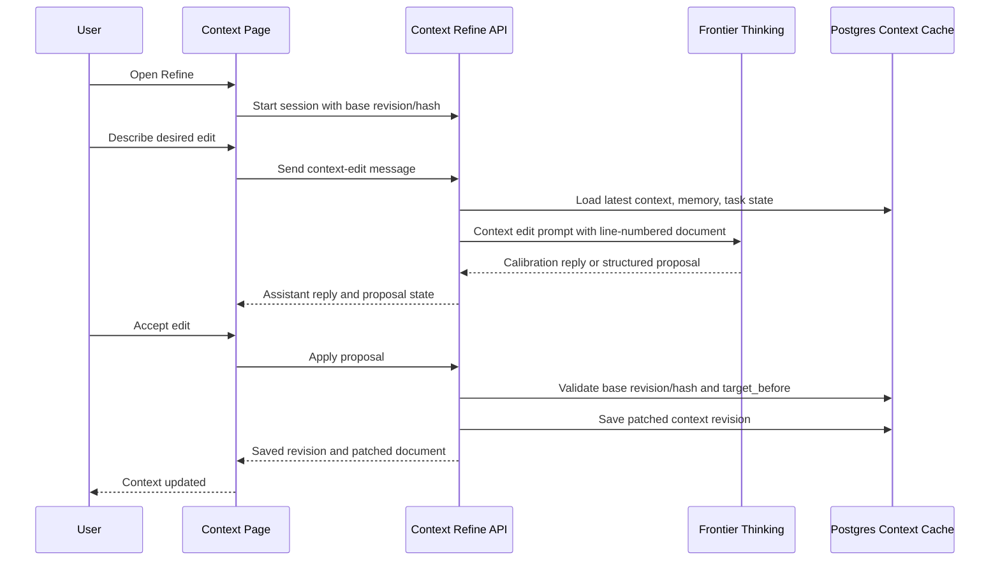

# Context Refine Jobs Editor Plan

This is a research and implementation-scope document. It is not an implemented surface yet.

The goal is one context editing experience where the user can talk through a context change, receive a precise edit proposal, review it against the current document, accept it, and have the current Context document actually change. The product should feel like Steve Jobs is helping edit the document: direct, high-standard, surgical, and focused on what deserves to remain.

This should not recreate the old PFTasks four-tab context module. Task Node Official should have one Context page and one context-edit assistant modal.

## Product Target

The Context document is the durable operating picture for the user. Editing it should feel serious, reversible, and exact.

The user flow should be:

1. User opens the Context page.
2. The document shows stable line numbers beside the editable body.
3. User opens `Refine Context`.
4. A chat-based modal opens with the current document, memory, task state, and recent chat context loaded silently.
5. User explains what they want changed.
6. The model either asks one focused calibration question or returns one concrete edit proposal.
7. The modal shows the proposed edit as a readable before/after diff with affected line numbers.
8. User can accept, ask for a revision, or reject.
9. Accept applies the edit to the current document and saves a new Postgres context revision.
10. Publishing to PFT remains a separate explicit action.

The critical distinction is `Accept edit` means the current account Context document is updated. It does not merely copy text, create a temporary draft, or require a manual paste.

## PFTasks Research

PFTasks contains useful reference material, but it should not be copied as product design.

Useful parts:

- `prompts/modules/context_refiner.md` used a line-numbered context document and produced structured `context_edit` proposals.
- `app/src/components/context/ContextEditReviewModal.jsx` had a concrete before/editable-after/patched-preview review pattern.
- `api/src/routes/module_chat.js` tracked proposal state as `pending`, `accepted_pending_save`, `rejected`, and `saved`.
- `api/src/routes/__tests__/module_chat_routes.test.js` covered replace block, replace section, replace document, edited target text, rejected proposals, saved proposals, and stale proposal cases.

Problems to avoid:

- PFTasks split context AI across Module Chat tabs and standalone Context page utilities. That made the product feel like several systems fighting over the same document.
- PFTasks had separate `Refine`, `Sprint`, `Targeted Edit`, and `Full Rewrite` lanes. Task Node Official should collapse the surface into one context-edit assistant with typed internal intent, not visible lane sprawl.
- PFTasks had an accept-then-save split. This created ambiguity about whether the document actually changed.
- PFTasks relied on delayed async flows and proposal recovery behavior that could become stale if the context changed while the model was working.
- Some fallback extraction behavior tried to infer edits from prose. Task Node Official should require structured model output for proposals and fail clearly if structured output is missing.

## Recommended UX

### Layout

Use a two-layer model:

- Context page: full document editing surface.
- Context refine modal: temporary assistant workspace for proposing one edit.

The Context page should remain calm and document-first. The modal should not look like a dashboard card. It should feel like a focused editing room.

Recommended first pass:

- The Context editor remains the full-width main surface.
- Add a left gutter with line numbers aligned to rendered text blocks.
- Add one primary action near the existing toolbar: `Refine`.
- `Refine` opens a modal centered over the page.
- The modal has two columns on desktop:
  - left: compact chat thread with the context-edit assistant.
  - right: proposal review pane when a proposal exists.
- On mobile, chat and proposal review become stacked tabs inside the modal.

### Modal States

The modal needs explicit states:

- `ready`: user can type the edit request.
- `thinking`: request is running and can be cancelled.
- `needs_calibration`: assistant asked one question; no proposal exists yet.
- `proposal_ready`: exactly one proposal exists.
- `applying`: accept clicked; server is validating and saving.
- `saved`: document was updated and context revision is known.
- `stale`: base document changed before apply; user must rebase or regenerate.
- `failed`: provider, parse, validation, or save failed with a clear recovery action.

Do not let a delayed model response silently overwrite the document. The proposal must carry the base context revision and body hash.

### Proposal Review

A proposal should show:

- Operation: replace block, replace section, append to section, replace document, or append document.
- Line range: for example `Lines 18-27`.
- Rationale: one short reason.
- Before: exact current text being replaced.
- Editable suggestion: the proposed replacement, editable by the user before accept.
- Result preview: the patched document excerpt, not the whole document unless it is a full-document proposal.
- Actions: `Accept edit`, `Revise`, `Reject`.

The primary button should be `Accept edit`. Avoid vague buttons like `Use as draft`, `Copy packet`, or `Apply maybe`.

### Line Numbers

Line numbers are product-critical because the assistant needs to point at the document in a way the user can verify.

The line-numbered view should be generated from the same normalized plain-text representation used for the model packet. The editor can remain rich text, but the model should receive:

- plain document text.
- line-numbered document text.
- body SHA-256.
- current revision.

The first implementation should treat line numbers as document lines after HTML-to-text conversion. Later, we can improve mapping to exact rich-text blocks.

Line-number rules:

- Empty lines count.
- Headings count.
- List items count individually.
- Table rows count individually after plain-text conversion.
- The server should validate `target_before` against the current document before applying an edit.

## Prompt Design

Create a prompt specifically for context editing, not a reuse of the general Jobs chat prompt.

Proposed file:

- `prompts/context/context_edit_jobs_v1.xml`

The prompt should be Jobs-calibrated but not theatrical. It should not mention Steve Jobs to the user. It should sound like a decisive editor who cares about the human and product consequences of the document.

Prompt intent:

- Preserve facts, names, numbers, dates, wallet/task state, and user commitments.
- Improve clarity, hierarchy, contradiction handling, and execution usefulness.
- Propose one edit at a time.
- Prefer surgical edits over full rewrites.
- Ask one calibration question when the edit target is ambiguous.
- Emit structured output only when a safe proposal exists.
- Never tell the user to paste the edit manually.
- Never expose prompt names, retrieval, model routing, or app plumbing.

Suggested output contract:

```json
{
  "response": "short user-facing reply",
  "state": "needs_calibration | proposal",
  "proposal": null | {
    "operation": "replace_block | replace_section | append_to_section | replace_document | append_document",
    "anchor_type": "line_range | heading | excerpt | document",
    "line_start": 1,
    "line_end": 4,
    "target_heading": "exact heading when applicable",
    "target_before": "exact text from the current document when applicable",
    "target_after": "replacement or appended markdown",
    "rationale": "one short reason",
    "risk": "low | medium | high"
  }
}
```

The prompt should receive these blocks:

- `CONTEXT_DOCUMENT`: current plain text.
- `CONTEXT_DOCUMENT_WITH_LINE_NUMBERS`: line-numbered text.
- `CURRENT_CONTEXT_REVISION`: current revision and body hash.
- `RECENT_CHAT`: the current chat or modal conversation.
- `MEMORY`: deep memory and recent memory, bounded.
- `TASK_STATE`: outstanding, pending verification, refused, and recent rewarded tasks.
- `USER_REQUEST`: the current request.

Do not include PFTasks legacy scoring matrices, color lenses, alignment essays, tactic scoring, or reward-style rationale. The product need is editing, not an audit dissertation.

## Model Selection

Context editing should bias toward correctness over speed. The user is modifying a durable personal operating document; a bad edit is worse than a slow edit.

Recommended v1:

- Use Frontier Thinking only for context edit proposal generation.
- Do not expose a four-mode provider selector inside the modal.
- The modal can say `Thinking carefully` while running, but should not ask the user to understand model routing.
- If Frontier Thinking is unavailable, fail clearly and keep the document unchanged.

Provider costs should be charged like ordinary user-facing chat usage unless product policy later says context editing is subsidized. The preflight estimate must include the current context document, line-numbered context, memory, task state, and expected output.

Private model support can come later. It is not the first implementation target because context editing needs structured reliability, long context handling, and high-quality instruction following.

## Architecture

### Proposed Frontend Pieces

- `src/features/context/ContextEditor.jsx`
  - Future extraction target for the current inline `ContextView`.
- `src/features/context/ContextLineNumberGutter.jsx`
  - Renders stable visual line numbers from normalized text.
- `src/features/context/ContextRefineModal.jsx`
  - Chat thread, proposal review, and apply flow.
- `src/features/context/context-edit-client.js`
  - API calls for start, send, apply, reject, and cancel.
- `src/features/context/context-edit-preview.js`
  - Shared client-side preview for before/after display.

### Proposed Backend Pieces

- `server/context-edit-routes.js`
  - Routes for context-edit sessions, messages, proposals, apply, reject, and cancel.
- `server/context-edit-worker.js`
  - Optional async worker if model calls need to survive navigation.
- `server/context-edit-prompts.js`
  - Loads and renders `prompts/context/context_edit_jobs_v1.xml`.
- `server/context-edit-proposals.js`
  - Validates and applies structured proposals.
- `server/context-line-map.js`
  - Converts stored context HTML to plain text and line-number maps.

### Minimal API Shape

```text
POST /api/context/refine/sessions
POST /api/context/refine/sessions/:sessionId/messages
POST /api/context/refine/proposals/:proposalId/apply
POST /api/context/refine/proposals/:proposalId/reject
POST /api/context/refine/sessions/:sessionId/cancel
```

For v1, messages can be synchronous if the route reliably returns within product tolerances. If high-thinking calls are consistently slow, use a durable job row and poll or stream status. Do not fake async by leaving the user on a spinner with no state.

### Database Shape

Keep this small:

- `context_edit_sessions`
  - id, account_id, base_context_revision, base_body_sha256, status, created_at, updated_at.
- `context_edit_messages`
  - id, session_id, role, body, provider_response_id, usage_json, created_at.
- `context_edit_proposals`
  - id, session_id, base_context_revision, base_body_sha256, operation, line_start, line_end, target_before, target_after, rationale, state, created_at, applied_at.

Applying a proposal should call the existing context cache write path:

- `server/repositories/context.js::saveContextDocument`

The saved revision should use a source like `context_refine_jobs_editor` and provenance pointing to the session and proposal id.

### Diagram



## Async and Staleness Protections

This is the most important engineering boundary.

Every model request must carry:

- account id.
- session id.
- base context revision.
- base body hash.
- request id.

Every proposal must carry:

- proposal id.
- base context revision.
- base body hash.
- target_before.
- line_start and line_end if available.

Before applying, the server must reload the latest context document and confirm:

- the account owns the context document.
- the proposal is still pending.
- the base revision/hash matches, or a safe rebase can be performed.
- `target_before` still exists exactly where expected for block and section edits.

If validation fails, return `context_edit_stale` and show a rebase screen:

- `Regenerate against latest document`
- `Show latest document`
- `Cancel`

Do not apply stale proposals.

## UX Breakage Inventory

Known breakages to design out before implementation:

- The line-number gutter can drift from contenteditable wrapping if visual rows are mistaken for document lines.
- Autosave can race with proposal apply. Applying should use server-side revision/hash validation.
- A delayed high-thinking response can arrive after the user edits the document. It must become stale, not silently apply.
- Multiple modal sessions can propose conflicting edits. Only one pending proposal should be active per session; applying must validate against latest state.
- A proposal can be too large for a modal. Full-document replacements need a dedicated scrollable compare view.
- The model can return prose without structured JSON. The route should fail cleanly and ask the user to retry; do not regex a patch out of prose.
- The user can navigate away mid-run. Either persist the session or cancel it clearly.
- The user can have no context document. The assistant should create one only after confirming enough signal, then use `replace_document`.
- The user can be signed out. Context edit requires sign-in because it writes account context.
- The user can have no wallet. That is fine; context editing does not require a wallet.
- The user can have a locked wallet. That is fine; PFT publishing requires unlock, but context editing does not.
- The user may expect PFT history to change. It should not unless they separately click `Publish to PFT`.
- Long context documents can make model calls expensive. The modal must show usage estimates and hard failure if the prompt would exceed configured limits.

## Implementation Phases

### Phase 0: Prompt and Contract

- Add `prompts/context/context_edit_jobs_v1.xml`.
- Add prompt docs entry under Help > Prompts.
- Add a prompt smoke test that verifies required slots and no persona disclosure language.
- Add server-side JSON schema validation for proposal output.

### Phase 1: Line Numbers and One Modal

- Extract line-number normalization from the context editor.
- Render line numbers in the Context page.
- Add `Refine` action that opens the modal.
- Modal can accept a user request and show a mock proposal from a fixture only for local design validation.
- No production model call yet.

### Phase 2: Model Call and Proposal Review

- Wire Frontier Thinking through a context-edit route.
- Send current context, line-numbered context, memory, task state, and modal history.
- Render calibration replies and one proposal.
- Let user revise or reject.
- Keep all proposal state explicit.

### Phase 3: Apply and Save

- Add server-side apply validation.
- Apply structured proposal to latest context document.
- Save through `saveContextDocument`.
- Return the saved revision.
- Update the editor immediately from the saved document.

### Phase 4: Hardening

- Add stale proposal tests.
- Add concurrent session tests.
- Add long document tests.
- Add invalid JSON/model output tests.
- Add route smoke coverage for line numbers and modal open/close.
- Add screenshot QA on desktop and mobile.

## Done Criteria

This is done only when:

1. The Context page has visible line numbers that match the normalized model packet.
2. The user can open one context-edit assistant modal from the Context page.
3. The assistant uses the dedicated context-edit Jobs prompt, not the generic chat prompt alone.
4. The assistant can ask one calibration question or return one structured proposal.
5. The proposal review shows line range, before, editable suggestion, patched preview, rationale, and clear actions.
6. Accept validates the proposal server-side, updates Postgres context, and refreshes the editor with the saved revision.
7. No wallet is required for editing.
8. PFT publishing remains separate.
9. Stale proposals cannot overwrite newer document edits.
10. The route is verified in the running app with screenshots.

## Non-Goals

- Do not build four visible context edit tabs.
- Do not port the PFTasks Module Chat surface.
- Do not publish to PFT automatically.
- Do not add a model selector to the modal in v1.
- Do not use regex extraction as the primary patch path.
- Do not let the model emit uncontrolled full-document rewrites on first contact.
- Do not create a second unsaved context document source of truth.
