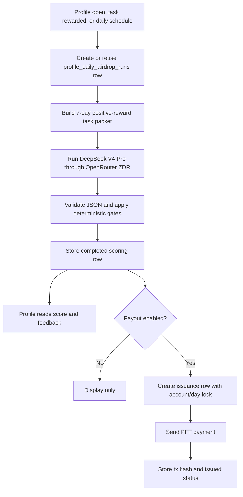

# Daily Airdrop Migration Plan

Status: deprecated implemented v1 plan. Current product truth lives in `Surfaces -> Daily Airdrop`, `Surfaces -> Profile`, and `Architecture -> Daily Airdrop Worker`.

Source references: PFTasks daily airdrop code was reviewed as historical reference only. This plan is for Task Node Official.

## Objective

Replace profile-page daily airdrop vapor with a simple, inspectable daily scoring and payout path.

The first Task Node Official version should answer four profile questions:

1. What was today's proposed drop?
2. What raised it?
3. What kept it lower?
4. What should the user improve tomorrow?

The model should be `deepseek/deepseek-v4-pro` through OpenRouter private routing with ZDR enabled. The prompt can be public. The evidence packet should be only a task reward packet: tasks rewarded with more than 0 PFT from the current timestamp minus 7 days through the current timestamp.

Current Task Node Official status: scoring, profile display, live issuance, retryable issuance rows, the recurring worker, and zero-candidate audit runs are implemented. This page is retained as migration history for the PFTasks research and design constraints.

## PFTasks Research

PFTasks does the daily drop in two separate phases.

### 1. Daily Profile Scoring

PFTasks prompt:

- `/home/pfrpc/repos/pftasks/prompts/profile/profile_daily_airdrop.md`
- prompt name: `profile-daily-airdrop`
- model in that repo: `openai/gpt-5.5`
- output fields include `weekly_basis_pft`, `retention_value_score`, `what_helped`, `what_limited`, `next_focus`, `eligibility_status`, `justification_blurb`, and `reasoning_text`.

PFTasks worker:

- `/home/pfrpc/repos/pftasks/worker/src/jobs/profile_field/execution_alignment.js`

The daily airdrop score is embedded in the old profile/alignment execution path. PFTasks built a broad profile evidence packet from task/reward data plus other account, identity, activity, and anti-abuse signals.

Task Node Official should not port the broad profile packet. The useful part is the separation between task-derived scoring, deterministic post-processing, cached profile output, and delayed payout issuance.

After the LLM returns JSON, PFTasks applies deterministic code gates:

- if there is no eligible rewarded work in the trailing 7 days, the result becomes 0 PFT;
- the score is clamped to the max daily payout;
- the score is stability-clamped against the prior day;
- parsed output is stored as a `profile_runs` row with `field = 'daily_airdrop'`.

### 2. Delayed Issuance

PFTasks issuance table:

- `/home/pfrpc/repos/pftasks/api/migrations/097_daily_airdrop_issuances.sql`
- later uniqueness guard: `/home/pfrpc/repos/pftasks/api/migrations/118_daily_airdrop_user_day_uniqueness.sql`

The issuance table stores:

- `run_id`
- `user_id`
- `wallet_id`
- `wallet_address`
- `amount_pft`
- `status`
- `tx_hash`
- `justification_blurb`
- `reasoning_text`
- `scoring_version`
- `payout_snapshot`
- `metadata`
- `environment`
- timestamps

PFTasks issuance worker:

- `/home/pfrpc/repos/pftasks/worker/src/lib/daily_airdrop_issuance.js`
- `/home/pfrpc/repos/pftasks/worker/src/jobs/daily_airdrop_issue.js`

Important behavior:

- resolves the user's primary active wallet;
- dedupes by user and UTC day, not wallet and day;
- uses a Postgres advisory lock per user/day;
- skips if the user has already been issued, skipped, or dry-run for that day;
- inserts `processing` before live payment;
- reclaims stale processing rows;
- pays PFT through the reward wallet service only after a completed scoring snapshot exists.

PFTasks scheduler:

- `/home/pfrpc/repos/pftasks/worker/src/lib/profile_daily_scheduler.js`

The scheduler enqueues the daily airdrop profile field and then schedules `daily_airdrop_issue` about one hour after a completed daily airdrop profile run.

## What To Keep

Task Node Official should keep these architectural boundaries:

- scoring is separate from issuance;
- scoring is account-scoped;
- payout is wallet-targeted;
- issuance dedupes by account/day;
- payout recipient selection is account-scoped through the identity wallet cloud, not one row per wallet;
- model output is validated and bounded by deterministic code;
- profile UI reads Postgres cache, not live model output;
- actual PFT payment has its own worker, lock, row state, and tx hash.

## Reward Pool Architecture

Current local/dev observation:

- The running API container has no `TASKNODE_REWARD_SEED`, `TASKNODE_ALLOCATION_SEED`, `TASKNODE_AUTHORITY_SEED`, `TASKNODE_SERVICE_SEED`, or `TASKNODE_PFT_FAUCET_SEED` set.
- It does have `FAUCET_SEED` set, whose public address is `rwdm72S9YVKkZjeADKU2bbUMuY4vPnSfH7`.
- It also has a 10-wallet `REWARD_WALLET_SEEDS` pool configured, but the current JavaScript task review worker does not consume that pool. The current task reward worker resolves a single reward seed through `TASKNODE_REWARD_SEED`, then allocation/authority/service/faucet fallbacks.

The daily airdrop implementation should not use the faucet fallback as the canonical funding wallet. It should use the same basic concept as a reward wallet pool, with explicit wallet roles and accounting tags.

Recommended reward-pool roles:

| Role | Purpose | Hot path? |
| --- | --- | --- |
| `treasury` | Top up pool wallets. Operator-controlled. | No |
| `task_reward` | Pays task-specific rewards. | Yes |
| `daily_airdrop` | Pays daily airdrops. | Yes |

V1 can start with one `daily_airdrop` reward-pool wallet on testnet, but it must be stored and tagged as `daily_airdrop`, not as a generic faucet. Production should support multiple daily-airdrop pool wallets because PFTL signing is synchronous per wallet.

Proposed tables:

```text
reward_pool_wallets
  id
  wallet_address
  role treasury | task_reward | daily_airdrop
  shard_key
  status active | paused | draining | retired
  secret_ref
  target_balance_pft
  min_balance_pft
  last_known_balance_pft
  last_used_at
  created_at
  updated_at

reward_pool_assignments
  account_id
  wallet_address
  role task_reward | daily_airdrop
  shard_key
  status active | paused | retired
  created_at
  updated_at
```

Only public wallet addresses and secret references belong in Postgres. Seeds remain in the operator secret store. `REWARD_WALLET_SEEDS` can seed the initial pool, but the runtime should resolve by `role`, not by "first seed available."

Funding-wallet selection rule for a daily drop:

1. If the account already has an active `daily_airdrop` assignment, use that wallet.
2. If not, choose an active `daily_airdrop` pool wallet by shard key or lowest recent load.
3. Create `reward_pool_assignments(account_id, role = 'daily_airdrop', wallet_address, shard_key)`.
4. Use that assigned wallet for future daily drops unless it is paused or retired.
5. If a wallet is paused, stop new assignments but allow already-processing rows to finish or be reconciled.

This gives stable accounting per user and avoids a single central wallet sequence bottleneck.

### Identity Cloud Recipient Rule

The daily airdrop is one award per identity cloud. A GitHub/X/Telegram/account identity can accumulate multiple PFT wallets over time through link, relink, and delink events, but the daily score remains keyed by `account_id` and `run_date`.

Recipient wallet selection is deterministic:

1. Build the identity wallet cloud from the account's active linked wallet and wallet auth history.
2. Exclude wallets currently claimed by another active app account.
3. Rank eligible identity wallets by all-time task count in `task_projections`.
4. Break ties by rewarded task count, total rewarded PFT, most recent task update, then active linked wallet.
5. If no identity wallet has task history, use the active linked wallet.
6. If the identity cloud has no eligible wallet, score can still run but live issuance must be skipped.

This prevents airdrop farming across relinked wallets and prevents Task Node authority/funding wallets from being accidentally selected just because they appear in task replay rows. The selected recipient is stored in the scoring snapshot under `airdrop_recipient`.

### Ex Post Tagging

Every production daily drop should be traceable through both Postgres and chain replay.

Postgres tags:

- `program = 'daily_airdrop'`
- `run_mode = 'production'`
- `run_date`
- `airdrop_run_id`
- `issuance_id`
- `account_id`
- `recipient_wallet_address`
- `funding_wallet_address`
- `reward_pool_role = 'daily_airdrop'`
- `reward_pool_wallet_id`
- `amount_pft`
- `tx_hash`
- `pointer_cid`
- `idempotency_key`
- `prompt_version`
- `input_hash`
- `scoring_version = 'daily_airdrop_v1'`

PFTL tags:

- Payment signer: `daily_airdrop` reward-pool wallet
- Payment destination: selected identity-cloud recipient wallet
- Pointer kind: existing `REWARD`
- Encrypted IPFS payload schema: `pf.airdrop.daily.v1`
- Pointer memo: existing `pf.ptr` / `v4` format

Daily airdrop payload shape:

```json
{
  "schema": "pf.airdrop.daily.v1",
  "protocol": "tasknode.pftl",
  "program": "daily_airdrop",
  "run_mode": "production",
  "run_date": "2026-05-21",
  "airdrop_run_id": "uuid",
  "issuance_id": "uuid",
  "account_id": "account_...",
  "recipient_wallet_address": "r...",
  "recipient_selection_basis": "identity_cloud_all_time_task_count",
  "funding_wallet_address": "r...",
  "reward_pool_role": "daily_airdrop",
  "reward_pool_wallet_id": "uuid",
  "amount_pft": "1200",
  "idempotency_key": "daily_airdrop:account_...:2026-05-21:production",
  "lookback": {
    "from": "2026-05-14T15:12:00.000Z",
    "to": "2026-05-21T15:12:00.000Z"
  },
  "alignment": {
    "actual_airdrop_pft_7d": "8400",
    "max_possible_airdrop_pft_7d": "70000",
    "alignment_score_7d": "0.12"
  },
  "decision": {
    "what_raised_today": "string",
    "what_kept_it_lower": "string",
    "to_improve_tomorrow": "string",
    "reasoning_text": "string"
  },
  "prompt_version": "daily_airdrop_v1",
  "input_hash": "sha256:..."
}
```

This gives three audit routes:

1. Profile UI reads `profile_daily_airdrop_runs` and `profile_daily_airdrop_issuances`.
2. Operator queries `program = 'daily_airdrop'` rows by account, wallet, date, amount, or tx hash.
3. A replay client scans `REWARD` pointers and filters decrypted payloads where `schema = 'pf.airdrop.daily.v1'`.

## What To Remove

Do not port the full PFTasks machinery.

Remove from v1:

- PFTasks legacy alignment theory;
- identity/provider metrics;
- anti-abuse scoring as a large dependency;
- complex retention theory;
- prior profile field fan-out;
- broad hidden profile jobs before the daily drop works.

Task Node Official should use the task engine as the primary evidence source.

## Proposed Task Node Official V1

### Product Contract

The daily airdrop is a private profile scoring job that reviews the user's recent positive-reward task packet and produces a simple daily read.

Simplifying heuristic: how much would a crypto network rationally pay today to retain this actor as a community member and contributor, based only on the positive-reward tasks they completed in the last 7 days?

It should display:

- today's drop: integer PFT amount;
- 7-day alignment score: actual airdrop received divided by the maximum possible 7-day airdrop;
- `what_raised_today`;
- `what_kept_it_lower`;
- `to_improve_tomorrow`;
- eligibility status and reason;
- scoring time;
- optional issuance status once payout is enabled.

The profile page must never show a fake generated value. If no run exists, show a plain empty state: "No daily drop has been computed today."

### Derived Alignment Score

Alignment score is not an LLM output. It is a deterministic rolling metric derived from daily airdrop outcomes.

Formula:

```text
alignment_score_7d = actual_airdrop_pft_7d / max_possible_airdrop_pft_7d

actual_airdrop_pft_7d = sum of daily airdrop PFT actually received in the trailing 7-day window
max_possible_airdrop_pft_7d = sum of each counted daily airdrop run's max possible amount
```

This is a run-window denominator, not a blind calendar denominator. If only one dry-run score exists and its `max_daily_pft = 10000`, the denominator is `10000 PFT`. If seven production scores exist and each had `max_daily_pft = 10000`, the denominator is `70000 PFT`.

Example:

```text
actual_airdrop_pft_7d = 5500
max_possible_airdrop_pft_7d = 10000
alignment_score_7d = 5500 / 10000 = 55%
```

During scoring-only phase, "actually received" means the completed daily airdrop score stored for that day. Once live issuance is enabled, "actually received" means issued PFT from `profile_daily_airdrop_issuances`. If an issuance fails, the failed amount does not count as received.

Store or return the numerator and denominator with the displayed score so the user can understand the metric:

```json
{
  "alignment_score_7d": 0.12,
  "alignment_score_7d_percent": 12,
  "actual_airdrop_pft_7d": 8400,
  "max_possible_airdrop_pft_7d": 70000
}
```

### Task Reward Packet

Build the model packet from Postgres task projections and task event forensics. The lookback window is current timestamp minus 7 days through current timestamp. Include only task outcomes with `reward_paid_pft > 0` where `subject_wallet` belongs to the account's identity wallet cloud.

```json
{
  "account_id": "account_...",
  "computed_at": "2026-05-21T15:12:00.000Z",
  "lookback": {
    "from": "2026-05-14T15:12:00.000Z",
    "to": "2026-05-21T15:12:00.000Z"
  },
  "reward_totals": {
    "rewarded_task_count": 1,
    "total_reward_paid_pft": 2.4
  },
  "identity_cloud": {
    "account_id": "account_...",
    "active_wallet_address": "r...",
    "eligible_wallet_count": 2,
    "eligible_wallets": [
      {
        "address": "r...",
        "status": "linked",
        "sources": ["active_link", "wallet_linked"],
        "linked_at": "2026-05-21T15:12:00.000Z",
        "updated_at": "2026-05-21T15:12:00.000Z"
      }
    ]
  },
  "airdrop_recipient": {
    "wallet_address": "r...",
    "selection_status": "selected",
    "selection_basis": "identity_cloud_all_time_task_count",
    "selected_active_wallet": true,
    "task_count": 20,
    "rewarded_task_count": 12,
    "reward_paid_pft": 20.45,
    "last_task_at": "2026-05-21T15:12:00.000Z",
    "candidate_wallet_count": 2
  },
  "rewarded_tasks": [
    {
      "task_id": "task_...",
      "subject_wallet": "r...",
      "title": "Fix timestamp rendering",
      "kind": "engineering",
      "status": "rewarded",
      "reward_offer_pft": 2.5,
      "reward_paid_pft": 2.4,
      "reward_decision": "partial_reward",
      "reward_reason": "Short verifier summary",
      "evidence_quality": 84,
      "completion_score": 90,
      "rewarded_at": "2026-05-21T15:12:00.000Z",
      "event_cids": ["Qm..."],
      "tx_hashes": ["ABC..."]
    }
  ],
  "daily_airdrop_policy": {
    "max_daily_pft": 10000,
    "network_value_heuristic": "How much would a crypto network rationally pay today to retain this actor as a community member and contributor?",
    "no_work_rule": "zero_if_no_positive_rewarded_task_in_lookback",
    "scoring_version": "daily_airdrop_v1"
  }
}
```

The packet should be compact. Do not send raw evidence blobs unless a task summary is insufficient. The drop should be based on what the user actually shipped, how much reward they received, and how the task authority scored it.

### Provider Policy

Use the existing OpenRouter private-provider pattern:

- model: `deepseek/deepseek-v4-pro`;
- temperature: `0`;
- structured JSON output;
- provider routing: `zdr = true`;
- provider data collection: `deny`;
- no user billing in v1;
- store provider, model, prompt version, and input hash on the run row.

OpenRouter's provider routing docs support per-request ZDR enforcement through `provider.zdr = true`; the docs also expose data policy filtering with `data_collection = "deny"`. Implementation should verify at runtime that the selected provider route satisfies those constraints.

### Prompt Contract

Runtime prompt file:

- `prompts/profile/daily_airdrop_v1.md`

The prompt should be public and short. It should not include PFTasks alignment language.

System prompt shape:

```text
You are the Task Node daily airdrop reviewer.

Read the supplied task reward packet and decide today's private daily drop.
Use only the supplied task reward packet. The simplifying heuristic is:
how much would a crypto network rationally pay today to retain this actor
as a community member and contributor?

Reward concrete paid work, useful shipped artifacts, clear task follow-through,
and high-quality verification outcomes. Lower the score when rewarded work is narrow,
replaceable, weakly evidenced, or does not create visible product/network value.

If the task reward packet contains no task with reward_paid_pft > 0 in the lookback
window, return 0 PFT and mark the user ineligible.

Return one JSON object only:
{
  "daily_airdrop_pft": <integer 0-10000>,
  "retention_value_score": <integer 0-100>,
  "what_raised_today": "<1 sentence>",
  "what_kept_it_lower": "<1 sentence>",
  "to_improve_tomorrow": "<1 sentence>",
  "eligibility_status": "eligible" | "ineligible",
  "eligibility_reason": "<string or null>",
  "reasoning_text": "<short paragraph grounded in the task evidence>"
}
```

Runtime user prompt blocks:

```text
Daily airdrop policy:
___DAILY_AIRDROP_POLICY_REPLACED_HERE___

Task reward packet:
___TASK_REWARD_PACKET_REPLACED_HERE___
```

### Deterministic Post-Processing

Model output is advice, not authority. Code must enforce:

- JSON schema validation;
- integer `daily_airdrop_pft` from `0` to `10000`;
- integer `retention_value_score` from `0` to `100`;
- no `reward_paid_pft > 0` task in the 7-day lookback packet means 0 PFT;
- one scored airdrop per identity cloud account, not per wallet;
- recipient wallet is selected from the account wallet cloud by task count and stored on the scoring snapshot;
- one production scoring row per account per UTC day unless explicitly regenerated by an operator;
- repeated dry-run scoring rows are allowed and must be marked non-canonical;
- one production issuance row per account per UTC day;
- no live issuance if the scoring snapshot has no selected identity-cloud recipient wallet;
- no issuance if scoring row is missing, failed, stale, or ineligible.

Do not enforce semantic product choices with regex. Use schema validation for structure and the model prompt for judgment.

## Proposed Database

### `profile_daily_airdrop_runs`

Purpose: account-scoped daily scoring cache.

Columns:

- `id`
- `account_id`
- `run_date`
- `run_mode`: `dry_run`, `production`
- `scenario_id`
- `is_canonical`
- `status`: `pending`, `running`, `completed`, `failed`
- `daily_airdrop_pft`
- `retention_value_score`
- `what_raised_today`
- `what_kept_it_lower`
- `to_improve_tomorrow`
- `eligibility_status`
- `eligibility_reason`
- `reasoning_text`
- `actual_airdrop_pft_7d`
- `max_possible_airdrop_pft_7d`
- `alignment_score_7d`
- `input_hash`
- `input_snapshot`
- `output_json`
- `provider`
- `model`
- `prompt_version`
- `prompt_digest`
- `error_message`
- `created_at`
- `updated_at`
- `completed_at`

Indexes:

- unique `(account_id, run_date)` where `run_mode = 'production'`;
- `(account_id, run_mode, created_at desc)`;
- `(account_id, created_at desc)`;
- `(status, created_at)`.

### `profile_daily_airdrop_issuances`

Purpose: live PFT payment state.

Columns:

- `id`
- `airdrop_run_id`
- `account_id`
- `run_date`
- `run_mode`: `dry_run`, `production`
- `program`: `daily_airdrop`
- `recipient_wallet_address`
- `recipient_selection_basis`
- `funding_wallet_address`
- `reward_pool_wallet_id`
- `reward_pool_role`: `daily_airdrop`
- `idempotency_key`
- `amount_pft`
- `status`: `pending`, `processing`, `issued`, `skipped`, `failed`, `dry_run`
- `tx_hash`
- `pointer_cid`
- `payload_hash`
- `skip_reason`
- `metadata`
- `created_at`
- `updated_at`
- `issued_at`

Indexes:

- unique `(account_id, run_date)` where `run_mode = 'production'`;
- unique `(idempotency_key)` where `run_mode = 'production'`;
- `(account_id, run_mode, created_at desc)`;
- `(recipient_wallet_address, created_at desc)`;
- `(funding_wallet_address, status, created_at)`;
- `(status, created_at)`.

### `reward_pool_wallets`

Purpose: shared funding pool for task rewards and daily airdrops.

Columns:

- `id`
- `wallet_address`
- `role`: `treasury`, `task_reward`, `daily_airdrop`
- `shard_key`
- `status`: `active`, `paused`, `draining`, `retired`
- `secret_ref`
- `target_balance_pft`
- `min_balance_pft`
- `last_known_balance_pft`
- `last_used_at`
- `created_at`
- `updated_at`

Indexes:

- unique `(wallet_address)`;
- `(role, status, shard_key)`;
- `(role, last_used_at)`.

### `reward_pool_assignments`

Purpose: stable account-to-wallet routing by reward program.

Columns:

- `account_id`
- `role`: `task_reward`, `daily_airdrop`
- `wallet_address`
- `shard_key`
- `status`: `active`, `paused`, `retired`
- `created_at`
- `updated_at`

Indexes:

- unique `(account_id, role)` where `status = 'active'`;
- `(wallet_address, role, status)`.

## Runtime Jobs

Daily airdrop should run as small explicit jobs, not as profile-page side effects.

| Job | Mode | Responsibility | Writes |
| --- | --- | --- | --- |
| `daily_airdrop_score` | `dry_run` or `production` | Build 7-day positive-reward task packet, call DeepSeek V4 Pro, validate output, compute alignment numerator/denominator. | `profile_daily_airdrop_runs` |
| `daily_airdrop_issue` | `dry_run` or `production` | Convert a completed scoring row into either a dry-run issuance row or a real payment. | `profile_daily_airdrop_issuances`, PFTL payment only in production live mode |
| `daily_airdrop_reconcile` | `production` | Recheck stale `processing` rows against PFTL/cache before any retry can sign again. | existing issuance row |
| `reward_pool_topup` | `production` | Keep `daily_airdrop` pool wallets above `min_balance_pft` from treasury. | pool wallet balance metadata and treasury tx rows |

The normal daily schedule should be:

1. Run `daily_airdrop_score` for active accounts.
2. After scoring completes, enqueue `daily_airdrop_issue`.
3. Run `daily_airdrop_reconcile` on stale `processing` rows before regular issue retries.
4. Run `reward_pool_topup` independently; top-ups are not in the user-facing payment path.

Manual testing should call the same jobs with `run_mode = 'dry_run'` and a `scenario_id`. It should not call a separate fake path.

## No-Double-Pay Invariants

Daily airdrops need to tolerate retries, worker crashes, slow RPC responses, and operator dry-runs without accidentally sending twice.

Required invariants:

1. `profile_daily_airdrop_runs` has only one canonical production scoring row per account/day.
2. `profile_daily_airdrop_issuances` has only one production issuance row per account/day.
3. Every production issuance has a deterministic `idempotency_key`: `daily_airdrop:<account_id>:<run_date>:production`.
4. Payment workers must claim the issuance row before opening the funding wallet.
5. Each funding wallet has an advisory lock so only one process signs from that wallet at a time.
6. A row in `issued`, `skipped`, or `processing` is not replaced by a new row.
7. A retry operates on the existing issuance row, not a new issuance row.
8. If a submit times out after signing, the worker reconciles by `idempotency_key`, `payload_hash`, funding wallet, destination wallet, and amount before resubmitting.
9. A successful payment writes `tx_hash`, `pointer_cid`, `issued_at`, and `status = 'issued'`.
10. Alignment-score numerator counts only `issued` production rows once live issuance is enabled.

Worker sequence:

```text
1. Acquire account/day advisory lock.
2. Read canonical production scoring row.
3. If no active wallet or amount <= 0, insert or update issuance as skipped.
4. Insert issuance row with status pending using the production unique key.
5. Claim same row by changing status pending -> processing.
6. Resolve or create account assignment for role daily_airdrop.
7. Acquire funding-wallet advisory lock.
8. Build encrypted pf.airdrop.daily.v1 payload and compute payload_hash.
9. Before signing, check whether this issuance row already has tx_hash.
10. Submit PFT payment plus REWARD pointer from funding wallet.
11. On success, write tx_hash, pointer_cid, issued_at, status issued.
12. On timeout, leave status processing with enough metadata for reconciliation.
13. Reconciliation checks chain/cache before any retry can sign again.
```

Failure behavior:

- `skipped`: terminal, no wallet, no eligible amount, or explicit operator skip.
- `failed`: terminal only after reconciliation proves no payment happened and retry budget is exhausted.
- `processing`: non-terminal. It can be reclaimed after a stale threshold only by a worker that first checks the chain/cache for an existing matching payment.
- `dry_run`: never blocks production because `run_mode = 'dry_run'` is outside production uniqueness.

## Run Modes And Test Strategy

Use two explicit modes.

### Dry Run

Dry run is for repeated testing. It should use the real task reward packet, real DeepSeek V4 Pro prompt, real JSON validation, real database writes, and real profile rendering. It must not send PFT.

Dry-run behavior:

- `run_mode = 'dry_run'`;
- may be run repeatedly for the same account and same day;
- stores a `scenario_id` or generated test id for comparison;
- writes `profile_daily_airdrop_runs`;
- optionally writes `profile_daily_airdrop_issuances` with `status = 'dry_run'`;
- never opens the reward wallet;
- never submits a PFTL payment;
- never changes the production canonical daily row unless an operator explicitly promotes it.

Use dry runs for:

- prompt iteration;
- comparing multiple task reward packets;
- local Docker testing;
- Fly dev testing;
- checking no-work, weak-work, strong-work, and zero-reward scenarios.

### Production Run

Production run is the canonical daily drop path. It must be idempotent.

Production behavior:

- `run_mode = 'production'`;
- one canonical scoring row per account per UTC day;
- one issuance row per account per UTC day;
- one deterministic `idempotency_key` per account/day;
- acquires an account/day advisory lock before issuance row creation or claim;
- acquires a funding-wallet advisory lock before signing any PFTL payment;
- skips if production issuance is already `issued`, `skipped`, or `processing` for that account/day;
- retries operate on the existing issuance row and reconcile chain/cache before signing again;
- sends PFT only when live issuance is enabled and the scoring row is completed, eligible, positive, and attached to an active linked wallet;
- stores the payment transaction hash after submit.

Testing sequence:

1. Run dry-run scoring against fixture packets until prompt output is stable.
2. Run dry-run scoring against a real account's 7-day task reward packet.
3. Run dry-run issuance and confirm the profile panel explains the amount without a tx hash.
4. Run production scoring with live issuance disabled and confirm the canonical row.
5. Run production live issuance for a small amount on testnet.
6. Verify profile UI shows issued amount, tx hash, alignment numerator, and denominator.

Dry runs prove the model, packet, and UI. Production runs prove idempotency and payment.

## Proposed Worker Flow



Trigger rules:

- score after a task receives a positive reward decision;
- score once daily for active accounts;
- allow manual refresh from private profile, but rate-limit it;
- do not block task submission or profile rendering on model execution.

## Implementation Phases

### Phase 1: Scoring Only

Deliver:

- create `prompts/profile/daily_airdrop_v1.md`; completed;
- add scoring table migration; completed in `019_profile_daily_airdrop.sql`;
- add repository functions for run creation, completion, and latest-run reads; partially completed for create/complete/fail/recent totals;
- add manual scorer using DeepSeek V4 Pro through OpenRouter ZDR; completed in `server/profile-daily-airdrop.js` and `scripts/profile-daily-airdrop-score.mjs`;
- add profile page read path for the latest daily drop;
- remove any static/mock daily airdrop copy from the production profile surface;
- add smoke fixtures for no positive rewards, weak positive rewards, strong positive rewards, and zero-reward tasks that do not count as eligible.

Done means the profile page shows a real latest scoring row or a real empty state. Current state is CLI-verifiable dry-run scoring only; it is not yet a finished profile UX feature.

### Phase 2: Dry-Run Issuance

Deliver:

- create issuance and reward-pool table migrations;
- import or configure role-aware reward-pool wallets;
- add issuer worker with account/day advisory lock;
- add funding-wallet advisory lock before signing;
- resolve active primary linked PFT wallet and `daily_airdrop` reward-pool assignment;
- insert `dry_run` issuance rows for eligible positive drops;
- show dry-run issuance status in private profile.

Done means a positive score creates exactly one dry-run issuance row per account/day.

### Phase 3: Live PFT Payout

Deliver:

- connect issuer to the role-aware reward-pool wallet service;
- submit PFTL payment transaction;
- store tx hash and issued status;
- add chain/cache reconciliation before retrying stale `processing` rows;
- add operator monitor for failed/processing/stale issuance rows;
- document runbook and rollback behavior.

Done means a live eligible account receives PFT, the tx hash appears in Postgres, and the profile page can explain the payment.

## UX Requirements

Private profile Daily Airdrop panel:

- if no run exists today: "No daily drop has been computed today";
- if running: show "Computing today's drop" with last updated time;
- if completed: show amount, 7-day alignment score, three feedback fields, and scoring time;
- if skipped/ineligible: show 0 PFT and the reason in plain English;
- if issuance is enabled: show payment status and tx hash;
- never show filler data.

Public profile should not expose the private daily airdrop explanation unless a later product decision makes it public.

## Acceptance Criteria

- PFTasks daily airdrop behavior is documented as reference, not copied blindly.
- Task Node daily airdrop prompt is short, public, and task-evidence based.
- Scoring uses `deepseek/deepseek-v4-pro` with OpenRouter ZDR provider routing.
- Postgres has a daily scoring row keyed by account/day.
- A user with no positive-reward task in the 7-day lookback packet gets 0 PFT.
- 7-day alignment score is computed as actual trailing 7-day airdrop received over maximum possible trailing 7-day airdrop.
- Daily airdrop funding uses the reward-pool architecture with `role = 'daily_airdrop'`.
- Production issuance has account/day uniqueness, deterministic idempotency keys, and wallet-level signing locks.
- Profile reads real rows or shows a real empty state.
- Issuance, when enabled, dedupes by account/day and records tx hash.
- The docs and Help Prompts page name the prompt file and runtime call sites.

## Open Decisions

- Whether the first live version should issue real PFT immediately. Recommended: scoring-only first, dry-run issuance second, live issuance third.
- Whether daily drop regeneration should be manual, scheduled, or task-event-triggered only. Recommended: event-triggered plus daily schedule, manual refresh rate-limited to private profile.
- Whether the daily amount should use PFTasks' previous stability clamp. Recommended: defer clamp until real issuance; scoring-only phase can display the model's bounded integer without prior-day anchoring.

## External Provider References

- OpenRouter provider routing: `https://openrouter.ai/docs/guides/routing/provider-selection`
- OpenRouter provider logging and data retention: `https://openrouter.ai/docs/guides/privacy/provider-logging/`
- OpenRouter DeepSeek provider page: `https://openrouter.ai/provider/deepseek`

## Reviewer To Do List

Review implementation against this document (daily airdrop migration plan). Mark each item when verified.

### Memory Efficiency
- [ ] Plan phases avoid loading unbounded history or corpus into single jobs.
- [ ] Derived read models prefer projections over duplicate materialized stores.

### Code Quality
- [ ] Done criteria map to testable checks or smoke commands.
- [ ] Status (implemented vs planned) accurate on every section.

### Coherence
- [ ] Plan does not contradict shipped behavior in Surfaces/Architecture docs.
- [ ] Dependencies on other plans explicitly named and still valid.

### Bloat
- [ ] Plan scoped to stated phase; future work not implied as shipped.
- [ ] Avoid duplicating full surface doc content; link instead.

### Security
- [ ] New tables/routes in plan include account ownership and encryption notes.
- [ ] Operator-only actions identified with audit requirements.
