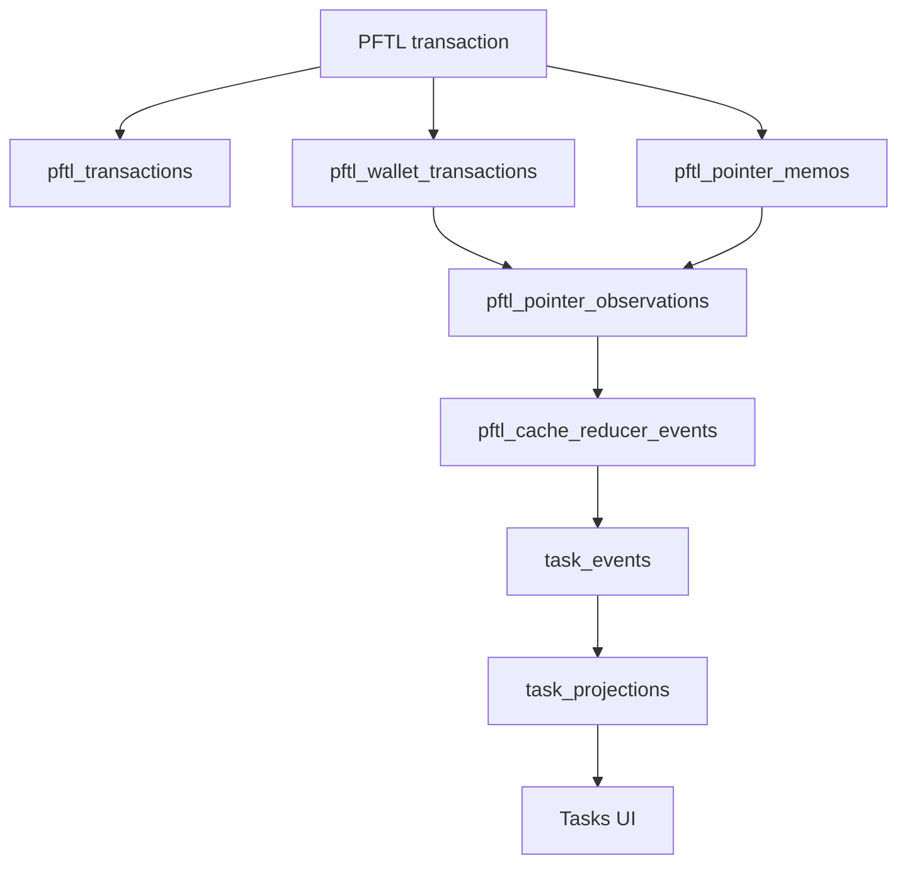
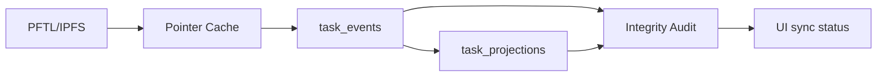

# Data Architecture Hardening Plan

## Purpose

Task Node Official cannot rely on lucky cache behavior. PFTL and IPFS are the canonical record for wallet-backed work. Postgres is the fast read model. The architecture is only trustworthy if the read model can be rebuilt, audited, repaired, and proven consistent with the chain-derived event stream.

This plan audits the current architecture and defines the work required to make stale task state, missing verification prompts, double processing, and silent projection drift hard to reintroduce.

## Plain English Problem

The app currently has three layers:

```text
PFTL/IPFS truth
  -> Postgres cache and normalized events
  -> UI projections
```

The failure mode we just hit was:

```text
PFTL/IPFS truth: task reached verification_requested
Postgres projection: task still looked submitted
UI: confidently rendered the stale projection
```

That is unacceptable. The product should either show the correct state or clearly say that indexing is behind. It should not show stale state as if it is authoritative.

## Implementation Status

As of May 21, 2026, Phase 0 and the pointer-observation portion of Phase 1 are implemented in the local Docker environment.

What exists now:

| Area | Implemented path |
| --- | --- |
| Pointer observation bridge | `server/db/migrations/023_pftl_pointer_observations.sql` adds `pftl_pointer_observations`, keyed by wallet, tx hash, and memo index. |
| Ingestion | `server/repositories/pftl-cache.js` writes a global `pftl_pointer_memos` row and a wallet/account `pftl_pointer_observations` row for every decoded pointer. |
| Backfill | `npm run db:pftl-pointer-observation-backfill -- --limit=10000` fills observations from existing cached wallet transactions and pointer memos. |
| Reducer scope | `server/pftl-cache-reducer.js` resolves task replay through observations across the account's active wallets and no longer treats `pftl_pointer_memos.wallet_address` as task ownership. |
| Queue policy | Task projection reducer events are only created when a task-style pointer carries a concrete task ID. Blank historical task-looking pointers are ignored instead of failing projection replay. |
| Task read integrity | `GET /api/tasks` returns sync counts for reducer lag/failures. `GET /api/tasks/detail` returns `forensics.integrity` with latest cached pointer, projected last event, reducer counts, and `projectionBehindCachedPointer`. |
| Audit | `npm run data-architecture-audit` checks pointer observations, current task projection drift, unrepaired reducer failures, billing projection mismatch, and stuck memory jobs. |
| Repair | `npm run task-replay-repair -- --task-id=<task_id> --apply` rebuilds task projections through reducer replay. `npm run pftl-reducer-requeue -- --id=<event_id> --apply` requeues a failed reducer event without manual SQL. |

Live verification performed:

```text
docker exec tasknodeofficial-api-1 npm run db:pftl-pointer-observation-backfill -- --limit=10000
docker exec tasknodeofficial-api-1 npm run data-architecture-audit
docker exec tasknodeofficial-api-1 npm run task-replay-repair -- --task-id=task_880e60cf38a6aa23da350a1b03884bfc --apply
docker exec tasknodeofficial-api-1 npm run task-replay-repair -- --task-id=task_3665c17974505135be16a1019e7d21fb --apply
docker exec tasknodeofficial-api-1 npm run pftl-reducer-requeue -- --id=112977 --apply
```

Current audit result:

```json
{
  "ok": true,
  "p0": [],
  "p1": [],
  "counts": {
    "pointerObservationMissing": 0,
    "pointerObservationOrphans": 0,
    "reducerFailed": 0,
    "currentTaskProjectionDrift": 0,
    "knownTaskSkippedReducers": 0,
    "billingProjectionMismatch": 0,
    "stuckMemoryJobs": 0
  }
}
```

The audit still reports `reducerFailedNoTaskPointerIgnored` as a count. Those are historical no-task-ID pointer rows that were incorrectly queued before the no-task-ID queue policy existed; they are not current product failures and should not be replayed as task projections.

## Audit Scope

Reviewed code and schema:

| Area | Files and tables reviewed |
| --- | --- |
| PFTL cache | `server/repositories/pftl-cache.js`, `server/pftl-cache-reducer.js`, `pftl_transactions`, `pftl_wallet_transactions`, `pftl_pointer_memos`, `pftl_cache_reducer_events` |
| Tasks | `server/repositories/tasks.js`, `server/task-request.js`, `server/task-generation-worker.js`, `server/task-actions.js`, `server/task-submission.js`, `server/task-review-worker.js`, `task_requests`, `pftl_task_pointer_events`, `task_events`, `task_projections` |
| Context | `server/repositories/context.js`, `context_documents`, `context_revisions`, `context_history_imports`, `context_history_pointers` |
| Chat and billing | `server/repositories/chat-billing.js`, `chat_conversations`, `chat_messages`, `chat_model_runs`, `billing_accounts`, `billing_ledger_entries` |
| Memory | `server/repositories/chat-memory.js`, `chat_memory_jobs`, `chat_memory_entries`, `chat_deep_memory_jobs` |
| Profile | `server/repositories/profile-*`, `profile_nfts`, `profile_daily_airdrop_runs`, `profile_daily_airdrop_issuances`, `profile_public_snapshots` |

Observed local database evidence on May 21, 2026:

| Query result | Meaning |
| --- | --- |
| `pftl_cache_reducer_events`: 21,123 completed, 48 failed | Reducer failures are present and need an operator-visible repair path. |
| Failed reducer errors: 42 `task_projection_empty`, 3 `context_ipfs_fetch_failed`, 2 `task_pointer_missing`, 1 `context_pointer_missing` | Projection failures are not rare enough to ignore. |
| `pftl_pointer_memos`: 81 pointer memo rows are attached to transactions observed by more than one wallet | The schema stores global pointer data with a single wallet owner, which is the wrong boundary. |
| Task pointer memo blanks: 8,953 of 8,986 `TASK_SUBMISSION` rows have no task ID | Historical or legacy task-style memos can pollute known-task replay if replay queries are too broad. |
| Projection/event count mismatches exist in historical imported data | Legacy and current app task rows need explicit source classification and integrity checks, not blind trust. |

## Current Data Contract

The intended contract should be:

```text
PFTL transaction = immutable chain fact
IPFS payload = encrypted readable content behind a CID
pftl_transactions = global transaction mirror
pftl_wallet_transactions = which tracked wallets observed the transaction
pftl_pointer_memos = decoded pointer memo identity for a tx hash and memo index
task_events = normalized lifecycle events for one task ID
task_projections = disposable current-state read model built from task_events
UI = reads projection plus integrity/freshness state
```

Any row that can be rebuilt from chain, IPFS, and typed events is a cache row. Cache rows must never become the protocol truth.

## P0 Findings

### 1. Pointer Memo Ownership Is Wrong

Current schema:

```text
pftl_pointer_memos primary key: (tx_hash, memo_index)
pftl_pointer_memos.wallet_address: single wallet address
pftl_wallet_transactions: many wallets can observe the same tx_hash
```

This is internally inconsistent. A pointer memo belongs to a transaction and memo index. It does not belong to exactly one wallet. Wallet visibility belongs in a separate observation table.

Why this breaks:

- a user wallet can submit evidence;
- an authority wallet can issue verification;
- both wallets can observe the same task transaction;
- the memo table stores only one `wallet_address`;
- reducer code can fail when it asks for the memo under the other wallet.

Required fix:

```text
pftl_pointer_memos
  key: tx_hash, memo_index
  no ownership meaning attached to wallet_address

pftl_pointer_observations
  key: wallet_address, tx_hash, memo_index
  account_id, role, direction, first_seen_at, source
```

Migration shape:

1. Create `pftl_pointer_observations`.
2. Backfill it from `pftl_wallet_transactions` joined to `pftl_pointer_memos`.
3. Update `storePftlAccountTransactions` so every wallet observation writes the bridge table.
4. Update reducers and forensics to join through observations when wallet/account scope matters.
5. Stop using `pftl_pointer_memos.wallet_address` as an ownership boundary.
6. Keep the old column temporarily only for migration compatibility, then remove or formally deprecate it.

Acceptance criteria:

- a single tx hash with one memo and two observed wallets produces one pointer memo row and two observation rows;
- task replay for a known `task_id` works whether the seed reducer event came from the user wallet or authority wallet;
- no reducer event is skipped because the pointer is cached under the other wallet.

### 2. Task Projection Can Drift From Task Events

Current task reads depend on `task_projections`. That is correct for speed, but the app does not yet enforce that projections match the normalized event log.

Required invariant:

```text
For every current app task:
  latest task_events state == task_projections.status
  count(task_events for task_id) == task_projections.event_count
  latest task_events tx/cid == task_projections.last_event_tx_hash/last_event_cid
```

Required fix:

1. Add `scripts/task-data-integrity-smoke.mjs`.
2. Check projection status, event count, latest tx/CID, and forensics timeline count.
3. Fail on any current app task where `/api/tasks`, `/api/tasks/detail`, and DB projection disagree.
4. Treat legacy imported rows separately so old historical material does not hide current app breakage.
5. Add the script to the task work verification path.

Acceptance criteria:

- the script fails if a verification request exists in `task_events` but the projection still says `submitted`;
- the script fails if a task detail page reports fewer forensics events than `task_projections.event_count`;
- the script can be run locally and in Docker.

### 3. Reducer Failures Are Not Product-Visible Enough

Current state:

```text
pftl_cache_reducer_events has failed rows.
The Tasks UI can still show stale projected state.
```

Required fix:

1. Add a cache health summary to task sync responses:
   - pending reducer events for this task;
   - failed reducer events for this task;
   - latest cached pointer tx/CID;
   - latest projected tx/CID.
2. If a newer task pointer exists than the projection has consumed, return `sync.status = "indexing_lag"` for that task.
3. Show a small task-level indexing warning instead of pretending stale state is final.
4. Add an operator repair action that requeues failed reducer events by task ID or account ID.

Acceptance criteria:

- a task with a newer cached pointer than projected state shows an indexing warning;
- failed reducer events are visible through `/api/pftl/cache/health`;
- repair does not require manual SQL.

### 4. Task Worker State Is Stored In Projection JSON

Current workers mark processing and published state inside `task_projections.metadata_json.workers`.

This works at low volume, but it mixes two concepts:

- projection: current task read model;
- job ownership: whether a worker owns a phase.

That creates avoidable risks:

- projection replay can overwrite worker metadata;
- worker claim state can survive after chain truth changes;
- failure recovery is harder to audit.

Required fix:

Create a typed `task_phase_jobs` table:

| Column group | Purpose |
| --- | --- |
| `task_id`, `account_id`, `phase` | Unique job identity. |
| `status`, `attempts`, `available_at`, `locked_at`, `locked_by` | Worker claim state. |
| `source_event_tx_hash`, `source_event_cid` | Which task event created the job. |
| `published_tx_hash`, `published_cid` | Idempotent output anchors. |
| `last_error`, `metadata_json` | Diagnostics. |

Phase examples:

- `generate_offer`;
- `request_verification`;
- `score_reward`;
- `pay_reward`.

Acceptance criteria:

- workers claim typed jobs, not projections;
- projection replay can be deleted and rebuilt without deleting worker audit history;
- duplicate worker execution is prevented by unique `(task_id, phase, source_event_tx_hash, source_event_cid)`.

### 5. Authority And Reward Wallet Signing Need A Queue

Current app workers sign authority and reward transactions inline. That is acceptable for low-volume local/testnet use, but not as the final architecture.

PFTL signing is sequential per wallet. The system needs a durable queue per signing wallet.

Required fix:

Create `wallet_tx_queue`:

| Column group | Purpose |
| --- | --- |
| `id`, `account_id`, `wallet_address`, `wallet_role` | Signing wallet ownership. |
| `intent_kind`, `intent_id`, `idempotency_key` | What is being signed and why. |
| `payload_cid`, `memo_kind`, `task_id`, `request_id` | Pointer details. |
| `status`, `attempts`, `available_at`, `locked_at`, `locked_by` | Queue state. |
| `prepared_tx_json`, `signed_tx_blob`, `submitted_tx_hash` | Transaction lifecycle. |
| `confirmed_ledger`, `confirmed_at`, `last_error` | Confirmation and diagnostics. |

Acceptance criteria:

- one wallet has at most one active signing job;
- retrying a job cannot produce a duplicate logical event;
- task authority, reward, airdrop, and future context/system transactions share the same queue machinery.

## P1 Findings

### Context Current Draft Versus Chain History

Current context design is directionally correct:

- current editable context is account-scoped and does not require a wallet;
- long-term historical versions should be PFT pointer writes;
- Postgres should cache current draft and pointer history.

Risks:

- context history previews can still depend on wallet-linked history;
- historical encrypted previews can look broken if the service cannot decrypt or if the cache is behind;
- current draft and published pointer history need clear UI language.

Plan:

1. Keep `context_documents` and one current `context_revisions` row as current draft cache.
2. Keep durable version history as PFTL/IPFS pointer history.
3. Add context integrity checks:
   - current document exists per account;
   - current draft hash matches the saved body;
   - published pointer rows have decrypt/hydration status;
   - preview failures are classified as indexing, decrypt, fetch, or unsupported legacy.
4. Do not store long-term Postgres revision history beyond the current draft unless explicitly introduced as a product feature.

### Billing Ledger Versus Balance Projection

Billing has an append-style ledger and a `billing_accounts` balance projection. The ledger should be the truth; `billing_accounts` should be repairable.

Plan:

1. Add a billing integrity check:
   - ledger credit/debit sum equals `billing_accounts` summary;
   - every model run debit has one idempotent billing ledger entry;
   - failed model runs do not create final debits;
   - web search tool estimates match billed web search calls.
2. Add a repair command that recomputes `billing_accounts` from `billing_ledger_entries`.

### Chat Ownership And Attachments

Chat ownership is now account-scoped in the core history path. The remaining architecture need is an invariant script.

Plan:

1. Check every `chat_messages` row belongs to an existing account-owned conversation.
2. Check attachments are only read through message/account ownership.
3. Check soft-deleted conversations do not appear in recents or app state.
4. Check runtime fallback is disabled in public environments.

### Memory Jobs

Memory jobs are intentionally async and should not bill the user. Risks are queue drift, stale deep memory blocks, and durable prompt injection.

Plan:

1. One memory row per assistant message.
2. One deep memory row per account/block.
3. Deep memory source snapshot must contain exact memory entry IDs.
4. Memory injection into chat should use a bounded, labeled context block, never an unbounded hidden override.
5. Add an integrity script for missing jobs, duplicate deep blocks, and stuck processing rows.

### Profile, NFT, And Airdrop Derived Data

Profile output is derived. It must be reproducible from source inputs.

Plan:

1. Every daily airdrop run stores the exact task packet fingerprint and identity-cloud recipient decision.
2. Every production airdrop has a unique account/day issuance row.
3. Public profile snapshots store input fingerprint and prompt digest.
4. Profile NFTs store image CID, metadata CID, prompt digest, model, and mint status.
5. Regeneration should produce new rows, not mutate old proof rows into unrecoverable states.

## Required New Verification Tools

### `scripts/data-architecture-audit.mjs`

One command that summarizes the health of every critical data boundary.

Checks:

- PFTL pointer memo observation consistency;
- reducer queue failures by kind and age;
- task projection versus task event consistency;
- `/api/tasks` versus `/api/tasks/detail` status agreement for recent tasks;
- context current draft and pointer history status;
- billing ledger/account summary consistency;
- chat ownership and attachment ownership;
- memory job uniqueness and stuck processing rows;
- profile derived-data idempotency.

Output:

```json
{
  "ok": false,
  "p0": [
    {
      "surface": "tasks",
      "code": "task_projection_stale",
      "task_id": "task_...",
      "expected": "verification_requested",
      "actual": "submitted"
    }
  ],
  "p1": [],
  "counts": {}
}
```

### `scripts/task-replay-repair.mjs`

Rebuilds `task_events` and `task_projections` from cached PFTL pointer memos and IPFS payloads.

Rules:

- accepts `--task-id`, `--account-id`, or `--wallet`;
- does not invent lifecycle events;
- does not write fake task state;
- reports every skipped pointer with a concrete reason;
- can run dry-run or apply mode.

### `scripts/pftl-pointer-observation-backfill.mjs`

Backfills the new pointer observation bridge from existing transaction and pointer rows.

Rules:

- idempotent;
- safe to run repeatedly;
- reports transactions with pointer memos but no wallet observations;
- reports wallet observations with missing pointer memo rows.

## Target Diagrams

### PFTL Cache After Normalization



### Task State Truth



The UI should never depend on projection alone when the integrity layer knows there is a newer cached pointer or failed reducer event.

## Implementation Burndown

### Phase 0: Stop Silent Drift

1. Add `scripts/data-architecture-audit.mjs` with current-task checks first.
2. Add task-specific integrity fields to `GET /api/tasks/detail`.
3. Add task list sync warnings when projection is behind known cached pointers.
4. Add a repair command that requeues reducer events for a task ID.
5. Add docs for how to interpret each integrity error.

Done when:

- the task that motivated this plan would have failed the audit before manual debugging;
- the UI would have shown indexing lag instead of stale submitted state;
- the audit runs in Docker.

### Phase 1: Normalize Pointer Observations

1. Add `pftl_pointer_observations` migration.
2. Backfill observations from `pftl_wallet_transactions` and `pftl_pointer_memos`.
3. Update cache ingestion to write observations.
4. Update `pointerMemoForReducerEvent` to resolve memo identity by tx/memo/CID and observation by wallet/account.
5. Update task, context, and forensics queries to use observations where wallet scope matters.
6. Add tests for the same pointer observed by user and authority wallets.

Done when:

- `pftl_pointer_memos.wallet_address` is no longer used for task ownership;
- the same tx/memo can be replayed from either observed wallet;
- multi-wallet pointer rows are normal, not a failure.

### Phase 2: Make Task Replay Deterministic

1. Create a single task replay module that consumes hydrated lifecycle events and emits:
   - normalized `task_events`;
   - expected projection;
   - integrity report.
2. Use the shared lifecycle state definitions from `shared/task-lifecycle.js`.
3. Reject impossible transitions into a visible integrity error instead of silently accepting them.
4. Make `task_projections` fully disposable: delete and rebuild should produce the same visible task.
5. Add current app task fixtures covering proposed, accepted, submitted, verification requested, verification response submitted, zero reward, positive reward, refused, cancelled.

Done when:

- replaying the same task twice is idempotent;
- projection status is a pure function of ordered task events;
- impossible transitions are visible in audit output.

### Phase 3: Split Worker Jobs From Projections

1. Add `task_phase_jobs`.
2. Move verification request and reward scoring claims out of `task_projections.metadata_json`.
3. Store worker attempts, locks, output tx/CID, and last error in typed job rows.
4. Update task detail forensics to show worker job history separately from chain lifecycle.

Done when:

- projection repair does not erase worker audit state;
- worker retry does not require mutating projection JSON;
- duplicate verification or reward jobs are blocked by unique phase keys.

### Phase 4: Add Wallet Transaction Queue

1. Add `wallet_tx_queue`.
2. Route authority offer, verification request, reward decision, reward payment, daily airdrop, and future system-signed transactions through it.
3. Enforce one active signing job per wallet.
4. Add idempotency keys for every transaction intent.
5. Add operator queue health.

Done when:

- no authority or reward wallet transaction is signed inline by a phase worker;
- retrying a worker cannot double-pay or double-publish the same logical event;
- throughput can scale by adding wallets, not by racing one wallet.

### Phase 5: Remove Legacy Ambiguity

1. Classify legacy imported task rows by source.
2. Keep legacy rows out of current app integrity failures unless explicitly audited.
3. Remove or gate runtime-store fallbacks in public mode.
4. Convert remaining JSON-only operational state into typed tables when it controls product behavior.
5. Keep JSON metadata only for diagnostics, provider payloads, and snapshots that are not workflow control state.

Done when:

- current app health can be audited without historical PFTasks-style noise;
- public production cannot silently fall back to ephemeral runtime state;
- workflow decisions do not depend on undocumented JSON blobs.

## Release Gate For Task/Data Changes

No future task/data architecture change should be called complete unless all of this passes:

```bash
npm run quality
npm run build
npm run route-smoke
npm run db:pftl-cache-reducer-smoke
node scripts/data-architecture-audit.mjs --current-app
git diff --check
```

For task changes, also verify one rendered task detail page in the local app and confirm:

- card status;
- detail status;
- forensics lifecycle;
- latest CID;
- latest transaction;
- current verification or reward state.

## What Not To Do

- Do not fix individual task IDs by manual SQL.
- Do not add regex or hardcoded task exceptions.
- Do not let UI cards render stale projections as authoritative when cache health knows better.
- Do not store workflow control state only inside `metadata_json`.
- Do not treat a wallet observation as the owner of a global PFTL pointer memo.
- Do not describe Python reference demos as app pipeline proof unless the app path invokes the same code path.

## Success Definition

This architecture is robust when:

1. A chain event can be indexed from any observed wallet and still updates the same task.
2. The app can rebuild task state from cached PFTL pointers and encrypted IPFS payloads.
3. The UI cannot silently disagree with forensics.
4. Worker retries are idempotent and auditable.
5. Projection failures are visible, repairable, and tested.
6. A new engineer can run one audit command and understand whether the app data model is trustworthy.

## Reviewer To Do List

Review implementation against this document (data architecture hardening plan). Mark each item when verified.

### Memory Efficiency
- [ ] Plan phases avoid loading unbounded history or corpus into single jobs.
- [ ] Derived read models prefer projections over duplicate materialized stores.
- [ ] Audit script (`data-architecture-audit`) bounded; no full table scan without indexes.

### Code Quality
- [ ] Done criteria map to testable checks or smoke commands.
- [ ] Status (implemented vs planned) accurate on every section.
- [ ] P0 items map to migrations 023+ and reducer repair paths.

### Coherence
- [ ] Plan does not contradict shipped behavior in Surfaces/Architecture docs.
- [ ] Dependencies on other plans explicitly named and still valid.
- [ ] Release gate matches execution mandate verification commands.

### Bloat
- [ ] Plan scoped to stated phase; future work not implied as shipped.
- [ ] Avoid duplicating full surface doc content; link instead.
- [ ] Manual SQL repair discouraged; `task-replay-repair` documented as canonical fix.

### Security
- [ ] New tables/routes in plan include account ownership and encryption notes.
- [ ] Operator-only actions identified with audit requirements.
- [ ] Pointer observation bridge prevents cross-wallet task ID confusion.
