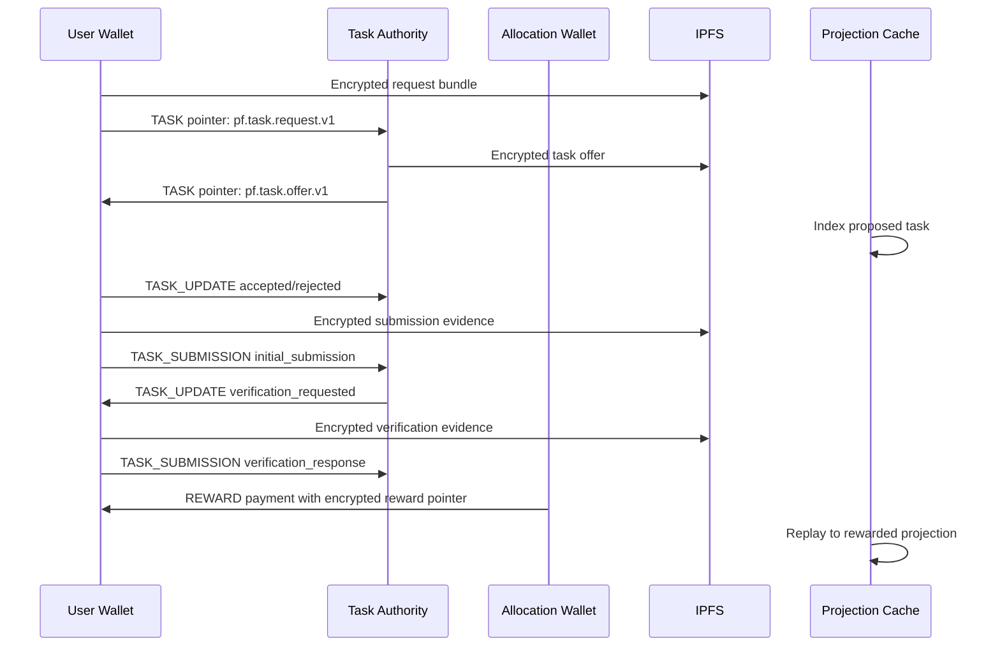
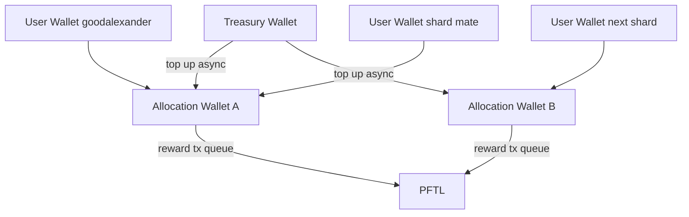

# Getting Tasks Over The Line

## Objective

Turn the Tasks surface from vaporware into a wallet-first PFTL task system. The first milestone is not UX polish. The first milestone is proving that the real goodalexander wallet can request tasks from real chat/context data, receive task offers, submit multiple tasks, answer verification, receive real PFT rewards, and then have those events appear in the app from a cache rebuilt from chain-verifiable records.

The target wallet seed for the first real replay is stored outside the app source in `ga_seed2.txt`. The seed must never be printed, committed, copied into markdown, or passed through model context. The Python harness should read it locally, derive the wallet, and report only the classic address, CIDs, tx hashes, task IDs, and replay projection.

## Current Ground Truth

Task Node already has the right primitives:

- `reference_clients/python/tasknode_pftl/scenarios/full_lifecycle.py` can run a full encrypted PFTL/IPFS task replay.
- `reference_clients/python/tasknode_pftl/taskgen.py` has a minimal task-generation contract.
- `reference_clients/python/tasknode_pftl/verification.py` has evidence readers for screenshots, PDFs, DOCX, and public URLs.
- `server/context-publish.js` can publish encrypted context pointers and now enforces a TaskNode recipient shard.
- `server/db/migrations/001_*` through `005_*` persist chats, attachments, context, and memory.
- `docs/PFTL_TASK_ENGINE_SPEC.md` defines the canonical pointer lifecycle.

The missing piece is a real-wallet task request harness that consumes current app data instead of simulated bundle data, plus a projection cache that makes the web Tasks surface read from replayed state.

## PFTasks Research Summary

PFTasks is the reference, not the destination.

Useful PFTasks pieces:

- Task generation lives around `pftasks/api/src/routes/chat/post_message_task_general.js`.
- Async generation uses `pftasks/api/src/services/task_request_generation_queue.js`.
- Generated tasks insert SQL `tasks` rows and `task_events` rows with `task_generated`.
- Verification asks come from `pftasks/api/src/services/verification_service.js`.
- Reward scoring and reward pointer payout happen in `pftasks/worker/src/jobs/reward_task/execution.js`.
- Reward wallet concurrency is handled by `pftasks/worker/src/lib/reward_wallets.js` with a wallet pool, Postgres advisory locks, top-up thresholds, and retryable submit handling.

What we should not copy:

- SQL-first task truth.
- Legacy prompt payloads with broad JSON requirements and app-specific fields.
- A UX-only task request path that cannot be reproduced by Codex or a CLI.
- A global task table as the canonical lifecycle record.

What we should adapt:

- Minimal task-generation quality gates.
- Duplicate and access-policy concepts as cache-side safeguards.
- Verification prompt/reward policy ideas.
- Reward wallet locking and funding patterns, but applied to per-user or sharded allocation wallets.

## Product Event Shape

The app user flow should become:

1. User clicks `Request task` inside Chat.
2. The app creates a bounded task request bundle from current account data.
3. The user wallet signs a PFTL pointer to the encrypted request event.
4. TaskNode reads the request, generates a task offer, encrypts it, and signs an offer pointer.
5. The app cache indexes the offer and displays it in Tasks as `Proposed`.
6. User accepts, rejects, or lets it expire.
7. User submits initial evidence.
8. TaskNode issues a verification request.
9. User submits verification evidence.
10. TaskNode scores it and sends a reward payment from the assigned reward wallet.
11. The cache replays the wallet histories so the UX can show the final state ex post.

## Request Bundle V1

The request bundle must be a protocol object, not an internal React state blob. A future Codex runtime should be able to build the same object without using the web app.

```json
{
  "schema": "pf.task.request_bundle.v1",
  "bundle_id": "bundle_...",
  "subject_wallet": "r...",
  "created_at": "ISO-8601",
  "client": {
    "name": "tasknodeofficial|codex|python",
    "version": "0.1.0",
    "conversation_id": "optional app chat id"
  },
  "request": {
    "request_id": "req_...",
    "request_text": "user-visible task request",
    "requested_task_kind": "personal|network|alpha|system",
    "source": "user_chat"
  },
  "context": {
    "current_context": {
      "context_id": "ctx_...",
      "revision": 12,
      "cid": "optional latest published context CID",
      "digest": "sha256:...",
      "summary": "bounded summary",
      "body_excerpt": "bounded excerpt or empty when CID-only"
    }
  },
  "memory": {
    "deep_memories": [
      {
        "created_at": "ISO-8601",
        "user_request_summary": "...",
        "system_response_summary": "...",
        "memory_text": "..."
      }
    ],
    "recent_memories": [
      {
        "created_at": "ISO-8601",
        "memory_text": "..."
      }
    ]
  },
  "chat_context": {
    "current_conversation": {
      "conversation_id": "account_...",
      "title": "chat title",
      "recent_messages": [
        {
          "id": "msg_...",
          "role": "user|assistant",
          "content": "bounded content",
          "created_at": "ISO-8601",
          "digest": "sha256:..."
        }
      ]
    },
    "recent_chats": [
      {
        "conversation_id": "account_...",
        "title": "chat title",
        "last_message_at": "ISO-8601",
        "summary": "bounded summary"
      }
    ]
  },
  "wallet": {
    "subject_wallet": "r...",
    "allocation_wallet": "r...",
    "authority_wallet": "r..."
  },
  "policy": {
    "task_generation_model": "chat-latest",
    "task_policy_version": "task-policy-minimal-v1",
    "reward_policy_version": "reward-policy-minimal-v1"
  }
}
```

Rules:

- The full bundle is encrypted to the user wallet, TaskNode service key, task authority key, and any verification/reward service key that needs to read it.
- The PFTL pointer exposes only the CID, kind, schema, flags, and optional task/request identifiers.
- Context documents should be referenced by CID and digest when available; the bundle can include a bounded excerpt so generation can proceed before a context CID exists.
- Memory records are included as product context, not high-authority instructions.
- Attachments should be represented by extracted text records and content digests, not raw unbounded file blobs.

## PFTL Lifecycle



## Wallet And Latency Model

PFTL signing is synchronous per wallet. A single global reward wallet will become a bottleneck and a messy accounting boundary.

Recommended v1:

- `user_wallet`: user-controlled wallet; signs request, accept/reject, submissions.
- `task_authority_wallet`: system wallet; signs task offers and verification requests.
- `allocation_wallet`: system-controlled reward wallet assigned to a user or small shard.
- `treasury_wallet`: top-up source only; should not pay every task reward directly.

Allocation strategy:

- First implementation may assign one allocation wallet to goodalexander for the live harness.
- Next implementation should support deterministic sharding: one allocation wallet per user, or one wallet per small shard of users, such as 10 users.
- Each allocation wallet gets its own transaction queue and advisory lock.
- Top-ups happen asynchronously from treasury when balance drops below a threshold.
- Reward payout jobs should never block unrelated users on the same global wallet.



## Database Overlay

Postgres is a projection cache. It must make the Tasks UX fast, but cache loss must be recoverable from PFTL and IPFS.

Add migrations only after the real-wallet harness proves the event shape.

Core tables:

```text
task_wallet_allocations
  id
  account_id nullable
  subject_wallet
  allocation_wallet
  authority_wallet
  policy_version
  status
  created_at
  updated_at
  unique(subject_wallet)

task_request_bundles
  bundle_id
  account_id nullable
  subject_wallet
  conversation_id nullable
  request_id
  request_text
  bundle_cid
  bundle_digest
  context_digest nullable
  memory_digest nullable
  chat_digest nullable
  created_at

pftl_task_pointer_events
  id
  wallet_address
  counterparty_wallet nullable
  tx_hash
  ledger_index
  tx_index nullable
  memo_index
  pointer_kind
  schema_version
  cid
  task_id nullable
  request_id nullable
  flags_json
  source_rpc
  observed_at
  unique(tx_hash, memo_index)

task_payload_cache
  cid
  schema
  content_kind
  encrypted_sha256
  decrypt_status
  decrypted_summary_json nullable
  hydrated_at nullable
  error nullable

task_events
  id
  task_id
  event_type
  subject_wallet
  actor_wallet
  authority_wallet nullable
  allocation_wallet nullable
  source_tx_hash
  source_cid
  canonical_order
  payload_json
  created_at
  unique(task_id, event_type, source_tx_hash, source_cid)

task_projections
  task_id
  account_id nullable
  subject_wallet
  status
  title
  description_preview
  task_kind
  reward_offer_pft nullable
  reward_actual_pft nullable
  accept_by nullable
  deadline_at nullable
  latest_event_id
  latest_tx_hash
  source_confidence
  sync_status
  updated_at

task_sync_checkpoints
  wallet_address
  last_hot_ledger_seen nullable
  last_archive_ledger_checked nullable
  last_full_replay_at nullable
  updated_at
```

Read rules:

- Tasks UX reads `task_projections`.
- Details modal reads `task_events` plus decrypted summaries from `task_payload_cache`.
- Replay workers rebuild `task_events` from `pftl_task_pointer_events` plus IPFS payloads.
- App account IDs annotate rows, but wallet history remains canonical.

## Implementation Plan

### Phase 1: Real Goodalexander Harness

Goal: prove the protocol using `ga_seed2.txt`, live PFTL, live IPFS, real task generation, and real rewards.

Work:

- Add a Python scenario, likely `tasknode_pftl.scenarios.goodalexander_task_replay`.
- Read `ga_seed2.txt` locally and derive the goodalexander wallet without printing the seed.
- Resolve the user wallet `MessageKey`; publish it if needed.
- Load real app data for goodalexander from Postgres:
  - current context document;
  - latest published context CID when present;
  - last 3 deep memories;
  - last 36 memory records;
  - current chat transcript window;
  - recent chat summaries.
- Build `pf.task.request_bundle.v1`.
- Encrypt and pin the bundle to IPFS.
- Write the request pointer from the user wallet.
- Generate a real task with `chat-latest`.
- Write the offer pointer from task authority.
- Accept the task from the user wallet.
- Submit initial evidence from the user wallet.
- Issue verification request from task authority.
- Submit verification evidence from the user wallet.
- Score and send a small real PFT reward from the assigned allocation wallet.
- Replay the relevant user, authority, and allocation wallet histories and write a markdown receipt with task IDs, CIDs, tx hashes, and final projection.

Acceptance criteria:

- At least two task submissions complete in one run so wallet queues and idempotency are tested.
- No deterministic fallback task generator is used unless explicitly requested.
- Every lifecycle event has a CID and PFTL tx hash.
- Final projection reaches `rewarded` for each task.
- The user wallet balance changes by the expected reward amount minus user-side pointer fees.

### Phase 2: Task Projection Cache

Goal: make completed harness tasks appear ex post in the app.

Work:

- Add task projection migrations.
- Add a replay/index worker that scans:
  - goodalexander user wallet;
  - TaskNode authority wallet;
  - goodalexander allocation wallet.
- Hydrate CIDs from IPFS.
- Decrypt with TaskNode service key.
- Reduce events into `task_projections`.
- Expose `/api/tasks` from projections.
- Replace vapor task data in the Tasks surface with projection rows.

Acceptance criteria:

- If the projection rows are deleted, re-running replay rebuilds them from PFTL/IPFS.
- The UI shows the harness-created tasks without manually inserting task rows.
- Missing CID hydration leaves visible `sync_status`, not fake task content.

### Phase 3: Chat Request Button

Goal: wire the app request button after the protocol and projection are proven.

Work:

- Add `Request task` action in Chat.
- Server builds the same request bundle from account data.
- Browser/user wallet signs the request pointer.
- Async TaskNode worker generates offer and emits authority pointer.
- UX shows a pending request, then proposed task when projection updates.

Acceptance criteria:

- User can request a task from a chat and later see it in Tasks.
- The task still replays from PFTL/IPFS with no app database trust.
- The UX never blocks on archive history scans.

### Phase 4: Production Reward Walleting

Goal: avoid reward payout contention and global wallet blast radius.

Work:

- Add allocation wallet provisioning and assignment.
- Support one allocation wallet per user or per small shard.
- Add treasury top-up jobs.
- Add per-wallet transaction queues and locks.
- Add monitoring for low balances, failed rewards, and stuck queues.

Acceptance criteria:

- Multiple users can complete tasks without waiting on one reward wallet.
- A stuck allocation wallet does not halt global rewards.
- Reward accounting is wallet-local and replayable.

## Test Matrix

The first real test should run against goodalexander with `ga_seed2.txt`.

| Test | What It Proves |
| --- | --- |
| Build bundle from real context, memory, and chat | App data can shape task generation without UX handwaving |
| Publish user MessageKey if missing | User can decrypt and receive private task payloads |
| Request pointer from user wallet | Wallet-first task initiation works |
| Offer pointer from authority wallet | TaskNode can issue proposed tasks canonically |
| Two accepted tasks in one run | User wallet queue and idempotency behave |
| Two submissions and verification responses | Submission lifecycle is not single-case demo code |
| Two real reward payments | Allocation wallet payout path is real |
| Replay after cache wipe | Postgres is a rebuildable projection |
| App Tasks read projection | UX shows ex post chain state |

## Open Decisions

- Whether v1 allocation is exactly one wallet per user or shard size 10.
- Whether task authority and TaskNode encryption service should be the same wallet or separate service identities.
- Whether the first web request button should always write a user request pointer before generation, or allow a server-only dry-run preview.
- How aggressively to include raw context excerpts versus CID references in task request bundles.
- Whether task-generation costs are billed immediately at request time or included in task economics later.

## Immediate Next Step

Build and run Phase 1 as a Python scenario before touching the Chat or Tasks UX. The output should be a human-readable receipt and machine-readable JSON projection. Only after that should the app implement task projection tables and replace the Tasks surface data.
