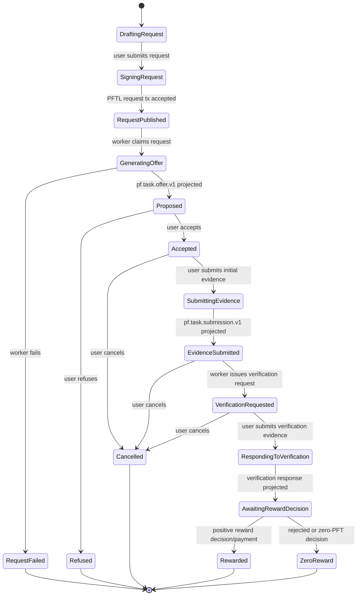

# Task Engine UX Integration Plan

## Purpose

Make Tasks a real, understandable product surface rather than a collection of hidden protocol events.

When a user requests a task, they should immediately see a stateful task request in the UI. An AI system should generate a task offer. The user should accept or refuse that offer from a clear modal. Evidence submission should lead to a sensible verification request. Verification evidence should be scored by the AI system. Good evidence should result in a PFT reward. Bad evidence should result in a zero-reward decision with an explanation.

No user should ever have to guess whether the app is waiting, broken, processing, rejected, rewarded, or missing a worker.

## Audit Scope

This plan is the contract for porting the existing backend task-system pieces into the visible frontend product.

The goal is not another reference demo. The goal is a running app path where:

1. requesting a task creates visible state immediately;
2. an AI system generates a concrete task offer;
3. the user accepts or refuses that offer from the UI;
4. initial evidence creates a visible submission state;
5. the system generates a specific verification request;
6. the user submits verification evidence;
7. bad evidence closes with a visible zero-reward decision;
8. good evidence closes with a visible reward decision and PFT payout;
9. every step has task detail and forensics that explain what happened.

If any step is manual, Python-only, hidden in chat metadata, or missing from the UI, that step is not done.

## Current Truth

The repo now has one live app pipeline for request, offer, accept/refuse/cancel, evidence submission, verification request, verification response, reward decision, and positive reward payment. It is still a v1 pipeline with seed-configured authority/reward wallets and limited worker failure UI.

Implemented:

- The browser can publish an encrypted `pf.task.request.v1` PFTL pointer from the linked wallet through `POST /api/tasks/request`.
- The request event CID, request bundle CID, request transaction hash, and request ID are persisted in durable `task_requests` rows and cached in hidden `task_request` chat rows.
- The Tasks UI renders only a compact active request strip while a request is signing, queued, generating, recently published, or recently failed. Once the worker produces a proposed task, the task card is the UX and the raw request receipt is no longer shown in the main task list.
- `server/task-generation-worker.js` can claim a published request, decrypt the bundle, call OpenAI `chat-latest` through the task generation prompt, publish a real encrypted `pf.task.offer.v1` pointer from the authority wallet, sync PFTL, and reduce it into `task_projections`.
- The PFTL transaction cache can index `TASK` pointers.
- The reducer can project `pf.task.offer.v1`, lifecycle updates, submissions, verification responses, reward decisions, and reward payments into `task_projections` when those chain events already exist.
- The Python reference engine can run request, offer, acceptance, evidence, verification, scoring, reward payout, replay, and projection import.
- The Tasks UI can display projected task buckets and task forensics once `task_projections` contains task state.
- The task detail surface can show accept/refuse/cancel actions for non-terminal states and publish signed `pf.task.update.v1` pointers from the browser wallet.
- The Submit tab publishes signed encrypted initial evidence and verification evidence through `POST /api/tasks/submission`.
- `server/task-review-worker.js` consumes submitted tasks, generates a verification request with the configured prompt/model, and publishes a `pf.task.update.v1` verification request pointer.
- `server/task-review-worker.js` consumes verification responses, scores them with the configured prompt/model, publishes a `pf.task.reward_decision.v1`, and pays positive rewards with `pf.reward.v1` when the score is positive.

Not implemented yet:

- Worker failure state UI. Failures are retained in worker metadata/logs, but the user-facing task detail does not yet show a dedicated retry/failure panel for review-worker failures.
- Per-user or per-shard allocation wallet provisioning. Reward signing currently uses configured service/reward seeds.

The Python engine remains a reference. The app now invokes its own JavaScript request, submission, review, and scoring bridges for the live UX path.

## Executed Bridge Proof

Live PFTL testnet tasks have exercised these outcomes from the browser-backed path:

```text
task_880e60cf38a6aa23da350a1b03884bfc -> rewarded, partial positive payout, 0.45 / 0.75 PFT
task_ab585795d15c8556386b8a4f8a4e68b6 -> rewarded, partial positive payout, 1.80 / 3.00 PFT
task_a89f56f7028d7cc8c397b529f58e4cef -> rewarded, full positive payout, 2.50 / 2.50 PFT
```

The forensics pages for these tasks show offer, acceptance, evidence, verification request, verification response, reward decision, and reward payment pointers when present. Zero-reward tasks remain valid terminal `rewarded` tasks; they show the reward decision reason and do not require a separate payment pointer.

## Backend To Frontend Port Map

The current backend pieces need to become product surfaces through an explicit bridge.

| Backend capability | Existing location | Frontend/product surface to build | Done when |
| --- | --- | --- | --- |
| Request bundle construction from context, memory, recent chat, and task queue | `server/task-request.js`, `reference_clients/python/tasknode_pftl/app_data.py` | Request Task modal receipt and request detail page | The user sees the request text, bundle CID, event CID, tx hash, and status after submit. |
| Task generation prompt/provider call | `reference_clients/python/tasknode_pftl/taskgen.py`, `prompts/task_engine/taskgen_minimal_v1.md` | Proposed task card and accept/refuse modal | A UI request creates a real `pf.task.offer.v1` and a projected task card without manual CLI intervention. |
| PFTL/IPFS lifecycle emission | `reference_clients/python/tasknode_pftl/engine/lifecycle.py`, `server/pftl-submit.js`, `server/pftl-pointer.js` | Chain-backed status changes and forensics | Every visible status has a matching CID and transaction hash. |
| Task projection and reducer | `server/pftl-cache-reducer.js`, `server/repositories/tasks.js` | Task buckets, task detail, chat task context | The UI reads projected task state instead of fabricated local state. |
| Evidence adapters for URL, screenshot, files, code, text | `reference_clients/python/tasknode_pftl/verification.py`, `reference_clients/python/tasknode_pftl/engine/evidence_suite.py` | Evidence submission modal and evidence summary | Submitted evidence is visible in task detail and forensics with readable processed output. |
| Verification request generation | `server/task-review-worker.js`, `prompts/task_engine/verification_request_v1.md` | Verification tab task state and verification response modal | The user sees one specific follow-up ask that matches the task and submitted evidence. |
| Reward scoring and payout | `server/task-review-worker.js`, `prompts/task_engine/reward_scoring_v1.md` | Reward outcome panel, Wallet transaction feed, Rewarded tab | Good evidence pays PFT; bad evidence closes at `0 PFT` with a reason. |

The web app must not create fake task cards to hide missing backend work. Durable task cards come from `task_projections`; request receipts come from `task_requests` but are only prominent while the request is actively in flight.

## No Invisible State Rule

Every task request and task must have one user-facing state label, one next action, and one diagnostics path.

| Product state | User-facing copy should answer | Required diagnostics |
| --- | --- | --- |
| `signing` | "Am I waiting on my wallet?" | local request ID, signing step |
| `published` | "Did the chain receive my request?" | request tx hash, event CID, bundle CID |
| `queued` | "Is the system going to process this?" | queue row, status, created time |
| `generating` | "Is AI generating the task?" | worker run ID, provider, attempt count |
| `proposed` | "What task is being offered?" | task ID, offer CID, offer tx hash |
| `accepted` | "What do I need to do next?" | accept CID and tx hash |
| `evidence_submitted` | "What evidence did I send?" | evidence refs, processed artifacts, submission CID and tx hash |
| `verification_requested` | "What follow-up does the system need?" | verification request text, CID, tx hash |
| `awaiting_reward_decision` | "Is scoring still running?" | verification response CID and tx hash, worker status |
| `rewarded` | "Was I paid or not, and why?" | reward decision, payment tx if positive, zero-reward reason if rejected |
| `failed` | "What failed and what can I retry?" | error summary, worker run, retry action |

An empty panel is not an acceptable representation of an in-flight task. If the backend does not know the state, the UI should say that the projection is stale and expose the last known chain anchors.

## Product State Machine

The UI must make these states visible:



`ZeroReward` is a completed task state. It should appear in Rewarded history with `0 PFT` and a clear reason.

## UX Contract

### Request Task

After the user submits the Request Task modal:

- A compact active request strip appears immediately in Tasks.
- The strip shows the request text and current state without raw proof clutter.
- The first state is `Signing` while the browser signs the request.
- After the request transaction lands, the row shows `Published to PFT`.
- After the worker claims it, the row shows `Generating task`.
- If generation succeeds, the strip disappears and the proposed task card becomes the user's next action.
- If generation fails recently, the strip shows a readable failure reason and should expose retry once retry is implemented.

The request must not disappear while it is in flight. After it becomes a task, the request receipt should not compete with the task card.

The modal flow should be:

1. user clicks `Request task`;
2. modal asks for optional task detail;
3. modal shows the context packet sources that will be included: context document, deep memory, recent memory, recent chat, and active task queue;
4. submit signs and publishes a request pointer;
5. modal closes only after an active request strip exists or a clear failure is shown.

### Proposed Task

When a task offer is projected:

- It appears in Outstanding as `Proposed`.
- Opening it shows a clear task contract: title, description, steps, evidence requirement, deadline, and reward offer.
- The primary actions are `Accept task` and `Refuse task`.
- Clicking either opens a modal that explains exactly what will be signed.
- If the wallet is locked, the modal opens the shared unlock flow before signing.

The accept/refuse modal must be explicit that accepting puts the task on the user's plate and refusing closes the offer. It must not silently accept, silently reject, or route to chat.

### Accepted Task

After acceptance:

- The task remains in Outstanding as `Accepted`.
- The next action is `Submit evidence`.
- The evidence UI should have one primary action, not multiple confusing submit buttons.
- Evidence types should include text, URL, screenshot/image, file/PDF/DOCX, and code or commit text where applicable.

### Evidence Submitted

After initial evidence submission:

- The task state changes to `Evidence submitted`.
- The user sees that the system is preparing a verification request.
- The detail page shows submitted evidence refs, CIDs, transaction hashes, and readable processed evidence when available.

The Submit tab must show whether the user is submitting initial evidence or responding to a verification request. Those are separate lifecycle steps and should not share ambiguous button copy.

### Verification Requested

When the system emits a verification request:

- The task appears in Verification.
- The request text is shown at the top of the Submit tab.
- The evidence input is scoped to the verification request.
- The user can still cancel the task.

### Reward Decision

After verification response:

- The UI shows `Awaiting reward decision` until scoring finishes.
- Positive scoring emits a reward decision and PFT reward payment.
- Bad evidence emits a zero-reward decision with reason, score, and what would be needed to satisfy the task.
- The Rewarded tab shows both positive and zero-reward terminal tasks.

## Data Model

PFTL and encrypted IPFS remain canonical. Postgres is the product read model and worker coordination layer.

Current Postgres surfaces:

| Surface | Purpose |
| --- | --- |
| `task_requests` | Durable task request receipt and worker claim table. Stores request ID, account ID, wallet, CIDs, tx hash, status, worker attempts, generated task ID, and last error. The main UX only renders active in-flight rows. |
| `pftl_cache_reducer_events` | Idempotent reducer queue for task, context, and wallet projection work. |
| `pftl_task_pointer_events` | Hydrated task pointer events with tx hash, CID, ledger, schema, and payload JSON. |
| `task_events` | Existing normalized projected event history. |
| `task_projections` | Existing current task read model used by Tasks and chat context. |

Minimum `task_requests` fields:

```text
request_id
account_id
subject_wallet
source
request_text
user_detail_text
requested_task_kind
request_bundle_cid
request_event_cid
request_tx_hash
status
generated_task_id
worker_claimed_at
worker_completed_at
worker_attempt_count
last_error
created_at
updated_at
```

The `status` values are product states, not low-level implementation labels:

```text
signing
published
queued
generating
proposed
failed
cancelled
```

## Worker Path

The app uses JavaScript workers in the API process for the live UX path. The Python task engine remains a reference and external-agent harness, not the bridge used by the browser.

Request generation worker:

1. Claim one published request from `task_requests` using `FOR UPDATE SKIP LOCKED`.
2. Hydrate the request bundle from the request bundle CID.
3. Decrypt with the Task Node service key.
4. Load task queue cache for duplicate avoidance.
5. Generate a task with OpenAI `chat-latest` and `prompts/task_engine/taskgen_minimal_v1.md`.
6. Encrypt and pin `pf.task.offer.v1`.
7. Submit the authority wallet `TASK` pointer.
8. Sync the subject wallet and authority wallet through the PFTL cache.
9. Run the reducer until the new task appears in `task_projections`.
10. Update `task_requests.status` to `proposed` and attach `generated_task_id`.
11. On failure, update `task_requests.status` to `failed` and store `last_error`.

## Evidence And Verification Worker

Initial evidence submission publishes `pf.task.submission.v1` from the user wallet.

After that, `server/task-review-worker.js`:

1. Claim submitted tasks that do not yet have a verification request.
2. Read the task offer and submitted evidence.
3. Use evidence adapters for URL, screenshot/image, file metadata, code, and text. Screenshot/image inputs are described by OpenAI vision before the final payload is pinned.
4. Generate one sensible verification request.
5. Publish a `pf.task.update.v1` verification-request transition from the authority wallet.
6. Sync/reduce until the task appears in Verification.

Verification response publishes `pf.task.verification_response.v1` from the user wallet.

After that, the same review worker:

1. Claim verification responses awaiting review.
2. Read task offer, initial evidence, verification request, and verification response.
3. Score with the reward scoring prompt.
4. Publish `pf.task.reward_decision.v1`.
5. If reward is positive, send PFT from allocation wallet and publish/record reward evidence.
6. If reward is zero, do not pay PFT; project the task as rewarded with `0 PFT` and a reason.

## UI Screens To Build Or Repair

| UI surface | Required behavior |
| --- | --- |
| Tasks header | Show request count and worker state if requests are pending. |
| Request queue | Visible list of recent task requests and states. |
| Request detail | Shows request IDs, CIDs, tx hash, request text, worker run state, and generated task link. |
| Proposed task modal | Accept/refuse with wallet unlock and clear signing copy. |
| Evidence modal | One submit path with evidence type tabs or selector. |
| Verification response modal | Shows exact verification request and one submit path. |
| Reward outcome panel | Shows positive reward, pending reward, or zero-reward reason. |
| Forensics | Shows every lifecycle event, CID, tx hash, event digest, readable payload fields, and raw payload. |

## Existing Holes To Close

1. Verification, scoring, and reward worker failures need a visible user-facing failure/retry panel.
2. Allocation wallet provisioning needs the planned per-user or per-shard design instead of seed-config-only operation.
3. Authority and reward transactions need wallet-level queueing before public-scale load.
4. Operator monitoring needs explicit metrics for request generation, review, scoring, payout, and projection lag.

## Implementation Phases

### Phase 1: Visible Request Queue

Goal: a requested task never disappears.

Work:

- Create `task_requests` migration.
- Persist a `task_requests` row during `/api/tasks/request` submit.
- Add `GET /api/tasks/requests`.
- Render only active in-flight request rows in the Tasks surface.
- Show `published`, `queued`, `generating`, `proposed`, and `failed` states.

Done when:

- A live user request appears in the UI within one refresh.
- The active strip shows current state without raw request IDs or CID clutter.
- A failed worker state can be represented without throwing or disappearing.

### Phase 2: Request Worker To Task Offer

Goal: request publication creates an AI-generated proposed task.

Work:

- Add a worker loop in the API container.
- Claim `task_requests` rows with `status = 'published'`.
- Invoke the Python task-generation path using the request bundle CID or equivalent decrypted bundle.
- Emit encrypted `pf.task.offer.v1`.
- Sync and reduce PFTL events.
- Link `task_requests.generated_task_id` to `task_projections.task_id`.

Done when:

- Requesting a task in the app produces a visible Proposed task without manual CLI intervention.
- The Proposed task is backed by `task_projections`, not fabricated React state.
- Forensics shows the request event and offer event.

### Phase 3: Accept/Refuse UX

Goal: a proposed task has clear user choice.

Work:

- Add proposed-task action modal.
- Publish accept/refuse lifecycle events from browser wallet.
- Require wallet unlock before signing.
- Display refused tasks in the correct tab with reason.

Done when:

- Accepting moves a task to Accepted.
- Refusing moves a task to Refused.
- Both actions are visible in forensics with tx hash and CID.

### Phase 4: Evidence Submission UX

Goal: initial evidence can be submitted from the app.

Work:

- Replace placeholder/copy-packet behavior with signed `pf.task.submission.v1` publishing.
- Support text, URL, screenshot/image, file/PDF/DOCX, code text, and commit/repo text as evidence inputs.
- Store extracted text and evidence metadata in the encrypted payload.
- Project submitted evidence into the task detail page.

Done when:

- Submitting evidence changes task state from Accepted to Evidence Submitted.
- The task detail page shows what evidence was submitted.
- Forensics shows submission CID and tx hash.

Status: implemented and live-smoked for initial evidence submission on `task_3665c17974505135be16a1019e7d21fb`.

### Phase 5: Verification Request Worker

Goal: submitted evidence receives a sensible follow-up verification request.

Work:

- Claim submitted tasks without verification request.
- Process evidence through adapters.
- Generate one verification request using the configured prompt/model.
- Publish a `pf.task.update.v1` transition with `verification_requested`.
- Project task into Verification tab.

Done when:

- Evidence submission results in a visible verification request without manual CLI intervention.
- The verification request is specific to the task and evidence.

Status: implemented and live-smoked. The review worker generated a verification request with tx `E5FCFC31DAE8E9565085C603C1C4691C1C97B7246B850FBDCC99FD093318C5C9`.

### Phase 6: Verification Response And Reward

Goal: good evidence gets paid; bad evidence gets a clear zero-reward result.

Work:

- Publish `pf.task.verification_response.v1` from browser wallet.
- Claim verification responses awaiting scoring.
- Score with the reward scoring prompt and evidence adapters.
- Publish `pf.task.reward_decision.v1`.
- Pay positive rewards from allocation wallet.
- Project zero-reward tasks as terminal rewarded tasks with reason.

Done when:

- Reasonable evidence produces a positive reward payment visible in Wallet and Tasks.
- Bad evidence produces a zero-reward decision visible in Tasks with reason and no payment.
- Both paths are reproduced from the app UX, not a manual Python-only run.

Status: implemented and live-smoked for positive, partial, and zero-reward outcomes. Current browser-backed examples include `task_880e60cf38a6aa23da350a1b03884bfc`, `task_ab585795d15c8556386b8a4f8a4e68b6`, and `task_a89f56f7028d7cc8c397b529f58e4cef`.

### Phase 7: QA And Operator Hardening

Goal: no ambiguous state.

Work:

- Add route smoke coverage for request queue and task detail.
- Add database smoke for `task_requests` status transitions.
- Add worker smoke with fake provider and fake submitter.
- Add live smoke with a test wallet and real PFTL/IPFS for one request-to-offer.
- Add full live QA script for positive and zero-reward paths.
- Add docs screenshots or trace receipts for the UX path.

Done when:

- A tester can request, accept, submit, verify, and receive reward/zero-reward in the UI.
- Every state has visible copy and forensics.
- A failed worker does not leave the user guessing.

## Done Definition For Tasks

Tasks in this repo are not done until all of the following are true:

1. Requesting a task in the UI creates a visible active request state.
2. The request state becomes a proposed task through an automated worker.
3. The proposed task is projected from PFTL/IPFS into `task_projections`.
4. The user can accept or refuse from a clear modal.
5. The user can submit evidence from the app.
6. The system generates a verification request.
7. The user can submit verification evidence from the app.
8. The system scores the evidence.
9. Positive evidence pays PFT.
10. Bad evidence produces a zero-PFT terminal reward decision with reason.
11. Forensics shows all task events, CIDs, transaction hashes, and payload summaries.
12. The UI never hides processing, failure, pending, or terminal state.
13. The whole flow has been tested through the running app, with concrete request IDs, task IDs, CIDs, and tx hashes recorded in the handoff.

Anything less must be described with narrower language, such as request publishing, queue ingestion, offer generation, evidence publishing, or reward scoring.

## Reviewer To Do List

Review implementation against this document (task engine ux integration plan). Mark each item when verified.

### Memory Efficiency
- [ ] Plan phases avoid loading unbounded history or corpus into single jobs.
- [ ] Derived read models prefer projections over duplicate materialized stores.

### Code Quality
- [ ] Done criteria map to testable checks or smoke commands.
- [ ] Status (implemented vs planned) accurate on every section.

### Coherence
- [ ] Plan does not contradict shipped behavior in Surfaces/Architecture docs.
- [ ] Dependencies on other plans explicitly named and still valid.

### Bloat
- [ ] Plan scoped to stated phase; future work not implied as shipped.
- [ ] Avoid duplicating full surface doc content; link instead.

### Security
- [ ] New tables/routes in plan include account ownership and encryption notes.
- [ ] Operator-only actions identified with audit requirements.
