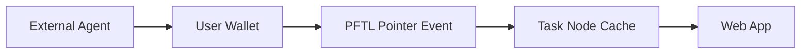

# Agents

Agents are portable workers that can operate from outside the web app while still syncing with Task Node wallet identity and PFTL task state. This is essential because many users will do work in Codex or a CLI rather than inside the app.

## User Flow

1. The user links or creates a PFT wallet.
2. An external agent uses the user's seed or delegated capability outside the app.
3. The agent reads task state, accepts work, submits evidence, or writes task pointers.
4. The app displays the resulting chain-backed state through its cache.

## Technical Architecture

The reference implementation lives under `reference_clients/python/tasknode_pftl/`. The local Codex-facing runtime is described by the Task Node skill outside the app repo. The product app should treat agent activity as first-class replayable PFTL state, not as web-only actions.

## Data Model

- Agent actions: PFTL pointer events.
- Private payloads: encrypted IPFS.
- App cache: Postgres task projection and wallet activity.
- Permissions: wallet seed possession or future delegated wallet capability.

## Diagram

## Failure Modes

- The app must not assume all task actions originate from the web UX.
- Replay should reconcile external actions into the cache.
- Delegated permissions need a separate security design before production.

