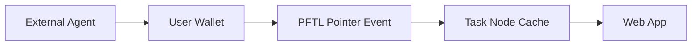

# Agents

Agents are portable workers that can operate from outside the web app while still syncing with Task Node wallet identity and PFTL task state. This is essential because many users will do work in Codex or a CLI rather than inside the app.

## User Flow

1. The user links or creates a PFT wallet.
2. An external agent uses the user's seed or delegated capability outside the app.
3. The agent reads task state, accepts work, submits evidence, or writes task pointers.
4. The app displays the resulting chain-backed state through its cache.

## Technical Architecture

The reference implementation lives under `reference_clients/python/tasknode_pftl/`. The product app should treat agent activity as first-class replayable PFTL state, not as web-only actions.

## Data Model

- Agent actions: PFTL pointer events.
- Private payloads: encrypted IPFS.
- App cache: Postgres task projection and wallet activity.
- Permissions: wallet seed possession or future delegated wallet capability.

## Diagram

## Failure Modes

- The app must not assume all task actions originate from the web UX.
- Replay should reconcile external actions into the cache.
- Delegated permissions need a separate security design before production.

## Reviewer To Do List

Review implementation against this document (agents). Mark each item when verified.

### Memory Efficiency
- [ ] List and detail views read Postgres caches with documented caps or pagination.
- [ ] Async workers handle heavy model/IPFS work; primary UX path stays non-blocking.
- [ ] External agents use pointer-native reads; Postgres cache optional acceleration only.

### Code Quality
- [ ] Code references in doc resolve to existing modules and routes.
- [ ] Failure modes documented here have matching user-visible error handling.
- [ ] Python reference client paths documented and runnable.

### Coherence
- [ ] Surface behavior matches Architecture docs for cache vs canonical state.
- [ ] Hidden/not-exposed features labeled honestly if mentioned.
- [ ] Agent workflows align with PFTL task lifecycle doc, not PFTasks legacy.

### Bloat
- [ ] Surface does not duplicate logic owned by shared modules or workers.
- [ ] UI state not duplicated in unrelated caches without invalidation rules.
- [ ] Reference clients do not duplicate full app server logic unnecessarily.

### Security
- [ ] Account scoping enforced on all read/write API paths for this surface.
- [ ] Wallet-bound actions require linked unlocked wallet as documented.
- [ ] Agent examples never commit seeds or operator keys.
