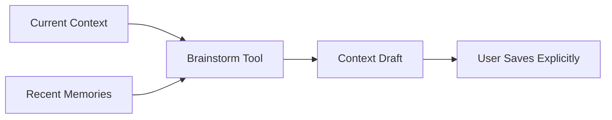

# Brainstorming Context

Brainstorming Context helps the user explore possible additions or changes to their context document before committing them. It is a thinking surface, not an automatic rewrite.

## User Flow

1. The user opens Brainstorming Context.
2. The app provides current context and recent memory as grounding.
3. The model proposes themes, missing context, and clarifying questions.
4. The user chooses what to keep.

## Technical Architecture

This should reuse the chat runner with a typed system packet. The output should be represented as a draft, not as saved context. If the user accepts changes, the context cache save path should be used.

Relevant code surfaces are `src/main.jsx`, `src/features/context/context-view-utils.jsx`, `server/repositories/context.js`, and `server/chat-router.js`.

## Data Model

- Reads: current context cache and memory cache.
- Writes: none until the user chooses to save.
- Optional future writes: draft table for unsaved context proposals.

## Diagram

## Failure Modes

- The tool should not overwrite current context.
- Low-confidence suggestions should be labeled as suggestions.
- Empty context should produce questions, not filler copy.

## Reviewer To Do List

Review implementation against this document (brainstorming context). Mark each item when verified.

### Memory Efficiency
- [ ] Hidden tool paths not loaded in default UI bundle if still unshipped.

### Code Quality
- [ ] If code remains, it shares chat-router boundaries and is feature-flagged or unreachable.

### Coherence
- [ ] Doc states not exposed; no app nav advertises this surface.

### Bloat
- [ ] Consider removing dead UI entry points if tool remains deferred.

### Security
- [ ] Unreachable surfaces cannot be invoked via API without auth checks.
