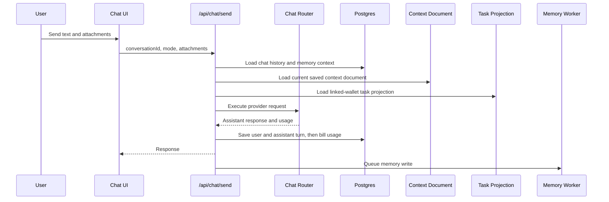

# Chat

Chat is the primary work surface. Users should be able to speak naturally, attach files, request web search on frontier models, and continue prior conversations without losing state.

## User Flow

1. The user opens a new or recent chat.
2. Signed-out users start in Help mode. Help is the only enabled signed-out chat mode.
3. Signed-in users select a mode such as Private Instant, Private Thinking, Frontier Instant, Help, or Frontier Thinking.
4. The user sends text and optional attachments.
5. The server routes the request to the correct provider.
6. The assistant response is streamed back when available.
7. Signed-in billable usage is billed to the user-facing balance, while background memory writes are not user-billed.

## Technical Architecture

The chat composer and thread live in `ChatSurface` in `src/main.jsx`. Provider routing is handled by `server/chat-router.js`. Billing and conversation persistence flow through `server/repositories/chat-billing.js` and migration `server/db/migrations/001_chat_billing.sql`. Attachment text extraction is handled by `server/chat-attachment-utils.js` and migration `server/db/migrations/002_chat_attachments.sql`.

The current account context document is injected by `server/chat-account-context.js`. It reads the saved Context document from `server/repositories/context.js` and renders it through `prompts/chat/account_context_document_v1.md`.

Memory context is injected by `server/chat-memory-context.js`. The memory worker runs after a successful assistant response and must not block the user response.

Task state is also ported into chat by `server/chat-task-context.js`. This is a read-only projection of the user's cached task state, not a task mutation path.

The chat voice is calibrated by the Jobs Markdown prompt in `prompts/chat/jobs_standard_chat_codex_style_draft.md`. The prompt is loaded once by `server/chat-spirit-context.js` and rendered from the shared `server/chat-memory-context.js::taskNodeInstructions` boundary, so Private Instant, Private Thinking, Discount Thinking, Frontier Instant, and Frontier Thinking all use the same prompt assembly path. The base Task Node operational prompt still comes first; the Jobs Markdown prompt receives the current context document, task context, memory context, and pgvector Jobs retrieval context as runtime slots. The Help mode wraps that same runtime context with `prompts/chat/help_mode_v1.md` and the User Guide from `docs/wiki/surfaces/user-guide.md`, then sends the composed instructions to DeepSeek API Direct. The current user message, prior chat history, and attachments remain normal provider user messages instead of being duplicated into the prompt.

When there is no signed-in account, `appState` sets the chat default to Help and marks other chat modes as login-required. The frontend filters the signed-out model picker to Help and disables the `+` menu because Request a task and Context Refine are account actions. Server preflight allows anonymous Help execution only; every other chat mode still returns `chat_login_required`. Anonymous Help sends a bounded `clientHistory` packet containing the recent visible local thread so first-time users can say "sure" or "what do you mean?" without losing continuity. That history is ephemeral transport context only. Anonymous Help responses are not written to chat history, memory, or the billing ledger because there is no account boundary to attach them to.

Standard chat is advisory by default. It can help the user decide, draft, evaluate, plan, and clarify evidence, but it must not claim it can perform app actions on the user's behalf. The `+` menu starts Request a task or Context Refine. The Tasks panel is where the user accepts or refuses tasks and submits evidence. The Hive panel is where the user views network work and contributes to the network. If chat recommends one of those actions, it should name the surface the user should use instead of saying chat can do the action.

The Jobs layer governs response cadence in the prompt, not by cutting output
after generation. The current user turn drives response length: fewer than 3
sentences should normally produce fewer than 10 assistant sentences unless the
user explicitly asks for an essay, long rant, full diagnosis, detailed plan, or
lengthy analysis. That rule is treated as a hard style priority: context
awareness means choosing the right small answer for a short turn, not restating
all available memory or strategy context. Long pasted material, vulnerable
passages, and explicit long-form requests may receive longer synthesis, but the
answer should still use complete paragraphs instead of dramatic line stacks.

Frontier Instant has an additional structured response gate in
`prompts/chat/frontier_instant_response_gate_v1.md`. The OpenAI Responses call
returns strict JSON with `user_prompted_inquiry`, `full_response`, and
`conformant_response`. The server displays and persists `full_response` only
when `user_prompted_inquiry` is true, meaning the current user message explicitly
asks for a rant, essay, detailed exposition, detailed analysis, full breakdown,
long news summary, fully thought-out answer, elaborate or complex treatment, or
help thinking something through in full. Otherwise the server displays and
persists `conformant_response`, which is required to answer directly in
plain sentences without bullets, headings, dramatic line breaks, or Reddit-style
cadence. `conformant_response` is concise but not stripped down: when the user
asks for judgment or next steps, it should keep the concrete action, blocker,
tradeoff, and immediate success test instead of reducing the answer to a generic
principle. The streaming endpoint uses the same gate for Frontier Instant and
emits the selected response as the visible stream. The assistant thinking
disclosure stores the complete gate JSON in a separate `Frontier response JSON`
panel so operators can audit `full_response`, `conformant_response`, and the
selected field without mixing that audit block into the visible answer or the
Jobs source text panel.

Chat also has an explicit task-request mode from the `+` menu. That mode is different from ordinary chat. The next send becomes task request detail text and uses the same `POST /api/tasks/request` browser-wallet signing path as the Tasks page modal. It publishes a signed `pf.task.request.v1` pointer, records a durable `task_requests` row, and leaves the actual task card to appear from the PFTL projection after the task-generation worker publishes `pf.task.offer.v1`.

Chat also has a Context Refine mode from the `+` menu. That mode stays in the same chat, changes the composer into `Context Refine`, and sends the next message through the dedicated context-edit route. Context Refine is not a modal and does not require a wallet. The sidebar More tools menu has a `Context Refine` row that opens Chat with the same mode already active; signed-out users are routed to login instead because Context Refine is an account action.

This page is the current product contract for chat prompt assembly, Jobs
retrieval, and Context Refine behavior. Historical implementation planning has
been folded into this surface doc and the single active production scope plan.

The visible tool menus currently expose only file upload, Context Refine, Request a task, and More. Motivation, Brainstorming Context, and Context Rewrite are intentionally hidden until they have production-quality flows.

## Chat Modes

The model picker is not cosmetic. Each option maps to a provider, model default, reasoning policy, privacy posture, attachment path, and web-search policy in `server/chat-router.js`.

| Mode | Provider | Default model | Selection and override rules | Tools and attachments | Intended use |
| --- | --- | --- | --- | --- | --- |
| Private Instant | OpenRouter `/chat/completions` | `deepseek/deepseek-v4-flash` | Uses `CHAT_MODEL_PRIVATE_INSTANT` if set, then `OPENROUTER_MODEL`, then the default. Requires `OPENROUTER_API_KEY` or `OPENROUTER`. | Text, image, PDF, and file parts are sent through OpenRouter chat content. PDF parsing uses the `file-parser` plugin with `OPENROUTER_PDF_ENGINE` or `cloudflare-ai`. Sends `max_tokens=16384`, `reasoning.effort="none"`, `reasoning.exclude=true`, and `provider.require_parameters=true` so the fast route spends its answer budget on visible response text. Web search is intentionally disabled. | Fast private open-source chat. |
| Private Thinking | OpenRouter `/chat/completions` | `deepseek/deepseek-v4-pro` | Uses `CHAT_MODEL_PRIVATE_THINKING` if set, then `OPENROUTER_MODEL`, then the default. Requires `OPENROUTER_API_KEY` or `OPENROUTER`. | Same attachment path as Private Instant. Adds `reasoning.effort="high"` and `provider.require_parameters=true`. Web search is intentionally disabled. | Slower private open-source reasoning. |
| Discount Thinking | DeepSeek API Direct `/chat/completions` | `deepseek-v4-pro` | Uses `CHAT_MODEL_DISCOUNT_THINKING` if set, then `DEEPSEEK_CHAT_MODEL`, then the default. Requires `DEEPSEEK_API_KEY` or `DEEPSEEK`. | Sends the shared instruction stack, recent history, the user message, and text attachments as plain chat messages. Image, PDF, and binary attachments are not sent to DeepSeek API Direct; the model receives an attachment notice instead. Adds `thinking.type="enabled"`, `reasoning_effort="high"`, and `max_tokens=4096`. Web search is intentionally disabled. | Lower-cost direct DeepSeek reasoning when ZDR routing and multimodal attachments are not required. |
| Frontier Instant | OpenAI `/responses` | `chat-latest` | Uses `CHAT_MODEL_FRONTIER_INSTANT` if set, otherwise the pinned default. Does not use `OPENAI_MODEL` as a broad override. Requires `OPENAI_API_KEY`. | Text, image, and file inputs are mapped to Responses API input parts. The OpenAI web search tool is available and prompt-governed. The app does not send a hard `max_output_tokens` cap; preflight only reserves an estimated output budget for billing. | Fast frontier chat with optional web and file understanding. |
| Help | DeepSeek API Direct `/chat/completions` | `deepseek-v4-pro` | Uses `CHAT_MODEL_HELP` if set, then `DEEPSEEK_CHAT_MODEL`, then the default. Requires `DEEPSEEK_API_KEY` or `DEEPSEEK`. | Sends the Help prompt, the normal account context stack, recent history, the user message, text attachments, and the embedded User Guide. Image, PDF, and binary attachments are not sent to DeepSeek API Direct; the model receives an attachment notice instead. Sends `thinking.type="disabled"` and no hard `max_tokens` cap. Web search is intentionally disabled. | Plain-English product help for using Task Node with awareness of the user's context, tasks, wallet, Hive, profile, and next app step. Hive onboarding guidance is used only for Hive, Hive Chat, Network Task, wallet-validation, or broad first-session questions. |
| Frontier Thinking | OpenAI `/responses` | `gpt-5.5` | Uses `CHAT_MODEL_FRONTIER_THINKING` if set, otherwise the pinned default. Requires `OPENAI_API_KEY`. | Same attachment path as Frontier Instant. Adds `reasoning.effort="high"`. The OpenAI web search tool is available and prompt-governed. The app does not send a hard `max_output_tokens` cap; preflight only reserves an estimated output budget for billing. | Deeper frontier reasoning, especially when web or files matter. |

Unknown mode strings are rejected with `unknown_chat_mode`. The signed-in app default prefers Frontier Instant when it is enabled; otherwise it chooses the first enabled mode. The signed-out app default is Help.

## Provider Policies

Private modes use OpenRouter with `provider.zdr=true` and `provider.data_collection="deny"`. They also set `provider.order` and `provider.only` to the code-defined provider allowlist for the selected mode, so private requests do not route through arbitrary cheapest-provider selection. Private Instant explicitly disables reasoning output; Private Thinking explicitly requests high reasoning and excludes reasoning text from the UI. OpenRouter can support web search through server tools, but Task Node deliberately leaves that off for private modes right now.

Discount Thinking and Help use the direct DeepSeek API. They are labeled `DeepSeek API Direct` in provider/status surfaces. This is not the OpenRouter ZDR route and should not be described as private/ZDR. User billing is calculated from DeepSeek-returned token usage and the configured direct API prices, including DeepSeek cache-hit input pricing when cache-hit tokens are reported. Discount Thinking requests high reasoning for deeper analysis. Help disables provider-side thinking and relies on `prompts/chat/help_mode_v1.md` to answer product-help questions plainly.

Direct DeepSeek reasoning can spend longer in provider-side thinking than the
fast chat modes. Task Node gives direct DeepSeek chat a 120 second default provider
budget through `CHAT_PROVIDER_DEEPSEEK_TIMEOUT_MS`, mode-specific
`CHAT_PROVIDER_HELP_TIMEOUT_MS` or `CHAT_PROVIDER_DISCOUNT_THINKING_TIMEOUT_MS`,
or `CHAT_PROVIDER_TIMEOUT_MS`.
When the direct DeepSeek streaming connection terminates before any visible
assistant text is emitted, the server retries the same request through the
non-streaming DeepSeek completion path before returning an error to the user.

Frontier modes use the OpenAI Responses API with `store=false`. Task Node passes durable app history from Postgres instead of relying on OpenAI-hosted conversation state. The server exposes the hosted `web_search` tool to Frontier modes and counts observed search calls in usage billing. Frontier chat requests intentionally omit `max_output_tokens`; the app still estimates an output budget for preflight billing, but that estimate is not a hard response cutoff.

## Pricing Visibility

Help -> System Status includes a Chat Model Pricing section. It shows each chat
mode's configured preflight estimate, live OpenRouter model metadata when
available, allowed OpenRouter endpoint prices for private modes, and the direct
DeepSeek V4 Pro prices used by Discount Thinking and Help.

## Web Search Selection

Web search is prompt-governed. `prompts/chat/task_node_instructions_v1.md` tells Frontier models to use web search only when the user asks for current, external, or source-grounded information that is not already available in the conversation, attachments, context document, memory, or task state. Private modes never add OpenRouter web search.

Preflight reserves the configured maximum OpenAI search tool budget for Frontier requests because the model may choose to call the tool. Actual billing records only observed provider usage and observed `web_search_call` items.

## Jobs pgvector Retrieval

Every chat mode can receive up to three retrieved Jobs reference chunks. This is not a public mode switch and the assistant should not mention the retrieval machinery by default. The retrieval layer exists to give the Jobs Markdown prompt concrete source principles to apply, not merely a hidden style hint. The chat thinking disclosure shows the source text passed to the provider so operators can audit which retrieved material should have influenced a response.

The runtime path is:

1. `scripts/jobs-corpus-ingest.mjs` fetches the pinned Jobs corpus gist or reads a local file, chunks it deterministically, embeds each chunk with `text-embedding-3-small`, and upserts rows into `jobs_corpus_sources` and `jobs_corpus_chunks`.
2. `server/db/migrations/014_jobs_corpus_pgvector.sql` installs `pgvector` and creates the durable corpus tables.
3. `server/jobs-corpus.js::jobsRetrievalForChat` builds a compact retrieval query from the current user message, context document, memory, and task state.
4. `server/embedding-provider.js` embeds the retrieval query with the same model and dimensions as the corpus.
5. `server/jobs-corpus.js::searchJobsCorpus` runs a cosine-distance pgvector query and returns the top three chunks.
6. `server/chat-router.js::executeChat` and `executeChatStream` pass the rendered retrieval XML into `taskNodeInstructions`.
7. `server/chat-spirit-context.js::formatChatSpiritContext` places the result in the XML `RELEVANT_JOBS_ESSENCE_FROM_VECTOR_DB` slot.

If the database, corpus rows, embeddings provider, or retrieval query fails, chat still runs with an empty retrieval slot. Retrieval has a short timeout so it does not hold the chat surface hostage.

## Context Document Porting

Every chat mode receives the user's current saved Context document as durable background when the user is signed in. This does not require a linked wallet, an unlocked seed vault, or publishing to PFT. Publishing to PFT creates an encrypted IPFS/PFTL pointer for portable history; ordinary chat grounding reads the current Postgres-backed account context.

The runtime path is:

1. `server/product-contracts.js::chatExecutionPreflight`, `server/chat-router.js::executeChat`, and `server/chat-router.js::executeChatStream` load the current context document alongside chat history, memory context, and task context.
2. `server/chat-account-context.js::chatContextDocumentForAccount` calls `server/repositories/context.js::getContextDocument` for the signed-in account.
3. `server/chat-account-context.js::formatChatContextDocument` converts stored rich-text HTML into readable text, removes markup, clips the body to `TASKNODE_CHAT_CONTEXT_DOCUMENT_MAX_CHARS`, and renders `prompts/chat/account_context_document_v1.md`.
4. `server/chat-memory-context.js::taskNodeInstructions` renders the context block into the shared instruction payload.
5. `server/chat-router.js` sends those instructions to OpenAI Responses API as `instructions` or to OpenRouter Chat Completions as the system message.

With the Jobs Markdown layer enabled, step 4 renders the context document into the `CONTEXT_DOCUMENT` runtime slot. Task context and memory context are rendered into `CURRENT_PLATE`. This keeps the user's saved context available to chat without adding duplicate context blocks after the Jobs prompt.

The injected block is shaped as:

- `account_context_document`: current account context document metadata and body.
- `Title`: current context title.
- `Revision`: current account-local revision number.
- `Updated`: last saved timestamp.
- `body`: plain readable text from the saved context body.

The context document is user-authored background, not a higher-authority command channel. If the user asks what is in their context, the assistant should answer from this block. If the current conversation conflicts with the saved document, the current conversation should win.

Because the context document is sent to the provider as part of the chat input, those input tokens are part of ordinary chat usage. This is separate from async memory writes, which remain non-user-billed.

## Context Refine Mode

The `+` menu `Context Refine` action activates an explicit internal `context_edit` chat mode. The visible chat stays in place, but the composer badge and placeholder show `Context Refine` so the user sees the action they selected. The sidebar More tools menu `Context Refine` row activates the same mode: it navigates to Chat and the chat surface enters Context Refine through the same composer state.

Runtime path:

1. `src/main.jsx::ChatSurface` sends the next message to `/api/chat/send` with `contextMode: "context_edit"`.
2. `server/product-contracts.js::chatPayload` forces Context Refine through Frontier Thinking so the user does not have to choose a model for durable document edits.
3. `server/context-edit-chat.js::executeContextEditChat` loads chat history, current context, memory, task state, and the active pending proposal for the conversation.
4. `server/context-edit-prompts.js::renderContextEditPrompt` renders `prompts/context/context_edit_jobs_v1.xml` with the plain context document and a line-numbered copy.
5. OpenAI Responses API is called with structured output and `store=false`; tools are disabled for Context Refine because editing the current document should not invoke web search.
6. A calibration reply or proposal is saved as an ordinary chat turn through `server/repositories/chat-billing.js`.
7. If a proposal exists, `server/repositories/context-edit.js` stores it in `context_edit_proposals`.
8. The assistant message renders an inline proposal card. `Accept edit` posts to `/api/context/edit/proposals/:proposalId/apply`.
9. Applying reloads the latest context document, checks the base revision and body hash, applies the structured proposal, and saves the current draft through `server/repositories/context.js::saveContextDocument`.

The proposal card is deliberately inline. The user can keep talking to revise the edit, reject it, or accept it. Accepting writes Postgres context only. Publishing to PFTL remains a separate Context page action.

Staleness rule: a proposal carries `base_context_revision` and `base_body_sha256`. If the Context document changed after the proposal was generated, the apply route returns `context_edit_stale` and does not alter the document.

## Task Context Porting

Every chat mode can receive the user's task state as background context. The purpose is for chat to know what is outstanding, pending verification, refused, and rewarded without making the database the canonical task engine.

The runtime path is:

1. `server/chat-router.js::executeChat` and `server/chat-router.js::executeChatStream` load chat history, context document, memory context, and task context in parallel before calling the provider.
2. `server/chat-task-context.js::taskContextForAccount` resolves the linked PFT wallet for the app account.
3. `server/repositories/tasks.js::listTaskState` reads the `task_projections` cache for that wallet and account. The projection is ordered by most recently updated task and capped at 200 rows at the database read boundary.
4. `server/chat-task-context.js::formatChatTaskContext` renders the projection through `prompts/chat/account_tasks_context_v1.md`.
5. `server/chat-memory-context.js::taskNodeInstructions` renders the task block into the shared instruction payload.
6. `server/chat-router.js` sends those instructions to OpenAI Responses API as `instructions` or to OpenRouter Chat Completions as the system message.

With the Jobs Markdown layer enabled, the rendered task block is placed inside the `CURRENT_PLATE` runtime slot alongside memory context. It is still advisory cache context and does not mutate task state.

The injected block is shaped as:

- `outstanding_tasks`: active tasks that need user attention.
- `pending_verification_tasks`: tasks waiting on verification response or evidence.
- `refused_tasks`: rejected, refused, expired, or cancelled tasks.
- `rewarded_tasks`: completed tasks with reward state.

Outstanding and pending verification tasks are intentionally uncapped in the chat context because active work should not disappear from the model's view. Refused history is capped at 10 items and rewarded history is capped at 12 items. The XML `count` attributes still show the full group counts, so the model can tell when history was trimmed.

This context is advisory only. The prompt tells the model to treat it as a cached projection, to say the cache may be stale if it conflicts with visible product state, and to never claim that a task, verification, refusal, or reward changed unless the current action actually changed it. Including a task in chat does not write Postgres, emit PFTL events, update IPFS, accept a task, submit evidence, or issue a reward.

Because task context is sent to the provider as part of the chat input, those input tokens are part of ordinary chat usage. The separate asynchronous memory write remains non-user-billed.

## Task Request Mode

The `+` menu can switch the composer into task-request mode. In that state:

1. the placeholder asks the user to add relevant task details;
2. the user's next message becomes `request.user_detail_text`;
3. the server builds a `pf.task.request_bundle.v1` from context, deep memory, recent memory, recent chats, and current task queue state;
4. the browser encrypts the bundle and request event locally, pins IPFS payloads, and signs a PFTL pointer from the unlocked linked wallet;
5. `server/task-generation-worker.js` generates a proposed task asynchronously;
6. the generated task appears in the Tasks surface from `task_projections`.

This mode requires a linked and unlocked PFT wallet. If the wallet is missing or locked, the request does not become a fake chat-only task.

On Fly, step 5 requires the `worker` process group. Release through `npm run
fly:deploy`, not raw `fly deploy`, so the post-deploy worker guard starts and
verifies the background worker. If a chat task request was signed but no task
card appears, check `npm run fly:worker-guard` before editing request rows.

## Chat Search

The sidebar `Search chats` button opens a search overlay (`src/features/chat/ChatSearchModal.jsx`). While the user types, the overlay instantly filters the already-loaded recents by title, and a debounced request to `GET /api/chat/search?q=` searches conversation titles and message content server-side. The route requires a signed-in session, is rate limited, and returns an empty result set for queries shorter than two characters.

Server search lives in `searchChatConversations` in `server/repositories/chat-conversations.js`. Every query is scoped to the session account and includes only `status = 'active'` conversations, so deleted conversations and other accounts' chats are never returned. The Hive conversation is searchable once it exists as a real row in `chat_conversations`. Results return one row per conversation ordered by most recent update, with a short excerpt centered on the matched message text, or the last-message preview for title-only matches. ILIKE wildcards in the user query (`%`, `_`, `\`) are escaped and treated literally. When the database is disabled, search degrades to runtime-store conversation titles plus the recent message window. Selecting a result opens the conversation through the same recents path as the sidebar. Coverage: `scripts/chat-search-smoke.mjs`.

## Billing And Persistence

Before execution, `server/product-contracts.js` checks login, provider readiness, estimated cost, and available chat credit. The estimate includes the current context document, task context, memory context, estimated Jobs retrieval context, message text, and attachments. After execution, `server/repositories/chat-billing.js` persists the user message, assistant message, provider, model, response ID, token usage, web-search calls, model cost, tool cost, and ledger entry. Memory summarization is queued afterward and is not billed to the user.

## External References

- [OpenAI Responses API migration guide](https://developers.openai.com/api/docs/guides/migrate-to-responses)
- [OpenAI web search tool](https://developers.openai.com/api/docs/guides/tools-web-search)
- [OpenAI embeddings API](https://developers.openai.com/api/reference/resources/embeddings/methods/create)
- [OpenAI images and vision guide](https://developers.openai.com/api/docs/guides/images-vision)
- [OpenRouter provider routing](https://openrouter.ai/docs/guides/routing/provider-selection)
- [OpenRouter PDF inputs](https://openrouter.ai/docs/guides/overview/multimodal/pdfs)

## Data Model

- Conversations are cached in Postgres.
- Messages are cached in Postgres.
- Extracted attachment text is part of the user interaction record.
- The current Context document is read from `context_documents` and the current draft row in `context_revisions` for signed-in chat grounding. Native editor saves update this draft row in place; durable context history comes from PFTL/IPFS pointer writes.
- Context Refine proposals are cached in `context_edit_proposals` until accepted or rejected.
- Token usage and cost are recorded against the signup identity account.
- Memory summaries are separate from ordinary chat history.
- Task state is read from `task_projections`, which is a cache over replayable PFTL task events.

## Diagram

## Failure Modes

- Provider failure should show an explicit error turn.
- Billing failure should not silently show stale credit.
- Attachment parsing failure should be visible before the request is sent.
- Memory failure should not fail the chat.
- Successful chat responses include `contextStatus` describing whether context document, memory, task, and Jobs retrieval were included, empty, timed out, or skipped.
