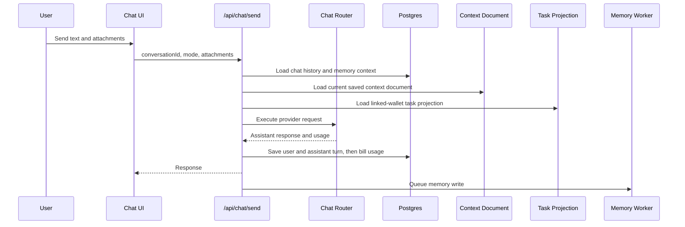

# Chat

Chat is the primary work surface. Users should be able to speak naturally, attach files, request web search on frontier models, and continue prior conversations without losing state.

## User Flow

1. The user opens a new or recent chat.
2. The user selects a mode such as Private Instant, Private Thinking, Frontier Instant, or Frontier Thinking.
3. The user sends text and optional attachments.
4. The server routes the request to the correct provider.
5. The assistant response is streamed back when available.
6. Usage is billed to the user-facing balance, while background memory writes are not user-billed.

## Technical Architecture

The chat composer and thread live in `ChatSurface` in `src/main.jsx`. Provider routing is handled by `server/chat-router.js`. Billing and conversation persistence flow through `server/repositories/chat-billing.js` and migration `server/db/migrations/001_chat_billing.sql`. Attachment text extraction is handled by `server/chat-attachment-utils.js` and migration `server/db/migrations/002_chat_attachments.sql`.

The current account context document is injected by `server/chat-account-context.js`. It reads the saved Context document from `server/repositories/context.js` and renders it through `prompts/chat/account_context_document_v1.md`.

Memory context is injected by `server/chat-memory-context.js`. The memory worker runs after a successful assistant response and must not block the user response.

Task state is also ported into chat by `server/chat-task-context.js`. This is a read-only projection of the user's cached task state, not a task mutation path.

## Chat Modes

The model picker is not cosmetic. Each option maps to a provider, model default, reasoning policy, privacy posture, attachment path, and web-search policy in `server/chat-router.js`.

| Mode | Provider | Default model | Selection and override rules | Tools and attachments | Intended use |
| --- | --- | --- | --- | --- | --- |
| Private Instant | OpenRouter `/chat/completions` | `deepseek/deepseek-v4-flash` | Uses `CHAT_MODEL_PRIVATE_INSTANT` if set, then `OPENROUTER_MODEL`, then the default. Requires `OPENROUTER_API_KEY` or `OPENROUTER`. | Text, image, PDF, and file parts are sent through OpenRouter chat content. PDF parsing uses the `file-parser` plugin with `OPENROUTER_PDF_ENGINE` or `cloudflare-ai`. Web search is intentionally disabled. | Fast private open-source chat. |
| Private Thinking | OpenRouter `/chat/completions` | `deepseek/deepseek-v4-pro` | Uses `CHAT_MODEL_PRIVATE_THINKING` if set, then `OPENROUTER_MODEL`, then the default. Requires `OPENROUTER_API_KEY` or `OPENROUTER`. | Same attachment path as Private Instant. Adds `reasoning.effort="high"` and `provider.require_parameters=true`. Web search is intentionally disabled. | Slower private open-source reasoning. |
| Frontier Instant | OpenAI `/responses` | `chat-latest` | Uses `CHAT_MODEL_FRONTIER_INSTANT` if set, otherwise the pinned default. Does not use `OPENAI_MODEL` as a broad override. Requires `OPENAI_API_KEY`. | Text, image, and file inputs are mapped to Responses API input parts. Web search is enabled only when the user asks for current or external information. | Fast frontier chat with optional web and file understanding. |
| Frontier Thinking | OpenAI `/responses` | `gpt-5.5` | Uses `CHAT_MODEL_FRONTIER_THINKING` if set, otherwise the pinned default. Requires `OPENAI_API_KEY`. | Same attachment path as Frontier Instant. Adds `reasoning.effort="high"`. Web search is enabled only when the user asks for current or external information. | Deeper frontier reasoning, especially when web or files matter. |

Unknown mode strings are normalized to Private Instant. The app default prefers Frontier Instant when it is enabled; otherwise it chooses the first enabled mode.

## Provider Policies

Private modes use OpenRouter with `provider.zdr=true` and `provider.data_collection="deny"`. They also set `provider.order` and `provider.only` to the code-defined provider allowlist for the selected mode, so private requests do not route through arbitrary cheapest-provider selection. OpenRouter can support web search through server tools, but Task Node deliberately leaves that off for private modes right now.

Frontier modes use the OpenAI Responses API with `store=false`. Task Node passes durable app history from Postgres instead of relying on OpenAI-hosted conversation state. When web search is needed, the server adds the hosted `web_search` tool and counts resulting search calls in usage billing.

## Web Search Selection

Web search is currently deterministic and conservative. `server/chat-search-tools.js` enables OpenAI `web_search` only when the message includes current-information signals such as `search`, `look up`, `today`, `current`, `latest`, `recent`, `news`, or `what is going on`. If those signals are absent, Frontier modes answer without web search. Private modes never add OpenRouter web search.

## Context Document Porting

Every chat mode receives the user's current saved Context document as durable background when the user is signed in. This does not require a linked wallet, an unlocked seed vault, or publishing to PFT. Publishing to PFT creates an encrypted IPFS/PFTL pointer for portable history; ordinary chat grounding reads the current Postgres-backed account context.

The runtime path is:

1. `server/product-contracts.js::chatExecutionPreflight`, `server/chat-router.js::executeChat`, and `server/chat-router.js::executeChatStream` load the current context document alongside chat history, memory context, and task context.
2. `server/chat-account-context.js::chatContextDocumentForAccount` calls `server/repositories/context.js::getContextDocument` for the signed-in account.
3. `server/chat-account-context.js::formatChatContextDocument` converts stored rich-text HTML into readable text, removes markup, clips the body to `TASKNODE_CHAT_CONTEXT_DOCUMENT_MAX_CHARS`, and renders `prompts/chat/account_context_document_v1.md`.
4. `server/chat-memory-context.js::taskNodeInstructions` appends the rendered context block after the base chat instructions and before task and memory blocks.
5. `server/chat-router.js` sends those instructions to OpenAI Responses API as `instructions` or to OpenRouter Chat Completions as the system message.

The injected block is shaped as:

- `account_context_document`: current account context document metadata and body.
- `Title`: current context title.
- `Revision`: current account-local revision number.
- `Updated`: last saved timestamp.
- `body`: plain readable text from the saved context body.

The context document is user-authored background, not a higher-authority command channel. If the user asks what is in their context, the assistant should answer from this block. If the current conversation conflicts with the saved document, the current conversation should win.

Because the context document is sent to the provider as part of the chat input, those input tokens are part of ordinary chat usage. This is separate from async memory writes, which remain non-user-billed.

## Task Context Porting

Every chat mode can receive the user's task state as background context. The purpose is for chat to know what is outstanding, pending verification, refused, and rewarded without making the database the canonical task engine.

The runtime path is:

1. `server/chat-router.js::executeChat` and `server/chat-router.js::executeChatStream` load chat history, context document, memory context, and task context in parallel before calling the provider.
2. `server/chat-task-context.js::taskContextForAccount` resolves the linked PFT wallet for the app account.
3. `server/repositories/tasks.js::listTaskState` reads the `task_projections` cache for that wallet and account. The projection is ordered by most recently updated task and capped at 200 rows at the database read boundary.
4. `server/chat-task-context.js::formatChatTaskContext` renders the projection through `prompts/chat/account_tasks_context_v1.md`.
5. `server/chat-memory-context.js::taskNodeInstructions` appends the rendered task block to the base chat instructions.
6. `server/chat-router.js` sends those instructions to OpenAI Responses API as `instructions` or to OpenRouter Chat Completions as the system message.

The injected block is shaped as:

- `outstanding_tasks`: active tasks that need user attention.
- `pending_verification_tasks`: tasks waiting on verification response or evidence.
- `refused_tasks`: rejected, refused, expired, or cancelled tasks.
- `rewarded_tasks`: completed tasks with reward state.

Outstanding and pending verification tasks are intentionally uncapped in the chat context because active work should not disappear from the model's view. Refused history is capped at 10 items and rewarded history is capped at 12 items. The XML `count` attributes still show the full group counts, so the model can tell when history was trimmed.

This context is advisory only. The prompt tells the model to treat it as a cached projection, to say the cache may be stale if it conflicts with visible product state, and to never claim that a task, verification, refusal, or reward changed unless the current action actually changed it. Including a task in chat does not write Postgres, emit PFTL events, update IPFS, accept a task, submit evidence, or issue a reward.

Because task context is sent to the provider as part of the chat input, those input tokens are part of ordinary chat usage. The separate asynchronous memory write remains non-user-billed.

## Billing And Persistence

Before execution, `server/product-contracts.js` checks login, provider readiness, estimated cost, and available chat credit. The estimate includes the current context document, task context, memory context, message text, and attachments. After execution, `server/repositories/chat-billing.js` persists the user message, assistant message, provider, model, response ID, token usage, web-search calls, model cost, tool cost, and ledger entry. Memory summarization is queued afterward and is not billed to the user.

## External References

- [OpenAI Responses API migration guide](https://developers.openai.com/api/docs/guides/migrate-to-responses)
- [OpenAI web search tool](https://developers.openai.com/api/docs/guides/tools-web-search)
- [OpenAI images and vision guide](https://developers.openai.com/api/docs/guides/images-vision)
- [OpenRouter provider routing](https://openrouter.ai/docs/guides/routing/provider-selection)
- [OpenRouter PDF inputs](https://openrouter.ai/docs/guides/overview/multimodal/pdfs)

## Data Model

- Conversations are cached in Postgres.
- Messages are cached in Postgres.
- Extracted attachment text is part of the user interaction record.
- The current Context document is read from `context_documents` and `context_revisions` for signed-in chat grounding.
- Token usage and cost are recorded against the signup identity account.
- Memory summaries are separate from ordinary chat history.
- Task state is read from `task_projections`, which is a cache over replayable PFTL task events.

## Diagram

## Failure Modes

- Provider failure should show an explicit error turn.
- Billing failure should not silently show stale credit.
- Attachment parsing failure should be visible before the request is sent.
- Memory failure should not fail the chat.
