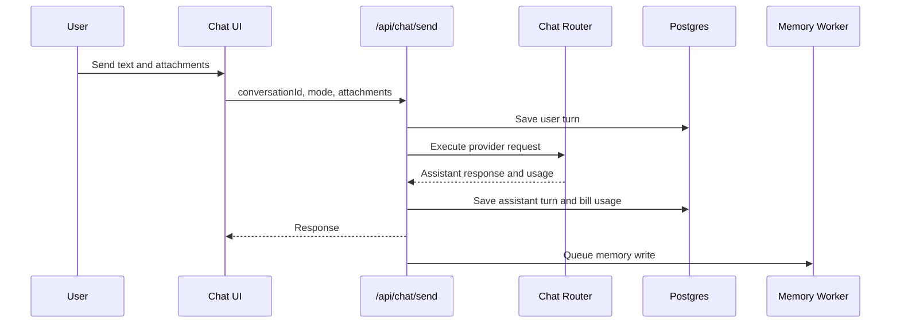

# Chat

Chat is the primary work surface. Users should be able to speak naturally, attach files, request web search on frontier models, and continue prior conversations without losing state.

## User Flow

1. The user opens a new or recent chat.
2. The user selects a mode such as Private Instant, Private Thinking, Frontier Instant, or Frontier Thinking.
3. The user sends text and optional attachments.
4. The server routes the request to the correct provider.
5. The assistant response is streamed back when available.
6. Usage is billed to the user-facing balance, while background memory writes are not user-billed.

## Technical Architecture

The chat composer and thread live in `ChatSurface` in `src/main.jsx`. Provider routing is handled by `server/chat-router.js`. Billing and conversation persistence flow through `server/repositories/chat-billing.js` and migration `server/db/migrations/001_chat_billing.sql`. Attachment text extraction is handled by `server/chat-attachment-utils.js` and migration `server/db/migrations/002_chat_attachments.sql`.

Memory context is injected by `server/chat-memory-context.js`. The memory worker runs after a successful assistant response and must not block the user response.

## Data Model

- Conversations are cached in Postgres.
- Messages are cached in Postgres.
- Extracted attachment text is part of the user interaction record.
- Token usage and cost are recorded against the signup identity account.
- Memory summaries are separate from ordinary chat history.

## Diagram

## Failure Modes

- Provider failure should show an explicit error turn.
- Billing failure should not silently show stale credit.
- Attachment parsing failure should be visible before the request is sent.
- Memory failure should not fail the chat.

