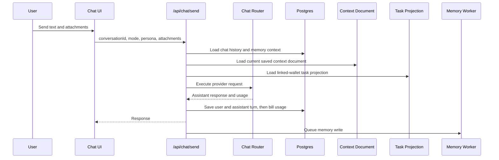

# Chat

Chat is the primary work surface. Users should be able to speak naturally,
attach files, choose between fast and deep reasoning, and continue prior
conversations without losing state.

## User Flow

1. The user opens a new or recent chat.
2. Signed-out users start in Help mode. Help is the only enabled signed-out chat mode.
3. Signed-in users select Instant, Thinking, or Help independently from the Jobs, ODV, Trading Coach, or Kravis personality.
4. The `+` menu owns personality selection. Its `More` submenu also exposes the restored Brainstorm, Motivation, Five Mirrors, I Ching, ODV, Sprint Planner, Validator, Post Fiat Q&A, and App Help modalities.
5. The user sends text and optional attachments.
6. The server validates both enums, assembles the selected prompt/context packet, and routes the request to Ambient.
7. The assistant response is streamed back when available.
8. Signed-in billable usage is billed to the user-facing balance, while background memory writes are not user-billed.

## Technical Architecture

The chat composer and thread live in `ChatSurface` in `src/main.jsx`. Provider routing is handled by `server/chat-router.js`. Billing and conversation persistence flow through `server/repositories/chat-billing.js` and migration `server/db/migrations/001_chat_billing.sql`. Attachment text extraction is handled by `server/chat-attachment-utils.js` and migration `server/db/migrations/002_chat_attachments.sql`.

The current account context document is injected by `server/chat-account-context.js`. It reads the saved Context document from `server/repositories/context.js` and renders it through `prompts/chat/account_context_document_v1.md`.

Memory context is injected by `server/chat-memory-context.js`. The memory worker runs after a successful assistant response and must not block the user response.

Task state is also ported into chat by `server/chat-task-context.js`. This is a read-only projection of the user's cached task state, not a task mutation path.

Chat model mode and personality are separate structured fields. Mode chooses the Ambient capability/model; personality or modality chooses prompt assembly and retrieval policy. `shared/chat-personas.js` owns the allowlisted IDs and aliases, `server/chat-persona-prompts.js` loads the canonical prompt, and `server/chat-memory-context.js::taskNodeInstructions` assembles the final system packet. Jobs uses `prompts/chat/jobs_standard_chat_codex_style_draft.md` plus pgvector Jobs retrieval. ODV uses `prompts/docs/odv_lindy_v1.md`; Trading Coach uses `prompts/docs/trading_coach_v1.md`; Kravis uses the system-prompt section of `prompts/kravis.md`. Restored modalities use the canonical legacy prompts under `prompts/chat_modules/`. Every non-Jobs selection still receives the account Context document, memory, task projection, conversation history, and attachments, but never the Jobs Markdown prompt or Jobs vector excerpts. The current user message remains a normal provider user message rather than being copied into the system prompt.

Post Fiat Q&A is the sourced exception to the otherwise static restored-modality prompts. `scripts/sync-post-fiat-knowledge.mjs` snapshots `docs/whitepaper.md` from `postfiatorg/postfiatl1v2` and every Markdown article under `content/blog/` from `postfiatorg/postfiatorg.github.io`, recording immutable source commits and hashes in `prompts/chat_modules/post_fiat_knowledge.json`. `server/post-fiat-knowledge.js` always supplies the canonical whitepaper boundary and a catalog synopsis for every archived article, then selects a diverse set of question-relevant whitepaper and blog snippets. Whitepaper claims outrank blog claims; dated published posts outrank older posts; source files marked `draft: true` remain labeled unpublished drafts/proposals and link to their pinned repository source instead of masquerading as public pages. Refreshing this corpus is an explicit reviewed sync, not a live network fetch during a user turn.

The server, not the browser, enforces this boundary. `server/chat-router.js::resolveChatJobsContext` returns a typed skipped result before invoking the retrieval function for ODV, Trading Coach, or Kravis, even when an internal caller supplies a pre-rendered `jobsEssence`. Unknown personality values return `unknown_chat_persona`. Each persisted user/assistant turn and run record stores the validated `chatPersona` for auditability.

When there is no signed-in account, `appState` sets the chat default to Help and marks other chat modes as login-required. The frontend filters the signed-out model picker to Help and disables the `+` menu because Request a task and Context Refine are account actions. Server preflight allows anonymous Help execution only; every other chat mode still returns `chat_login_required`. Anonymous Help sends a bounded `clientHistory` packet containing the recent visible local thread so first-time users can say "sure" or "what do you mean?" without losing continuity. That history is ephemeral transport context only. Anonymous Help responses are not written to chat history, memory, or the billing ledger because there is no account boundary to attach them to.

A new signed-in chat that is not the Hive conversation shows four starter prompt pills under the empty-state composer: `Help me build my context document`, `Give me my first task`, `How do I earn PFT?`, and `What should I do first?`. Clicking a pill prefills the composer text and focuses it; nothing is sent until the user presses send. Signed-out and Hive empty states do not show starter prompts.

Standard chat is advisory by default. It can help the user decide, draft, evaluate, plan, and clarify evidence, but it must not claim it can perform app actions on the user's behalf. The `+` menu starts Request a task, Context Refine, or Context Rewrite. The Tasks panel is where the user accepts or refuses tasks and submits evidence. The Hive panel is where the user views network work and contributes to the network. If chat recommends one of those actions, it should name the surface the user should use instead of saying chat can do the action.

The Jobs layer governs response cadence in the prompt, not by cutting output
after generation. The current user turn drives response length: fewer than 3
sentences should normally produce fewer than 10 assistant sentences unless the
user explicitly asks for an essay, long rant, full diagnosis, detailed plan, or
lengthy analysis. That rule is treated as a hard style priority: context
awareness means choosing the right small answer for a short turn, not restating
all available memory or strategy context. Long pasted material, vulnerable
passages, and explicit long-form requests may receive longer synthesis, but the
answer should still use complete paragraphs instead of dramatic line stacks.

Chat also has an explicit task-request mode from the `+` menu. That mode is different from ordinary chat. The next send becomes task request detail text and uses the same `POST /api/tasks/request` browser-wallet signing path as the Tasks page modal. It publishes a signed `pf.task.request.v1` pointer, records a durable `task_requests` row, and leaves the actual task card to appear from the PFTL projection after the task-generation worker publishes `pf.task.offer.v1`.

Chat also has a Context Refine mode from the `+` menu. That mode stays in the same chat, changes the composer into `Context Refine`, and sends the next message through the dedicated context-edit route. Context Refine is not a modal and does not require a wallet. The sidebar More tools menu has a `Context Refine` row that opens Chat with the same mode already active; signed-out users are routed to login instead because Context Refine is an account action.

This page is the current product contract for chat prompt assembly, Jobs
retrieval, and Context Refine behavior. Historical implementation planning has
been folded into this surface doc and the single active production scope plan.

The visible `+` menu exposes file upload, Context Refine, Context Rewrite, Request a task, Personality, and More. The Personality row expands inline to Jobs, ODV, Trading Coach, and Kravis. More expands inline to the restored chat modalities and closes after selection. The expanded menu is capped to the current viewport and scrolls as one surface, so every modality remains reachable at short desktop heights and on mobile instead of escaping into a clipped flyout. A selected modality becomes a visible composer mode chip, supplies its own question placeholder, and forces the request through Thinking (`z-ai/glm-5.2`) so its behavior is stable regardless of the user's ordinary chat-mode preference. Exiting the chip restores Jobs without overwriting the saved ordinary model preference. Context Rewrite remains a separate billed async full-document context pipeline documented in [Context Rewrite](#docs/context-rewrite).

I Ching requires both a private birth profile and an explicit question. On first selection, the setup dialog collects birth date, exact birth time, birth city/country, and the gender required by the traditional chart calculation. `POST /api/i-ching/profile` geocodes the place, resolves its historical timezone, adjusts the recorded time to true solar time, generates the Bā Zì and Zǐ Wēi Dòu Shù payloads, and stores them in the account-scoped `i_ching_profiles` row. A successful save does not silently dismiss the modal: it shows an explicit `Profile saved` completion state, reports the resolved timezone and true solar time, and requires the user to continue with `Ask your I Ching question`. On every later selection, the composer displays `Profile ready` after the profile GET confirms the account-scoped chart still exists. The profile and computed chart are private chat inputs; the public profile API never exposes them. Canceling setup exits the modality, and server preflight returns `i_ching_profile_required` before provider execution or billing if the chart is missing.

The geocoder adapter passes the normalized city/country as a string to `node-geocoder`; object-shaped calls are invalid in the pinned adapter version and must not be used. Direct `latitude,longitude` remains a defensive fallback. Profile-generation failures emit a structured server warning without birth inputs, while the setup modal keeps the entered form visible and shows the returned error.

After setup, attachment-only sends remain disabled. Each question performs a fresh local three-coin cast in `server/i-ching-cast.js`, resolves the primary and relating figures against the checked-in 64-hexagram dataset, and combines that present-moment cast with the persisted natal charts, current date, account context, memory, conversation history, and task projection in the canonical legacy reading prompt. A standalone hexagram can describe the immediate situation without a birthday, but Task Node must not label that as the full personalized module reading.

## Chat Personalities

| Personality | Prompt | Account context | Jobs vector retrieval |
| --- | --- | --- | --- |
| Jobs | Jobs standard chat prompt | Context document, tasks, memory, history, attachments | Enabled; up to three chunks |
| ODV | Canonical ODV Lindy prompt | Context document, tasks, memory, history, attachments | Disabled before retrieval |
| Trading Coach | Canonical Telegram Trading Coach prompt | Context document, tasks, memory, history, attachments | Disabled before retrieval |
| Kravis | Canonical Kravis private-equity prompt | Context document, tasks, memory, history, attachments | Disabled before retrieval |

Personality does not select a model. Any personality can run with Instant or Thinking. Jobs remains the default for old clients and stored sessions that omit the field; the browser stores an explicit selection per account. Context Refine remains its own GLM-backed workflow and does not inherit a chat personality.

## Chat Modalities

| Modality | Purpose | Runtime |
| --- | --- | --- |
| Brainstorm | Generate and pressure-test useful possibilities | GLM 5.2 |
| Motivation | Convert friction into a concrete next move | GLM 5.2 |
| Five Mirrors | Examine one situation through five distinct lenses | GLM 5.2 |
| I Ching | Combine a fresh three-coin cast with the user's private Bā Zì and Zǐ Wēi profile | GLM 5.2 |
| ODV | Apply the canonical ODV Lindy alignment prompt | GLM 5.2 |
| Sprint Planner | Turn current context into a focused execution sprint | GLM 5.2 |
| Validator | Stress-test an idea, claim, or plan | GLM 5.2 |
| Post Fiat Q&A | Explain Post Fiat from the canonical L1V2 whitepaper and question-relevant snippets from the complete Post Fiat blog archive | GLM 5.2 |
| App Help | Give practical Task Node usage guidance | GLM 5.2 |

Modalities are explicit user selections, not semantic guesses from ordinary chat text. They share the validated chat-persona transport field for backward-compatible persistence and auditing, while `chatPersonaIsModality` supplies the separate UI/model behavior. Conversation history remains provider message history even when a custom prompt is installed; custom prompts no longer turn a continuing thread into an isolated one-shot call.

## Chat Modes

The model picker is not cosmetic. Each option maps to a provider, model default, reasoning policy, privacy posture, attachment path, and web-search policy in `server/chat-router.js`.

| Mode | Provider | Default model | Selection and override rules | Tools and attachments | Intended use |
| --- | --- | --- | --- | --- | --- |
| Instant | Ambient `/chat/completions` | `deepseek/deepseek-v4-flash-0731` | Pinned by the `fast_text` capability policy. Requires `AMBIENT_API_KEY`. | Local bounded document extraction; Kimi is selected when preserved visual input is present. Reasoning and web search are disabled. | Fast everyday chat. |
| Thinking | Ambient `/chat/completions` | `z-ai/glm-5.2` | Pinned by the `reasoning_text` capability policy. Requires `AMBIENT_API_KEY`. | Same attachment path as Instant with `xhigh` reasoning. Web search is disabled. | Deeper analysis and Context Refine. |
| Help | Ambient `/chat/completions` | `deepseek/deepseek-v4-flash-0731` | Uses the `fast_text` policy plus the Help prompt and embedded User Guide. Requires `AMBIENT_API_KEY`. | Same bounded attachment path as Instant with a 1,200-token response cap. | Plain-English Task Node product help. |

Unknown mode strings are rejected with `unknown_chat_mode`. The signed-in app
default is Instant and the signed-out app default is Help. Historical stored
labels normalize one-way to Instant or Thinking but are never returned by the
mode API or shown in a picker.

## Provider Policies

All chat inference goes through `server/ambient-inference.js`. Instant and Help
use the dated DeepSeek Flash route; Thinking uses GLM 5.2. No chat mode can call
OpenRouter, direct DeepSeek, OpenAI, or Vercel AI Gateway. The OpenAI credential
exception remains isolated to sanitized Profile NFT image rendering.

## Pricing Visibility

Help -> System Status includes a Chat Model Pricing section. It shows each chat
mode's configured preflight estimate and live Ambient model metadata.

## Web Search Selection

The three user-facing chat modes do not enable web search. Ambient web tools
remain available to explicit research workflows outside the chat mode picker.

## Jobs pgvector Retrieval

Every model mode can receive up to three retrieved Jobs reference chunks only when the selected personality is Jobs. ODV, Trading Coach, and Kravis report Jobs retrieval as `skipped` and cannot invoke the corpus query. This is not a model-mode switch and the assistant should not mention the retrieval machinery by default. The retrieval layer exists to give the Jobs Markdown prompt concrete source principles to apply, not merely a hidden style hint. The chat thinking disclosure shows the source text passed to the provider so operators can audit which retrieved material should have influenced a Jobs response.

The runtime path is:

1. `scripts/jobs-corpus-ingest.mjs` fetches the pinned Jobs corpus gist or reads a local file, chunks it deterministically, embeds each chunk with `deterministic-bag-of-words-v1`, and upserts rows into `jobs_corpus_sources` and `jobs_corpus_chunks`.
2. `server/db/migrations/014_jobs_corpus_pgvector.sql` installs `pgvector` and creates the durable corpus tables.
3. `server/jobs-corpus.js::jobsRetrievalForChat` builds a compact retrieval query from the current user message, context document, memory, and task state.
4. `server/embedding-provider.js` embeds the retrieval query with the same model and dimensions as the corpus.
5. `server/jobs-corpus.js::searchJobsCorpus` runs a cosine-distance pgvector query and returns the top three chunks.
6. `server/chat-router.js::resolveChatJobsContext` first checks the validated personality; only Jobs can call the retrieval function.
7. `server/chat-router.js::executeChat` and `executeChatStream` pass the rendered retrieval XML into `taskNodeInstructions`.
8. `server/chat-spirit-context.js::formatChatSpiritContext` places the result in the XML `RELEVANT_JOBS_ESSENCE_FROM_VECTOR_DB` slot.

If the database, corpus rows, embeddings provider, or retrieval query fails, chat still runs with an empty retrieval slot. Retrieval has a short timeout so it does not hold the chat surface hostage.

## Context Document Porting

Every chat mode receives the user's current saved Context document as durable background when the user is signed in. This does not require a linked wallet, an unlocked seed vault, or publishing to PFT. Publishing to PFT creates an encrypted IPFS/PFTL pointer for portable history; ordinary chat grounding reads the current Postgres-backed account context.

The runtime path is:

1. `server/product-contracts.js::chatExecutionPreflight`, `server/chat-router.js::executeChat`, and `server/chat-router.js::executeChatStream` load the current context document alongside chat history, memory context, and task context.
2. `server/chat-account-context.js::chatContextDocumentForAccount` calls `server/repositories/context.js::getContextDocument` for the signed-in account.
3. `server/chat-account-context.js::formatChatContextDocument` converts stored rich-text HTML into readable text, removes markup, clips the body to `TASKNODE_CHAT_CONTEXT_DOCUMENT_MAX_CHARS` with a 60,000-character default and ceiling, and renders `prompts/chat/account_context_document_v1.md`.
4. `server/chat-memory-context.js::taskNodeInstructions` renders the context block into the shared instruction payload.
5. `server/chat-router.js` sends those instructions through the shared Ambient adapter.

With the Jobs Markdown layer enabled, step 4 renders the context document into the `CONTEXT_DOCUMENT` runtime slot. Task context and memory context are rendered into `CURRENT_PLATE`. This keeps the user's saved context available to chat without adding duplicate context blocks after the Jobs prompt.

The injected block is shaped as:

- `account_context_document`: current account context document metadata and body.
- `Title`: current context title.
- `Revision`: current account-local revision number.
- `Updated`: last saved timestamp.
- `body`: plain readable text from the saved context body.

The context document is user-authored background, not a higher-authority command channel. If the user asks what is in their context, the assistant should answer from this block. If the current conversation conflicts with the saved document, the current conversation should win.

Because the context document is sent to the provider as part of the chat input, those input tokens are part of ordinary chat usage. This is separate from async memory writes, which remain non-user-billed.

## Context Refine Mode

The `+` menu `Context Refine` action activates an explicit internal `context_edit` chat mode. The visible chat stays in place, but the composer badge and placeholder show `Context Refine` so the user sees the action they selected. The sidebar More tools menu `Context Refine` row activates the same mode: it navigates to Chat and the chat surface enters Context Refine through the same composer state.

Runtime path:

1. `src/main.jsx::ChatSurface` sends the next message to `/api/chat/send` with `contextMode: "context_edit"`.
2. `server/product-contracts.js::chatPayload` forces Context Refine through Thinking so the user does not have to choose a model for durable document edits.
3. `server/context-edit-chat.js::executeContextEditChat` loads chat history, current context, memory, task state, and the active pending proposal for the conversation.
4. `server/context-edit-prompts.js::renderContextEditPrompt` renders `prompts/context/context_edit_jobs_v1.xml` with the plain context document and a line-numbered copy.
5. Ambient GLM 5.2 is called with structured output; tools are disabled for Context Refine because editing the current document should not invoke web search.
6. A calibration reply or proposal is saved as an ordinary chat turn through `server/repositories/chat-billing.js`.
7. If a proposal exists, `server/repositories/context-edit.js` stores it in `context_edit_proposals`.
8. The assistant message renders an inline proposal card. `Accept edit` posts to `/api/context/edit/proposals/:proposalId/apply`.
9. Applying reloads the latest context document, checks the base revision and body hash, applies the structured proposal, and saves the current draft through `server/repositories/context.js::saveContextDocument`.

The proposal card is deliberately inline. The user can keep talking to revise the edit, reject it, or accept it. Accepting writes Postgres context only. Publishing to PFTL remains a separate Context page action.

Staleness rule: a proposal carries `base_context_revision` and `base_body_sha256`. If the Context document changed after the proposal was generated, the apply route returns `context_edit_stale` and does not alter the document.

## Task Context Porting

Every chat mode can receive the user's task state as background context. The purpose is for chat to know what is outstanding, pending verification, refused, and rewarded without making the database the canonical task engine.

The runtime path is:

1. `server/chat-router.js::executeChat` and `server/chat-router.js::executeChatStream` load chat history, context document, memory context, and task context in parallel before calling the provider.
2. `server/chat-task-context.js::taskContextForAccount` resolves the linked PFT wallet for the app account.
3. `server/repositories/tasks.js::listTaskState` reads the `task_projections` cache for that wallet and account. The projection is ordered by most recently updated task and capped at 200 rows at the database read boundary.
4. `server/chat-task-context.js::formatChatTaskContext` renders the projection through `prompts/chat/account_tasks_context_v1.md`.
5. `server/chat-memory-context.js::taskNodeInstructions` renders the task block into the shared instruction payload.
6. `server/chat-router.js` sends those instructions through the shared Ambient adapter.

With the Jobs Markdown layer enabled, the rendered task block is placed inside the `CURRENT_PLATE` runtime slot alongside memory context. It is still advisory cache context and does not mutate task state.

The injected block is shaped as:

- `outstanding_tasks`: active tasks that need user attention.
- `pending_verification_tasks`: tasks waiting on verification response or evidence.
- `refused_tasks`: rejected, refused, expired, or cancelled tasks.
- `rewarded_tasks`: completed tasks with reward state.

Outstanding and pending verification tasks are intentionally uncapped in the chat context because active work should not disappear from the model's view. Refused history is capped at 10 items and rewarded history is capped at 12 items. The XML `count` attributes still show the full group counts, so the model can tell when history was trimmed.

This context is advisory only. The prompt tells the model to treat it as a cached projection, to say the cache may be stale if it conflicts with visible product state, and to never claim that a task, verification, refusal, or reward changed unless the current action actually changed it. Including a task in chat does not write Postgres, emit PFTL events, update IPFS, accept a task, submit evidence, or issue a reward.

Because task context is sent to the provider as part of the chat input, those input tokens are part of ordinary chat usage. The separate asynchronous memory write remains non-user-billed.

## Task Request Mode

The `+` menu can switch the composer into task-request mode. In that state:

1. the placeholder asks the user to add relevant task details;
2. the user's next message becomes `request.user_detail_text`;
3. the server builds a `pf.task.request_bundle.v1` from context, deep memory, recent memory, recent chats, and current task queue state;
4. the browser encrypts the bundle and request event locally, pins IPFS payloads, and signs a PFTL pointer from the unlocked linked wallet;
5. `server/task-generation-worker.js` generates a proposed task asynchronously;
6. the generated task appears in the Tasks surface from `task_projections`.

This mode requires a linked and unlocked PFT wallet. If the wallet is missing or locked, the request does not become a fake chat-only task.

On Fly, step 5 requires the `worker` process group. Release through `npm run
fly:deploy`, not raw `fly deploy`, so the post-deploy worker guard starts and
verifies the background worker. If a chat task request was signed but no task
card appears, check `npm run fly:worker-guard` before editing request rows.

## Chat Search

The sidebar `Search chats` button opens a search overlay (`src/features/chat/ChatSearchModal.jsx`). While the user types, the overlay instantly filters the already-loaded recents by title, and a debounced request to `GET /api/chat/search?q=` searches conversation titles and message content server-side. The route requires a signed-in session, is rate limited, and returns an empty result set for queries shorter than two characters.

Server search lives in `searchChatConversations` in `server/repositories/chat-conversations.js`. Every query is scoped to the session account and includes only `status = 'active'` conversations, so deleted conversations and other accounts' chats are never returned. The Hive conversation is searchable once it exists as a real row in `chat_conversations`. Results return one row per conversation ordered by most recent update, with a short excerpt centered on the matched message text, or the last-message preview for title-only matches. ILIKE wildcards in the user query (`%`, `_`, `\`) are escaped and treated literally. When the database is disabled, search degrades to runtime-store conversation titles plus the recent message window. Selecting a result opens the conversation through the same recents path as the sidebar. Coverage: `scripts/chat-search-smoke.mjs`.

## Billing And Persistence

Before execution, `server/product-contracts.js` checks login, model mode, personality, provider readiness, estimated cost, and available chat credit. The estimate includes the selected persona prompt, current context document, task context, memory context, message text, and attachments; estimated Jobs retrieval tokens are included only for Jobs. After execution, `server/repositories/chat-billing.js` persists the user message, assistant message, validated personality metadata, provider, model, response ID, token usage, prompt-cache hit/miss tokens, whether the provider reported cache details, estimated cache savings, cost source, web-search calls, model cost, tool cost, and ledger entry. Memory summarization is queued afterward and is not billed to the user.

Task Node's user tariff is 55% below the prior rates. Thinking costs $0.4725/M uncached input, $0.09/M cache-read input, and $1.98/M output. Instant and Help cost $0.063/M uncached input, $0.0126/M cache-read input, and $0.126/M output. `server/chat-provider-usage.js` always calculates the ledger debit from that cache-aware user tariff. Provider-returned `usage.cost` is retained only as wholesale-cost metadata and cannot override what the user is charged. A response with no cache detail remains explicitly unreported instead of being counted as a cache miss. System Status aggregates reported Ambient chat runs over a seven-day default window and shows reporting coverage, cache-hit percentage, cache-hit tokens, and pricing-derived savings.

## Data Model

- Conversations are cached in Postgres.
- Messages are cached in Postgres.
- Extracted attachment text is part of the user interaction record.
- The current Context document is read from `context_documents` and the current draft row in `context_revisions` for signed-in chat grounding. Native editor saves update this draft row in place; durable context history comes from PFTL/IPFS pointer writes.
- Context Refine proposals are cached in `context_edit_proposals` until accepted or rejected.
- Token usage, prompt-cache accounting, and cost are recorded against the signup identity account.
- Memory summaries are separate from ordinary chat history.
- Task state is read from `task_projections`, which is a cache over replayable PFTL task events.
- Private I Ching birth inputs and computed chart payloads are account-scoped in `i_ching_profiles`; no natal chart is generated or inferred from ordinary chat context.

## Diagram

## Failure Modes

- Provider failure should show an explicit error turn.
- Billing failure should not silently show stale credit.
- Attachment parsing failure should be visible before the request is sent.
- Memory failure should not fail the chat.
- Successful chat responses include `contextStatus` describing whether context document, memory, task, and Jobs retrieval were included, empty, timed out, or skipped.
