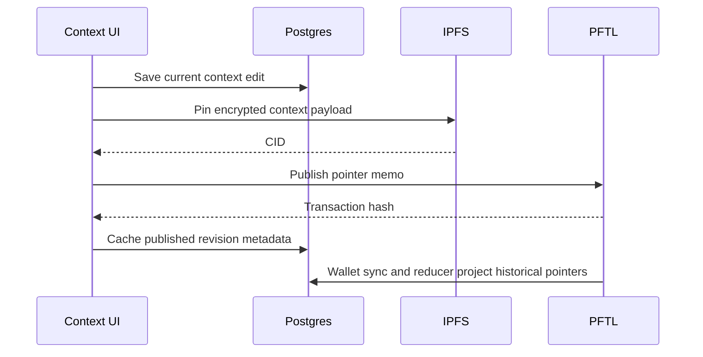

# Context

Context is the user's durable working profile. It is the structured background that helps Task Node understand goals, constraints, projects, and current direction. Context must work even when the user has no wallet.

The Team page can also add a generated Team Context block to model-facing personal context. This is an account preference, not an edit to the saved Context document: the editable document remains user-owned, while `server/chat-context-load.js` composes the currently authorized team report into the execution packet. The block is included only when the Team-page checkmark is enabled and the report fingerprint matches the current grants and rewarded-task set.

## User Flow

1. The user edits the current context document.
2. The app saves the current draft to Postgres by updating the active draft row in place.
3. The editor shows line numbers that correspond to the plain-text context packet used by Context Refine.
4. The footer shows task-generation context usage; expanding it shows how much of the 60,000 readable-character task-generation budget the current document uses.
5. If the user has a wallet, they can publish encrypted context pointers to PFTL.
6. The PFTL cache projects historical context pointers for the linked wallet.
7. The user can preview and restore a historical version.

## Technical Architecture

The context editor is in `src/main.jsx` and `src/features/context/context.css`. Publishing is handled by `src/features/context/context-publish.js`, `server/context-publish.js`, `server/context-ipfs.js`, `server/pftl-pointer.js`, and `server/pftl-submit.js`.

The context cache repository is `server/repositories/context.js`, backed by `server/db/migrations/003_context_cache.sql`, `server/db/migrations/011_context_history_projection_source.sql`, `server/db/migrations/016_context_current_draft_only.sql`, and `server/db/migrations/017_context_prune_non_current_drafts.sql`. Normal editor saves are a current-draft cache, not immutable history. Historical pointer projection uses `server/context-history.js`, `server/pftl-cache-sync.js`, and `server/pftl-cache-reducer.js`.

The native document storage cap is `CONTEXT_DOCUMENT_MAX_CHARS` from `shared/context-budget.js`, currently 120,000 raw rich-text characters. Model-facing consumers convert the saved rich-text body into readable text first. Task generation uses `TASKGEN_CONTEXT_MAX_CHARS`, currently 60,000 readable compacted characters, so the task engine sees the substantive context text rather than a short raw HTML slice. The Context page budget toggle is UI-only; task request bundles do not include usage percentages or budget telemetry.

Context Refine runs through Chat, not a separate Context modal. `src/main.jsx::ChatSurface` activates `contextMode: "context_edit"` from the chat `+` menu or from the sidebar More tools menu entry, which navigates to Chat and activates the same composer mode. `server/context-edit-chat.js` uses `prompts/context/context_edit_jobs_v1.xml`, stores pending proposals in `context_edit_proposals`, and applies accepted proposals through `server/repositories/context.js::saveContextDocument`. The Context page then reloads the saved revision from Postgres.

Context Rewrite runs through Chat, not the Context page. It is a billed async job that assembles context, chat, memory, tasks, network profile, Jobs retrieval, and research, then returns a copyable/downloadable Markdown artifact. It does not overwrite the current context document; users can copy from the artifact and decide what to save manually.

Line numbers are generated from the same normalized HTML-to-text idea used by `server/context-line-map.js`. They are inspection anchors for the user and model packet; the server still validates accepted edits by revision, body hash, and exact `target_before` text before saving.

## Current Limits

- Native editor saves post to `/api/context/edit/save`, and `server/index.js` reads that request body with a 64KB cap. Requests over 64KB fail with `request_too_large` (HTTP 413), so the 120,000-character storage cap is not actually reachable through a single editor save; very large documents fail at the request boundary instead of saving partially.
- Bodies that do exceed the storage cap on any save path are silently sliced to `CONTEXT_DOCUMENT_MAX_CHARS` by `server/repositories/context.js` before saving. There is no oversize error or visible truncation warning, so content past the cap is dropped without telling the user.

## Data Model

- Current context: Postgres cache tied to account identity. It stores the latest draft for chat/task grounding and does not retain every autosave as long-term history.
- Historical wallet context: cached PFTL pointer projections. The server cache stores CID, transaction, ledger, timestamp, direction, version, and available metadata; it does not store decrypted plaintext previews.
- Restore preview: encrypted IPFS payload fetched by CID and decrypted in the browser only after the local wallet vault is unlocked. The readable preview is a session cache, not durable Postgres state.
- Published context: encrypted IPFS document referenced by PFTL memo pointer.
- Context edit proposal: account-scoped pending/applied/rejected proposal tied to a chat conversation and assistant message.
- Team Context preference/report: account-scoped generated collaborator background assembled at execution time; it never becomes a context revision or published PFTL context pointer.

## Diagram

## Failure Modes

- Context editing must not require a wallet.
- Publishing must require an unlocked local vault.
- Restore must make overwrite behavior explicit.
- Historical previews should load per document, distinguish queued/loading/error states, and never present failed or idle previews as still loading.
- Context Refine proposals must not overwrite newer manual edits; stale proposals fail before save.
