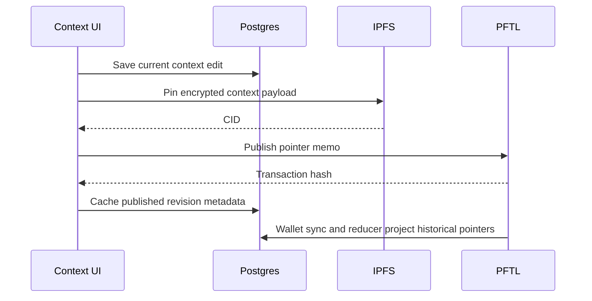

# Context

Context is the user's durable working profile. It is the structured background that helps Task Node understand goals, constraints, projects, and current direction. Context must work even when the user has no wallet.

## User Flow

1. The user edits the current context document.
2. The app saves the current draft to Postgres by updating the active draft row in place.
3. The editor shows line numbers that correspond to the plain-text context packet used by Context Refine.
4. If the user has a wallet, they can publish encrypted context pointers to PFTL.
5. The PFTL cache projects historical context pointers for the linked wallet.
6. The user can preview and restore a historical version.

## Technical Architecture

The context editor is in `src/main.jsx` and `src/features/context/context.css`. Publishing is handled by `src/features/context/context-publish.js`, `server/context-publish.js`, `server/context-ipfs.js`, `server/pftl-pointer.js`, and `server/pftl-submit.js`.

The context cache repository is `server/repositories/context.js`, backed by `server/db/migrations/003_context_cache.sql`, `server/db/migrations/011_context_history_projection_source.sql`, `server/db/migrations/016_context_current_draft_only.sql`, and `server/db/migrations/017_context_prune_non_current_drafts.sql`. Normal editor saves are a current-draft cache, not immutable history. Historical pointer projection uses `server/context-history.js`, `server/pftl-cache-sync.js`, and `server/pftl-cache-reducer.js`.

Context Refine runs through Chat, not a separate Context modal. `src/main.jsx::ChatSurface` activates `contextMode: "context_edit"` from the `+` menu. `server/context-edit-chat.js` uses `prompts/context/context_edit_jobs_v1.xml`, stores pending proposals in `context_edit_proposals`, and applies accepted proposals through `server/repositories/context.js::saveContextDocument`. The Context page then reloads the saved revision from Postgres.

Line numbers are generated from the same normalized HTML-to-text idea used by `server/context-line-map.js`. They are inspection anchors for the user and model packet; the server still validates accepted edits by revision, body hash, and exact `target_before` text before saving.

## Data Model

- Current context: Postgres cache tied to account identity. It stores the latest draft for chat/task grounding and does not retain every autosave as long-term history.
- Historical wallet context: cached PFTL pointer projections. The server cache stores CID, transaction, ledger, timestamp, direction, version, and available metadata; it does not store decrypted plaintext previews.
- Restore preview: encrypted IPFS payload fetched by CID and decrypted in the browser only after the local wallet vault is unlocked. The readable preview is a session cache, not durable Postgres state.
- Published context: encrypted IPFS document referenced by PFTL memo pointer.
- Context edit proposal: account-scoped pending/applied/rejected proposal tied to a chat conversation and assistant message.

## Diagram

## Failure Modes

- Context editing must not require a wallet.
- Publishing must require an unlocked local vault.
- Restore must make overwrite behavior explicit.
- Historical previews should load per document, distinguish queued/loading/error states, and never present failed or idle previews as still loading.
- Context Refine proposals must not overwrite newer manual edits; stale proposals fail before save.

## Reviewer To Do List

Review implementation against this document (context). Mark each item when verified.

### Memory Efficiency
- [ ] List and detail views read Postgres caches with documented caps or pagination.
- [ ] Async workers handle heavy model/IPFS work; primary UX path stays non-blocking.
- [ ] Current draft stored in `context_revisions`; history from pointer projection, not unbounded revision rows.
- [ ] Chat grounding clips body to configured max chars before provider send.

### Code Quality
- [ ] Code references in doc resolve to existing modules and routes.
- [ ] Failure modes documented here have matching user-visible error handling.
- [ ] Native editor saves update draft row in place; publish is separate PFTL path.
- [ ] Context Refine proposals carry revision/body hash for staleness detection.

### Coherence
- [ ] Surface behavior matches Architecture docs for cache vs canonical state.
- [ ] Hidden/not-exposed features labeled honestly if mentioned.
- [ ] Postgres draft vs PFTL published history distinction clear in UI and API.
- [ ] Context available without wallet; publish requires linked unlocked wallet.

### Bloat
- [ ] Surface does not duplicate logic owned by shared modules or workers.
- [ ] UI state not duplicated in unrelated caches without invalidation rules.
- [ ] Rich-text HTML stripped for chat injection; no duplicate markup in prompts.

### Security
- [ ] Account scoping enforced on all read/write API paths for this surface.
- [ ] Wallet-bound actions require linked unlocked wallet as documented.
- [ ] Publish encrypts to user + TaskNode recipients; server rejects missing service shard.
- [ ] Context history restore is account/wallet scoped via cache projection.
