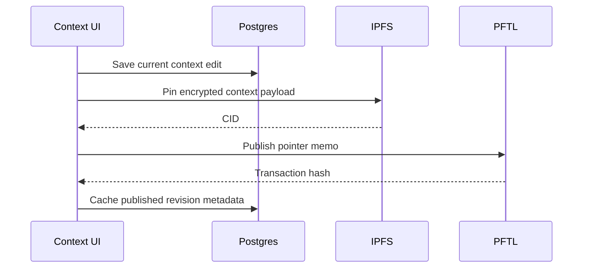

# Context

Context is the user's durable working profile. It is the structured background that helps Task Node understand goals, constraints, projects, and current direction. Context must work even when the user has no wallet.

## User Flow

1. The user edits the current context document.
2. The app saves the current version to Postgres.
3. If the user has a wallet, they can publish encrypted context pointers to PFTL.
4. Historical context versions can be discovered from wallet history.
5. The user can preview and restore a historical version.

## Technical Architecture

The context editor is in `src/main.jsx` and `src/features/context/context.css`. Publishing is handled by `src/features/context/context-publish.js`, `server/context-publish.js`, `server/context-ipfs.js`, `server/pftl-pointer.js`, and `server/pftl-submit.js`.

The context cache repository is `server/repositories/context.js`, backed by `server/db/migrations/003_context_cache.sql`. Historical pointer hydration uses `server/context-history.js` and `server/context-history-rpc.js`.

## Data Model

- Current context: Postgres cache tied to account identity.
- Historical wallet context: PFTL pointer events and encrypted IPFS payloads.
- Restore preview: decrypted payload held only for the current restore workflow.
- Published context: encrypted IPFS document referenced by PFTL memo pointer.

## Diagram

## Failure Modes

- Context editing must not require a wallet.
- Publishing must require an unlocked local vault.
- Restore must make overwrite behavior explicit.
- Historical previews should load per document, not mark every version as restoring.

