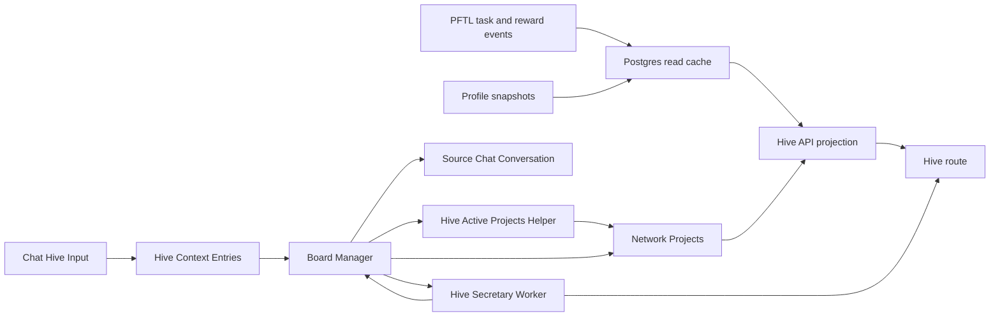

# Hive

Hive is the network coordination surface. It shows active projects, task routing, operator load, and project-scoped activity in one place so members can understand where the network is concentrating attention.

The current implementation uses Postgres-backed network project records plus live Hive Context and Hive Secretary data. The original Hive mock is preserved only as design reference. The target architecture is Board Manager centered: one leased Board Manager run decides when Hive context, projects, project documents, contributors, and Network Tasks should change.

## User Surface

The Hive route is available at `#hive` from the primary sidebar. The surface contains:

- active projects with planned task count, target contributor count, and PFT route budget
- a routing feed showing recent project-linked task state transitions, newest first
- allotted operators derived from live project-linked task allocation, shown with the user's profile NFT/PFP when available
- project detail pages for active `network_projects` rows
- a collapsed `Hive Context` section at the bottom of the page with two tabs: `Hive Context` for Secretary/raw inputs and `Hive Mind Agent` for Board Manager actions

The project detail page is layered as:

1. About
2. Contributors
3. Tasks
4. Activity

Project IDs are part of the product surface. The project detail header should expose the stable `network_projects.id` so operators can refer to a project in tasks, docs, and chat without ambiguity.

## Hive Input

Chat has a `Hive Input` mode in the composer `+` menu. It is a persistence action, not a model call and not a billed chat response.

When the user selects `Hive Input`, the composer changes mode and the next message is saved to `Hive Context`. The server also records the user message and a muted italic acknowledgement in chat history so the conversation remains understandable after navigation. The acknowledgement says the Hive may respond in the same chat if the Board Manager decides a reply is important.

`Hive Context` is a network context document built from user-submitted entries. It is grouped by user and shown collapsed on the Hive page.

Each Hive Context entry keeps the sender account, display-name snapshot, validated wallet state, body hash, and source chat conversation id. That source conversation id is the return route if the Board Manager decides the Hive should speak back to that user.

Expanding the section shows tabs. `Hive Context` shows the current `Hive Secretary` report first. Raw user inputs are behind a second collapsible `Raw inputs` control so the page reads like a network report by default instead of a transcript dump. Raw inputs show contributor, timestamp, body, and whether the entry came from a validated linked wallet. Source chat title is intentionally not displayed because it is usually not useful network context.

`Hive Mind Agent` shows the Board Manager feed. This feed reads durable `board_manager_runs` plus `board_manager_action_results` and includes runs where the selected action is `do_nothing` or no selected action was recorded. It refreshes when the Hive Context panel opens and polls while the panel remains open, so later Board Manager runs appear without a full page refresh. It is an audit feed, not the user response surface. Internal smoke/test runs stay in Postgres for verification but are excluded from this normal user-facing feed.

Every recorded Board Manager run writes a micro summary artifact at completion. The artifact is stored as structured JSON plus a short plain-text report on the run row. It says what action was selected, why, what target was touched, what executed, and what should happen next. Future Board Manager source packets use these micro summaries for recent-run memory instead of injecting full prior decisions and action payloads.

The Hive Mind Agent card renders that decision audit directly. A run should show the selected action, summary, decision reason, action result, confidence, run id, source packet digest, and trigger. This is required even when the selected action is `do_nothing`, which the UI labels as `No board change`, because "no board mutation" is still a decision that must be explainable from the live state the agent saw.

## Board Manager Target

The Board Manager is the planned system operator for Hive. It is a Codex Exec function with a bounded action registry. It should run periodically or after meaningful state changes, claim a single `global_hive` lease, inspect the current board state, and choose one action.

V0 exists as a persistent Codex Exec harness. It builds the current Hive source packet, calls Codex Exec using `gpt-5.5` with `xhigh` reasoning, validates the returned action against a JSON schema, and records the decision in `board_manager_runs` when Postgres is enabled. It stores one Codex session id per manager scope in `board_manager_sessions`; later ticks call `codex exec resume <session_id>` instead of starting over. It defaults to dry-run for app mutations, and executes supported action hooks only when the executor is run with `--execute`.

The local continuous runner is `npm run board-manager:loop -- --execute`. It calls the same one-shot Board Manager executor repeatedly. If the manager selects `do_nothing`, the loop sleeps for two minutes before the next tick. If the manager changes the board, it waits only the shorter action delay and then rechecks the resulting Hive state. This is a development harness, not the production deployment model.

The production target is a Fly-managed `board-manager` process group with a Postgres-backed job queue and lease. The first implementation is now in place. Web/API instances can enqueue Board Manager jobs but do not run background workers when started with `TASKNODE_PROCESS_ROLE=web`. The dedicated Board Manager worker claims one due job, calls the existing one-shot Codex Exec path, claims the scope lease inside that one-shot run, resumes the persistent Codex session, executes at most one validated action, writes the run/action/micro-summary audit rows, and schedules follow-up work when the action mutates state. Multiple Fly machines can exist for failover, but only claimed jobs and the Board Manager lease holder can act. The full migration plan is in `Plans -> Board Manager`.

Allowed actions include:

- do nothing
- update the Board Manager context document
- refresh Hive Secretary
- research
- message a user for follow-up context
- create or update projects
- archive projects that should leave the active board
- refresh a project product document
- assign or remove contributors
- initiate project-linked Network Tasks with rewards
- review evidence packets through the existing task engine

Implemented hooks today are `message_user`, `refresh_hive_secretary`, `create_project`, `archive_project`, `refresh_project_document`, `assign_contributor`, and `initiate_network_task`. `archive_project` is the delete-project behavior; the row is hidden from the active board but not hard deleted. `message_user` writes an assistant message into the user's original Hive Input chat conversation and records a delivery audit row in `board_manager_user_messages`; the Hive Mind Agent tab itself stays focused on the agent run/action feed. `refresh_project_document` writes the agent-managed Project Status shown inside a Hive project About section.

`initiate_network_task` does not let the Board Manager write the final task offer. It creates a project-linked allocation row and a durable generation job. The gated `server/network-task-generation-worker.js` then turns that job into a normal task request bundle and schedules the existing task-generation worker. The resulting offer is still a normal encrypted `pf.task.offer.v1` task pointer from the task engine, with project metadata attached for Hive reads.

After a Network Task exists, Hive does not let the Board Manager manage status. The task lifecycle is read from `task_projections`, which is rebuilt from signed PFTL task events. `network_project_task_refs` and `network_task_allocations` are display/routing mirrors; `server/repositories/network-tasks.js` reconciles them from `task_projections` after projection imports and before Hive project reads.

The Board Manager source packet now includes a `networkTaskContent` snapshot. This is the Board Manager's compact working memory for project-linked Network Tasks. It includes:

- the last five rewarded Network Tasks, with title, description, steps, submission requirement, state, actual reward, and reward summary;
- current outstanding Network Tasks, including proposed, accepted, submitted, verification, reward-decision, and repairable generation-link states;
- queued/running/generated network-task generation jobs that do not have a projected task yet.

This snapshot is intentionally not the full forensics view. It does not carry raw CIDs, transactions, every metadata field, or full uploaded artifacts. The purpose is to let the Board Manager understand what work happened and what work is still active before it refreshes a project document, messages a user, or allocates another Network Task.

The Hive project task row renders canonical task statuses directly, including `rewarded`, `reward_decided`, `verification_response_submitted`, and stopped states. Unknown statuses are shown as unknown, not silently downgraded to `proposed`.

Task assignees use the assignee wallet's latest selected/profile NFT image when one exists in `profile_nfts`. If no profile NFT image is available, Hive falls back to the small deterministic SVG badge and compact wallet label.

The Routing Feed and Allotted Operators sections are also derived from live project-linked tasks. `network_project_contributors` and `network_project_activity` may hold explicit project rows later, but the current board will not stay empty when `network_project_task_refs` has real tasks. A project-linked task with an assignee creates a contributor/operator read model, and its current task state creates a routing-feed entry. The Allotted Operators subtitle refers to operators currently routed by live project tasks, not a permanent full-time membership claim.

The Routing Feed is intentionally compact. It should show who acted, what changed, which project/task it belongs to, and PFT when useful. It should not render raw request IDs, task IDs, CIDs, transaction hashes, or placeholder words such as `indexed`; those details belong in task forensics or operator logs.

Current local Docker state:

- Project `task_node` has a live project-linked Network Task row.
- Task `task_01af1624fcb74e41d902ca32b126f27d` was generated from Board Manager allocation `netalloc_66cc6446-8ff3-4cb3-9049-a23e75e44ba8` and generation job `nettaskjob_2d863a1a-0d57-47c2-9b33-52787ad8d37c`.
- The request id is `req_net_c73fe62037a9cf201d51b32bdefa69ca`.
- The offer transaction is `E6C86781C0D53A68F2E7740AA8751E19616B9732489D9EA8C4330A692AC1A931`.
- The task completed through normal submission, review, and reward. `task_projections.status` is `rewarded`.
- `network_project_task_refs.state` mirrors `rewarded`, and `network_task_allocations.allocation_status` mirrors `completed`.
- The Hive project task row, Routing Feed, Allotted Operators, and assignee profile badge now render from that live project-linked task path.

The old direct cascade where Hive Secretary automatically drives active projects is deprecated as the target architecture. The existing Secretary and Active Projects workers remain implementation primitives, but the Board Manager should own when they run.

## Hive Secretary And Active Projects

When a signed-in user posts a Hive Input:

1. `POST /api/hive/context` stores the raw input.
2. The route checks the account's linked wallet through `getLinkedWallet`.
3. If the account has a linked wallet, the entry is marked `wallet_validated = true`.
4. Validated entries enqueue a Hive Secretary job.
5. `server/hive-secretary-worker.js` calls OpenAI Responses with `gpt-5.5-pro`, `reasoning.effort = high`, structured JSON output, and `store = false`.
6. The completed report is stored in `hive_secretary_reports`.
7. In the current implementation, the completed report queues a Hive Active Projects job.
8. `server/hive-project-worker.js` calls OpenAI Responses with `gpt-5.5-pro`, `reasoning.effort = high`, structured JSON output, and `store = false`.
9. The completed project generation is stored in `hive_project_generations` and upserts active rows in `network_projects`.
10. `GET /api/hive/context` returns both the grouped raw context and the current Secretary report.

Step 7 is the part to replace as Board Manager work lands. Hive Secretary should report network context. The Board Manager should decide whether that report is stale, whether active projects should change, whether research is needed, or whether the correct action is no action.

Hive Secretary uses `prompts/hive/hive_secretary_v1.md`. The prompt returns strict JSON with:

- `summary`
- `project_signals`
- `network_implications`
- `open_questions`
- `next_system_focus`

The Secretary worker is source-bound: it summarizes validated Hive Inputs and classifies project signals into the current Hive project types. It does not create tasks.

Hive Active Projects uses `prompts/hive/hive_active_projects_v1.md`. That prompt decides which projects should be active based on the latest Secretary report and current project registry. It can preserve an existing project, create a new project, or pause generated/seeded projects that are no longer supported by the report. It still does not create tasks, contributors, wallets, payments, or activity rows.

Scoping is not a project. The active-project prompt now treats scoping as a phase or status on a durable project. A project can be `Post Fiat L1` with phase `Scoping`; it should not be `Post Fiat L1 scoping`. The rejected generated scoping projects are archived by `server/db/migrations/032_archive_rejected_hive_scoping_projects.sql`, locked by `server/db/migrations/034_lock_operator_archived_hive_projects.sql`, and skipped by `server/repositories/hive-project-planning.js` so future project generations cannot silently reactivate them.

Each project can now have a project-linked Product Document. Each project card opens a project board whose About section can include a generated document with:

- how the project realistically benefits the network;
- what success looks like;
- current status;
- who is working on it and why;
- what is blocked or unclear.

That Product Document is written by the Board Manager when it chooses `refresh_project_document`. The document is part of the Board Manager's JSON decision in `payload.project_document`; the action hook validates and stores it in `network_project_product_docs`. It does not call a second writer model. The static project identity remains in `network_projects.about`.

The Product Document appears as a collapsible `Project Status` section inside About. The static `network_projects.about` text explains what the project is. The generated Project Status explains the current execution picture, key points, blockers, and next actions. The collapsed view shows only the short summary so the project page remains scannable. The detailed plan lives in `docs/wiki/plans/agent-managed-about-panels.md`.

If no current product document exists, the About section shows the static project description plus the empty state `Project status has not been generated yet.` It does not show filler copy.

Current endpoint:

- `GET /api/hive/projects` returns active network projects, project task rows, contributor rollups, activity rows, and the latest Hive Secretary input reference.
- `GET /api/hive/context` returns the grouped Hive Context document, Hive Secretary report/job state, and public Board Manager action feed. If the viewer is signed in, it also includes that account's private Board Manager messages.
- `POST /api/hive/context` stores one signed-in user's Hive Input entry, records the chat acknowledgement, and queues Hive Secretary when the user has a linked wallet.

## Technical Architecture

The production app does not import from `mocks/hive.jsx`. The mock is preserved as design input, and the app route is implemented as normal source code:

- `src/features/hive/HiveView.jsx` renders the Hive index and project detail drill-in.
- `src/features/hive/hive.css` contains the isolated styling for the surface.
- `src/main.jsx` registers `#hive`, adds the sidebar entry, and lazy-loads the view.
- `server/hive-routes.js` serves Hive project, Hive Context, and Hive Secretary reads and writes.
- `server/hive-secretary-worker.js` processes validated Hive Inputs through OpenAI `gpt-5.5-pro`; this is planned to become a Board Manager action handler.
- `server/hive-project-worker.js` determines active network projects through OpenAI `gpt-5.5-pro`; this is planned to become a Board Manager action helper instead of an independent cascade.
- `server/repositories/board-manager.js` builds the Board Manager source packet, validates action decisions, records runs, records action results, formats the Hive Mind Agent feed, and reads manager message delivery audit rows.
- `server/repositories/board-manager-scheduler.js` owns the durable Board Manager scheduler helpers: scope setup, job enqueue, due tick enqueue, job claiming, job completion, and deferred/failed retries.
- `server/board-manager-actions.js` executes the first Board Manager action hooks.
- `server/process-role.js` separates `web`, `worker`, and local `all` startup roles so Fly web instances do not accidentally run background workers.
- `server/repositories/network-tasks.js` creates project-linked Network Task and Alpha Task allocations, claims generation jobs, and links published offers back to Hive projects.
- `server/repositories/network-tasks.js` also reconciles project task refs and allocation rows from `task_projections`; this prevents the Board Manager's initial allocation state from becoming stale after a user accepts, submits, refuses, cancels, or is rewarded.
- `server/repositories/network-tasks.js::getNetworkTaskContentSnapshot` builds the Board Manager's compact task-content snapshot from `network_project_task_refs`, `task_projections`, `network_task_generation_jobs`, `network_task_allocations`, and latest task reward/update events.
- `server/network-task-generation-worker.js` consumes queued network-task generation jobs and hands them to the existing task-generation worker through `task_requests`.
- `server/repositories/chat-assistant-messages.js` appends Board Manager `message_user` responses to existing account-owned chat conversations without creating a billed model run.
- `scripts/board-manager-codex-exec.mjs` runs one persistent Codex Exec Board Manager tick or, with `--execute`, dispatches supported action hooks.
- `scripts/board-manager-worker.mjs` is the durable job-driven Board Manager worker entrypoint for Fly or local production-like runs.
- `scripts/board-manager-ops.mjs` provides operator commands for status, enqueue, pause, resume, and scope setup.
- `schemas/board-manager-action.schema.json` constrains the Codex Exec output.
- `server/repositories/hive-context.js` persists raw Hive Context entries, Secretary jobs, and Secretary reports.
- `server/repositories/hive-projects.js` reads active network projects, links the latest Secretary report as a project input, and derives routing feed/operator rollups from project task refs when explicit contributor/activity rows are absent. The routing feed, project tasks, and project activity sort by event/update timestamp descending before rendering. Contributor, operator, task-assignee, and activity rows use the selected profile NFT/PFP from `profile_nfts` when available, falling back to the generated badge only when no image exists.
- `server/repositories/hive-project-product-docs.js` builds a single-project source packet, reads the current product document, and inserts a new current product document while superseding the old one.
- `server/repositories/hive-project-planning.js` persists active-project planner jobs and completed generations, then upserts `network_projects`.
- `server/db/migrations/027_hive_context_entries.sql` creates the Hive Context table.
- `server/db/migrations/028_hive_secretary_reports.sql` adds linked-wallet validation metadata and Secretary job/report tables.
- `server/db/migrations/029_hive_network_projects.sql` creates the current network project read model and seeds the initial `PFT distribution v3` project spec.
- `server/db/migrations/030_hive_project_seed_cleanup.sql` removes earlier mock-only operator/task/feed seed rows from existing environments.
- `server/db/migrations/031_hive_project_planning.sql` adds the active-project planning job and generation tables.
- `server/db/migrations/032_archive_rejected_hive_scoping_projects.sql` archives the three rejected generated scoping cards from existing environments.
- `server/db/migrations/033_board_manager_v0.sql` adds Board Manager lease/run/action-result tables.
- `server/db/migrations/034_lock_operator_archived_hive_projects.sql` locks archived project rows so rejected projects do not reappear after a later planner run.
- `server/db/migrations/035_board_manager_action_hooks.sql` adds user-visible Board Manager messages.
- `server/db/migrations/036_board_manager_persistent_sessions.sql` adds persistent Codex session tracking.
- `server/db/migrations/038_network_project_product_docs.sql` adds versioned current/superseded product documents for Hive projects.
- `server/db/migrations/039_network_task_allocations.sql` adds Network Task allocation and generation job tables.
- `server/db/migrations/041_board_manager_run_micro_summaries.sql` adds compact Board Manager run artifacts for agent continuity and source-packet size control.
- `server/db/migrations/042_board_manager_scheduler.sql` adds durable scheduler scopes and jobs for production Board Manager execution.
- `prompts/hive/hive_secretary_v1.md` is the source-controlled Secretary prompt.
- `prompts/hive/hive_active_projects_v1.md` is the source-controlled active-project prompt.
- `prompts/hive/board_manager_v1.md` is the Board Manager operating prompt and includes the `payload.project_document` shape for `refresh_project_document` plus the `payload.network_task` shape for `initiate_network_task`.

The Board Manager is the agentic writer for core Hive artifacts. It reads Hive state, preserves session context, chooses one action, and for `refresh_project_document` writes the document directly. External models are reserved for explicit tools such as user-facing task generation, profile analysis, or future subagent work, not for routine project-document authorship.

## Current Data Boundary

Active projects and project detail now read from Postgres. `PFT distribution v3` is seeded only as a bootstrap apriori network project record so the page has a real project shape before the first active-project generation runs. After a Hive Active Projects generation completes, the generated project set becomes the active set.

The project seed is intentionally not a fake live network. A project can carry planned/scoped metrics such as scoped task target, target contributors, and route budget, but live task rows must come from project-linked allocation data. Once `network_project_task_refs` contains a real linked task, the current Hive read model derives the project task row, contributor/operator row, routing-feed entry, and routed PFT summary from that task ref and its synced `task_projections` state. Explicit `network_project_contributors` and `network_project_activity` rows can be added later as materialized rollups, but the visible board is not allowed to go blank when the canonical task ref exists.

Hive Context is live Postgres-backed app data. It is not on-chain. Hive Secretary and Hive Active Projects are also Postgres-backed and regenerate from validated-wallet Hive Inputs after new entries arrive.

Cadence today:

- Hive Input saves immediately.
- Validated-wallet input queues Hive Secretary immediately.
- A completed Secretary report queues Hive Active Projects immediately.
- Active project rows update after that worker completes.

Deprecated target:

- Do not keep adding independent cron-like workers for every Hive behavior.
- Do not let each Fly instance run a Board Manager loop.
- Do not let Active Projects, Product Documents, task assignment, and review each become separate overactive schedulers.
- Do not rely on tmux, SSH sessions, or manually watched shells for production Board Manager execution.

Board Manager target:

- A single leased Board Manager run wakes on a logical cadence or meaningful trigger.
- The manager selects one scoped action.
- Existing workers are called only as action handlers.
- Product Documents refresh when the manager decides a project is stale or materially changed.
- If a Product Document identifies missing information, the manager can research, ask follow-up questions, or initiate information-gathering Network Tasks under the existing project.
- Production runs come from a durable Fly worker process with `board_manager_jobs`, `board_manager_leases`, and auditable `board_manager_runs`, not from local tmux. The runnable entrypoints are `npm run start:web`, `npm run start:worker`, and `npm run start:board-manager`.
- In local Docker, `TASKNODE_NETWORK_TASK_GENERATION_WORKER_ENABLED=true` is enabled. The worker consumes `network_task_generation_jobs`, creates normal encrypted task request bundles, and schedules the existing task-generation worker. A May 23, 2026 local Docker test produced task `task_01af1624fcb74e41d902ca32b126f27d` for project `task_node` with offer transaction `E6C86781C0D53A68F2E7740AA8751E19616B9732489D9EA8C4330A692AC1A931`.
- Outside local Docker, a live PFTL network-task offer still requires the network worker, task-generation worker, service encryption key, IPFS, and PFTL submit credentials to be enabled.

The Secretary report and Active Projects generation are not canonical task state. They are operator-readable planning artifacts. They make project identity available to the future system Network Task worker without pretending the report is itself a task.

The expected live replacement path is:

## Future Live Sources

The likely production data sources are:

- `task_projections` for task state, rewards, and project assignment
- `network_projects` for active project identity, target metrics, source inputs, and project detail
- `network_project_task_refs` after live allocation creates project-linked task rows
- derived contributor/operator and routing-feed read models from `network_project_task_refs` and `task_projections`, with `network_project_contributors` and `network_project_activity` available later for explicit materialized rows
- `hive_context_entries` for user-submitted network context
- `hive_secretary_reports` for the current synthesized network context report
- `hive_project_planning_jobs` and `hive_project_generations` for active project determination
- Board Manager lease/run/action tables plus user-visible Board Manager messages
- public profile snapshots for operator role and skill summaries
- daily airdrop and reward history for contribution weighting
- PFTL transaction cache rows for proof anchors and forensic drill-in

## Reviewer To Do List

Review implementation against this document (hive). Mark each item when verified.

### Memory Efficiency
- [ ] List and detail views read Postgres caches with documented caps or pagination.
- [ ] Async workers handle heavy model/IPFS work; primary UX path stays non-blocking.
- [ ] Hive read models derive from projections when rollup tables empty; avoid N+1 task fetches.
- [ ] Board Manager runs single leased scope; no parallel Codex Exec storms.

### Code Quality
- [ ] Code references in doc resolve to existing modules and routes.
- [ ] Failure modes documented here have matching user-visible error handling.
- [ ] Task state sourced from `task_projections`, not Board Manager decision JSON.
- [ ] Hive Secretary and Active Projects workers have durable job queues with retry semantics.

### Coherence
- [ ] Surface behavior matches Architecture docs for cache vs canonical state.
- [ ] Hidden/not-exposed features labeled honestly if mentioned.
- [ ] Network Task routing metadata on tasks matches allocation rows.
- [ ] Project About documents sourced from `network_project_product_docs`, not stale mocks.

### Bloat
- [ ] Surface does not duplicate logic owned by shared modules or workers.
- [ ] UI state not duplicated in unrelated caches without invalidation rules.
- [ ] Board Manager micro-summaries used for continuity instead of reinjecting full prior runs.

### Security
- [ ] Account scoping enforced on all read/write API paths for this surface.
- [ ] Wallet-bound actions require linked unlocked wallet as documented.
- [ ] Hive Input requires validated-wallet flag before Secretary consumption.
- [ ] Board Manager `message_user` deliveries audited with destination conversation id.
