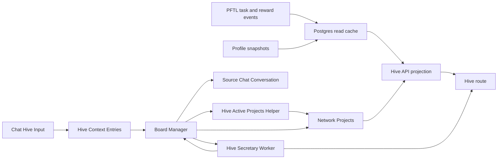

# Hive

Hive is the network coordination surface. It shows active projects, task routing, operator load, and project-scoped activity in one place so members can understand where the network is concentrating attention.

The current implementation uses Postgres-backed network project records plus live Hive Context and Hive Secretary data. The original Hive mock is preserved only as design reference. The target architecture is Board Manager centered: one leased Board Manager run decides when Hive context, projects, project documents, contributors, and Network Tasks should change.

## User Surface

The Hive route is available at `#hive` from the primary sidebar. The surface contains:

- active projects with planned task count, target contributor count, and PFT route budget
- a routing feed showing recent task state transitions once live project-linked tasks exist
- allotted operators once live project-linked task allocation exists
- project detail pages for active `network_projects` rows
- a collapsed `Hive Context` section at the bottom of the page with two tabs: `Hive Context` for Secretary/raw inputs and `Hive Mind Agent` for Board Manager actions

The project detail page is layered as:

1. About
2. Contributors
3. Tasks
4. Activity

Project IDs are part of the product surface. The project detail header should expose the stable `network_projects.id` so operators can refer to a project in tasks, docs, and chat without ambiguity.

## Hive Input

Chat has a `Hive Input` mode in the composer `+` menu. It is a persistence action, not a model call and not a billed chat response.

When the user selects `Hive Input`, the composer changes mode and the next message is saved to `Hive Context`. The server also records the user message and a muted italic acknowledgement in chat history so the conversation remains understandable after navigation. The acknowledgement says the Hive may respond in the same chat if the Board Manager decides a reply is important.

`Hive Context` is a network context document built from user-submitted entries. It is grouped by user and shown collapsed on the Hive page.

Each Hive Context entry keeps the sender account, display-name snapshot, validated wallet state, body hash, and source chat conversation id. That source conversation id is the return route if the Board Manager decides the Hive should speak back to that user.

Expanding the section shows tabs. `Hive Context` shows the current `Hive Secretary` report first. Raw user inputs are behind a second collapsible `Raw inputs` control so the page reads like a network report by default instead of a transcript dump. Raw inputs show contributor, timestamp, body, and whether the entry came from a validated linked wallet. Source chat title is intentionally not displayed because it is usually not useful network context.

`Hive Mind Agent` shows the Board Manager feed. This feed reads durable `board_manager_runs` plus `board_manager_action_results` and includes runs where the selected action is `do_nothing` or no selected action was recorded. It is an audit feed, not the user response surface. Internal smoke/test runs stay in Postgres for verification but are excluded from this normal user-facing feed.

## Board Manager Target

The Board Manager is the planned system operator for Hive. It is a Codex Exec function with a bounded action registry. It should run periodically or after meaningful state changes, claim a single `global_hive` lease, inspect the current board state, and choose one action.

V0 exists as a persistent Codex Exec harness. It builds the current Hive source packet, calls Codex Exec using `gpt-5.5` with `xhigh` reasoning, validates the returned action against a JSON schema, and records the decision in `board_manager_runs` when Postgres is enabled. It stores one Codex session id per manager scope in `board_manager_sessions`; later ticks call `codex exec resume <session_id>` instead of starting over. It defaults to dry-run for app mutations, and executes supported action hooks only when the executor is run with `--execute`.

Allowed actions include:

- do nothing
- update the Board Manager context document
- refresh Hive Secretary
- research
- message a user for follow-up context
- create or update projects
- archive projects that should leave the active board
- refresh a project product document
- assign or remove contributors
- initiate project-linked Network Tasks with rewards
- review evidence packets through the existing task engine

Implemented hooks today are `message_user`, `refresh_hive_secretary`, `create_project`, `archive_project`, and `assign_contributor`. `archive_project` is the delete-project behavior; the row is hidden from the active board but not hard deleted. `message_user` writes an assistant message into the user's original Hive Input chat conversation and records a delivery audit row in `board_manager_user_messages`; the Hive Mind Agent tab itself stays focused on the agent run/action feed.

The old direct cascade where Hive Secretary automatically drives active projects is deprecated as the target architecture. The existing Secretary and Active Projects workers remain implementation primitives, but the Board Manager should own when they run.

## Hive Secretary And Active Projects

When a signed-in user posts a Hive Input:

1. `POST /api/hive/context` stores the raw input.
2. The route checks the account's linked wallet through `getLinkedWallet`.
3. If the account has a linked wallet, the entry is marked `wallet_validated = true`.
4. Validated entries enqueue a Hive Secretary job.
5. `server/hive-secretary-worker.js` calls OpenAI Responses with `gpt-5.5-pro`, `reasoning.effort = high`, structured JSON output, and `store = false`.
6. The completed report is stored in `hive_secretary_reports`.
7. In the current implementation, the completed report queues a Hive Active Projects job.
8. `server/hive-project-worker.js` calls OpenAI Responses with `gpt-5.5-pro`, `reasoning.effort = high`, structured JSON output, and `store = false`.
9. The completed project generation is stored in `hive_project_generations` and upserts active rows in `network_projects`.
10. `GET /api/hive/context` returns both the grouped raw context and the current Secretary report.

Step 7 is the part to replace as Board Manager work lands. Hive Secretary should report network context. The Board Manager should decide whether that report is stale, whether active projects should change, whether research is needed, or whether the correct action is no action.

Hive Secretary uses `prompts/hive/hive_secretary_v1.md`. The prompt returns strict JSON with:

- `summary`
- `project_signals`
- `network_implications`
- `open_questions`
- `next_system_focus`

The Secretary worker is source-bound: it summarizes validated Hive Inputs and classifies project signals into the current Hive project types. It does not create tasks.

Hive Active Projects uses `prompts/hive/hive_active_projects_v1.md`. That prompt decides which projects should be active based on the latest Secretary report and current project registry. It can preserve an existing project, create a new project, or pause generated/seeded projects that are no longer supported by the report. It still does not create tasks, contributors, wallets, payments, or activity rows.

Scoping is not a project. The active-project prompt now treats scoping as a phase or status on a durable project. A project can be `Post Fiat L1` with phase `Scoping`; it should not be `Post Fiat L1 scoping`. The rejected generated scoping projects are archived by `server/db/migrations/032_archive_rejected_hive_scoping_projects.sql`, locked by `server/db/migrations/034_lock_operator_archived_hive_projects.sql`, and skipped by `server/repositories/hive-project-planning.js` so future project generations cannot silently reactivate them.

The next planned layer is a project-linked Product Document. Each project card should open a project board whose About section can expand into a generated document with:

- how the project realistically benefits the network;
- what success looks like;
- current status;
- who is working on it and why;
- what is blocked or unclear.

That Product Document is planned to be generated per project by OpenRouter `deepseek/deepseek-v4-pro` using a ZDR-capable provider. It is not implemented yet. Until that worker exists, Hive only shows the current project row fields and Secretary report, not a generated Product Document.

The Product Document should appear as a `Project Status` section inside About. The static `network_projects.about` text explains what the project is. The generated Project Status explains the current execution picture, key points, blockers, and next actions. The detailed plan lives in `docs/wiki/plans/agent-managed-about-panels.md`.

Current endpoint:

- `GET /api/hive/projects` returns active network projects, project task rows, contributor rollups, activity rows, and the latest Hive Secretary input reference.
- `GET /api/hive/context` returns the grouped Hive Context document, Hive Secretary report/job state, and Board Manager action feed for the signed-in account.
- `POST /api/hive/context` stores one signed-in user's Hive Input entry, records the chat acknowledgement, and queues Hive Secretary when the user has a linked wallet.

## Technical Architecture

The production app does not import from `mocks/hive.jsx`. The mock is preserved as design input, and the app route is implemented as normal source code:

- `src/features/hive/HiveView.jsx` renders the Hive index and project detail drill-in.
- `src/features/hive/hive.css` contains the isolated styling for the surface.
- `src/main.jsx` registers `#hive`, adds the sidebar entry, and lazy-loads the view.
- `server/hive-routes.js` serves Hive project, Hive Context, and Hive Secretary reads and writes.
- `server/hive-secretary-worker.js` processes validated Hive Inputs through OpenAI `gpt-5.5-pro`; this is planned to become a Board Manager action handler.
- `server/hive-project-worker.js` determines active network projects through OpenAI `gpt-5.5-pro`; this is planned to become a Board Manager action helper instead of an independent cascade.
- `server/repositories/board-manager.js` builds the Board Manager source packet, validates action decisions, records runs, records action results, formats the Hive Mind Agent feed, and reads manager message delivery audit rows.
- `server/board-manager-actions.js` executes the first Board Manager action hooks.
- `server/repositories/chat-assistant-messages.js` appends Board Manager `message_user` responses to existing account-owned chat conversations without creating a billed model run.
- `scripts/board-manager-codex-exec.mjs` runs one persistent Codex Exec Board Manager tick or, with `--execute`, dispatches supported action hooks.
- `schemas/board-manager-action.schema.json` constrains the Codex Exec output.
- `server/repositories/hive-context.js` persists raw Hive Context entries, Secretary jobs, and Secretary reports.
- `server/repositories/hive-projects.js` reads active network projects and links the latest Secretary report as a project input.
- `server/repositories/hive-project-planning.js` persists active-project planner jobs and completed generations, then upserts `network_projects`.
- `server/db/migrations/027_hive_context_entries.sql` creates the Hive Context table.
- `server/db/migrations/028_hive_secretary_reports.sql` adds linked-wallet validation metadata and Secretary job/report tables.
- `server/db/migrations/029_hive_network_projects.sql` creates the current network project read model and seeds the initial `PFT distribution v3` project spec.
- `server/db/migrations/030_hive_project_seed_cleanup.sql` removes earlier mock-only operator/task/feed seed rows from existing environments.
- `server/db/migrations/031_hive_project_planning.sql` adds the active-project planning job and generation tables.
- `server/db/migrations/032_archive_rejected_hive_scoping_projects.sql` archives the three rejected generated scoping cards from existing environments.
- `server/db/migrations/033_board_manager_v0.sql` adds Board Manager lease/run/action-result tables.
- `server/db/migrations/034_lock_operator_archived_hive_projects.sql` locks archived project rows so rejected projects do not reappear after a later planner run.
- `server/db/migrations/035_board_manager_action_hooks.sql` adds user-visible Board Manager messages.
- `server/db/migrations/036_board_manager_persistent_sessions.sql` adds persistent Codex session tracking.
- `prompts/hive/hive_secretary_v1.md` is the source-controlled Secretary prompt.
- `prompts/hive/hive_active_projects_v1.md` is the source-controlled active-project prompt.
- `prompts/hive/board_manager_v1.md` is the planned Board Manager operating prompt.

## Current Data Boundary

Active projects and project detail now read from Postgres. `PFT distribution v3` is seeded only as a bootstrap apriori network project record so the page has a real project shape before the first active-project generation runs. After a Hive Active Projects generation completes, the generated project set becomes the active set.

The project seed is intentionally not a fake live network. The project can carry planned/scoped metrics such as 14 scoped tasks, 6 target contributors, and 420 PFT route target, but contributor cards, task rows, routing feed rows, and allotted operator rows stay empty until real project-linked allocation data exists.

Hive Context is live Postgres-backed app data. It is not on-chain. Hive Secretary and Hive Active Projects are also Postgres-backed and regenerate from validated-wallet Hive Inputs after new entries arrive.

Cadence today:

- Hive Input saves immediately.
- Validated-wallet input queues Hive Secretary immediately.
- A completed Secretary report queues Hive Active Projects immediately.
- Active project rows update after that worker completes.

Deprecated target:

- Do not keep adding independent cron-like workers for every Hive behavior.
- Do not let each Fly instance run a Board Manager loop.
- Do not let Active Projects, Product Documents, task assignment, and review each become separate overactive schedulers.

Board Manager target:

- A single leased Board Manager run wakes on a logical cadence or meaningful trigger.
- The manager selects one scoped action.
- Existing workers are called only as action handlers.
- Product Documents refresh when the manager decides a project is stale or materially changed.
- If a Product Document identifies missing information, the manager can research, ask follow-up questions, or initiate information-gathering Network Tasks under the existing project.

The Secretary report and Active Projects generation are not canonical task state. They are operator-readable planning artifacts. They make project identity available to the future system Network Task worker without pretending the report is itself a task.

The expected live replacement path is:

## Future Live Sources

The likely production data sources are:

- `task_projections` for task state, rewards, and project assignment
- `network_projects` for active project identity, target metrics, source inputs, and project detail
- `network_project_task_refs`, `network_project_contributors`, and `network_project_activity` after live allocation creates project-linked task rows, contributors, and activity
- `hive_context_entries` for user-submitted network context
- `hive_secretary_reports` for the current synthesized network context report
- `hive_project_planning_jobs` and `hive_project_generations` for active project determination
- Board Manager lease/run/action tables plus user-visible Board Manager messages
- public profile snapshots for operator role and skill summaries
- daily airdrop and reward history for contribution weighting
- PFTL transaction cache rows for proof anchors and forensic drill-in
