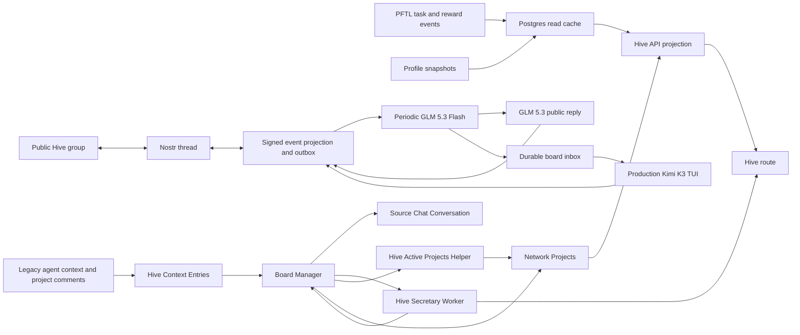

# Hive

Hive is the network coordination surface. It shows active projects, task routing, operator load, and project-scoped activity in one place so members can understand where the network is concentrating attention.

The current implementation uses Postgres-backed network project records plus live Hive Context, board comments, public profile snapshots, and GLM Board Secretary Project Status memos. The original Hive mock is preserved only as design reference. The old Board Manager action loop and Hive Decision Agent mutation lane are retired by default: Hive now separates readable board-status synthesis from any production Kimi task manager that may consume that status as advisory context.

## User Surface

Network tasks are selected by the production Kimi manager for eligible contributors
with free task capacity. A board having three existing tasks does not prevent new
assignments. Badge requirements, board assignment restrictions and reward budgets
still apply. The manager receives follow-up duties for old offers and inactive
accepted tasks; eligible stale work is cancelled with a recorded reason after
checking for newer progress. Submitted or rewarded work is not cancelled by this
stale-task path. Missing access to submitted evidence blocks review rather than
counting against the contributor.

The Hive route is available at `#hive` from the primary sidebar. The surface contains:

- active projects with live task rows, live contributor/allocation state, and routed PFT derived from real task data
- a routing feed showing recent project-linked task state transitions, newest first
- allotted operators derived from live project-linked task allocation, shown with the user's profile NFT/PFP when available
- project detail pages for active `network_projects` rows
- a collapsed `Hive Context` section at the bottom of the page with two tabs: `Hive Context` for Secretary/raw inputs and `Hive Mind Agent` for historical Board Manager/action audit rows
- collapsed project `Board comments` toggles inside each project detail About section, backed by Hive Context entries scoped to that project

While the Hive route is open, the active project document quietly refreshes from `/api/hive/projects` on a short interval. Project-linked task rows, contributor state, and routing feed entries therefore catch up after PFTL/task projection updates without requiring a full browser reload. The route serves one shared cached board document for signed-in and signed-out viewers, then applies only a cheap per-viewer `nextTask` overlay so viewer-owned work can be highlighted without rebuilding the whole project packet for every account poll. Viewer-owned accepted/submitted/review tasks are labeled as active task state; viewer-owned proposed tasks are labeled as task offers, not active tasks.

The project detail page is layered as:

1. About
2. Contributors
3. Tasks
4. Activity

Project detail task rows and activity rows use the same compact row structure:
status, task title, current public operator identity, PFT amount, and explicit
next-action text. Activity rows also acknowledge the latest state transition so
the user does not need to infer whether a proposed, accepted, submitted,
refused, or rewarded task was recorded. Long task and activity lists paginate
in-page instead of expanding the project page indefinitely.

Project cards include a `Next reward task` preview. If the project has a live
accepted, verification, submitted, or proposed task, the card shows that task,
its current state, reward amount, and next action. If no reward-bearing task is
available, the card shows the honest blocker: either a queued generation job or
that no reward-bearing task is available right now.

Hive operator identities link to `#/profile?account=<accountId>` only when the
wallet resolves to an account that already has a public discoverable profile.
Hive task rows, routing-feed rows, activity rows, and next-task previews open a
read-only Hive task pop-out. That pop-out is scoped to network-project tasks
only and surfaces public lifecycle summary fields, public tx hashes, and CIDs;
it never decrypts or returns raw evidence plaintext. When an evidence-evaluation
orc packet exists for the task, the pop-out also shows its summary,
recommendation, and compact artifact verdicts (`verified`, `self_attested`, or
`unverified`). Those packets are follow-up context only; reward decisions still
belong to the normal task review and reward publication path.

Public identity resolution is wallet-scoped but account-aware. The Hive project
repository resolves task assignees, operators, contributors, and feed actors to
`accountId`, `hasPublicProfile`, public handle, display name fallback, and
selected profile NFT/PFP only when the account is already public and
discoverable (`server/repositories/hive-projects.js:86`,
`server/repositories/hive-projects.js:860`). The frontend uses the same pattern
as Directory: if `hasPublicProfile` is true, the identity badge/name is an
`#/profile?account=<accountId>` link; otherwise it renders as inert text
(`src/features/hive/HiveView.jsx:587`). This applies to routing feed rows,
allotted-operator rows, contributor cards, project task assignees, activity
rows, and task pop-out assignees.

The routing feed preserves the Hive codename as the primary displayed operator
name. Public `displayName` is exposed as a separate fallback field, not a
replacement, so wallet feed names do not get clobbered by profile display names
(`server/repositories/hive-projects.js:118`).

Project IDs are part of the product surface. The project detail header should expose the stable `network_projects.id` so operators can refer to a project in tasks, docs, and chat without ambiguity.

### Hive chat: the public group

Open **Hive chat** in the primary sidebar or use the **Open Hive group chat**
button on the Hive boards page. `#hive-chat` is one shared public conversation
for Task Node members, backed by a signed Nostr thread. Handles link to member
profiles; timestamps link to the signed Nostr event. Profile pictures reuse
the selected public profile NFT, with a starter portrait when none is available.
Type `@` to select a member, or use Reply to reference a message.

Reading works while signed out or with the wallet locked. Sending requires a
signed-in account with a discoverable profile, an active public Messages
identity and the matching unlocked wallet. Signed-in users without Messages
see a nonblocking setup prompt. Messages explains the identity and provides a
return link to Hive after activation. The composer clearly labels messages as
public on Nostr; direct Messages remain encrypted.

`@hive-board` is an automated participant. On new community activity, GLM 5.3
Flash periodically decides whether to respond or escalate. It can remain
silent. GLM 5.3 writes selected replies from public room messages, room facts
and public board summaries. No private chats, memories, task evidence or
legacy Hive conversations enter this context. The default check interval is
60 seconds, with no model call for an idle room and no immediate model call
on message submission.

Concrete board issues can create durable `hive_group_escalations` inbox items
for the existing production Kimi K3 Corbanu TUI manager. Board packets,
digests and supervisor duties include those items. The manager reads
`bm hive-inbox <board>` and uses `bm hive-reply <id> --message <public text>
--outcome resolved|declined` after investigation. Existing board scope and
action permissions still apply. Closing the inbox and queuing a signed reply
share the command transaction; retries cannot duplicate the reply. The group
shows when an escalation is queued and when the manager has replied.

The member panel contains **Previous private Hive chat**, a read-only archive
scoped to the current account. Historical private conversations are never
imported into the Nostr room. Old Hive recent-chat links now open the group.

## Hive Brain

`Hive Brain` is an operator-only audit tab under the sidebar `More` menu at
`#hive-brain`. It exposes the current board stack in human terms: the Hive
Reports, a deterministic Live Task Packet, Task generation history, system prompt documentation, and post-reward Task
Accounting harvests. Raw legacy Board Manager JSON is not the primary operator
surface.

The main read APIs are:

- `GET /api/hive/reports?type=&since=` for the report secretaries
- `GET /api/hive/reports/:id` for full report markdown plus verification phases
- `GET /api/hive/brain/live-task-packet` for the plain-English Live Task
  Packet
- `GET /api/hive/brain/task-generation-history` for Network Task generation
  jobs
- `GET /api/hive/brain/harvest-report` for the latest resolved-history Harvest
  Report
- `GET /api/hive/brain/harvests` for post-reward Task Accounting harvests
- `GET /api/hive/brain/harvest-checkouts` for the harvest checkout log

All Hive Brain endpoints are operator-gated. Most are read-only. Harvest rows
also support bounded accounting metadata mutations: verified Core Contributors
can check out an unresolved harvest row to their linked wallet, and authorized
Task Accounting operators can mark a row resolved with a comment. Hive Brain
cannot create projects, route tasks, execute hooks, change rewards, ban users,
or modify eligibility.

The Live Task Packet is assembled without an LLM. `server/repositories/hive-live-task-packet.js`
reads `task_projections`, `network_project_task_refs`,
`profile_public_snapshots`, `account_network_badges`, and
`network_badge_definitions`, then formats a readable contributor packet. Each
contributor section includes assigned proposed Network Tasks, outstanding
accepted/submitted/verification tasks, the last five rewarded Network Tasks,
the public profile description card fields shown on Profile pages, and verified
contributor badges. The Hive Brain overview polls the endpoint every 30 seconds
and renders the packet as expandable contributor/task sections. A collapsed
plain-text copy remains available for audit, but raw JSON and markdown tables
are not the primary view.

Task generation history is also assembled without an LLM. `server/repositories/hive-brain.js`
reads durable worker rows from `network_task_generation_jobs` into a
reverse-chronological operator view. Each row answers what durable worker job was queued, whether it linked to a request or
visible task, which badge lane and reward band were used, and any recorded
worker error. The surface is read-only and does not itself generate, approve,
publish, or reward tasks.

### GLM Board Secretary

`server/hive-board-secretary-worker.js` writes the Project Status memo shown in
each Hive project About section. It runs from the `board-secretary` process
group every 15 minutes when `TASKNODE_HIVE_BOARD_SECRETARY_ENABLED=true`, uses
Vercel `zai/glm-5.3` with Ambient backup, and stores rows in
`hive_board_secretary_memos`. The worker is advisory only. It cannot create
tasks, cancel tasks, send user messages, change rewards, mark work resolved, or
mutate project state.

The worker sets its own DB statement timeout from
`TASKNODE_HIVE_BOARD_SECRETARY_DB_STATEMENT_TIMEOUT_MS` and defaults to 60s so
large board packets can be assembled without changing the app-wide DB timeout.

Each run builds one deterministic board-scoped source packet from:

- existing project/task state from `network_project_task_refs`,
  `task_projections`, and pending generation jobs;
- board comments stored as Hive Context entries with
  `metadata.projectComment.projectId`;
- eligible contributors with verified badges and the same public profile
  description fields used by the Live Task Packet;
- Project Leader Hive Context messages relevant to the board.

Rewarded and paid tasks are intentionally compacted before the model sees them.
The packet includes task id, proposal summary, contributor, reward amount,
reward timestamp, reward tx/CID, and short reward commentary. It does not pass
full evidence packets, full verification responses, or raw attachment blobs for
rewarded work.

The rendered memo is Markdown and uses the fixed sections `What This Project
Is`, `Why This Advances PFT Value`, `Current Point People`, `Operators Needed`,
`Next Tactics`, `Overall Strategy`, and `Recommendation For Task Management
Agent`. Generated timestamps, model names, source packet digests, prompt
versions, and usage details remain stored on the memo row for audit, but they
are not rendered inside the user-facing board memo. The Hive UI prefers the
latest current `hive_board_secretary_memos` row over historical Board Manager
product documents for the collapsible `Project Status` block. If no memo exists
yet, it falls back to the older
`network_project_product_docs` row or the empty pending state.

### Hive Reports

Hive Brain also renders the Phase 1 Hive v2 report store. Reports are
operator-only, read-only markdown documents stored in `hive_reports`; they are
not JSON source packets. The list/detail API is:

- `GET /api/hive/reports?type=&since=` for recent report documents
- `GET /api/hive/reports/:id` for one full markdown report plus verification
  phases

The Hive Brain card grid calls the list API with
`includeLatestByType=true`. That response returns the normal recent report
page plus the newest row for each report type, so the 20-minute
`rewarded_task` report cannot push 24-hour reports out of the operator view and
make them appear missing. Card previews are derived from parsed markdown and
collapse KPI tables into short text summaries; the full report view renders
headings, lists, code, horizontal rules, and markdown tables.

Eight report builders run from `server/hive-reports-worker.js`:

- `rewarded_task`, every 20 minutes: per verified badge role, the last rewarded
  Network Tasks with proposal and reward context.
- `operative`, every 24 hours: verified operators by role, current allocation
  state, and the work they appear to be doing.
- `kol`, daily: public marketing/amplification state. It includes an
  `agent_verify` phase from the KOL link verifier, which fetches public links
  referenced by the report and records whether they are reachable.
- `development`, every 24 hours: core development state. It includes an
  `agent_verify` phase from the development repo verifier, which checks
  Post Fiat repository links and recent public GitHub issue/PR visibility.
- `qa`, every 24 hours: product QA activity and suggested improvements, drawing
  from QA-role tasks and recent Hive chats that look like product feedback.
- `executive`, every 24 hours: Project Leader Hive chats from the past 24 hours
  assembled into an executive brief.
- `hive_intelligence`, every 6 hours: strategic Hive Mind intelligence brief
  synthesized from all upstream Hive reports, the Harvest Report, the Live Task
  Packet, and current Board Secretary memos. It evaluates whether reward routing
  and operator work are likely to increase PFT value, then recommends actions
  within the board manager action space: deploy tasks, send targeted messages, or
  recommend founder-level changes.
- `board_manager_planning`, every 3 hours: advisory Board Manager portfolio
  planning report. It reads the latest Hive Intelligence report, live board
  state, outstanding tasks, recent rewarded tasks, Board Secretary memos, board
  comments, Project Leader context, Live Task Packet contributor descriptions,
  badge-routing constraints, and a compact archived-board index. It ranks boards
  by outcome clarity, KPI believability, budget effectiveness, upside/downside,
  and sequencing feasibility, then recommends only `ADD_BOARD`,
  `ARCHIVE_BOARD`, or `UNARCHIVE_BOARD` candidates. `UNARCHIVE_BOARD` uses the
  archived-board index and must respect operator archive locks. It does not
  execute those actions.

The Hive Intelligence source packet also includes deterministic task-routing
constraints: active task badge requirements plus operators grouped by verified
badge. Concrete task deployment or reassignment recommendations must use those
constraints. The report must not infer that an operator can receive a task from
profile text, point-person status, prior rewards, or general skill signals when
the task requires a different badge.

Report inputs are existing durable facts: `account_network_badges` for roles,
`task_projections` for active/rewarded Network Tasks, `network_projects` and
their task mirrors for dynamic projects, and `hive_context_entries` for Hive
chat. The builders use the configured Vercel Hive report model with high
reasoning effort in production; the `hive_intelligence` builder uses GLM 5.3
`xhigh` reasoning by default through
`TASKNODE_HIVE_INTELLIGENCE_REPORT_REASONING_EFFORT`. The
`board_manager_planning` builder uses GLM 5.3 `high` reasoning by default
through `TASKNODE_BOARD_MANAGER_PLANNING_REPORT_REASONING_EFFORT` and gets a
larger default visible output budget through
`TASKNODE_BOARD_MANAGER_PLANNING_REPORT_MAX_TOKENS`. `TASKNODE_HIVE_REPORT_PROVIDER_MOCK=true
node scripts/run-smokes.mjs db scripts/hive-reports-smoke.mjs` exercises the same storage, worker, list/detail,
and UI-facing shape without spending model tokens.

Report source packets must include human-readable operator identity when it is
durably known. Role and task rows use the latest account `public_handle` from
observability events as the public app handle fallback, and identity approvals
can provide a provider-specific handle/profile URL. This prevents role tables
from degrading to opaque account IDs when badge proof rows only contain metrics
such as KOL X follower counts.

Hive Brain report detail uses a lightweight markdown renderer for operator
readability. It renders headings, lists, code blocks, horizontal rules, and
tables. Because report models sometimes collapse markdown table rows onto one
line, the renderer normalizes table sequences such as
`| Metric | Value | |---|---| | Active projects | 5 |` into real table rows
before rendering. `node scripts/hive-report-markdown-smoke.mjs` covers both valid
multi-line tables and collapsed report tables.

### Historical Task Accounting Harvests

The disabled accounting harvester loop, provider, prompt, and queue writers
were removed on September 5, 2026. Existing harvests remain readable and can
still be checked out and resolved through the authorized Hive Brain workflow.
The descriptions below explain stored historical classifications and manual
resolution; there is no periodic harvest generation or enable switch.

`requires_action=false` means the rewarded task was self-contained, for example
a completed bug fix where no separate product or operator follow-up is needed.
`requires_action=true` means the rewarded task packet contains follow-up signal:
a bug, product/UX issue, feature request, release/community communication need,
routing/accounting concern, or other concrete item that should be surfaced to a
personnel or project owner.

The suggested action must be a concrete output, not a handoff. It is one
imperative instruction naming the artifact or system change to make. Product,
UX, routing, workflow, and accounting defects must become investigation/fix
work: reproduce or inspect the named behavior, implement the fix when the
defect exists, and provide not-a-bug evidence only when it does not reproduce.
They must not become tracker-ready QA packets or documentation-only follow-up.
Valid non-defect examples are a PR, config change, release note, X post,
Discord announcement, smoke test, migration, prompt change, or runbook update.
Invalid examples are "route this", "surface this",
"send this to the team", "review this", "assign this", "tag someone",
"check this", or conditional "if/then" branches. The action text must not make
a person's later approval, assignment, tag, or inspection the completion
condition. The first verb must create or change something concrete: Open,
Create, Add, Update, Implement, Publish, Write, Run, Configure, Remove, Merge,
File, or Investigate.

The action must also name the actual findings. Rows should not say "the report,"
"the memo," "the three issues," "the broken states," or "the proposed fixes"
without spelling out what they are. For a UX report, the action should list the
specific user-visible gaps to file or fix. If the stored task packet lacks the
actual findings, the correct action is a data-capture fix for that packet class,
not a vague follow-up.

The harvester is accounting-only. It does not execute enforcement, clawbacks,
reward changes, bans, eligibility changes, or routing mutations. Those still
require the appropriate guarded product, protocol, or operator path.

The Hive Brain `Harvests` tab displays the queue output: task, reward,
classification, summary, suggested action, category, and harvest time. The
default list is unresolved rows only. Verified Core Contributors and active Orc
agents can press `Check out` to assign a row to their linked wallet; the current
checkout is stored on `task_accounting_harvests`, and every checkout writes an
append-only event to `task_accounting_harvest_checkout_events`. The tab shows
active checkouts for unresolved rows only. Resolving a harvest clears the current
checkout owner; the append-only event remains available to audit callers that
pass `includeResolved=true`. A separate resolved-history section keeps closed
rows visible with the stored resolution comment. Authorized Task Accounting
operators, or the eligible current checkout owner for that row, mark rows
resolved from that tab by
entering a comment in the resolve dialog. The APIs are
`GET /api/hive/brain/harvest-report`,
`GET /api/hive/brain/harvests?resolved=false`,
`GET /api/hive/brain/harvests?resolved=true`,
`GET /api/hive/brain/harvest-checkouts`,
`POST /api/hive/brain/harvests/:taskId/checkout`, and
`POST /api/hive/brain/harvests/:taskId/resolve`. The focused mock smoke is:

The Harvest Report is the overview-level digest of resolved history. It is
generated from deterministic row data, not from another LLM call. Every third
newly resolved harvest creates the next persisted report in
`task_accounting_harvest_reports`; the report endpoint also catches up missing
three-resolution buckets if older code closed rows before a report existed. The
three-row boundary is the refresh cadence, not the report scope: each generated
report summarizes the current resolved-history/backlog state at generation time
and then lists the latest detailed resolved rows up to the report detail limit.
The report body stays plain-English and includes:

- Overall BLUF: current unresolved/actionable/checked-out backlog state.
- Key issues resolved: what concrete problems were identified and actioned by
  Grashnuk or another eligible operator.
- Solutions and deployment: the actual closeout outcome, with deployment or
  verification evidence only when the resolution note states it.
- Productive takeaways for the current board state and operators.
- Initiators: who checked out/resolved the rows and what they need to know next.

The Hive Brain overview tab displays the latest Harvest Report as a card inside
`Reports & generations`, next to the normal Hive reports. If fewer than three
harvests have ever been resolved, the card shows how many more closeouts are
needed before the first report is generated.

### Hive v2 Decision Agent (removed)

The Hive v2 Decision Agent, its routes, prompt, and `hive_decision_runs` table
were removed (migration 146). The current Hive runtime uses readable reports,
the GLM Board Secretary, and Kimi K3 for board/task management.

## New User Quickstart

1. Sign in and choose a public Task Node handle in Profile.
2. Link a wallet and keep its recovery information safe.
3. Open Messages and activate your wallet-bound Nostr identity. The activation
   page explains private Messages and public Hive chat together.
4. Open Hive chat, unlock the wallet when sending, and join the group using
   your handle and profile picture. `@` tags members; Reply links messages.
5. Ask the group or `@hive-board` about concrete board work. The periodic bot
   may reply or pass an actionable issue to Kimi; a message alone is not a task.
6. Open Tasks to accept offers, submit evidence and follow verification.

## Group transport and recovery

The room uses public kind-1 notes with NIP-10 root/reply `e` tags and `p` tags
for mentions. This works with the existing configured public relays without
requiring a new managed relay. Protocol reference:
[NIP-10 thread markers](https://github.com/nostr-protocol/nips/blob/master/10.md).
The bot's stable key signs the root and its own kind-0 profile once. Its
reserved NIP-05 address is `hive-board@tasknode.postfiat.org`.

Browsers derive the existing Messages key locally and submit a signed event.
The API verifies its signature, room root and current account-to-key binding,
then stores it in a durable outbox. Only a relay's positive event ACK marks
it delivered. A temporary outage returns HTTP 202 and the UI says it is saved
and retrying. Failed HTTP requests retain the draft and signed event ID in
account-scoped session storage, so retrying after a reload does not create a
second message. No private signing key is uploaded.

A live browser relay subscription supplies new events; a five-second API
catch-up pass recovers missed deliveries. The existing `worker:hive` process
handles relay ingestion, pending publications and periodic bot participation.
Only verified events from current public Task Node messaging identities or
the trusted bot enter the application feed. Relay ingestion does not grant
access to task or board actions.

Postgres delivery sequences, an atomic bot lease and a durable cursor protect
against duplicate replies and skipped late deliveries. Transport checks run
independently of slow model calls. Bot decisions, escalation creation and
reply outbox insertion commit together. Board replies use the same outbox.

Private legacy Hive Context, project board comments, Secretary reports and
historical Board Manager audit views remain separate from the public group.
`POST /api/hive/context` remains the project/agent context intake boundary;
it does not feed the group or produce immediate responses when group chat is
enabled. Legacy `POST /api/hive/chat` returns 410 with the new group location.

## Board Manager Target

The Board Manager is the system operator for Hive. It is a leased model decision worker with a bounded action registry. It runs periodically or after meaningful state changes, claims a single `global_hive` lease, inspects the current board state, and chooses one action.

The active board professionalism standard now lives in this Hive surface page
and [Architecture -> Hive & Board Operations](#docs/hive-operations).
Active board counts must be live execution counts, not planned or scoped counts.
Board Manager archives are reversible unless an explicit operator archive lock
is present.

Board management runs as the Kimi K3 board manager on the operator host,
through `scripts/bm.mjs` and the scoped board-agent API. The `board-secretary`
process group writes advisory per-board memos. The earlier in-app V0 decision
worker, loop runner, scheduler, and Codex executors were removed.

Allowed actions include:

- do nothing
- update the Board Manager context document
- refresh Hive Secretary
- research
- message a user for follow-up context
- create or update projects
- archive projects that should leave the active board
- refresh a project product document
- assign or remove contributors
- initiate project-linked Network Tasks with rewards
- review evidence packets through the existing task engine

Implemented hooks today are `message_user`, `refresh_hive_secretary`, `create_project`, `archive_project`, `restore_project`, `refresh_project_document`, `assign_contributor`, and `initiate_network_task`. `archive_project` hides the row from the active board but does not hard delete it. `restore_project` reactivates a non-operator-locked archived project instead of creating a duplicate board. Autonomous Board Manager archives are soft and reversible; explicit operator archive locks are the only archive state the planner must not resurrect. `create_project` is guarded by the current project registry and skips when an active or archived similar project already exists, so new boards are the exception rather than the default append path. `message_user` writes an assistant message into the user's default Hive chat conversation, records a delivery audit row in `board_manager_user_messages`, and opens a durable `board_manager_followups` row. The target must be a Hive Context entry from the current source packet or an account/candidate present in that packet, so the model cannot invent an arbitrary recipient. Delivery is idempotent at the action-hook boundary: one Hive Context entry can receive one Board Manager response, and an account/project with an open follow-up cannot receive repeated consecutive Hive messages while waiting for the user to respond. Task-action messages are also stale-guarded: the decision must carry a structured `payload.message_precondition` naming the related task or allocation and the live statuses that must still hold, and the hook re-checks the account's live state at execution time. A message whose referenced task already reached a terminal state, or that asks the user to act when no action remains, is skipped and recorded with the skip reason instead of being delivered. `assign_contributor` has the same source-packet boundary: the wallet must appear as a validated Hive Context wallet or as an eligible Network Task candidate in the current packet before the hook can add it to a project. When the DeepSeek secretary compresses the Board Manager packet, the app carries only a small action-target registry plus open follow-up state into the compressed packet so these hooks can still validate recipients and contributors without exposing the full raw source packet to the downstream model. The Hive Mind Agent tab itself stays focused on the agent run/action feed. `refresh_project_document` writes the agent-managed Project Status shown inside a Hive project About section.

`initiate_network_task` does not let the Board Manager write the final task offer. It creates a project-linked allocation row, a semantic `network_task_intents` row, and a durable generation job. The intent key is based on project, candidate, task class, normalized need, and reward band rather than the Board Manager run id, so repeated runs suppress the same task request instead of generating another copy. The gated `server/network-task-generation-worker.js` then turns that job into a normal task request bundle and schedules the existing task-generation worker. The resulting offer is still a normal encrypted `pf.task.offer.v1` task pointer from the task engine, with project metadata attached for Hive reads.

If the Board Manager queues the wrong work or a generated request fails before a task offer exists, close the allocation chain instead of retrying it blindly. The task-generation worker automatically does this for failed Board Manager-generated requests before offer publication: it marks the allocation failed, marks the generation job failed, stales the semantic intent, and hides the task request receipt as operator-audit-only so it does not appear as `Needs attention` in the Tasks UI. If automatic repair did not run, use `npm run network-task-allocation-repair -- fail --allocation-id <id> --reason "<reason>" --execute` or `npm run network-task-allocation-repair -- fail --request-id <id> --reason "<reason>" --execute`. To route an operator-supplied replacement through the normal Board Manager hook, use `npm run board-manager:manual-network-task -- --project-id <id> --account-id <account> --wallet <wallet> --need "<plain-English task need>" --reason "<routing reason>" --execute`. The manual command creates an auditable Board Manager run and still uses `initiate_network_task`; it does not insert a visible task directly.

After a Network Task exists, Hive does not let the Board Manager manage status. The task lifecycle is read from `task_projections`, which is rebuilt from signed PFTL task events. `network_project_task_refs` and `network_task_allocations` are display/routing mirrors; `server/repositories/network-tasks.js` reconciles them from `task_projections` after projection imports and before Hive project reads.

Network Task restart recovery is implemented in `server/network-task-recovery.js`. It reloads active project-linked Network Tasks from `task_projections`, repairs the Hive mirrors, preserves latest evidence CIDs/transactions from `task_events`, and reports the next valid action. Accepted tasks wait for user evidence. Submitted tasks resume verification-request generation unless that worker already published. Verification-response-submitted tasks resume reward scoring unless that worker already published. Recovery never signs accept/refuse/cancel or evidence-submission transitions for the user.

Rewarded Network Tasks now create a delayed Board Manager inspection trigger. When `syncNetworkTaskProjection` sees a project-linked task reach `rewarded`, it enqueues `network_task_rewarded_followup` due two minutes after the reward event. If a Board Manager run already completed after that reward timestamp, or completes before the delayed job is claimed, the follow-up is skipped. This keeps task state canonical in PFTL while still prompting the Hive board to react when completed work changes project context.

The Board Manager source packet now includes a `networkTaskContent` snapshot. This is the Board Manager's compact working memory for project-linked Network Tasks. It includes:

- the last five rewarded Network Tasks, with title, description, steps, submission requirement, state, actual reward, and reward summary;
- current outstanding Network Tasks, including proposed, accepted, submitted, verification, reward-decision, and repairable generation-link states;
- recent stopped Network Tasks, including refused, cancelled, rejected, expired, failed, or rerouted states;
- queued/running/generated network-task generation jobs that do not have a projected task yet.

This snapshot is intentionally not the full forensics view. It does not carry raw CIDs, transactions, every metadata field, or full uploaded artifacts. The purpose is to let the Board Manager understand what work happened and what work is still active before it refreshes a project document, messages a user, or allocates another Network Task.

User routing context is also compacted before it reaches the Board Manager. `network_task_profiles` are generated asynchronously by the memory worker through the DeepSeek Flash ZDR route, and `listEligibleNetworkTaskCandidates` passes only those small diagnostic profiles plus the active wallet. The Board Manager does not receive full user context documents, full chat history, or raw memory bundles in the normal decision packet.

Network Task eligibility is not a manual application flow. A user becomes routable when their Task Node account has a linked PFT wallet, that wallet is active in the PFTL sync cache, the Memory worker has generated a completed Network Diagnostic Report, the account has a verified operating badge, and the account/wallet has no outstanding or pending Network Task consuming capacity. Task Node queues a missing report automatically from the memory worker's active-wallet sweep and from eligibility reads; opening Memory is not required, while its refresh button remains an explicit rebuild control. There is no flow for requesting the report from Hive, Board Manager, or an operator, and user-facing surfaces must not describe one. The Board Manager can then allocate a Network Task only when an active project needs work that fits that routing profile. Personal and engineering task history is useful signal, but it is not the capacity gate and should not be described as a hard prerequisite.

Network Task capacity has one canonical rule, implemented once in `listNetworkTaskCapacityBlockers` (`server/repositories/network-task-capacity.js`) and used by all three capacity surfaces: the Board Manager executor hook (`enqueueNetworkTaskGenerationFromBoardDecision`), the user-facing `getNetworkTaskEligibility`, and `boardActionPressure.candidateCapacity`. The rule:

- Liveness is status-based, not time-window based. An allocation in an active status (`candidate`, `queued`, `proposed`, `accepted`, `submitted`, `verification_requested`, `verification_response_submitted`, `reward_decided`) blocks regardless of age; a multi-day accepted Network Task still consumes capacity. There is no 24-hour created_at window anywhere.
- `task_projections` is the truth for generated tasks. An allocation whose underlying task projection reached a terminal outcome (`refused`, `rejected`, `cancelled`, `expired`, `rerouted`, `failed`, `completed`, `rewarded`) never blocks, even if the allocation mirror row is stale.
- Capacity ignores task class. An active allocation of either class (`network` or `alpha`) blocks new allocation for that wallet; cross-class blocking is explicit policy.
- Capacity is wallet-aware. Once an outstanding task or pending generation job has a concrete candidate wallet, it consumes capacity only for that same wallet. If the user delinks that wallet and links a different active wallet, the old wallet's task stays in the audit trail but does not block the newly linked wallet from Board Manager routing (wallet-bound blockers only count while that wallet is still an active linked user wallet in `pftl_sync_wallets`). Account-only pending work still consumes account capacity until the candidate wallet is known.

Because all three surfaces call the same predicate, the executor cannot double-allocate a contributor the eligibility panel calls busy, and the eligibility panel cannot say "available for routing" while the Board Manager packet marks the candidate blocked. `node scripts/network-task-capacity-smoke.mjs` pins the three call paths to the same verdicts.

The source packet also includes `boardActionPressure`, a deterministic health summary. This is the guard against passive Hive decisions. If active projects have no live tasks, no contributors, no pending generation, or a recent stopped Network Task with no follow-up, the packet marks the board as action-required. It also marks action required when the latest project-linked Network Task was stopped and there is no newer replacement task or generation job, even if older work is still open. In that state the manager should route work, assign an eligible contributor, ask for the smallest missing decision input, refresh the project document with a concrete blocker, restore a matching archived project, or archive the project. `eligibleCandidateCount` means candidates still available after outstanding and pending Network Tasks are accounted for, so a busy contributor is not counted as free capacity. Personal and engineering tasks are context only; they do not make a contributor ineligible for a Network Task. Recent refusals are routing feedback, not a live capacity status; the manager should inspect refusal notes and route materially different work or ask a follow-up instead of saying the candidate is "currently refusing tasks." When capacity is unavailable, the packet includes the exact outstanding Network Task or pending generation job consuming that capacity in `boardActionPressure.candidateCapacity.activeNetworkTaskCapacityBlockers`. If `eligibleCandidateCount` is zero and there is no open user follow-up, the expected fallback is `message_user`, not `do_nothing`. If `eligibleCandidateCount` is greater than zero, stale project documents or older follow-up summaries that claim all contributors are blocked must be treated as outdated context and not as current blockers. A Project Status refresh is not live board motion; it cannot by itself clear an empty project. `do_nothing` is acceptable when the board already has live motion, a matching task/generation job is in flight, or a targeted user follow-up is waiting for a response.

Account live-state prompt lines for a user's Network Tasks include the task id, allocation id, task/allocation status, reward offer, accept-by timestamp, deadline timestamp, and `waiting_for_user` flag when those values exist. Hive Chat and Board Manager messages can therefore tell a contributor that a proposed Network Task is waiting for accept/refuse with the concrete task id, reward, and accept-by window instead of describing capacity as a silent delay.

The normal Hive UI can hide empty active project rows until they have tasks, contributors, pending generation, or an operator pin. The Board Manager source packet must still include empty active projects. Otherwise the manager cannot see a project need and cannot route the first Network Task that would create the evidence row.

The Hive project task row renders canonical task statuses directly, including `rewarded`, `verification_response_submitted`, intermediate states, and stopped states. Unknown statuses are shown as unknown, not silently downgraded to `proposed`.

Task assignees use the assignee wallet's latest selected/profile NFT image when one exists in `profile_nfts`. Operator labels are enriched from the current public account identity for the linked wallet, so public Hive handle or public display-name changes appear on Hive without waiting for Board Manager to rewrite project contributor rows. If no public identity or profile NFT image is available, Hive falls back to the small deterministic SVG badge and compact wallet label.

The Routing Feed and Allotted Operators sections are also derived from live project-linked tasks. `network_project_contributors` and `network_project_activity` may hold explicit project rows later, but the current board will not stay empty when `network_project_task_refs` has real tasks. A project-linked task with an assignee creates a contributor/operator read model, and its current task state creates a routing-feed entry. The Allotted Operators subtitle refers to operators currently routed by live project tasks, not a permanent full-time membership claim.

The Routing Feed is intentionally compact. It should show who acted, what changed, which project/task it belongs to, and PFT when useful. Rewarded rows also show a compact `Proof` action when a reward tx/CID exists, linking to the configured PFTL explorer or opening the task proof popout. It should not render raw request IDs, task IDs, CIDs, full transaction hashes, or placeholder words such as `indexed`; full proof values belong in task forensics, the Hive task popout, or operator logs.

Current local Docker state:

- Project `task_node` has a live project-linked Network Task row.
- Task `task_01af1624fcb74e41d902ca32b126f27d` was generated from Board Manager allocation `netalloc_66cc6446-8ff3-4cb3-9049-a23e75e44ba8` and generation job `nettaskjob_2d863a1a-0d57-47c2-9b33-52787ad8d37c`.
- The request id is `req_net_c73fe62037a9cf201d51b32bdefa69ca`.
- The offer transaction is `E6C86781C0D53A68F2E7740AA8751E19616B9732489D9EA8C4330A692AC1A931`.
- The task completed through normal submission, review, and reward. `task_projections.status` is `rewarded`.
- `network_project_task_refs.state` mirrors `rewarded`, and `network_task_allocations.allocation_status` mirrors `completed`.
- The Hive project task row, Routing Feed, Allotted Operators, and assignee profile badge now render from that live project-linked task path.

The old direct cascade where Hive Secretary automatically drives active projects is deprecated as the target architecture. The existing Secretary and Active Projects workers remain implementation primitives, but the Board Manager should own when they run.

## Hive Secretary And Active Projects

Hive Context stores validated inputs and queues the context secretary.
`server/hive-secretary-worker.js` summarizes those inputs through Vercel GLM
5.3 with Ambient backup and stores the report in `hive_secretary_reports`.
`GET /api/hive/context` returns both raw context and the current report.

The secretary prompt is `prompts/hive/hive_secretary_v1.md`; its structured
output contains summary, project signals, network implications, open questions,
and next system focus. It does not create tasks or mutate the board registry.

The experimental project planner was removed. Kimi K3 and authorized operators
manage deterministic boards; historical project generations remain readable,
and operator archive locks remain enforced.

Each project can now have a project-linked Product Document. Each project card opens a project board whose About section can include a generated document with:

- how the project realistically benefits the network;
- what success looks like;
- current status;
- who is working on it and why;
- what is blocked or unclear.

Historical Product Documents were written by the Board Manager when it chose
`refresh_project_document` and stored in `network_project_product_docs`. Those
rows remain for audit/fallback, but the current Project Status writer is the
GLM Board Secretary. It writes advisory Markdown memos to
`hive_board_secretary_memos` from deterministic board packets and does not
execute Board Manager actions.

The Project Status memo appears as a collapsible section inside About. The
static `network_projects.about` text explains what the project is. The generated
Project Status memo explains the current execution picture, point people,
operator needs, next tactics, overall strategy, and the recommendation for a
production Kimi task manager. The collapsed view shows only a short preview so
the project page remains scannable. Debugging metadata such as source packet
digests and provider/model details is kept in storage and system status, not in
the visible memo body.

If no current product document exists, the About section shows the static project description plus the empty state `Project status has not been generated yet.` It does not show filler copy.

Current endpoints:

- `GET /api/hive/projects` returns active network projects, project task rows, contributor rollups, activity rows, the latest scoped project board comments, and the latest Hive Secretary input reference.
- Project detail `Activity` is a recent feed. When activity rows are derived from task mirrors rather than stored `network_project_activity`, the response caps the derived activity list so terminal project history is not duplicated into both `tasks` and `activity` on every poll. Full task history remains in the `Tasks` table and project counters.
- `GET /api/hive/task-detail?taskId=<taskId>` returns a public read-only detail document for a network-project task only. Non-project personal/private task IDs are rejected before task event rows are read.
- `GET /api/hive/context` returns the grouped Hive Context document, Hive Secretary report/job state, and public Board Manager action feed. If the viewer is signed in, it also includes that account's private Board Manager messages. If the signed-in viewer passes `agentLogs=full`, Board Manager feed rows include expandable stored run logs for the Hive Mind Agent tab.
- `POST /api/hive/context` stores legacy agent context or project board comments and queues the existing Secretary. It is separate from public Hive group messages and does not invoke immediate replies while group chat is enabled.
- `GET /api/hive/chat` returns private legacy conversation metadata for the archive.
- `PATCH /api/hive/chat` marks the signed-in account's unread Board Manager Hive messages as read.
- `POST /api/hive/chat` returns 410 while group chat is enabled, directing clients to Messages setup and the signed group endpoint.
- `GET /api/hive/group` returns the public room, members and recent delivered messages, plus the authenticated caller's own pending outbox and setup state.
- `GET /api/hive/group/status` returns authenticated setup and unread state.
- `POST /api/hive/group/messages` accepts `{event}` only: a valid signed kind-1 event for the room and the current account binding. Returns 200 after relay ACK or 202 for a durable pending message.
- `POST /api/hive/group/read` records a monotonic delivery sequence for unread badges.

The public task-detail endpoint first joins `network_project_task_refs` to
`task_projections` and `network_projects`; if no project-linked row exists, it
returns `hive_task_not_found` before reading `task_events`
(`server/repositories/hive-projects.js:1007`). This is the hard data boundary
that keeps personal/private task ids out of the public Hive pop-out.

The explicit public field contract is stored as
`publicHiveTaskDetailFields` in `server/repositories/hive-projects.js`. The
response may include only:

- task identity and display fields: `task.id`, `task.taskId`,
  `task.requestId`, `task.title`, `task.state`, `task.kind`, `task.summary`,
  `task.description`, `task.source`, `task.createdAt`, `task.updatedAt`,
  `task.age`, and `task.nextAction`;
- public assignee fields: `task.assignee`, `task.assigneeAccountId`,
  `task.assigneeHasPublicProfile`, `task.assigneeHandle`,
  `task.assigneeDisplayName`, and selected `task.assigneeNft` title/status/CID
  fields;
- public reward/project fields: `task.pft`, `task.proofTxHash`,
  `task.proofCid`, `task.project.id`, `task.project.name`, and
  `task.project.type`;
- public work/review summaries: `review.submissions[].type`,
  `review.submissions[].summary`, `review.verification.request`,
  `review.verification.response`, `review.outcome.decision`,
  `review.outcome.rewardPft`, `review.outcome.reason`,
  `review.outcome.paymentTxHash`, `review.outcome.paymentCid`, and
  `review.outcome.paymentObservedAt`;
- timeline audit fields: `timeline[].action`, `timeline[].label`,
  `timeline[].time`, `timeline[].txHash`, and `timeline[].cid`.

The pop-out is read-only. It has no accept, submit, verify, wallet signing, or
lifecycle controls; those stay on the Tasks surface for the owner/operator
workflow.

## Technical Architecture

The production app does not import design mocks, and the app route is implemented as normal source code:

- `src/features/hive/HiveView.jsx` renders the Hive index and project detail drill-in.
- `src/features/hive/hive.css` contains the isolated styling for the surface.
- `src/main.jsx` registers `#hive`, adds the sidebar entry, and lazy-loads the view.
- `server/hive-routes.js` serves Hive project, Hive Context, and Hive Secretary reads and writes.
- `server/hive-board-secretary-worker.js` runs the advisory per-board GLM 5.3 memo writer every 15 minutes.
- `server/repositories/hive-board-secretary.js` builds deterministic board-scoped packets, truncates rewarded task evidence, persists current memo rows, and exposes public memo reads for Hive projects.
- `server/hive-board-secretary-provider.js` calls Vercel `zai/glm-5.3` with Ambient backup for Project Status Markdown.
- `server/repositories/board-manager.js` builds the Board Manager source packet, validates action decisions, records runs, records action results, formats the Hive Mind Agent feed, and reads manager message delivery audit rows.
- `server/profile-daily-airdrop-worker.js` runs recurring Daily Airdrop scoring/issuance when enabled and records internal `daily_airdrop` cards into the Hive Mind Agent feed.
- `server/repositories/board-manager-health.js` computes `boardActionPressure`, including empty active project and stopped Network Task pressure.
- `server/board-manager-actions.js` executes the first Board Manager action hooks.
- `server/process-role.js` separates `web`, `worker`, and local `all` startup roles so Fly web instances do not accidentally run background workers.
- `server/repositories/network-tasks.js` creates project-linked Network Task and Alpha Task allocations, claims generation jobs, and links published offers back to Hive projects.
- `server/repositories/network-tasks.js` also reconciles project task refs and allocation rows from `task_projections`; this prevents the Board Manager's initial allocation state from becoming stale after a user accepts, submits, refuses, cancels, or is rewarded.
- `server/repositories/network-tasks.js::getNetworkTaskContentSnapshot` builds the Board Manager's compact task-content snapshot from `network_project_task_refs`, `task_projections`, `network_task_generation_jobs`, `network_task_allocations`, and latest task reward/update events.
- `server/network-task-recovery.js` runs the restart recovery loop for active Network Tasks and exposes operator logs through `npm run network-task-recovery`.
- `server/network-task-generation-worker.js` consumes queued network-task generation jobs and hands them to the existing task-generation worker through `task_requests`.
- `server/repositories/chat-assistant-messages.js` appends Board Manager `message_user` responses to existing account-owned chat conversations without creating a billed model run.
- `schemas/board-manager-action.schema.json` constrains the Board Manager model output.
- `server/repositories/hive-context.js` persists raw Hive Context entries, Secretary jobs, and Secretary reports.
- `server/repositories/hive-projects.js` reads active network projects, links the latest Secretary report as a project input, derives routing feed/operator rollups from project task refs when explicit contributor/activity rows are absent, and serves the public network-project task detail pop-out payload. The routing feed, project tasks, and project activity sort by event/update timestamp descending before rendering. Contributor, operator, task-assignee, and activity rows use the selected profile NFT/PFP from `profile_nfts` when available, falling back to the generated badge only when no image exists.
- `server/repositories/hive-project-product-docs.js` builds a single-project source packet, reads the current product document, and inserts a new current product document while superseding the old one.
- `server/repositories/hive-project-planning.js` persists active-project planner jobs and completed generations, then upserts `network_projects`.
- `server/db/migrations/027_hive_context_entries.sql` creates the Hive Context table.
- `server/db/migrations/028_hive_secretary_reports.sql` adds linked-wallet validation metadata and Secretary job/report tables.
- `server/db/migrations/029_hive_network_projects.sql` creates the current network project read model and seeds the initial `PFT distribution v3` project spec.
- `server/db/migrations/030_hive_project_seed_cleanup.sql` removes earlier mock-only operator/task/feed seed rows from existing environments.
- `server/db/migrations/031_hive_project_planning.sql` adds the active-project planning job and generation tables.
- `server/db/migrations/032_archive_rejected_hive_scoping_projects.sql` archives the three rejected generated scoping cards from existing environments.
- `server/db/migrations/033_board_manager_v0.sql` adds Board Manager lease/run/action-result tables.
- `server/db/migrations/034_lock_operator_archived_hive_projects.sql` locks archived project rows so rejected projects do not reappear after a later planner run.
- `server/db/migrations/035_board_manager_action_hooks.sql` adds user-visible Board Manager messages.
- `server/db/migrations/036_board_manager_persistent_sessions.sql` remains for manual Codex operator-session tracking; the default Board Manager decision path is stateless provider calls plus durable run summaries.
- `server/db/migrations/038_network_project_product_docs.sql` adds versioned current/superseded product documents for Hive projects.
- `server/db/migrations/039_network_task_allocations.sql` adds Network Task allocation and generation job tables.
- `server/db/migrations/041_board_manager_run_micro_summaries.sql` adds compact Board Manager run artifacts for agent continuity and source-packet size control.
- `server/db/migrations/042_board_manager_scheduler.sql` adds durable scheduler scopes and jobs for production Board Manager execution.
- `prompts/hive/hive_secretary_v1.md` is the source-controlled Secretary prompt.
- `prompts/hive/board_manager_v1.md` is the Board Manager operating prompt and includes the `payload.project_document` shape for `refresh_project_document` plus the `payload.network_task` shape for `initiate_network_task`.

The Board Manager is the agentic writer for core Hive artifacts. It reads Hive state, chooses one action, and for `refresh_project_document` writes the document directly. Secondary models are reserved for explicit tools such as user-facing task generation, profile analysis, compression, or future subagent work, not for routine project-document authorship.

## Current Data Boundary

Active projects and project detail now read from Postgres. `PFT distribution v3` is seeded only as a bootstrap apriori network project record so the page has a real project shape before the first active-project generation runs. After a Hive Active Projects generation completes, the generated project set becomes the active set.

The project seed is intentionally not a fake live network. Project planning output can describe a coordination container, but the visible Hive read model must not render planned/scoped counts as task rows, routed PFT, or allocated operators. Live task rows must come from project-linked allocation data. Once `network_project_task_refs` contains a real linked task, the current Hive read model derives the project task row, contributor/operator row, routing-feed entry, and routed PFT summary from that task ref and its synced `task_projections` state. Explicit `network_project_contributors` and `network_project_activity` rows can be added later as materialized rollups, but the visible board is not allowed to go blank when the canonical task ref exists.

Hive Context is live Postgres-backed app data. It is not on-chain. Hive Secretary and Hive Active Projects are also Postgres-backed and regenerate from validated-wallet Hive chat entries after new entries arrive.

Public group cadence:

- Signed user messages are durably accepted and published without a model call.
- Relay/outbox checks run every five seconds in the existing Hive worker.
- Flash checks new member activity at most once per configured interval (default 60 seconds).
- GLM writes selected replies; Kimi handles escalations through its existing supervised TUI.

The Secretary and project status pathways below describe the separate legacy context and board projections.

Deprecated target:

- Do not keep adding independent cron-like workers for every Hive behavior.
- Do not let each Fly instance run a Board Manager loop.
- Do not let Active Projects, Product Documents, task assignment, and review each become separate overactive schedulers.
- Do not rely on tmux, SSH sessions, or manually watched shells for production Board Manager execution.

Board Manager target:

- A single leased Board Manager run wakes on a logical cadence or meaningful trigger.
- The manager selects one scoped action.
- Existing workers are called only as action handlers.
- Product Documents refresh when the manager decides a project is stale or materially changed.
- If a Product Document identifies missing information, the manager can research, ask follow-up questions, or initiate information-gathering Network Tasks under the existing project.
- Board Manager scope status is durable. `enabled`, `paused`, and `disabled` live in `board_manager_scopes`; worker startup can create a missing scope and update cadence/budget settings, but it must not silently flip a paused or disabled scope back to enabled unless the operator explicitly sets that status.
- The API worker must run both `TASKNODE_NETWORK_TASK_GENERATION_WORKER_ENABLED=true` and `TASKNODE_TASK_GENERATION_WORKER_ENABLED=true`. The Network Task worker consumes `network_task_generation_jobs` and creates normal encrypted task request bundles; the task-generation worker publishes the real `pf.task.offer.v1` task pointer. A queued generation job is only a pending worker input, not a visible Network Task.
- `network_task_generation_jobs` has the same stale-job recovery as Board Manager jobs. Each queue pass reclaims `running` jobs whose lock is older than `TASKNODE_NETWORK_TASK_GENERATION_STALE_MINUTES` (default 5) back through the normal failure path, so a killed worker cannot wedge a project in pending generation or hold candidate capacity forever; repeated crashes converge to `failed` and fail the allocation and intent. Retried generation jobs are also double-publish safe: if the deterministic task request already advanced (claimed, proposed, or linked to a generated task), the retry reuses the existing request and marks the job generated instead of re-queueing the request for a second `pf.task.offer.v1`.
- Outside local Docker, a live PFTL network-task offer still requires the network worker, task-generation worker, service encryption key, IPFS, and PFTL submit credentials to be enabled.

The Secretary report and Active Projects generation are not canonical task state. They are operator-readable planning artifacts. They make project identity available to the future system Network Task worker without pretending the report is itself a task.

The expected live replacement path is:

## Future Live Sources

The likely production data sources are:

- `task_projections` for task state, rewards, and project assignment
- `network_projects` for active project identity, target metrics, source inputs, and project detail
- `network_project_task_refs` after live allocation creates project-linked task rows
- derived contributor/operator and routing-feed read models from `network_project_task_refs` and `task_projections`, with `network_project_contributors` and `network_project_activity` available later for explicit materialized rows
- `hive_context_entries` for user-submitted network context
- `hive_secretary_reports` for the current synthesized network context report
- `hive_project_planning_jobs` and `hive_project_generations` for active project determination
- Board Manager lease/run/action tables plus user-visible Board Manager messages
- public profile snapshots for operator role and skill summaries
- daily airdrop and reward history for contribution weighting
- PFTL transaction cache rows for proof anchors and forensic drill-in

Relay publication returns the first positive acknowledgement promptly while
allowing the other relay attempts to finish within their own timeout. A delayed
relay fixture proves that a fast acknowledgement does not cancel replication.
