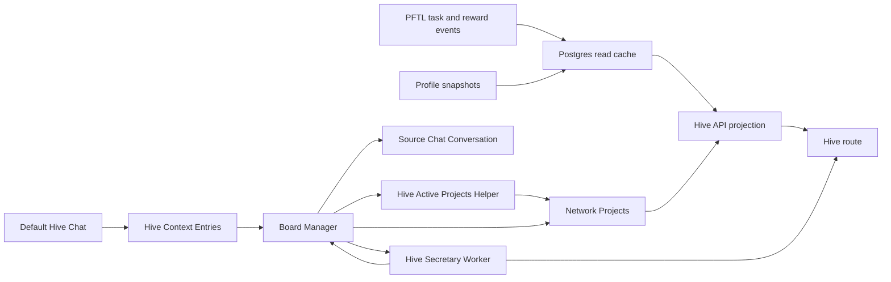

# Hive

Hive is the network coordination surface. It shows active projects, task routing, operator load, and project-scoped activity in one place so members can understand where the network is concentrating attention.

The current implementation uses Postgres-backed network project records plus live Hive Context and Hive Secretary data. The original Hive mock is preserved only as design reference. The target architecture is Board Manager centered: one leased Board Manager run decides when Hive context, projects, project documents, contributors, and Network Tasks should change.

## User Surface

The Hive route is available at `#hive` from the primary sidebar. The surface contains:

- active projects with live task rows, live contributor/allocation state, and routed PFT derived from real task data
- a routing feed showing recent project-linked task state transitions, newest first
- allotted operators derived from live project-linked task allocation, shown with the user's profile NFT/PFP when available
- project detail pages for active `network_projects` rows
- a collapsed `Hive Context` section at the bottom of the page with two tabs: `Hive Context` for Secretary/raw inputs and `Hive Mind Agent` for Board Manager actions

While the Hive route is open, the active project document quietly refreshes from `/api/hive/projects` on a short interval. Project-linked task rows, contributor state, and routing feed entries therefore catch up after PFTL/task projection updates without requiring a full browser reload.

The project detail page is layered as:

1. About
2. Contributors
3. Tasks
4. Activity

Project detail task rows and activity rows use the same compact row structure:
status, task title, current public operator identity, PFT amount, and explicit
next-action text. Activity rows also acknowledge the latest state transition so
the user does not need to infer whether a proposed, accepted, submitted,
refused, or rewarded task was recorded. Long task and activity lists paginate
in-page instead of expanding the project page indefinitely.

Project cards include a `Next reward task` preview. If the project has a live
accepted, verification, submitted, or proposed task, the card shows that task,
its current state, reward amount, and next action. If no reward-bearing task is
available, the card shows the honest blocker: either a queued generation job or
that no reward-bearing task is available right now.

Hive operator identities link to `#/profile?account=<accountId>` only when the
wallet resolves to an account that already has a public discoverable profile.
Hive task rows, routing-feed rows, activity rows, and next-task previews open a
read-only Hive task pop-out. That pop-out is scoped to network-project tasks
only and surfaces public lifecycle summary fields, public tx hashes, and CIDs;
it never decrypts or returns raw evidence plaintext. When an evidence-evaluation
orc packet exists for the task, the pop-out also shows its summary,
recommendation, and compact artifact verdicts (`verified`, `self_attested`, or
`unverified`). Those packets are follow-up context only; reward decisions still
belong to the normal task review and reward publication path.

Public identity resolution is wallet-scoped but account-aware. The Hive project
repository resolves task assignees, operators, contributors, and feed actors to
`accountId`, `hasPublicProfile`, public handle, display name fallback, and
selected profile NFT/PFP only when the account is already public and
discoverable (`server/repositories/hive-projects.js:86`,
`server/repositories/hive-projects.js:860`). The frontend uses the same pattern
as Directory: if `hasPublicProfile` is true, the identity badge/name is an
`#/profile?account=<accountId>` link; otherwise it renders as inert text
(`src/features/hive/HiveView.jsx:587`). This applies to routing feed rows,
allotted-operator rows, contributor cards, project task assignees, activity
rows, and task pop-out assignees.

The routing feed preserves the Hive codename as the primary displayed operator
name. Public `displayName` is exposed as a separate fallback field, not a
replacement, so wallet feed names do not get clobbered by profile display names
(`server/repositories/hive-projects.js:118`).

Project IDs are part of the product surface. The project detail header should expose the stable `network_projects.id` so operators can refer to a project in tasks, docs, and chat without ambiguity.

## Hive Brain

`Hive Brain` is an operator-only audit tab under the sidebar `More` menu at
`#hive-brain`. It exposes the current board stack in human terms: the six Hive
Reports, the Decision Agent decision trail, live task state, system prompt
documentation, and post-reward Task Accounting harvests. Raw legacy Board
Manager JSON is not the primary operator surface.

The main read APIs are:

- `GET /api/hive/reports?type=&since=` for the six report secretaries
- `GET /api/hive/reports/:id` for full report markdown plus verification phases
- `GET /api/hive/decision/runs` and `GET /api/hive/decision/run/:id` for the
  Decision Agent audit trail
- `GET /api/hive/brain/harvests` for post-reward Task Accounting harvests
- `GET /api/hive/brain/harvest-checkouts` for the harvest checkout log

All Hive Brain endpoints are operator-gated. Most are read-only. Harvest rows
also support bounded accounting metadata mutations: verified Core Contributors
can check out an unresolved harvest row to their linked wallet, and authorized
Task Accounting operators can mark a row resolved with a comment. Hive Brain
cannot create projects, route tasks, execute hooks, change rewards, ban users,
or modify eligibility.

### Hive Reports

Hive Brain also renders the Phase 1 Hive v2 report store. Reports are
operator-only, read-only markdown documents stored in `hive_reports`; they are
not JSON source packets. The list/detail API is:

- `GET /api/hive/reports?type=&since=` for recent report documents
- `GET /api/hive/reports/:id` for one full markdown report plus verification
  phases

Six report builders run from `server/hive-reports-worker.js`:

- `rewarded_task`, every 20 minutes: per verified badge role, the last rewarded
  Network Tasks with proposal and reward context.
- `operative`, every 24 hours: verified operators by role, current allocation
  state, and the work they appear to be doing.
- `kol`, daily: public marketing/amplification state. It includes an
  `agent_verify` phase from the KOL link verifier, which fetches public links
  referenced by the report and records whether they are reachable.
- `development`, every 24 hours: core development state. It includes an
  `agent_verify` phase from the development repo verifier, which checks
  Post Fiat repository links and recent public GitHub issue/PR visibility.
- `qa`, every 24 hours: product QA activity and suggested improvements, drawing
  from QA-role tasks and recent Hive chats that look like product feedback.
- `executive`, every 24 hours: Project Leader Hive chats from the past 24 hours
  assembled into an executive brief.

Report inputs are existing durable facts: `account_network_badges` for roles,
`task_projections` for active/rewarded Network Tasks, `network_projects` and
their task mirrors for dynamic projects, and `hive_context_entries` for Hive
chat. The builders use the configured OpenRouter Hive report model with high
reasoning effort in production. `TASKNODE_HIVE_REPORT_PROVIDER_MOCK=true
npm run hive-reports-smoke` exercises the same storage, worker, list/detail,
and UI-facing shape without spending model tokens.

### Task Accounting Harvester

Task Accounting Harvester is the canonical post-reward accounting queue for
rewarded Network Tasks. It replaces the prior Orc-owned rewarded-task triage
path for this responsibility.

The worker runs from the split `worker-hive` process through
`server/task-accounting-harvester-worker.js` only when
`TASKNODE_TASK_ACCOUNTING_HARVESTER_ENABLED=true`. Production keeps this off by
default so operators can start from an empty table and enable only small sample
runs instead of bulk-harvesting historical rewarded tasks. When enabled, each
interval:

1. scans canonical `task_projections` for rewarded or paid Network Tasks
2. upserts one durable queue row in `task_accounting_harvests`
3. sends a compact source packet to OpenRouter using
   `deepseek/deepseek-v4-pro`
4. stores a deterministic accounting classification:
   `requires_action` or `no_action`
5. records a short assessment summary, suggested action, category, confidence,
   provider/model metadata, prompt digest, and usage

The source packet includes bounded task lifecycle context from `task_events`,
including submitted evidence text, verification asks/responses, and reward
scoring rationale when those rows exist. This is required because harvest rows
must be understandable without opening the original task packet.

Before calling the model, the provider also extracts an `EVIDENCE_OUTLINE` from
long submissions: headings, issue/finding labels, observed/expected behavior,
impact, proposed fixes, screenshots, and reward-scoring rationale. The outline
is sent above the raw packet so long reports do not collapse into vague output
such as "fix the reported issues."

The prompt is source-controlled at
`prompts/hive/task_accounting_harvester_v1.md`. Its core instruction is:

```text
The following task proposal and reward were granted.
Answer the following: does this task contain actionable further information such as a bug, a major release update that might require further communication to the community, a feature request that needs to be surfaced to personnel?
```

`requires_action=false` means the rewarded task was self-contained, for example
a completed bug fix where no separate product or operator follow-up is needed.
`requires_action=true` means the rewarded task packet contains follow-up signal:
a bug, product/UX issue, feature request, release/community communication need,
routing/accounting concern, or other concrete item that should be surfaced to a
personnel or project owner.

The suggested action must be a concrete output, not a handoff. It is one
imperative instruction naming the artifact or system change to make. Product,
UX, routing, workflow, and accounting defects must become investigation/fix
work: reproduce or inspect the named behavior, implement the fix when the
defect exists, and provide not-a-bug evidence only when it does not reproduce.
They must not become tracker-ready QA packets or documentation-only follow-up.
Valid non-defect examples are a PR, config change, release note, X post,
Discord announcement, smoke test, migration, prompt change, or runbook update.
Invalid examples are "route this", "surface this",
"send this to the team", "review this", "assign this", "tag someone",
"check this", or conditional "if/then" branches. The action text must not make
a person's later approval, assignment, tag, or inspection the completion
condition. The first verb must create or change something concrete: Open,
Create, Add, Update, Implement, Publish, Write, Run, Configure, Remove, Merge,
File, or Investigate.

The action must also name the actual findings. Rows should not say "the report,"
"the memo," "the three issues," "the broken states," or "the proposed fixes"
without spelling out what they are. For a UX report, the action should list the
specific user-visible gaps to file or fix. If the stored task packet lacks the
actual findings, the correct action is a data-capture fix for that packet class,
not a vague follow-up.

The harvester is accounting-only. It does not execute enforcement, clawbacks,
reward changes, bans, eligibility changes, or routing mutations. Those still
require the appropriate guarded product, protocol, or operator path.

The Hive Brain `Harvests` tab displays the queue output: task, reward,
classification, summary, suggested action, category, and harvest time. The
default list is unresolved rows only. Verified Core Contributors and active Orc
agents can press `Check out` to assign a row to their linked wallet; the current
checkout is stored on `task_accounting_harvests`, and every checkout writes an
append-only event to `task_accounting_harvest_checkout_events`. The tab shows
active checkouts for unresolved rows only. Resolving a harvest clears the current
checkout owner; the append-only event remains available to audit callers that
pass `includeResolved=true`. A separate resolved-history section keeps closed
rows visible with the stored resolution comment. Authorized Task Accounting
operators, or the eligible current checkout owner for that row, mark rows
resolved from that tab by
entering a comment in the resolve dialog. The APIs are
`GET /api/hive/brain/harvests?resolved=false`,
`GET /api/hive/brain/harvests?resolved=true`,
`GET /api/hive/brain/harvest-checkouts`,
`POST /api/hive/brain/harvests/:taskId/checkout`, and
`POST /api/hive/brain/harvests/:taskId/resolve`. The focused mock smoke is:

#### Grashnuk follow-up loop

When an actionable harvest should be handled by the Orc process, the operator
uses the harvest row as the source of a personal task for Grashnuk instead of
editing the original rewarded Network Task. The request text must include the
harvest `task_id`, the stored assessment summary, and the stored suggested
action. It should ask for one concrete follow-up artifact that closes that
suggested action; it should not restate the row as a vague review or handoff.

The live sequence is:

1. Submit a signed personal task request as Grashnuk with the harvest assessment
   and suggested action as the task source. If the row describes a product
   defect, the request must ask Grashnuk to reproduce/inspect and fix the
   actual problem, or prove it is not a bug. Do not request a tracker-ready QA
   packet as the closing artifact.
2. Check out the harvest row in Hive Brain so ownership is visible in the
   checkout log. This still requires the checking-out account to have a verified
   `core_contributor` badge or an active `orc_agents` row for the same linked
   wallet; do not bypass that gate with a direct database write.
3. Complete the generated personal task and submit evidence as Grashnuk. If the
   self-requested task enters `verification_requested`, Grashnuk may answer the
   reviewer follow-up as additional evidence, but it must not decide reward,
   accounting, or enforcement outcomes.
4. After the personal task has an independent reward decision, close the harvest
   row from Hive Brain only when the issue is actually fixed, already fixed,
   not a bug, or a duplicate of another fix path. The current checkout owner can
   do this for their own checked-out row while they remain checkout-eligible.

The resolution comment is an operator-facing closeout note, not an audit packet.
Keep it short enough to scan in the Harvests card. Use 3-5 compact bullets and
avoid copying the full reward rationale or generated task proposal unless the
exact wording changes the closeout decision.

```text
Outcome: fixed / already fixed / not a bug / duplicate.
Problem: 1-2 plain-English issue summaries.
Action: actual fix, existing shipped fix, not-a-bug evidence, or duplicate path.
Proof: generated task id, reward amount, reward tx/CID, and one short reviewer
  sentence if it matters.
```

This process keeps the accounting row, checkout owner, Orc task request,
submitted evidence, independent verification/reward decision, and final
resolution note connected without changing rewards, eligibility, enforcement, or
the original harvested Network Task. A documentation packet, tracker-ready QA
note, or source-backed summary alone is not resolved and must stay open.

Operators can hand one harvest to a separate Grashnuk Codex process instead of
performing the loop manually in the current shell:

```bash
npm run grashnuk:harvest-codex -- \
  --task-id task_... \
  --execute
```

`scripts/grashnuk-harvest-codex-exec.mjs` starts `codex exec` with a constrained
Grashnuk prompt and the JSON result schema
`schemas/grashnuk-harvest-codex-result.schema.json`. The child process uses
`scripts/grashnuk-harvest-tools.mjs` for signed Grashnuk actions:
inspect/check out the harvest, request a Personal task, wait for the generated
task, submit evidence, answer verification follow-up, wait for reward proof, and
resolve the harvest. The helper reads local Grashnuk wallet/session files but
redacts seeds and session tokens from output. Use `--packet-only` to inspect the
Codex prompt without running the agent.

```bash
TASKNODE_TASK_ACCOUNTING_HARVESTER_PROVIDER_MOCK=true npm run task-accounting-harvester-smoke
```

When a Grashnuk run produces code, run a separate review/fix pass against the
Grashnuk commit:

```bash
npm run grashnuk:review-codex -- --commit <grashnuk_commit> --execute
```

The review pass is intentionally not wallet-capable. It checks the code change,
runs focused verification, and creates a follow-up fix commit if it finds a real
defect.

### Hive v2 Decision Agent

The Phase 3 Decision Agent is the active replacement for the old Board Manager
execution path. It runs on the same cadence, stores each run in
`hive_decision_runs`, and renders in Hive Brain under `Decision Agent`.
Production cutover is controlled by two deploy flags:

- `TASKNODE_HIVE_DECISION_AGENT_ACTIVE=true` lets the Decision Agent execute
  guardrail-approved actions.
- `TASKNODE_BOARD_MANAGER_EXECUTION_ENABLED=false` keeps the old Board Manager
  scheduler/audit path from mutating board state, even if its process command
  includes `--execute`.

Rollback is one deploy: set `TASKNODE_HIVE_DECISION_AGENT_ACTIVE=false` and
`TASKNODE_BOARD_MANAGER_EXECUTION_ENABLED=true`, then redeploy. Old
`board_manager_runs`, secretary packets, and action tables remain available for
audit and rollback context until the later decommission phase.

Inputs are:

- latest `hive_reports` documents for all six report types
- live task state from `task_projections` and pending
  `network_task_generation_jobs`
- idle eligible contributors from the same badge/capacity predicates used by
  Network Task routing
- recent board discussions and Project Leader/operator Hive chat from
  `hive_context_entries`

The prompt requires a structured action from the v2 registry
(`create_board`, `archive_board`, `create_task`, `cancel_task`,
`cancel_network_task`,
`message_user`, or `do_nothing`), a one- or two-paragraph plain-English
explanation, options considered, and the exact reports/task-state/discussion
references that informed the decision.

Deterministic guardrails run after the model output and before the run is
marked complete. In active mode, action execution happens only after these
guardrails pass:

- the target must be an idle badge-eligible contributor from the live source
  packet, not merely a contributor from stale reports
- the task must not duplicate the target's outstanding, pending, completed,
  rewarded, or recently terminal Network Tasks

When `create_task` passes, the Decision Agent does not write a final task offer
directly. It translates the recommendation into the existing
`initiate_network_task` hook, which re-checks candidate eligibility, badge lane,
capacity, reward cap, and semantic idempotency before queuing the normal Network
Task generation worker. Other supported actions use the existing Board Manager
action hooks with no legacy `board_manager_action_results` row; the execution
result is persisted on the `hive_decision_runs.result_json` payload.

The read API is operator-gated:

- `GET /api/hive/decision/runs`
- `GET /api/hive/decision/run/:id`

`TASKNODE_HIVE_DECISION_AGENT_PROVIDER_MOCK=true npm run
hive-decision-agent-smoke` verifies report ingestion, shadow persistence,
active action translation, dedup guardrails, and Hive Brain-facing shape without
model spend.

## New User Quickstart

This is the minimum path for a new Hive Chat contributor.

1. Sign in or create a Task Node account.
2. Open Profile and choose a Hive handle. This is the public name other members should recognize.
3. Open Wallet and link or create a PFT wallet. If you create a local wallet, save the seed phrase. Task Node cannot recover it.
4. Check that Wallet shows a linked PFT address. Hive Context validation is based on the account having a linked wallet; ordinary Hive Chat messages do not require the local vault to be unlocked.
5. Open Chat and select the pinned `Hive Chat` conversation in the sidebar. It is a default conversation, not a `+` menu mode.
6. Send a short first message that tells the network what you can contribute, what project you care about, or what context the Board Manager should consider.
7. Open Hive to inspect active projects, routed tasks, contributor activity, and the Hive Context / Hive Mind Agent panels.
8. If the Board Manager routes a Network Task to you, open Tasks. Accept or refuse the proposed task there. Hive explains network work; Tasks is where task actions happen.
9. For an accepted task, do the work and submit evidence from the task detail. Evidence can be changed files, commands run, screenshots, links, transaction hashes, CIDs, or a short proof note.
10. Watch the task move through submitted, verification, verification-response-submitted, and rewarded states. Rewarded tasks show PFT reward history in Tasks, Wallet, Profile, and Hive project activity when project-linked.

### What A First Message Should Say

A useful first Hive Chat message is plain and specific:

```text
I am new to Hive Chat. I linked my PFT wallet and want to help with Hive Chat onboarding. I can write docs, test wallet flows, and report confusing onboarding states. Please use this as network context for routing.
```

The message is saved to Hive Context. If the account has a linked wallet, the entry is marked as coming from a validated wallet. The immediate assistant response can explain the current board state, but it cannot create a task by itself. Network Task routing happens later through the Board Manager when there is a project need, eligible contributor capacity, and a matching user profile.

### Tasks, Rewards, And Submissions

Hive and Tasks are connected, but they are not the same surface.

- Hive shows network projects, Board Manager decisions, contributor rollups, and project-linked task movement.
- Hive Chat records network context and lets the user ask about board state.
- Tasks shows the actionable task card. Use Tasks to accept, refuse, cancel, submit evidence, answer verification, and see final task state.
- Wallet signs task actions and receives PFT rewards. A locked wallet can still display state, but wallet-bound task actions ask for unlock when signing is required.
- Profile shows the user's public trust surface, lifetime reward/account signals, and visible contribution identity.

### Onboarding Friction Points

1. Hive Chat location is easy to miss. A new user may open Hive and expect to type there, but the composer lives in the pinned `Hive Chat` conversation in Chat. Suggested improvement: add an `Open Hive Chat` button or first-run callout on the Hive page that deep-links to the pinned Hive conversation.
2. Wallet validation language is overloaded. New users may not know whether validation means signed in, linked wallet, active PFTL sync, or unlocked vault. Suggested improvement: show a small Hive Chat status chip such as `Wallet linked: Hive entries validated` or `Link wallet to validate Hive entries`.
3. The first-message outcome is not obvious. A message is saved immediately, but Board Manager routing is asynchronous and may choose no action. Suggested improvement: after send, show a receipt that says `Saved to Hive Context. Board Manager may use this in future routing; no task has been created yet.`
4. Network Task eligibility is not visible enough. A new user may expect one Hive message to create a paid task, while the actual gate includes linked wallet, active wallet sync, Network Diagnostic Report, free Network Task capacity, and a matching project need. The Network Diagnostic Report is never requested manually: it is queued automatically after the account's second positively rewarded task, and opening Memory also queues it when the account has none. Hive Chat receives the account's live eligibility state (status, blocked gates, rewarded-task count toward the automatic report) so it can name the real blocker instead of inventing a request flow. Suggested improvement: expose an eligibility checklist in Hive or Memory with the current blocker.
5. Acting on project-linked tasks requires switching surfaces. Hive shows the project task row, but acceptance, refusal, submission, verification, and reward details happen in Tasks. Suggested improvement: add direct `Open in Tasks` actions on Hive task rows and project task previews.

## Hive Chat

Every signed-in user gets one default `Hive Chat` conversation in the chat sidebar. The main coordination page remains `Hive`. `Hive Chat` is not a temporary composer mode and it is not selected from the chat `+` menu. It is a durable conversation dedicated to talking to the network coordination layer.

When the user sends a message in `Hive Chat`, `POST /api/hive/context` saves the user message to `Hive Context`, builds an account-scoped Hive source packet for the requesting user, loads the latest compressed Board Manager Secretary Packet plus a small live Board Manager source snapshot, and asks direct DeepSeek for an immediate conversational Hive response in the same chat. The prompt includes an explicit requesting-account block and labels Board Manager facts as shared board state; the model may say a task, follow-up, blocker, or reward belongs to the user only when the live facts mark it as tied to that account. The response is persisted as a normal assistant message with `provider=deepseek`, but it is system-paid and does not debit the user's chat credit. If DeepSeek is unavailable, the route still saves the Hive Context entry and records the user message, then falls back to the lightweight saved-status row. Hive Chat cannot create, queue, publish, accept, refuse, or submit personal tasks, Network Tasks, Alpha Tasks, or task proposals. It can explain status and record context only. Durable board mutations still happen only when the Board Manager later chooses an action such as `message_user`, `create_project`, `restore_project`, or `initiate_network_task`.

When a user asks for a Hive, Board Manager, Network, or project-linked task, Hive Chat must not offer a personal task as a fallback. The correct answer is that the request was saved into Hive Context and only Board Manager can route a project-linked Network Task. The `+` menu `Request task` action creates personal task proposals only when the user explicitly clicks that product action.

`Hive Chat` is visually pinned and labeled differently from normal user-created chats. It cannot be renamed. If the user disables it from the chat action menu, the app warns that this removes the default Hive conversation and stops new Hive discussion there until it is re-enabled from Settings -> Data controls. Disabling Hive Chat changes the conversation status to `hive_disabled`; it does not hard-delete Hive Context entries.

Board Manager replies create unread Hive notifications. `message_user` writes a `sent` row in `board_manager_user_messages` with `read_at = NULL`; `GET /api/app-state`, `GET /api/hive/chat`, and the chat recents list expose the unread count. The left navigation Hive item and pinned Hive recent row show that count until the user opens the Hive chat. Opening Hive calls `PATCH /api/hive/chat`, marks those Board Manager messages `read`, and clears the badge. This is account-scoped notification state, not a global Hive feed count.

`Hive Context` is a network context document built from user-submitted entries. It is grouped by user and shown collapsed on the Hive page.

Each Hive Context entry keeps the sender account, display-name snapshot, validated wallet state, body hash, attachment metadata, and source chat conversation id. Text paste attachments are decoded into the Secretary and Board Manager source packet so user-supplied context is available to the agent while the public Hive Context document stays metadata-only. That source conversation id is the return route if the Board Manager decides the Hive should speak back to that user.

Expanding the section shows tabs. `Hive Context` shows the current `Hive Secretary` report first. Raw user inputs are behind a second collapsible `Raw inputs` control so the page reads like a network report by default instead of a transcript dump. Raw inputs show contributor, timestamp, body, and whether the entry came from a validated linked wallet. Source chat title is intentionally not displayed because it is usually not useful network context.

`Hive Mind Agent` shows the Board Manager feed. This feed reads durable `board_manager_runs` plus `board_manager_action_results` and includes runs where the selected action is `do_nothing` or no selected action was recorded. It refreshes when the Hive Context panel opens and polls while the panel remains open, so later Board Manager runs appear without a full page refresh. It is an audit feed, not the user response surface. Internal smoke/test runs stay in Postgres for verification but are excluded from this normal user-facing feed.

Daily airdrop worker runs also appear in this feed. They are recorded as internal `daily_airdrop` actions, not model-selected Board Manager decisions. The card summary is intentionally plain: `Dispensed X PFT to Y users as part of daily airdrop.` The card links the payout loop to the same inspectable Hive agent surface as project, message, and task-routing actions.

Every recorded Board Manager run writes a micro summary artifact at completion. The artifact is stored as structured JSON plus a short plain-text report on the run row. It says what action was selected, why, what target was touched, what executed, and what should happen next. Future Board Manager source packets use these micro summaries for recent-run memory instead of injecting full prior decisions and action payloads.

The Hive Mind Agent card renders that decision audit directly. A run should show the selected action, summary, decision reason, action result, next check, confidence, run id, source packet digest, and trigger. This is required even when the selected action is `do_nothing`, which the UI labels as `No board change`, because "no board mutation" is still a decision that must be explainable from the live state the agent saw. Model-selected Board Manager runs also persist `decision_basis`: concrete source facts, tradeoffs, rejected actions, risk notes, and the next check. This is an audit summary, not hidden chain-of-thought.

The card surfaces the `Next check` from that decision basis before the raw logs
drawer. Users should not have to expand JSON logs to understand what the system
will inspect next or why no immediate board mutation happened.

Each Hive Mind Agent card also exposes an expandable `Full logs` drawer. When the viewer is signed in, the Hive page asks `GET /api/hive/context?agentLogs=full` for the stored run internals: decision basis, normalized decision JSON, action payload JSON, action-result JSON, provider output text when stored, the run micro-summary, and a compact source-packet snapshot. This is the first operator stop for understanding why the Hive behaved a certain way; it avoids a Fly shell audit for routine questions about what the Board Manager saw, what it decided, and what hook executed. The drawer intentionally shows a source snapshot rather than the entire raw source packet so it stays inspectable in-browser. Older runs that predate `decision_basis` synthesize a visible basis from stored action pressure, action results, and worker source packets.

## Board Manager Target

The Board Manager is the system operator for Hive. It is a leased model decision worker with a bounded action registry. It runs periodically or after meaningful state changes, claims a single `global_hive` lease, inspects the current board state, and chooses one action.

The active board professionalism standard now lives in this Hive surface page
and [Architecture -> Hive & Board Operations](#docs/hive-operations).
Active board counts must be live execution counts, not planned or scoped counts.
Board Manager archives are reversible unless an explicit operator archive lock
is present.

V0 now builds the current Hive source packet, optionally compresses it through a DeepSeek secretary packet, calls the configured decision provider, validates the returned action against `schemas/board-manager-action.schema.json`, and records the decision in `board_manager_runs` when Postgres is enabled. The default local and production-shaped decision model is OpenRouter Chat Completions with `z-ai/glm-5.2`, `high` reasoning, structured JSON output, `data_collection="deny"`, and usage reporting. OpenAI Responses with `gpt-5.5-pro` remains available through `TASKNODE_BOARD_MANAGER_PROVIDER=openai`. It defaults to dry-run for app mutations, and executes supported action hooks only when the executor is run with `--execute`. Codex Exec remains available as a manual repo/operator tool, but it is no longer the normal Board Manager decision engine.

The DeepSeek secretary path uses the direct DeepSeek API with `deepseek-v4-pro`; it is not the private ZDR chat route. Its job is to turn the full board packet into a reusable `board_triage` packet stored in `board_manager_secretary_packets`. GLM 5.2 receives that smaller packet instead of the full Hive state. The secretary digest ignores clock-only changes and no-op run churn, so quiet ticks reuse the stored packet instead of calling DeepSeek again. Operators can run the old full-source path with `--no-secretary`.

The local continuous runner is `npm run board-manager:loop -- --execute`. It calls the same one-shot Board Manager executor repeatedly. If the manager selects `do_nothing`, the loop sleeps for two minutes before the next tick. If the manager changes the board, it waits only the shorter action delay and then rechecks the resulting Hive state. This is a development harness, not the production deployment model.

The production target is a Fly-managed `board-manager` process group with a Postgres-backed job queue and lease. The first implementation is now in place. Web/API instances can enqueue Board Manager jobs but do not run background workers when started with `TASKNODE_PROCESS_ROLE=web`. The dedicated Board Manager worker claims one due job, calls the one-shot decision path, claims the scope lease inside that one-shot run, executes at most one validated action, writes the run/action/micro-summary audit rows, and schedules follow-up work when the action mutates state. Multiple Fly machines can exist for failover, but only claimed jobs and the Board Manager lease holder can act. Current repair instructions live in `Architecture -> Board Manager`.

Fly releases must use `npm run fly:deploy`, which runs `npm run
fly:background-guard` after deploy. The guard starts the active
`board-manager` machine and sets it to `restart=always` alongside the normal
`worker` process. If the Hive Mind Agent feed stops updating, first run
`npm run fly:background-guard` and verify `fly status -a tasknodeofficial-dev`
shows `board-manager` as `started`.

Allowed actions include:

- do nothing
- update the Board Manager context document
- refresh Hive Secretary
- research
- message a user for follow-up context
- create or update projects
- archive projects that should leave the active board
- refresh a project product document
- assign or remove contributors
- initiate project-linked Network Tasks with rewards
- review evidence packets through the existing task engine

Implemented hooks today are `message_user`, `refresh_hive_secretary`, `create_project`, `archive_project`, `restore_project`, `refresh_project_document`, `assign_contributor`, and `initiate_network_task`. `archive_project` hides the row from the active board but does not hard delete it. `restore_project` reactivates a non-operator-locked archived project instead of creating a duplicate board. Autonomous Board Manager archives are soft and reversible; explicit operator archive locks are the only archive state the planner must not resurrect. `create_project` is guarded by the current project registry and skips when an active or archived similar project already exists, so new boards are the exception rather than the default append path. `message_user` writes an assistant message into the user's default Hive chat conversation, records a delivery audit row in `board_manager_user_messages`, and opens a durable `board_manager_followups` row. The target must be a Hive Context entry from the current source packet or an account/candidate present in that packet, so the model cannot invent an arbitrary recipient. Delivery is idempotent at the action-hook boundary: one Hive Context entry can receive one Board Manager response, and an account/project with an open follow-up cannot receive repeated consecutive Hive messages while waiting for the user to respond. Task-action messages are also stale-guarded: the decision must carry a structured `payload.message_precondition` naming the related task or allocation and the live statuses that must still hold, and the hook re-checks the account's live state at execution time. A message whose referenced task already reached a terminal state, or that asks the user to act when no action remains, is skipped and recorded with the skip reason instead of being delivered. `assign_contributor` has the same source-packet boundary: the wallet must appear as a validated Hive Context wallet or as an eligible Network Task candidate in the current packet before the hook can add it to a project. When the DeepSeek secretary compresses the Board Manager packet, the app carries only a small action-target registry plus open follow-up state into the compressed packet so these hooks can still validate recipients and contributors without exposing the full raw source packet to the downstream model. The Hive Mind Agent tab itself stays focused on the agent run/action feed. `refresh_project_document` writes the agent-managed Project Status shown inside a Hive project About section.

`initiate_network_task` does not let the Board Manager write the final task offer. It creates a project-linked allocation row, a semantic `network_task_intents` row, and a durable generation job. The intent key is based on project, candidate, task class, normalized need, and reward band rather than the Board Manager run id, so repeated runs suppress the same task request instead of generating another copy. The gated `server/network-task-generation-worker.js` then turns that job into a normal task request bundle and schedules the existing task-generation worker. The resulting offer is still a normal encrypted `pf.task.offer.v1` task pointer from the task engine, with project metadata attached for Hive reads.

If the Board Manager queues the wrong work or a generated request fails before a task offer exists, close the allocation chain instead of retrying it blindly. The task-generation worker automatically does this for failed Board Manager-generated requests before offer publication: it marks the allocation failed, marks the generation job failed, stales the semantic intent, and hides the task request receipt as operator-audit-only so it does not appear as `Needs attention` in the Tasks UI. If automatic repair did not run, use `npm run network-task-allocation-repair -- fail --allocation-id <id> --reason "<reason>" --execute` or `npm run network-task-allocation-repair -- fail --request-id <id> --reason "<reason>" --execute`. To route an operator-supplied replacement through the normal Board Manager hook, use `npm run board-manager:manual-network-task -- --project-id <id> --account-id <account> --wallet <wallet> --need "<plain-English task need>" --reason "<routing reason>" --execute`. The manual command creates an auditable Board Manager run and still uses `initiate_network_task`; it does not insert a visible task directly.

After a Network Task exists, Hive does not let the Board Manager manage status. The task lifecycle is read from `task_projections`, which is rebuilt from signed PFTL task events. `network_project_task_refs` and `network_task_allocations` are display/routing mirrors; `server/repositories/network-tasks.js` reconciles them from `task_projections` after projection imports and before Hive project reads.

Network Task restart recovery is implemented in `server/network-task-recovery.js`. It reloads active project-linked Network Tasks from `task_projections`, repairs the Hive mirrors, preserves latest evidence CIDs/transactions from `task_events`, and reports the next valid action. Accepted tasks wait for user evidence. Submitted tasks resume verification-request generation unless that worker already published. Verification-response-submitted tasks resume reward scoring unless that worker already published. Recovery never signs accept/refuse/cancel or evidence-submission transitions for the user.

Rewarded Network Tasks now create a delayed Board Manager inspection trigger. When `syncNetworkTaskProjection` sees a project-linked task reach `rewarded`, it enqueues `network_task_rewarded_followup` due two minutes after the reward event. If a Board Manager run already completed after that reward timestamp, or completes before the delayed job is claimed, the follow-up is skipped. This keeps task state canonical in PFTL while still prompting the Hive board to react when completed work changes project context.

The Board Manager source packet now includes a `networkTaskContent` snapshot. This is the Board Manager's compact working memory for project-linked Network Tasks. It includes:

- the last five rewarded Network Tasks, with title, description, steps, submission requirement, state, actual reward, and reward summary;
- current outstanding Network Tasks, including proposed, accepted, submitted, verification, reward-decision, and repairable generation-link states;
- recent stopped Network Tasks, including refused, cancelled, rejected, expired, failed, or rerouted states;
- queued/running/generated network-task generation jobs that do not have a projected task yet.

This snapshot is intentionally not the full forensics view. It does not carry raw CIDs, transactions, every metadata field, or full uploaded artifacts. The purpose is to let the Board Manager understand what work happened and what work is still active before it refreshes a project document, messages a user, or allocates another Network Task.

User routing context is also compacted before it reaches the Board Manager. `network_task_profiles` are generated asynchronously by the memory worker through the DeepSeek Flash ZDR route, and `listEligibleNetworkTaskCandidates` passes only those small diagnostic profiles plus the active wallet. The Board Manager does not receive full user context documents, full chat history, or raw memory bundles in the normal decision packet.

Network Task eligibility is not a manual application flow. A user becomes routable when their Task Node account has a linked PFT wallet, that wallet is active in the PFTL sync cache, Memory has generated a completed Network Diagnostic Report, and the account/wallet has no outstanding or pending Network Task consuming capacity. The Network Diagnostic Report is generated only by the asynchronous Memory worker and is queued two ways: automatically after the account's second positively rewarded task (rewarded personal and engineering tasks count toward that trigger), and immediately when the user opens Memory while no completed report exists (the Memory refresh button forces a rebuild). There is no flow for requesting the report from Hive, Board Manager, or an operator, and user-facing surfaces must not describe one. The Board Manager can then allocate a Network Task only when an active project needs work that fits that routing profile. Personal and engineering task history is useful signal, but it is not the capacity gate and should not be described as a hard prerequisite.

Network Task capacity has one canonical rule, implemented once in `listNetworkTaskCapacityBlockers` (`server/repositories/network-task-capacity.js`) and used by all three capacity surfaces: the Board Manager executor hook (`enqueueNetworkTaskGenerationFromBoardDecision`), the user-facing `getNetworkTaskEligibility`, and `boardActionPressure.candidateCapacity`. The rule:

- Liveness is status-based, not time-window based. An allocation in an active status (`candidate`, `queued`, `proposed`, `accepted`, `submitted`, `verification_requested`, `verification_response_submitted`, `reward_decided`) blocks regardless of age; a multi-day accepted Network Task still consumes capacity. There is no 24-hour created_at window anywhere.
- `task_projections` is the truth for generated tasks. An allocation whose underlying task projection reached a terminal outcome (`refused`, `rejected`, `cancelled`, `expired`, `rerouted`, `failed`, `completed`, `rewarded`) never blocks, even if the allocation mirror row is stale.
- Capacity ignores task class. An active allocation of either class (`network` or `alpha`) blocks new allocation for that wallet; cross-class blocking is explicit policy.
- Capacity is wallet-aware. Once an outstanding task or pending generation job has a concrete candidate wallet, it consumes capacity only for that same wallet. If the user delinks that wallet and links a different active wallet, the old wallet's task stays in the audit trail but does not block the newly linked wallet from Board Manager routing (wallet-bound blockers only count while that wallet is still an active linked user wallet in `pftl_sync_wallets`). Account-only pending work still consumes account capacity until the candidate wallet is known.

Because all three surfaces call the same predicate, the executor cannot double-allocate a contributor the eligibility panel calls busy, and the eligibility panel cannot say "available for routing" while the Board Manager packet marks the candidate blocked. `npm run network-task-capacity-smoke` pins the three call paths to the same verdicts.

The source packet also includes `boardActionPressure`, a deterministic health summary. This is the guard against passive Hive decisions. If active projects have no live tasks, no contributors, no pending generation, or a recent stopped Network Task with no follow-up, the packet marks the board as action-required. It also marks action required when the latest project-linked Network Task was stopped and there is no newer replacement task or generation job, even if older work is still open. In that state the manager should route work, assign an eligible contributor, ask for the smallest missing decision input, refresh the project document with a concrete blocker, restore a matching archived project, or archive the project. `eligibleCandidateCount` means candidates still available after outstanding and pending Network Tasks are accounted for, so a busy contributor is not counted as free capacity. Personal and engineering tasks are context only; they do not make a contributor ineligible for a Network Task. Recent refusals are routing feedback, not a live capacity status; the manager should inspect refusal notes and route materially different work or ask a follow-up instead of saying the candidate is "currently refusing tasks." When capacity is unavailable, the packet includes the exact outstanding Network Task or pending generation job consuming that capacity in `boardActionPressure.candidateCapacity.activeNetworkTaskCapacityBlockers`. If `eligibleCandidateCount` is zero and there is no open user follow-up, the expected fallback is `message_user`, not `do_nothing`. If `eligibleCandidateCount` is greater than zero, stale project documents or older follow-up summaries that claim all contributors are blocked must be treated as outdated context and not as current blockers. A Project Status refresh is not live board motion; it cannot by itself clear an empty project. `do_nothing` is acceptable when the board already has live motion, a matching task/generation job is in flight, or a targeted user follow-up is waiting for a response.

Account live-state prompt lines for a user's Network Tasks include the task id, allocation id, task/allocation status, reward offer, accept-by timestamp, deadline timestamp, and `waiting_for_user` flag when those values exist. Hive Chat and Board Manager messages can therefore tell a contributor that a proposed Network Task is waiting for accept/refuse with the concrete task id, reward, and accept-by window instead of describing capacity as a silent delay.

The normal Hive UI can hide empty active project rows until they have tasks, contributors, pending generation, or an operator pin. The Board Manager source packet must still include empty active projects. Otherwise the manager cannot see a project need and cannot route the first Network Task that would create the evidence row.

The Hive project task row renders canonical task statuses directly, including `rewarded`, `verification_response_submitted`, intermediate states, and stopped states. Unknown statuses are shown as unknown, not silently downgraded to `proposed`.

Task assignees use the assignee wallet's latest selected/profile NFT image when one exists in `profile_nfts`. Operator labels are enriched from the current public account identity for the linked wallet, so public Hive handle or public display-name changes appear on Hive without waiting for Board Manager to rewrite project contributor rows. If no public identity or profile NFT image is available, Hive falls back to the small deterministic SVG badge and compact wallet label.

The Routing Feed and Allotted Operators sections are also derived from live project-linked tasks. `network_project_contributors` and `network_project_activity` may hold explicit project rows later, but the current board will not stay empty when `network_project_task_refs` has real tasks. A project-linked task with an assignee creates a contributor/operator read model, and its current task state creates a routing-feed entry. The Allotted Operators subtitle refers to operators currently routed by live project tasks, not a permanent full-time membership claim.

The Routing Feed is intentionally compact. It should show who acted, what changed, which project/task it belongs to, and PFT when useful. Rewarded rows also show a compact `Proof` action when a reward tx/CID exists, linking to the configured PFTL explorer or opening the task proof popout. It should not render raw request IDs, task IDs, CIDs, full transaction hashes, or placeholder words such as `indexed`; full proof values belong in task forensics, the Hive task popout, or operator logs.

Current local Docker state:

- Project `task_node` has a live project-linked Network Task row.
- Task `task_01af1624fcb74e41d902ca32b126f27d` was generated from Board Manager allocation `netalloc_66cc6446-8ff3-4cb3-9049-a23e75e44ba8` and generation job `nettaskjob_2d863a1a-0d57-47c2-9b33-52787ad8d37c`.
- The request id is `req_net_c73fe62037a9cf201d51b32bdefa69ca`.
- The offer transaction is `E6C86781C0D53A68F2E7740AA8751E19616B9732489D9EA8C4330A692AC1A931`.
- The task completed through normal submission, review, and reward. `task_projections.status` is `rewarded`.
- `network_project_task_refs.state` mirrors `rewarded`, and `network_task_allocations.allocation_status` mirrors `completed`.
- The Hive project task row, Routing Feed, Allotted Operators, and assignee profile badge now render from that live project-linked task path.

The old direct cascade where Hive Secretary automatically drives active projects is deprecated as the target architecture. The existing Secretary and Active Projects workers remain implementation primitives, but the Board Manager should own when they run.

## Hive Secretary And Active Projects

When a signed-in user posts in the Hive chat:

1. `POST /api/hive/context` stores the raw input.
2. The route checks the account's linked wallet through `getLinkedWallet`.
3. If the account has a linked wallet, the entry is marked `wallet_validated = true`.
4. Validated entries enqueue a Hive Secretary job.
5. `server/hive-secretary-worker.js` calls OpenAI Responses with `gpt-5.5-pro`, `reasoning.effort = high`, structured JSON output, and `store = false`.
6. The completed report is stored in `hive_secretary_reports`.
7. In the current implementation, the completed report queues a Hive Active Projects job.
8. `server/hive-project-worker.js` calls OpenAI Responses with `gpt-5.5-pro`, `reasoning.effort = high`, structured JSON output, and `store = false`.
9. The completed project generation is stored in `hive_project_generations` and upserts active rows in `network_projects`.
10. `GET /api/hive/context` returns both the grouped raw context and the current Secretary report.

Step 7 is the part to replace as Board Manager work lands. Hive Secretary should report network context. The Board Manager should decide whether that report is stale, whether active projects should change, whether research is needed, or whether the correct action is no action.

Hive Secretary uses `prompts/hive/hive_secretary_v1.md`. The prompt returns strict JSON with:

- `summary`
- `project_signals`
- `network_implications`
- `open_questions`
- `next_system_focus`

The Secretary worker is source-bound: it summarizes validated Hive chat entries and classifies project signals into the current Hive project types. It does not create tasks.

Hive Active Projects uses `prompts/hive/hive_active_projects_v1.md`. That prompt decides which projects should be active based on the latest Secretary report and current project registry. It can preserve an existing project, create a new project, or pause generated/seeded projects that are no longer supported by the report. It still does not create tasks, contributors, wallets, payments, or activity rows.

Scoping is not a project. The active-project prompt now treats scoping as a phase or status on a durable project. A project can be `Post Fiat L1` with phase `Scoping`; it should not be `Post Fiat L1 scoping`. The rejected generated scoping projects are archived by `server/db/migrations/032_archive_rejected_hive_scoping_projects.sql`, locked by `server/db/migrations/034_lock_operator_archived_hive_projects.sql`, and skipped by `server/repositories/hive-project-planning.js` so future project generations cannot silently reactivate them.

Each project can now have a project-linked Product Document. Each project card opens a project board whose About section can include a generated document with:

- how the project realistically benefits the network;
- what success looks like;
- current status;
- who is working on it and why;
- what is blocked or unclear.

That Product Document is written by the Board Manager when it chooses `refresh_project_document`. The document is part of the Board Manager's JSON decision in `payload.project_document`; the action hook validates and stores it in `network_project_product_docs`. It does not call a second writer model. The static project identity remains in `network_projects.about`.

The Product Document appears as a collapsible `Project Status` section inside About. The static `network_projects.about` text explains what the project is. The generated Project Status explains the current execution picture, key points, blockers, and next actions. The collapsed view shows only the short summary so the project page remains scannable. This Hive surface page is the current product contract.

If no current product document exists, the About section shows the static project description plus the empty state `Project status has not been generated yet.` It does not show filler copy.

Current endpoints:

- `GET /api/hive/projects` returns active network projects, project task rows, contributor rollups, activity rows, and the latest Hive Secretary input reference.
- `GET /api/hive/task-detail?taskId=<taskId>` returns a public read-only detail document for a network-project task only. Non-project personal/private task IDs are rejected before task event rows are read.
- `GET /api/hive/context` returns the grouped Hive Context document, Hive Secretary report/job state, and public Board Manager action feed. If the viewer is signed in, it also includes that account's private Board Manager messages. If the signed-in viewer passes `agentLogs=full`, Board Manager feed rows include expandable stored run logs for the Hive Mind Agent tab.
- `POST /api/hive/context` stores one signed-in user's Hive chat entry, records the user message in the Hive conversation, and queues Hive Secretary when the user has a linked wallet.
- `GET /api/hive/chat` returns the signed-in account's Hive chat state.
- `PATCH /api/hive/chat` marks the signed-in account's unread Board Manager Hive messages as read.
- `POST /api/hive/chat` re-enables the default Hive chat after a user disables it.

The public task-detail endpoint first joins `network_project_task_refs` to
`task_projections` and `network_projects`; if no project-linked row exists, it
returns `hive_task_not_found` before reading `task_events`
(`server/repositories/hive-projects.js:1007`). This is the hard data boundary
that keeps personal/private task ids out of the public Hive pop-out.

The explicit public field contract is stored as
`publicHiveTaskDetailFields` (`server/repositories/hive-projects.js:929`). The
response may include only:

- task identity and display fields: `task.id`, `task.taskId`,
  `task.requestId`, `task.title`, `task.state`, `task.kind`, `task.summary`,
  `task.description`, `task.source`, `task.createdAt`, `task.updatedAt`,
  `task.age`, and `task.nextAction`;
- public assignee fields: `task.assignee`, `task.assigneeAccountId`,
  `task.assigneeHasPublicProfile`, `task.assigneeHandle`,
  `task.assigneeDisplayName`, and selected `task.assigneeNft` title/status/CID
  fields;
- public reward/project fields: `task.pft`, `task.project.id`,
  `task.project.name`, and `task.project.type`;
- public work/review summaries: `review.submissions[].type`,
  `review.submissions[].summary`, `review.verification.request`,
  `review.verification.response`, `review.outcome.decision`,
  `review.outcome.rewardPft`, and `review.outcome.reason`;
- timeline audit fields: `timeline[].action`, `timeline[].label`,
  `review.outcome.paymentTxHash`, `review.outcome.paymentCid`,
  `review.outcome.paymentObservedAt`, `timeline[].time`, `timeline[].txHash`,
  and `timeline[].cid`.

The pop-out is read-only. It has no accept, submit, verify, wallet signing, or
lifecycle controls; those stay on the Tasks surface for the owner/operator
workflow.

## Technical Architecture

The production app does not import from `mocks/hive.jsx`. The mock is preserved as design input, and the app route is implemented as normal source code:

- `src/features/hive/HiveView.jsx` renders the Hive index and project detail drill-in.
- `src/features/hive/hive.css` contains the isolated styling for the surface.
- `src/main.jsx` registers `#hive`, adds the sidebar entry, and lazy-loads the view.
- `server/hive-routes.js` serves Hive project, Hive Context, and Hive Secretary reads and writes.
- `server/hive-secretary-worker.js` processes validated Hive chat entries through OpenAI `gpt-5.5-pro`; this is planned to become a Board Manager action handler.
- `server/hive-project-worker.js` determines active network projects through OpenAI `gpt-5.5-pro`; this is planned to become a Board Manager action helper instead of an independent cascade.
- `server/repositories/board-manager.js` builds the Board Manager source packet, validates action decisions, records runs, records action results, formats the Hive Mind Agent feed, and reads manager message delivery audit rows.
- `server/profile-daily-airdrop-worker.js` runs recurring Daily Airdrop scoring/issuance when enabled and records internal `daily_airdrop` cards into the Hive Mind Agent feed.
- `server/board-manager-decision-provider.js` calls OpenRouter Chat Completions with `z-ai/glm-5.2`, `reasoning.effort = high`, structured JSON output, and `data_collection = deny` by default for Board Manager decisions. It can still call OpenAI Responses when `TASKNODE_BOARD_MANAGER_PROVIDER=openai`.
- `server/repositories/board-manager-health.js` computes `boardActionPressure`, including empty active project and stopped Network Task pressure.
- `server/repositories/board-manager-scheduler.js` owns the durable Board Manager scheduler helpers: scope setup, job enqueue, due tick enqueue, job claiming, job completion, and deferred/failed retries.
- `server/board-manager-actions.js` executes the first Board Manager action hooks.
- `server/process-role.js` separates `web`, `worker`, and local `all` startup roles so Fly web instances do not accidentally run background workers.
- `server/repositories/network-tasks.js` creates project-linked Network Task and Alpha Task allocations, claims generation jobs, and links published offers back to Hive projects.
- `server/repositories/network-tasks.js` also reconciles project task refs and allocation rows from `task_projections`; this prevents the Board Manager's initial allocation state from becoming stale after a user accepts, submits, refuses, cancels, or is rewarded.
- `server/repositories/network-tasks.js::getNetworkTaskContentSnapshot` builds the Board Manager's compact task-content snapshot from `network_project_task_refs`, `task_projections`, `network_task_generation_jobs`, `network_task_allocations`, and latest task reward/update events.
- `server/network-task-recovery.js` runs the restart recovery loop for active Network Tasks and exposes operator logs through `npm run network-task-recovery`.
- `server/network-task-generation-worker.js` consumes queued network-task generation jobs and hands them to the existing task-generation worker through `task_requests`.
- `server/repositories/chat-assistant-messages.js` appends Board Manager `message_user` responses to existing account-owned chat conversations without creating a billed model run.
- `scripts/board-manager-model-exec.mjs` runs one provider-backed Board Manager tick or, with `--execute`, dispatches supported action hooks.
- `scripts/board-manager-codex-exec.mjs` remains a manual operator path for repo-aware Codex work, not the production Board Manager default.
- `scripts/board-manager-worker.mjs` is the durable job-driven Board Manager worker entrypoint for Fly or local production-like runs.
- `scripts/board-manager-ops.mjs` provides operator commands for status, enqueue, pause, resume, and scope setup.
- `schemas/board-manager-action.schema.json` constrains the Board Manager model output.
- `server/repositories/hive-context.js` persists raw Hive Context entries, Secretary jobs, and Secretary reports.
- `server/repositories/hive-projects.js` reads active network projects, links the latest Secretary report as a project input, derives routing feed/operator rollups from project task refs when explicit contributor/activity rows are absent, and serves the public network-project task detail pop-out payload. The routing feed, project tasks, and project activity sort by event/update timestamp descending before rendering. Contributor, operator, task-assignee, and activity rows use the selected profile NFT/PFP from `profile_nfts` when available, falling back to the generated badge only when no image exists.
- `server/repositories/hive-project-product-docs.js` builds a single-project source packet, reads the current product document, and inserts a new current product document while superseding the old one.
- `server/repositories/hive-project-planning.js` persists active-project planner jobs and completed generations, then upserts `network_projects`.
- `server/db/migrations/027_hive_context_entries.sql` creates the Hive Context table.
- `server/db/migrations/028_hive_secretary_reports.sql` adds linked-wallet validation metadata and Secretary job/report tables.
- `server/db/migrations/029_hive_network_projects.sql` creates the current network project read model and seeds the initial `PFT distribution v3` project spec.
- `server/db/migrations/030_hive_project_seed_cleanup.sql` removes earlier mock-only operator/task/feed seed rows from existing environments.
- `server/db/migrations/031_hive_project_planning.sql` adds the active-project planning job and generation tables.
- `server/db/migrations/032_archive_rejected_hive_scoping_projects.sql` archives the three rejected generated scoping cards from existing environments.
- `server/db/migrations/033_board_manager_v0.sql` adds Board Manager lease/run/action-result tables.
- `server/db/migrations/034_lock_operator_archived_hive_projects.sql` locks archived project rows so rejected projects do not reappear after a later planner run.
- `server/db/migrations/035_board_manager_action_hooks.sql` adds user-visible Board Manager messages.
- `server/db/migrations/036_board_manager_persistent_sessions.sql` remains for manual Codex operator-session tracking; the default Board Manager decision path is stateless provider calls plus durable run summaries.
- `server/db/migrations/038_network_project_product_docs.sql` adds versioned current/superseded product documents for Hive projects.
- `server/db/migrations/039_network_task_allocations.sql` adds Network Task allocation and generation job tables.
- `server/db/migrations/041_board_manager_run_micro_summaries.sql` adds compact Board Manager run artifacts for agent continuity and source-packet size control.
- `server/db/migrations/042_board_manager_scheduler.sql` adds durable scheduler scopes and jobs for production Board Manager execution.
- `prompts/hive/hive_secretary_v1.md` is the source-controlled Secretary prompt.
- `prompts/hive/hive_active_projects_v1.md` is the source-controlled active-project prompt.
- `prompts/hive/board_manager_v1.md` is the Board Manager operating prompt and includes the `payload.project_document` shape for `refresh_project_document` plus the `payload.network_task` shape for `initiate_network_task`.

The Board Manager is the agentic writer for core Hive artifacts. It reads Hive state, chooses one action, and for `refresh_project_document` writes the document directly. Secondary models are reserved for explicit tools such as user-facing task generation, profile analysis, compression, or future subagent work, not for routine project-document authorship.

## Current Data Boundary

Active projects and project detail now read from Postgres. `PFT distribution v3` is seeded only as a bootstrap apriori network project record so the page has a real project shape before the first active-project generation runs. After a Hive Active Projects generation completes, the generated project set becomes the active set.

The project seed is intentionally not a fake live network. Project planning output can describe a coordination container, but the visible Hive read model must not render planned/scoped counts as task rows, routed PFT, or allocated operators. Live task rows must come from project-linked allocation data. Once `network_project_task_refs` contains a real linked task, the current Hive read model derives the project task row, contributor/operator row, routing-feed entry, and routed PFT summary from that task ref and its synced `task_projections` state. Explicit `network_project_contributors` and `network_project_activity` rows can be added later as materialized rollups, but the visible board is not allowed to go blank when the canonical task ref exists.

Hive Context is live Postgres-backed app data. It is not on-chain. Hive Secretary and Hive Active Projects are also Postgres-backed and regenerate from validated-wallet Hive chat entries after new entries arrive.

Cadence today:

- Hive chat input saves immediately.
- Validated-wallet input queues Hive Secretary immediately.
- A completed Secretary report queues Hive Active Projects immediately.
- Active project rows update after that worker completes.

Deprecated target:

- Do not keep adding independent cron-like workers for every Hive behavior.
- Do not let each Fly instance run a Board Manager loop.
- Do not let Active Projects, Product Documents, task assignment, and review each become separate overactive schedulers.
- Do not rely on tmux, SSH sessions, or manually watched shells for production Board Manager execution.

Board Manager target:

- A single leased Board Manager run wakes on a logical cadence or meaningful trigger.
- The manager selects one scoped action.
- Existing workers are called only as action handlers.
- Product Documents refresh when the manager decides a project is stale or materially changed.
- If a Product Document identifies missing information, the manager can research, ask follow-up questions, or initiate information-gathering Network Tasks under the existing project.
- Production runs come from a durable Fly worker process with `board_manager_jobs`, `board_manager_leases`, and auditable `board_manager_runs`, not from local tmux. The runnable entrypoints are `npm run start:web`, `npm run start:worker`, and `npm run start:board-manager`.
- Local Docker now has a dedicated `board-manager` service. It runs `npm run board-manager:worker -- --execute`, uses the configured Board Manager provider credentials from the app environment, and consumes `board_manager_jobs` separately from the API process. Its periodic scope cadence is configured by `TASKNODE_BOARD_MANAGER_CADENCE_SECONDS` and defaults to 300 seconds in the local and Fly deployment environment. Its useful board-mutation budget is configured by `TASKNODE_BOARD_MANAGER_MAX_ACTIONS_PER_HOUR` and defaults to 60 actions per rolling hour. Internal audit cards such as daily airdrop payout reports appear in Hive Mind Agent but do not consume that budget. Running jobs older than the configured stale-job threshold are recovered for retry so a killed worker cannot leave the Hive agent stuck.
- Board Manager scope status is durable. `enabled`, `paused`, and `disabled` live in `board_manager_scopes`; worker startup can create a missing scope and update cadence/budget settings, but it must not silently flip a paused or disabled scope back to enabled unless the operator explicitly sets that status.
- The API worker must run both `TASKNODE_NETWORK_TASK_GENERATION_WORKER_ENABLED=true` and `TASKNODE_TASK_GENERATION_WORKER_ENABLED=true`. The Network Task worker consumes `network_task_generation_jobs` and creates normal encrypted task request bundles; the task-generation worker publishes the real `pf.task.offer.v1` task pointer. A queued generation job is only a pending worker input, not a visible Network Task.
- `network_task_generation_jobs` has the same stale-job recovery as Board Manager jobs. Each queue pass reclaims `running` jobs whose lock is older than `TASKNODE_NETWORK_TASK_GENERATION_STALE_MINUTES` (default 5) back through the normal failure path, so a killed worker cannot wedge a project in pending generation or hold candidate capacity forever; repeated crashes converge to `failed` and fail the allocation and intent. Retried generation jobs are also double-publish safe: if the deterministic task request already advanced (claimed, proposed, or linked to a generated task), the retry reuses the existing request and marks the job generated instead of re-queueing the request for a second `pf.task.offer.v1`.
- Outside local Docker, a live PFTL network-task offer still requires the network worker, task-generation worker, service encryption key, IPFS, and PFTL submit credentials to be enabled.

The Secretary report and Active Projects generation are not canonical task state. They are operator-readable planning artifacts. They make project identity available to the future system Network Task worker without pretending the report is itself a task.

The expected live replacement path is:



## Future Live Sources

The likely production data sources are:

- `task_projections` for task state, rewards, and project assignment
- `network_projects` for active project identity, target metrics, source inputs, and project detail
- `network_project_task_refs` after live allocation creates project-linked task rows
- derived contributor/operator and routing-feed read models from `network_project_task_refs` and `task_projections`, with `network_project_contributors` and `network_project_activity` available later for explicit materialized rows
- `hive_context_entries` for user-submitted network context
- `hive_secretary_reports` for the current synthesized network context report
- `hive_project_planning_jobs` and `hive_project_generations` for active project determination
- Board Manager lease/run/action tables plus user-visible Board Manager messages
- public profile snapshots for operator role and skill summaries
- daily airdrop and reward history for contribution weighting
- PFTL transaction cache rows for proof anchors and forensic drill-in
